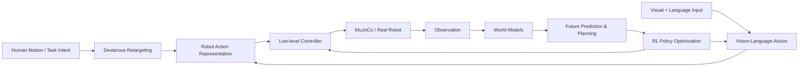

<h1 align="center">Embodied AI: Zero to Hero</h1>

<p align="center">
  <b>One stack. Four core capabilities. From fundamentals to reproducible robotics research.</b><br>
  <b>一体化具身智能开源体系：从核心概念到可复现的机器人研究</b>
</p>

<p align="center">
  <a href="https://github.com/Dld0621/Embodied-AI-Zero-to-Hero"></a>
  <a href="LICENSE"></a>
  <a href="https://python.org"></a>
  <a href="https://pytorch.org"></a>
  <a href="https://mujoco.org"></a>
</p>

<p align="center">
  <a href="#five-minute-quick-start">Quick Start</a> ·
  <a href="#choose-your-path">Learning Roadmap</a> ·
  <a href="#documentation-map">Documentation</a> ·
  <a href="#benchmarks">Benchmarks</a>
</p>

---

## Why This Repository

Embodied AI resources are fragmented across perception, policy learning, simulation, control, and hardware. This repository organizes them into a unified, executable path — from understanding core concepts to reproducing algorithms and building research prototypes.

具身智能的学习资源散落在感知、策略学习、仿真、控制和硬件等多个领域。本项目将它们组织成一条统一、可执行的路径：从理解核心概念，到复现算法，再到构建研究原型。

| | |
|:---|:---|
| **Systematic** | 不是论文链接集合，而是统一的系统结构，四个方向形成端到端链路 |
| **Executable** | 每个方向都包含最小可运行示例和清晰的入口 |
| **Research-oriented** | 从教学实现逐步过渡到论文复现与原创研究 |

---

## Project Status

| Track | Concepts | Tutorial | Runnable Demo | Benchmark | Research Extension |
|:------|:--------:|:--------:|:-------------:|:---------:|:------------------:|
| **Dexterous Retargeting** | ✅ | ✅ | ✅ | 🟡 | 🟡 |
| **Vision-Language-Action** | ✅ | ✅ | ✅ | 🟡 | ⏳ |
| **World Models** | ✅ | ✅ | ✅ | 🟡 | ⏳ |
| **Reinforcement Learning** | ✅ | ✅ | ✅ | 🟡 | ⏳ |
| **Sim-to-Real** | ✅ | ✅ | ✅ | ⏳ | ⏳ |
| **VLA Deployment** | ✅ | ✅ | ⏳ | ⏳ | ⏳ |

**Legend:** ✅ Verified · 🟡 Experimental · ⏳ Planned · 🔒 External

---

## Embodied AI System Overview

This project is structured around a single research stack, not four independent topics. Each module answers a distinct question within the full pipeline:



| Module | Question It Answers |
|:-------|:--------------------|
| **World Models** | If the robot executes an action, what will happen in the future? |
| **VLA** | Given an image and a language instruction, what should the robot do? |
| **RL** | When the current policy underperforms, how to optimize it through interaction? |
| **Retargeting** | How do high-level action intents map to specific robot morphologies and joints? |

**Core research line:** Dexterous Retargeting is the primary research focus and differentiated direction. VLA, World Models, and RL form the policy, prediction, and optimization layers that connect perception to physical execution.

---

## Choose Your Path

| Who you are | Recommended Track | First Task | Expected Outcome |
|:------------|:------------------|:-----------|:-----------------|
| **Zero background** | Foundations | Run FK/IK Demo | Understand robot action representation |
| **Robot learning student** | VLA Track | Run minimal VLA | Understand multimodal-to-action pipeline |
| **Dexterous hand researcher** | Retargeting Track | 21 points → Shadow Hand | Obtain robot joint angles from human landmarks |
| **RL learner** | RL Track | Run Q-Learning / SAC | Understand policy optimization |
| **World model researcher** | World Model Track | Run latent dynamics demo | Complete prediction + planning loop |
| **Engineering developer** | Simulation & Evaluation | Load MuJoCo model | Integrate your own robot |

---

## Five-Minute Quick Start

The single most stable entry point — run a complete retargeting pipeline from synthetic human hand landmarks to Shadow Hand joint angles in MuJoCo.

```bash
git clone https://github.com/Dld0621/Embodied-AI-Zero-to-Hero.git
cd Embodied-AI-Zero-to-Hero

pip install numpy scipy mujoco matplotlib

cd examples
python freshman_zero_to_one.py --gesture open --model shadow
```

**Input:** Synthetic 21-point human-hand landmarks (MediaPipe format, unit: meters)  
**Method:** SLSQP + Huber fingertip IK baseline with temporal smoothing  
**Output:** Shadow Hand 24-DoF joint positions (`qpos`)  
**Evaluation:** Fingertip Position Error (FPE) and per-frame inference latency  

Expected output:
```
[DexMVRetargeter] Loaded: 24 DOFs, 5 fingertips
  Scale factor: 1.518
  Retargeting time: 0.003s (2.5 ms/frame)
  Mean FPE: ~60 mm (synthetic data, uncalibrated)
```

> **Note:** FPE on synthetic data is expected to be higher than on real calibrated captures. Real-world retargeting with proper workspace calibration typically achieves < 15 mm. See [`docs/11-dexmv-research-guide.md`](docs/11-dexmv-research-guide.md) for details.

---

## Visual Demos

| | Input | Method | Result |
|:---|:---|:---|:---|
| **Retargeting** | MediaPipe-style 21-point landmarks | Constrained fingertip IK with temporal smoothing | Shadow Hand joint trajectory in MuJoCo |
| **VLA** | Synthetic image + language instruction | Minimal CNN + GRU + MLP policy head | Predicted action chunk (concept demo) |
| **World Model** | Current observation + action | Latent dynamics model (RSSM-style) | Predicted next observation |
| **RL** | Shadow Hand state + goal | SAC + HER | Reward curve / success rate over training |

> **Status:** Visual results are generated from actual code in this repository. GIF / video exports are WIP; static plots and MuJoCo renderings are available now.

---

## Core Learning & Research Tracks

All four tracks follow the same template:

| Section | Content |
|:--------|:--------|
| **Definition** | One-sentence purpose |
| **Pipeline** | Input → Core Method → Output → Evaluation |
| **Learning Levels** | Concept / Tutorial / Benchmark / Research |
| **Entry Points** | Learn · Run · Evaluate · Explore Papers |
| **Known Limitations** | Honest status of each component |

---

### 1. Dexterous Retargeting — Core Research Line

> **Definition:** Map human hand motion (21-point landmarks, MANO, or VR input) to dexterous robot hand joint angles, bridging the morphology gap between human and robot hands.
>
> **定位：** 将人手运动映射到机器人灵巧手关节角度，弥合人与机器人手的形态差异。这是本项目的核心研究主线。

**Pipeline:**

```
Human Motion Input
    → Coordinate Processing (local frame, mirroring, normalization)
    → Task Representation (fingertip positions / bone vectors / contact maps)
    → Solver (Rule-based / Numerical IK / Learning-based / Physics-aware)
    → Constraints (joint limits, collision, temporal smoothness, mimic joints)
    → Robot Execution (qpos / ctrl / trajectory)
    → Evaluation (FPE, jitter, contact preservation, runtime)
```

**Input / Method / Output / Evaluation:**

| Input | Core Method | Output | Evaluation |
|:------|:------------|:-------|:-----------|
| 21-point landmarks, MANO pose, VR controller, InterHand data | SLSQP + Huber Loss, Vector Optimization, Rule-based mapping, Neural retargeting | Joint angles (`qpos`), actuator targets (`ctrl`), trajectories | FPE, joint limit violation, jitter, collision rate, runtime |

**Learning Levels:**

| Level | Content | Status | Entry |
|:------|:--------|:------:|:------|
| Concept | FK/IK basics, 21-point model, coordinate frames | ✅ | [`tutorials/01-fk-ik-basics/`](tutorials/01-fk-ik-basics/) |
| Tutorial | Rule-based mapping, Vector Optimization with scipy | ✅ | [`tutorials/02-rule-based-retargeting/`](tutorials/02-rule-based-retargeting/) · [`tutorials/03-vector-optimization/`](tutorials/03-vector-optimization/) |
| Runnable | DexMV-style SLSQP + Huber Loss, complete pipeline | ✅ | [`examples/freshman_zero_to_one.py`](examples/freshman_zero_to_one.py) · [`examples/dexmv_style_retargeting/`](examples/dexmv_style_retargeting/) |
| Benchmark | Unified evaluation across methods | 🟡 | [`examples/evaluation_framework.py`](examples/evaluation_framework.py) |
| Research | Contact-aware, physics-aware, functional retargeting | 🟡 | [`docs/17-research-trends-and-positioning.md`](docs/17-research-trends-and-positioning.md) |

**Known Limitations:**
- Benchmark metrics are synthetic-data only; real-hardware verification is external.
- Mimic joint compensation is implemented for OmniHand O10 but not yet benchmarked against other hands.
- Contact-preserving retargeting (TopoRetarget-style) is documented but not yet implemented in code.

---

### 2. Vision-Language-Action — Policy Layer

> **Definition:** Generate robot actions from visual perception and natural language instructions. VLA serves as the policy layer that converts high-level human intent into executable robot commands.
>
> **定位：** 从视觉感知和自然语言指令生成机器人动作。VLA 作为策略层，将人类高层意图转化为可执行的机器人命令。

**Pipeline:**

```
Multimodal Input (RGB / language / proprioception)
    → Encoding (Vision encoder + Language encoder + State encoder)
    → Fusion (Cross-attention / Token fusion / Unified transformer)
    → Action Representation (joint position / delta pose / action chunk / diffusion trajectory)
    → Training (Behavior Cloning → Pretraining / Fine-tuning)
    → Inference (Observation + Instruction → Policy → Action Chunk → Safety Filter → Controller)
```

**Input / Method / Output / Evaluation:**

| Input | Core Method | Output | Evaluation |
|:------|:------------|:-------|:-----------|
| RGB image, language instruction, proprioception, previous actions | CNN/Transformer encoder, multimodal fusion, policy head (MLP / Diffusion / Transformer) | Action chunk (T steps of joint targets / EE pose) | Task success rate, inference latency, action smoothness, generalization |

**Learning Levels:**

| Level | Content | Status | Entry |
|:------|:--------|:------:|:------|
| Concept | VLA architecture, action chunking, BC vs RL | ✅ | [`docs/01-what-is-vla.md`](docs/01-what-is-vla.md) |
| Tutorial | Minimal VLA structure (random init, concept demo) | ✅ | [`examples/minimal_vla.py`](examples/minimal_vla.py) |
| Runnable | SmolVLA inference with LeRobot, OpenVLA-style loading | ✅ | [`examples/vla_demo.py`](examples/vla_demo.py) |
| Benchmark | LIBERO / ALOHA success rate comparison | 🟡 | See [`docs/13-vla-zero-to-one.md`](docs/13-vla-zero-to-one.md) |
| Research | Fine-tuning, cross-embodiment adaptation, real robot | ⏳ | [`docs/02-key-papers.md`](docs/02-key-papers.md) |

**Known Limitations:**
- `minimal_vla.py` is a structural demonstration with random weights, not a pretrained policy.
- `--mode aloha` in `vla_demo.py` requires GPU, network, and the LeRobot dataset; CPU fallback is synthetic only.
- Real-robot deployment instructions are planned but not yet included.

---

### 3. World Models — Prediction Layer

> **Definition:** Predict future observations and rewards given current state and action, supporting planning, data generation, and safe policy evaluation.
>
> **定位：** 给定当前状态与动作，预测未来观测与奖励，支持规划、数据生成和安全策略评估。

**Pipeline:**

```
Dataset (o_t, a_t, r_t, o_{t+1})
    → Representation Learning (pixel / point cloud / state → latent)
    → Dynamics Learning (p(z_{t+1} | z_t, a_t): deterministic / stochastic / RSSM / Transformer)
    → Prediction Heads (future obs / reward / termination / uncertainty)
    → Imagination (rollout candidate actions, select best)
    → Integration with VLA (action verification), RL (imaginary training), Retargeting (trajectory feasibility)
```

**Input / Method / Output / Evaluation:**

| Input | Core Method | Output | Evaluation |
|:------|:------------|:-------|:-----------|
| Observation sequence, action sequence, rewards | Latent dynamics model (linear / RSSM / Transformer / Diffusion) | Predicted next observation, reward, termination, uncertainty | One-step / multi-step prediction error, visual fidelity, planning success |

**Learning Levels:**

| Level | Content | Status | Entry |
|:------|:--------|:------:|:------|
| Concept | Model-based RL, RSSM, DreamerV3, planning | ✅ | [`docs/07-world-models-for-vla.md`](docs/07-world-models-for-vla.md) |
| Tutorial | Minimal linear world model + MPC | ✅ | [`examples/world_model_demo.py`](examples/world_model_demo.py) |
| Runnable | DreamerV3-style RSSM depth implementation | ✅ | [`examples/dreamer_rssm.py`](examples/dreamer_rssm.py) |
| Benchmark | Prediction error on standard control tasks | 🟡 | TBD |
| Research | WM + VLA fusion, PointWorld-style 3D flow | ⏳ | [`docs/07-world-models-for-vla.md`](docs/07-world-models-for-vla.md) |

**Known Limitations:**
- RSSM implementation is simplified compared to full DreamerV3; image encoder/decoder is not pixel-accurate.
- Multi-step rollout accumulation error is not yet benchmarked against standard control tasks.

---

### 4. Reinforcement Learning — Optimization Layer

> **Definition:** Optimize policies through environment interaction and reward feedback. RL serves as the fine-tuning and exploration layer that improves upon pretrained policies (VLA or BC) through trial and error.
>
> **定位：** 通过环境交互与奖励反馈优化策略。RL 作为微调和探索层，通过试错改进预训练策略（VLA 或 BC）。

**Pipeline:**

```
Task Definition (environment, object, goal, success/failure conditions)
    → Observation & Action Space (RGB + proprioception + object state → joint target / torque / EE delta)
    → Reward Design (task + progress + contact + smoothness - collision - energy)
    → Algorithm Selection (Q-Learning / SAC / PPO / HER / Offline RL)
    → Training (reset → rollout → buffer → update → evaluation)
    → Sim-to-Real (domain randomization, latency sim, safety constraints)
```

**Input / Method / Output / Evaluation:**

| Input | Core Method | Output | Evaluation |
|:------|:------------|:-------|:-----------|
| State observation, action space, reward function | Q-Learning, SAC, PPO, HER, Offline RL | Trained policy π(a\|s) | Success rate, sample efficiency, training stability, sim-to-real degradation |

**Learning Levels:**

| Level | Content | Status | Entry |
|:------|:--------|:------:|:------|
| Concept | MDP, value function, policy gradient, Q-Learning | ✅ | [`docs/06-rl-fundamentals-for-vla.md`](docs/06-rl-fundamentals-for-vla.md) |
| Tutorial | Pure-numpy Q-Learning demo | ✅ | [`examples/rl_demo.py --mode demo`](examples/rl_demo.py) |
| Runnable | SAC + HER on Shadow Hand (Gymnasium-Robotics) | ✅ | [`examples/rl_demo.py --mode train`](examples/rl_demo.py) |
| Benchmark | Success rate vs sample count on standard tasks | 🟡 | TBD |
| Research | RL fine-tuning of VLA policies, real-robot RL | ⏳ | [`docs/14-rl-zero-to-one.md`](docs/14-rl-zero-to-one.md) |

**Known Limitations:**
- SAC+HER training requires significant compute; CPU training is possible but slow.
- Real-robot RL safety constraints and sim-to-real transfer are documented but not yet implemented end-to-end.

---

## Benchmarks

This section will be populated with reproducible results. All numbers include environment, command, and random seed.

### Retargeting

| Method | Input | Robot | Mean FPE ↓ | P95 FPE ↓ | Jitter ↓ | Runtime ↓ | Status |
|:-------|:------|:------|:-----------|:----------|:---------|:----------|:-------|
| Rule Mapping | Synthetic-21 | Shadow | TBD | TBD | TBD | TBD | 🟡 |
| Vector Optimization | Synthetic-21 | Shadow | TBD | TBD | TBD | TBD | 🟡 |
| SLSQP + Huber | Synthetic-21 | Shadow | TBD | TBD | TBD | TBD | 🟡 |

**Environment:** Ubuntu 22.04, Python 3.10, MuJoCo 3.x, PyTorch 2.x  
**Evaluation script:** `python examples/evaluation_framework.py --method all --n_samples 100`  
> **Current CI covers import and structural smoke tests. Numerical and end-to-end regression tests are being added.**

### VLA / World Models / RL

| Track | Metric | Status |
|:------|:-------|:-------|
| VLA | Task success / inference latency | ⏳ |
| World Models | One-step / multi-step prediction error | ⏳ |
| RL | Reward curve / success rate / sample count | ⏳ |

---

## Supported Robots and Environments

| Robot | DOF | Fingers | Model Status | IK Verified | Benchmark Verified | Hardware Verified |
|:------|:---:|:-------:|:------------:|:-----------:|:------------------:|:-----------------:|
| **Shadow Hand** | 24 | 5 | ✅ Loaded | ✅ | 🟡 | 🔒 External |
| **Allegro Hand** | 16 | 4 | ✅ Loaded | ✅ | 🟡 | 🔒 External |
| **LEAP Hand** | 16 | 4 | ✅ Loaded | ✅ | 🟡 | 🔒 External |
| **OmniHand O10** | 10 | 5 | 🔒 External | 🔒 External | 🔒 External | 🔒 External |

**Legend:** ✅ Done · 🟡 In Progress · 🔒 External / Planned

---

## Learning Roadmap

```
Stage 0: Foundations
  └─ FK/IK, 21-point model, coordinate frames, MuJoCo basics

Stage 1: Retargeting Basics
  └─ Rule-based mapping → Vector Optimization → Complete pipeline

Stage 2: Retargeting Research
  └─ DexMV SLSQP + Huber → Evaluation framework → Contact-aware methods

Stage 3: VLA Basics
  └─ Minimal VLA structure → SmolVLA inference → Action representation

Stage 4: VLA Research
  └─ OpenVLA / Octo / Diffusion Policy → Fine-tuning → Deployment

Stage 5: World Models
  └─ Linear dynamics → RSSM → Integration with VLA/RL

Stage 6: RL Basics
  └─ Q-Learning → SAC → HER → Shadow Hand training

Stage 7: RL Research
  └─ RL fine-tuning of VLA → Sim-to-Real → Real robot safety

Stage 8: Sim-to-Real
  └─ Domain randomization → System ID → Visual adaptation → Hardware validation

Stage 9: Integration
  └─ End-to-end pipeline: Perception → VLA → Retargeting → Control

Stage 10: Frontier Research
  └─ 2026 trends: Physics-aware, calibration-free, cross-embodiment, functional retargeting
```

---

## Documentation Map

All detailed concepts, paper lists, commands, and tutorials live in [`docs/`](docs/). See [`docs/README.md`](docs/README.md) for the full index.

| Category | Documents |
|:---------|:----------|
| **Foundations** | Joint concepts, FK/IK basics, 21-point model, glossary |
| **Retargeting** | Taxonomy, human→robot mapping, optimization methods, learning-based methods, DexMV guide, freshman 0→1, evaluation metrics |
| **VLA** | Core concepts, key papers, learning path, fine-tuning, deployment, interview prep |
| **World Models** | Concepts, RSSM, integration with VLA/RL |
| **RL** | Fundamentals, SAC/HER, sim-to-real |
| **Sim-to-Real** | Domain randomization, system ID, visual adaptation, latency compensation |
| **Datasets & Tools** | Manipulation datasets, dexterous hands analysis, open-source projects |
| **Research** | ArXiv scan, research trends, frontier papers with online links |

---

## Reproducibility

### Tested Environments

| OS | Python | MuJoCo | PyTorch | Status |
|:---|:-------|:-------|:--------|:-------|
| Ubuntu 22.04 | 3.10 | 3.x | 2.x | ✅ |
| Windows 11 | 3.10 | 3.x | 2.x | 🟡 |
| macOS | 3.10 | 3.x | 2.x | 🟡 |

### Reproduction Levels

| Level | Requirement | Status |
|:------|:------------|:-------|
| L1 Import | Modules import without errors | ✅ |
| L2 Demo | Example commands run to completion | 🟡 |
| L3 Deterministic | Fixed seed produces repeatable results | ⏳ |
| L4 Benchmark | Unified evaluation script passes | ⏳ |
| L5 Hardware | Real-robot result validation | 🔒 External |

---

## Research Roadmap

| Phase | Goal | Timeline |
|:------|:-----|:---------|
| **Phase 1: Foundation** | Complete all tutorials and runnable demos | Done |
| **Phase 2: Benchmarking** | Unified evaluation across retargeting methods | 2026 Q3 |
| **Phase 3: Integration** | End-to-end VLA → Retargeting → MuJoCo pipeline | 2026 Q3 |
| **Phase 4: Sim-to-Real** | Domain randomization + real-hardware validation | 2026 Q4 |
| **Phase 5: Frontier** | Contact-aware retargeting, RL-augmented teleoperation | 2027 |

---

## Contributing

See [`CONTRIBUTING.md`](CONTRIBUTING.md) for issue/PR standards, content quality requirements, and review checklists.

欢迎提交 Issue 和 PR！当前高优先级方向：
- 补充数值回归测试（L3-L4 reproduction levels）
- 添加更多机器人手模型（Inspire Hand, SVH）
- 完善 VLA 微调教程和评估基准
- 补充世界模型与 VLA 融合的最新进展
- 补充前沿论文代码复现指南

---

## Citation

If you use this repository in your research, please cite:

```bibtex
@misc{embodied-ai-zero-to-hero,
  title={Embodied AI: Zero to Hero — A Reproducible Learning and Research Stack},
  author={Embodied AI Zero to Hero Contributors},
  year={2026},
  howpublished={\url{https://github.com/Dld0621/Embodied-AI-Zero-to-Hero}},
}
```

---

## License

[MIT License](LICENSE)

---

## Acknowledgments

- [MediaPipe](https://mediapipe-studio.webapps.google.com/demo/hand_landmarker) — Real-time hand landmark detection
- [InterHand2.6M](https://mks0601.github.io/InterHand2.6M/) — Two-hand 3D pose dataset
- [MuJoCo Menagerie](https://github.com/google-deepmind/mujoco_menagerie) — Pre-built robot model library
- [DexMV](https://github.com/yzqin/dexmv-sim) — ECCV 2022 high-precision IK retargeting
- [OpenVLA](https://github.com/openvla/openvla) — Stanford / Berkeley open-source VLA
- [LeRobot](https://github.com/huggingface/lerobot) — HuggingFace robot learning framework
- [Stable Baselines3](https://stable-baselines3.readthedocs.io/) — PyTorch RL algorithm library
- [SPIDER](https://github.com/facebookresearch/spider) — Meta FAIR physics-aware retargeting
- [DreamDojo](https://github.com/NVIDIA/DreamDojo) — NVIDIA general world model
