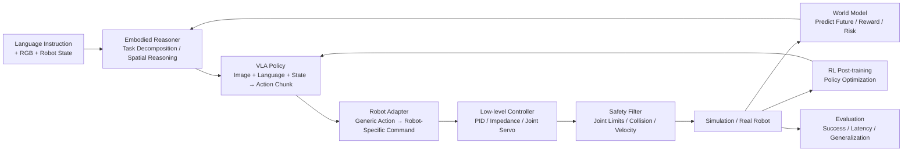

<h1 align="center">Embodied AI: Zero to Hero</h1>

<p align="center">
  English | <a href="README_CN.md">中文</a>
</p>

<p align="center">
  <b>An executable learning repository for robot learning:</b><br>
  <b>Robot Foundation Models · VLA · World Models · Reinforcement Learning · Simulation & Deployment</b>
</p>

<p align="center">
  <a href="https://github.com/Dld0621/Embodied-AI-Zero-to-Hero/actions/workflows/tests.yml"></a>
  <a href="https://github.com/Dld0621/Embodied-AI-Zero-to-Hero"></a>
  <a href="LICENSE"></a>
  <a href="https://python.org"></a>
  <a href="https://mujoco.org"></a>
</p>

<p align="center">
  <b>Maintainer:</b> <a href="https://github.com/Dld0621">Gangwei Li</a> — Robot Foundation Models · VLA · World Models · Robot Learning
</p>

<p align="center">
  <a href="#five-minute-quick-start">Quick Start</a> ·
  <a href="#choose-your-path">Learning Roadmap</a> ·
  <a href="#documentation-map">Documentation</a> ·
  <a href="#benchmarks">Benchmarks</a>
</p>

---

## Why This Repository

Robot learning resources are fragmented across vision-language-action policies, world models, reinforcement learning, and deployment. This repository organizes them into a unified, executable path — from understanding core concepts to reproducing algorithms and building research prototypes.

| | |
|:---|:---|
| **Systematic** | Not a link dump — a unified system structure where VLA, WM, and RL form a policy–prediction–optimization pipeline |
| **Executable** | Every direction includes a minimal runnable example with a clear entry point |
| **Research-oriented** | Progresses from teaching implementations to paper reproduction and original research |

### Scope & Boundaries

This repository focuses on the **robot-learning core** of embodied AI: policies, predictive models, and interactive optimization. It does **not** aim to be a comprehensive encyclopedia of all embodied AI subfields.

| **Covered** | **Not Covered** |
|:---|:---|
| Robot foundation models & cross-embodiment adaptation | Full 3D perception & SLAM |
| VLA (vision-language-action) policies | Legged locomotion & navigation |
| World models & latent dynamics | Complete hardware driver stacks |
| RL for continuous control | Mobile manipulation platforms |
| Simulation, evaluation & sim-to-real | Large-scale dataset curation |

If you are looking for a complete survey of navigation, locomotion, or industrial robot programming, this repository will not satisfy those needs. It is designed for researchers and students who want to understand and reproduce the learning-based decision-making pipeline of modern robotics.

---

## Project Status

### Core Research Tracks

| Track | Concepts | Tutorial | Runnable Demo | Benchmark | Research Extension |
|:------|:--------:|:--------:|:-------------:|:---------:|:------------------:|
| **Robot Foundation Models** | ✅ | ✅ | 🟡 | 🟡 | ⏳ |
| **Vision-Language-Action** | ✅ | ✅ | ✅ | ⏳ | ⏳ |
| **World Models** | ✅ | ✅ | ✅ | ⏳ | ⏳ |
| **Reinforcement Learning** | ✅ | ✅ | 🟡 | 🟡 | ⏳ |
| **Embodied Reasoning** | ✅ | ✅ | 🟡 | ⏳ | ⏳ |

### Engineering Layers

| Layer | Concepts | Tutorial | Runnable Demo | Status |
|:------|:--------:|:--------:|:-------------:|:------:|
| **Sim-to-Real** | ✅ | ✅ | ⏳ | ⏳ |
| **VLA Deployment** | ✅ | ✅ | ⏳ | ⏳ |
| **Evaluation Framework** | ✅ | 🟡 | ⏳ | ⏳ |

**Legend:** ✅ Verified (clean env, logged) · 🟡 Experimental (CI exists, but full data/model/benchmark validation pending) · ⏳ Planned · 🔒 External

---

## Embodied AI System Overview

This project is structured around a single research stack, not four independent topics. Each module answers a distinct question within the full pipeline:


```mermaid
flowchart LR
    A[Language Instruction<br/>+ RGB + Robot State]
    B[Embodied Reasoner<br/>Task Decomposition / Spatial Reasoning]

    A --> B
    B --> C[VLA Policy<br/>Image + Language + State → Action Chunk]
    C --> D[Robot Adapter<br/>Generic Action → Robot-Specific Command]
    D --> E[Low-level Controller<br/>PID / Impedance / Joint Servo]
    E --> F[Safety Filter<br/>Joint Limits / Collision / Velocity]
    F --> G[Simulation / Real Robot]

    G --> H[World Model<br/>Predict Future / Reward / Risk]
    H --> B
    G --> I[RL Post-training<br/>Policy Optimization]
    I --> C

    G --> J[Evaluation<br/>Success / Latency / Generalization]
```

| Module | Question It Answers |
|:-------|:--------------------|
| **Robot Foundation Models** | How to unify reasoning, VLA, world models, and RL into one deployment-ready pipeline? |
| **VLA** | Given an image and a language instruction, what should the robot do? |
| **World Models** | If the robot executes an action, what will happen in the future? |
| **RL** | When the current policy underperforms, how to optimize it through interaction? |
| **Embodied Reasoning** | How to decompose a long-horizon task into executable sub-goals? |

**Core research line:** Robot Foundation Models is the primary unifying framework. VLA, World Models, RL, and Embodied Reasoning form the policy, prediction, optimization, and planning layers that connect perception to physical execution.

---

## Choose Your Path

| Who you are | Recommended Track | First Task | Expected Outcome |
|:------------|:------------------|:-----------|:-----------------|
| **Zero background** | Foundations | Run PushCube VLA | Understand robot action representation |
| **Robot learning student** | VLA Track | Run minimal VLA | Understand multimodal-to-action pipeline |
| **Foundation model researcher** | RFM Track | Run SmolVLA adapter | Understand unified model interface & action chunks |
| **RL learner** | RL Track | Run Q-Learning / SAC | Understand policy optimization |
| **World model researcher** | World Model Track | Run latent dynamics demo | Complete prediction + planning loop |
| **Engineering developer** | Simulation & Evaluation | Load MuJoCo model | Integrate your own robot |

---

## Five-Minute Quick Start

The single most stable entry point — run a complete VLA pipeline on the dual-cube PushCube environment.

```bash
git clone https://github.com/Dld0621/Embodied-AI-Zero-to-Hero.git
cd Embodied-AI-Zero-to-Hero

pip install numpy torch --index-url https://download.pytorch.org/whl/cpu

cd examples
python unified_pushcube_vla.py --smoke-test --no-ablation
```

**Input:** 128×128 RGB image + language instruction ("push the red cube to the target")  
**Method:** CNN + word embedding → MLP policy head  
**Output:** 2-D action [dx, dy] (arm movement)  
**Evaluation:** Task success rate, language ablation (correct / shuffled / vision-only)

---

## Visual Demos

> **Note:** World Model visuals below are generated from real code. RL training curves are illustrative format demos (not from completed benchmarks). See [Benchmarks](#benchmarks) for verified results.

### World Model: RSSM Training Analysis

Held-out synthetic 2D navigation trajectories comparing posterior reconstruction, prior imagination (with 5-step posterior burn-in), reward prediction, and state-dependent termination prediction. Train/val/test split with deterministic seed.


### World Model + Policy Integration

Reward comparison across four WM-policy fusion strategies on synthetic Nav2D: BC baseline, WM-assisted reward augmentation, WM action evaluator, WM model-based planner, and latent-space behavior cloning.


> Concept demonstration on synthetic Nav2D; not a standard benchmark.

### RL Training Curves (Illustrative)

Illustrative synthetic RL learning curves showing the expected reporting format (not generated from a completed SAC+HER benchmark).


| Track | Input | Method | Result |
|:---|:---|:---|:---|
| **VLA** | Synthetic image + language instruction | Minimal CNN + GRU + MLP policy head | Predicted action chunk (concept demo) |
| **World Model** | Current observation + action | Latent dynamics model (RSSM-style) | Predicted next observation |
| **RL** | Synthetic state + goal | PPO + REINFORCE | 10–20% success (PushCube) |
| **RFM** | Image + language + state | Lightweight VLA (195K params, real checkpoint) | 0% closed-loop success, 30% selection accuracy |

> All visuals generated from code in this repository. GIF / video exports are WIP.

---

## Unified Task: PushCube (Dual-Cube, Language-Conditioned)

All PushCube baselines share a single lightweight task: **push the *correct* colored cube into a target zone**. Two cubes of distinct colors (red, green) sit on the table. A language instruction specifies which cube to push. A vision-only policy cannot disambiguate which cube to push without the language signal.

```
PushCube Environment (dual-cube)
├── State (14-D): [arm_x, arm_y, cube1_x, cube1_y, cube2_x, cube2_y,
│                  target_x, target_y, cube1_r, cube1_g, cube2_r, cube2_g,
│                  goal_red, goal_green]
├── Action (2-D): [dx, dy] (arm movement)
├── Observation (VLA): 128x128 RGB render + language instruction
├── Language: "push the {red|green} cube to the {direction}"
└── Success: active cube enters target zone within max_steps
```

| Track | File | What It Does | Key Technique |
|:---|:---|:---|:---|
| **VLA** | [`unified_pushcube_vla.py`](examples/unified_pushcube_vla.py) | Image + language → action | CNN + word embedding → MLP; 3-condition ablation (full / lang-shuffled / vision-only) |
| **World Model** | [`unified_pushcube_wm.py`](examples/unified_pushcube_wm.py) | Predict next state + reward | MLP dynamics (14-D state) |
| **RL** | [`unified_pushcube_rl.py`](examples/unified_pushcube_rl.py) | Learn policy from scratch | REINFORCE (policy gradient, pure NumPy) |
| **Action-Chunking** | [`unified_pushcube_act.py`](examples/unified_pushcube_act.py) | Imitation with action chunking | Multi-frame Transformer encoder + exponential temporal ensembling (no CVAE) |
| **Diffusion Policy** | [`unified_pushcube_diffusion.py`](examples/unified_pushcube_diffusion.py) | Imitation via diffusion | DDPM with action horizon, deterministic eval |

> **Note:** The Action-Chunking Policy is *not* a full ACT (Zhao et al., 2023). It implements multi-frame observation tokens and temporal ensembling but omits the CVAE latent variable. See the file header for details.

### Language Ablation (VLA)

To verify that the VLA policy actually uses the language signal, a **single trained model** is evaluated under three language conditions on the *same* set of evaluation episodes:

| Condition | Eval Language | Expected Behavior |
|:---|:---|:---|
| **Full VLA** | Correct ("push the red cube…") | Should push the right cube |
| **Language-shuffled** | Swapped ("push the green cube…") | Should push the *wrong* cube (proves language matters) |
| **Vision-only** | Zeroed (all-pad tokens) | Performance drop vs. full VLA |

A separately trained **Vision-Only baseline** (language tokens zeroed during training) is also included as a stronger control.

### Expert Policy

Demonstrations use a three-phase heuristic: (1) flank around the active cube, (2) approach from behind, then (3) push toward the target. Expert success rate: **~100%** on 50 random seeds.

Run all PushCube baselines:
```bash
cd examples
python unified_pushcube_env.py             # Environment self-test + expert baseline
python unified_pushcube_vla.py             # VLA + State-BC + 3-condition ablation
python unified_pushcube_wm.py              # World model, multi-step prediction
python unified_pushcube_rl.py --algo ppo   # PPO (main RL baseline)
python unified_pushcube_act.py             # Action-chunking policy + temporal ensembling
python unified_pushcube_diffusion.py       # Diffusion policy, action horizon

# CI smoke tests (fast, 2 episodes each)
python unified_pushcube_vla.py --smoke-test --no-ablation
python unified_pushcube_rl.py --smoke-test
python unified_pushcube_wm.py --smoke-test
python unified_pushcube_act.py --smoke-test
python unified_pushcube_diffusion.py --smoke-test
```

> PushCube is intentionally lightweight—no MuJoCo dependency, pure NumPy/PyTorch—so you can focus on algorithm logic rather than simulation plumbing. Success rates are teaching-level (limited data, small models); they illustrate algorithm differences, not production performance.

---

## Robot Foundation Models

A unified robot-learning layer that connects embodied reasoning, VLA policies, world models, RL post-training, robot adaptation, safety control, simulation, and real-robot deployment. Instead of treating "robot foundation models" as an isolated direction, this module wraps existing VLA as the action-generation layer and connects it to World Model predictions, RL post-training, and robot control interfaces.

```text
Language Instruction → Embodied Reasoner → Robot Foundation Model / VLA
    → Robot Adapter → Low-level Controller → Safety Filter
    → Simulation / Real Robot

    ↑ World Model predictions · RL post-training
```

### Unified Interface

All models implement the same protocol — the control loop never changes when swapping models:

```python
class RobotFoundationModel(Protocol):
    def reset(self) -> None: ...
    def predict_action(self, observation: RobotObservation) -> ActionChunk: ...
```

### Model Status

| Model | Type | Scale | Status | Recommended Use |
|:------|:-----|------:|:------:|:----------------|
| SmolVLA | Lightweight VLA | 450M | 🟡 Adapter + Lightweight VLA | Entry, fine-tuning, consumer GPU |
| OpenVLA/OFT | Generalist VLA | 7B | 🟡 Adapter | LIBERO, LoRA, standard benchmark |
| Octo | Generalist Diffusion Policy | 27M/93M | 🟡 Tutorial | Cross-embodiment learning |
| GR00T N1.6 | Humanoid Foundation Model | Large | ⏳ Planned | Humanoid, bimanual manipulation |

> **Status legend:** ✅ Real model loaded + real benchmark · 🟡 Adapter interface + mock pipeline (real weights/training not yet wired) · ⏳ Planned. SmolVLA adapter has a **real lightweight VLA checkpoint** (195K params, trained on 50 PushCube episodes, CPU) — see [`docs/28-smolvla-gpu-finetuning-runbook.md`](docs/28-smolvla-gpu-finetuning-runbook.md) for full 450M fine-tuning on GPU.

### Quick Start

```bash
# Test SmolVLA adapter in mock mode (no GPU/download needed)
cd examples/robot_foundation_models/smolvla
python inference.py

# Train lightweight VLA on real PushCube data (CPU, ~2 min)
python train_lightweight_vla.py --epochs 100 --batch_size 64

# Closed-loop evaluation with real checkpoint
python evaluate.py --mode closed_loop \
    --checkpoint models/lightweight_vla/lightweight_vla_pushcube.pt \
    --n_episodes 20

# Rule-based task planner
cd ../planners
python rule_based_planner.py

# RFM benchmarks (mock mode)
cd ../../../benchmarks/robot_foundation_models
python evaluate_offline.py --mock --smoke-test
python evaluate_closed_loop.py --mock --smoke-test
python language_ablation.py --mock --smoke-test
```

### Directory Structure

```
examples/robot_foundation_models/
├── common/          # RobotObservation, ActionChunk, Protocol, EmbodimentAdapter, SafetyFilter
├── smolvla/         # SmolVLAAdapter (450M, first priority)
├── openvla/         # OpenVLAAdapter (7B, LoRA config)
└── planners/        # Rule-based + VLM-based task decomposition
```

Documentation: [`docs/23-robot-foundation-models.md`](docs/23-robot-foundation-models.md) → [24](docs/24-action-representation-and-tokenization.md) → [25](docs/25-cross-embodiment-adaptation.md) → [26](docs/26-rfm-finetuning-and-evaluation.md) → [27](docs/27-embodied-reasoning-and-planning.md)

---

## Core Learning & Research Tracks

All tracks follow the same template:

| Section | Content |
|:--------|:--------|
| **Definition** | One-sentence purpose |
| **Pipeline** | Input → Core Method → Output → Evaluation |
| **Learning Levels** | Concept / Tutorial / Benchmark / Research |
| **Entry Points** | Learn · Run · Evaluate · Explore Papers |
| **Known Limitations** | Honest status of each component |

---

### 1. Vision-Language-Action — Policy Layer

> **Definition:** Generate robot actions from visual perception and natural language instructions. VLA serves as the policy layer that converts high-level human intent into executable robot commands.

**Pipeline:**

```
Multimodal Input (RGB / language / proprioception)
    → Encoding (Vision encoder + Language encoder + State encoder)
    → Fusion (Cross-attention / Token fusion / Unified transformer)
    → Action Representation (joint position / delta pose / action chunk / diffusion trajectory)
    → Training (Behavior Cloning → Pretraining / Fine-tuning)
    → Inference (Observation + Instruction → Policy → Action Chunk → Safety Filter → Controller)
```

**Input / Method / Output / Evaluation:**

| Input | Core Method | Output | Evaluation |
|:------|:------------|:-------|:-----------|
| RGB image, language instruction, proprioception, previous actions | CNN/Transformer encoder, multimodal fusion, policy head (MLP / Diffusion / Transformer) | Action chunk (T steps of joint targets / EE pose) | Task success rate, inference latency, action smoothness, generalization |

**Learning Levels:**

| Level | Content | Status | Entry |
|:------|:--------|:------:|:------|
| Concept | VLA architecture, action chunking, BC vs RL | ✅ | [`docs/01-what-is-vla.md`](docs/01-what-is-vla.md) |
| Tutorial | Minimal VLA structure (random init, concept demo) | ✅ | [`examples/minimal_vla.py`](examples/minimal_vla.py) |
| Tutorial | Dataset organization: episode, sync, normalization, feature mapping | ✅ | [`docs/21-vla-dataset-organization.md`](docs/21-vla-dataset-organization.md) |
| Tutorial | ACT vs Diffusion Policy comparison with minimal implementations | ✅ | [`docs/22-act-vs-diffusion-policy.md`](docs/22-act-vs-diffusion-policy.md) |
| Runnable | SmolVLA inference with LeRobot, OpenVLA-style loading | 🟡 | [`examples/vla_demo.py`](examples/vla_demo.py) |
| Runnable | Unified PushCube (dual-cube): VLA + language ablation / Action-Chunking / Diffusion Policy | ✅ | [`unified_pushcube_vla.py`](examples/unified_pushcube_vla.py) · [`unified_pushcube_act.py`](examples/unified_pushcube_act.py) · [`unified_pushcube_diffusion.py`](examples/unified_pushcube_diffusion.py) |
| Benchmark | LIBERO / ALOHA success rate comparison | ⏳ | See [`docs/13-vla-zero-to-one.md`](docs/13-vla-zero-to-one.md) |
| Research | Fine-tuning, cross-embodiment adaptation, real robot | ⏳ | [`docs/02-key-papers.md`](docs/02-key-papers.md) |

**Known Limitations:**
- `minimal_vla.py` is a structural demonstration with random weights, not a pretrained policy.
- `--mode aloha` in `vla_demo.py` requires GPU, network, and the LeRobot dataset; CPU fallback is synthetic only.
- PushCube VLA includes a 3-condition language ablation (full / shuffled / vision-only) to verify language usage. The Action-Chunking Policy omits CVAE (not full ACT). Success rates are teaching-level.
- Real-robot deployment instructions are planned but not yet included.

---

### 2. World Models — Prediction Layer

> **Definition:** Predict future observations and rewards given current state and action, supporting planning, data generation, and safe policy evaluation.

**Pipeline:**

```
Dataset (o_t, a_t, r_t, o_{t+1})
    → Representation Learning (pixel / point cloud / state → latent)
    → Dynamics Learning (p(z_{t+1} | z_t, a_t): deterministic / stochastic / RSSM / Transformer)
    → Prediction Heads (future obs / reward / termination / uncertainty)
    → Imagination (rollout candidate actions, select best)
    → Integration with VLA (action verification), RL (imaginary training), Robot Adapter (action feasibility)
```

**Input / Method / Output / Evaluation:**

| Input | Core Method | Output | Evaluation |
|:------|:------------|:-------|:-----------|
| Observation sequence, action sequence, rewards | Latent dynamics model (linear / RSSM / Transformer / Diffusion) | Predicted next observation, reward, termination, uncertainty | One-step / multi-step prediction error, visual fidelity, planning success |

**Learning Levels:**

| Level | Content | Status | Entry |
|:------|:--------|:------:|:------|
| Concept | Model-based RL, RSSM, DreamerV3, planning | ✅ | [`docs/07-world-models-for-vla.md`](docs/07-world-models-for-vla.md) |
| Tutorial | Minimal linear world model + MPC | ✅ | [`examples/world_model_demo.py`](examples/world_model_demo.py) |
| Runnable | DreamerV3-style RSSM depth implementation | ✅ | [`examples/dreamer_rssm.py`](examples/dreamer_rssm.py) |
| Benchmark | Prediction error on standard control tasks | 🟡 | TBD |
| Research | WM + Policy fusion, PointWorld-style 3D flow | ⏳ | [`docs/07-world-models-for-vla.md`](docs/07-world-models-for-vla.md) |

**Known Limitations:**
- RSSM implementation is simplified compared to full DreamerV3; image encoder/decoder is not pixel-accurate.
- Multi-step rollout accumulation error is not yet benchmarked against standard control tasks.

**Implementation Status:**

| Capability | Status |
|:-----------|:------:|
| Observation reconstruction (RSSM decoder) | ✅ |
| Latent transition (GRU + prior/posterior) | ✅ |
| Imagination rollout (prior vs posterior) | ✅ |
| Reward prediction head | ✅ (RSSM + minimal_world_model) |
| Termination prediction head | ✅ (continue_head implemented; meaningful eval requires non-trivial termination labels) |
| Uncertainty calibration | ⏳ |
| Actor–Critic imagination training | ⏳ |

---

### 3. Reinforcement Learning — Optimization Layer

> **Definition:** Optimize policies through environment interaction and reward feedback. RL serves as the fine-tuning and exploration layer that improves upon pretrained policies (VLA or BC) through trial and error.

**Pipeline:**

```
Task Definition (environment, object, goal, success/failure conditions)
    → Observation & Action Space (RGB + proprioception + object state → joint target / torque / EE delta)
    → Reward Design (task + progress + contact + smoothness - collision - energy)
    → Algorithm Selection (Q-Learning / SAC / PPO / HER / Offline RL)
    → Training (reset → rollout → buffer → update → evaluation)
    → Sim-to-Real (domain randomization, latency sim, safety constraints)
```

**Input / Method / Output / Evaluation:**

| Input | Core Method | Output | Evaluation |
|:------|:------------|:-------|:-----------|
| State observation, action space, reward function | Q-Learning, SAC, PPO, HER, Offline RL | Trained policy π(a\|s) | Success rate, sample efficiency, training stability, sim-to-real degradation |

**Learning Levels:**

| Level | Content | Status | Entry |
|:------|:--------|:------:|:------|
| Concept | MDP, value function, policy gradient, Q-Learning | ✅ | [`docs/06-rl-fundamentals-for-vla.md`](docs/06-rl-fundamentals-for-vla.md) |
| Tutorial | Pure-numpy Q-Learning demo | ✅ | [`examples/rl_demo.py --mode demo`](examples/rl_demo.py) |
| Runnable | PPO on PushCube (PyTorch, main baseline) + REINFORCE (concept demo) | ✅ | [`examples/unified_pushcube_rl.py`](examples/unified_pushcube_rl.py) |
| Benchmark | Success rate vs sample count on standard tasks | 🟡 | TBD |
| Research | RL fine-tuning of VLA policies, real-robot RL | ⏳ | [`docs/14-rl-zero-to-one.md`](docs/14-rl-zero-to-one.md) |

**Known Limitations:**
- SAC+HER training requires significant compute; CPU training is possible but slow.
- Real-robot RL safety constraints and sim-to-real transfer are documented but not yet implemented end-to-end.

---

### 4. Embodied Reasoning — Planning Layer

> **Definition:** Decompose long-horizon tasks into executable sub-goals and coordinate policy execution with failure recovery.

**Pipeline:**

```
Language instruction → Task decomposition → Subgoal sequence → VLA execution → Failure detection & recovery
```

**Current Status:**

| Component | Status | Entry |
|:----------|:-------|:------|
| Rule-based planner | ✅ Runnable | `examples/robot_foundation_models/planners/rule_based_planner.py` |
| VLM-based planner | 🟡 Mock | `examples/robot_foundation_models/planners/` |
| Failure recovery | ⏳ Planned | — |

Documentation: [`docs/27-embodied-reasoning-and-planning.md`](docs/27-embodied-reasoning-and-planning.md)

---

## Benchmarks

Benchmark configuration and reference results are provided. Clean-environment reproduction is being verified.

### PushCube Benchmark (Dual-Cube, Language-Conditioned)

All PushCube baselines evaluated on the same dual-cube PushCube environment.

| Method | Input | Train | Success Rate ↑ | Notes |
|:-------|:------|:------|:---:|:------|
| Expert | State | — | **~100%** | Three-phase heuristic (flank → behind → push) |
| State-BC | 14-D state with goal-color one-hot | 100 episodes / 50 epochs | **90%** | MLP + geometric feature engineering |
| VLA (Full) | RGB + language | 100 episodes / 50 epochs | **0%** | CNN + word embedding → MLP; needs more data |
| Action-Chunking | RGB hist + language | 50 epochs | TBD | K-frame Transformer, no CVAE |
| Diffusion Policy | RGB + language | 50 epochs | TBD | DDPM, 20 steps, action horizon=10 |
| RL (PPO) | 14-D state | 500 episodes | **10–20%** | Actor-Critic + GAE + BC warm-start; BC pretrain 40% |

**World Model (MLP dynamics):** val_loss=0.041, multi-step error H=1: 0.071, H=5: 0.296, H=10: 0.556

**Environment:** 14-D state, 2-D action, 128×128 RGB, dual-cube (red+green), language-conditioned
**Command:** `cd examples && python unified_pushcube_vla.py` (and other unified_pushcube_*.py)

> **Note:** State-BC proves the unified task is learnable (90% success). VLA remains at 0% because vision requires significantly more data (>1000 episodes) and/or larger models than the teaching-scale setup provides. PPO achieves non-zero success but is sensitive to hyperparameters — BC pre-training reaches 40%, but PPO fine-tuning partially destabilizes the policy. These are teaching-level results illustrating algorithm differences, not production performance.

### VLA / World Models / RL

| Track | Metric | Status |
|:------|:-------|:-------|
| VLA | Task success / inference latency | 🟡 |
| World Models | One-step / multi-step prediction error | 🟡 |
| RL | Reward curve / success rate / sample count | 🟡 |

### RL Benchmark Protocol: PushCube (PPO)

PPO (main baseline) and REINFORCE (concept demo) on PushCube dual-cube environment.

| Config | Value |
|:-------|:------|
| Environment | PushCube (dual-cube, 14-D state) |
| Main algorithm | PPO (Actor-Critic + GAE, PyTorch) |
| Concept demo | REINFORCE (2-layer MLP, pure NumPy) |
| Episodes | 500 (PPO); 1000 (REINFORCE) |
| Evaluation | 20 episodes |
| Metrics | Success rate (%), mean reward |

**Command:**
```bash
cd examples
python unified_pushcube_rl.py --algo ppo        # PPO (main baseline)
python unified_pushcube_rl.py --algo reinforce  # REINFORCE (concept demo)
python unified_pushcube_rl.py --smoke-test       # CI smoke test
```

**Results location:** `results/unified_pushcube/rl_results.json`

---

## Supported Robots and Environments

| Robot | Type | DOF | Model Status | Adapter Status | Hardware Verified |
|:------|:-----|:---:|:------------:|:--------------:|:-----------------:|
| **PushCube (2D)** | Simulated arm | 2 | ✅ | ✅ | N/A |
| **Franka Panda** | Arm + gripper | 7+1 | 🟡 | 🟡 | 🔒 External |
| **UR5e** | Arm + gripper | 6+1 | ⏳ | ⏳ | 🔒 External |
| **AgiBot X1** | Humanoid upper body | 7+7 | 🟡 | 🟡 | 🔒 External |
| **Unitree G1** | Humanoid | 23+ | ⏳ | ⏳ | 🔒 External |

**Legend:** ✅ Done · 🟡 In Progress · ⏳ Planned · 🔒 External

---

## Learning Roadmap

```
Foundation → Runnable Baselines → Unified Benchmarks → Research & Real Robot
```

For the full Stage 0–10 breakdown, see [`docs/README.md`](docs/README.md).

---

## Documentation Map

All detailed concepts, paper lists, commands, and tutorials live in [`docs/`](docs/). See [`docs/README.md`](docs/README.md) for the full index.

| Category | Documents |
|:---------|:----------|
| **Foundations** | Joint concepts, FK/IK basics, glossary |
| **Robot Foundation Models** | RFM overview, action tokenization, cross-embodiment, fine-tuning & evaluation, embodied reasoning |
| **VLA** | Core concepts, key papers, learning path, fine-tuning, deployment, interview prep |
| **World Models** | Concepts, RSSM, integration with VLA/RL |
| **RL** | Fundamentals, SAC/HER, sim-to-real |
| **Sim-to-Real** | Domain randomization, system ID, visual adaptation, latency compensation |
| **Datasets & Tools** | Manipulation datasets, open-source projects |
| **Research** | ArXiv scan, research trends, frontier papers with online links |

---

## Reproducibility

### Tested Environments

| OS | Python | MuJoCo | PyTorch | Status |
|:---|:-------|:-------|:--------|:-------|
| Ubuntu 22.04 | 3.10 | 3.x | 2.x | ✅ |
| Windows 11 | 3.10 | 3.x | 2.x | 🟡 |
| macOS | 3.10 | 3.x | 2.x | 🟡 |

### Reproduction Levels

| Level | Requirement | Status |
|:------|:------------|:-------|
| L1 Import | Modules import without errors | ✅ |
| L2 Demo | Example commands run to completion | 🟡 |
| L3 Deterministic | Fixed seed produces repeatable results | 🟡 |
| L4 Benchmark | Unified evaluation script passes | ⏳ |
| L5 Hardware | Real-robot result validation | 🔒 External |

---

## Research Roadmap

| Phase | Goal | Timeline |
|:------|:-----|:---------|
| **Phase 1: Foundation** | Complete all tutorials and runnable demos | Done |
| **Phase 2: RFM Integration** | SmolVLA real fine-tuning + PushCube closed-loop | 2026 Q3 |
| **Phase 3: Cross-embodiment** | OpenVLA adapter, multi-robot evaluation | 2026 Q4 |
| **Phase 4: Sim-to-Real** | Domain randomization + real-hardware validation | 2026 Q4 |
| **Phase 5: Frontier** | Long-horizon tasks, VLM planning, real deployment | 2027 |

---

## Contributing

See [`CONTRIBUTING.md`](CONTRIBUTING.md) for issue/PR standards, content quality requirements, and review checklists.

Issues and PRs are welcome! Current high-priority directions:
- Complete SmolVLA real fine-tuning and PushCube closed-loop evaluation
- Add OpenVLA adapter with LoRA fine-tuning
- Add more robot adapters (Franka Panda, UR5e, Unitree G1)
- Complete VLA fine-tuning tutorials and evaluation benchmarks
- Add latest advances in World Model + Policy fusion
- Add frontier paper code reproduction guides

---

## Citation

If you use this repository in your research, please cite:

```bibtex
@misc{embodied-ai-zero-to-hero,
  title={Embodied AI: Zero to Hero — A Reproducible Learning and Research Stack},
  author={Gangwei Li},
  year={2026},
  howpublished={\url{https://github.com/Dld0621/Embodied-AI-Zero-to-Hero}},
}
```

---

## License

[MIT License](LICENSE)

---

## Acknowledgments

- [MuJoCo Menagerie](https://github.com/google-deepmind/mujoco_menagerie) — Pre-built robot model library
- [OpenVLA](https://github.com/openvla/openvla) — Stanford / Berkeley open-source VLA
- [LeRobot](https://github.com/huggingface/lerobot) — HuggingFace robot learning framework
- [Stable Baselines3](https://stable-baselines3.readthedocs.io/) — PyTorch RL algorithm library
- [DreamDojo](https://github.com/NVIDIA/DreamDojo) — NVIDIA general world model
- [SmolVLA](https://github.com/huggingface/lerobot/tree/main/lerobot/common/policies/smolvla) — HuggingFace lightweight VLA
