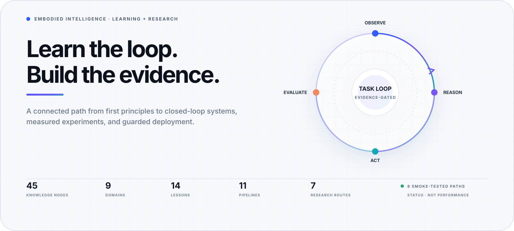
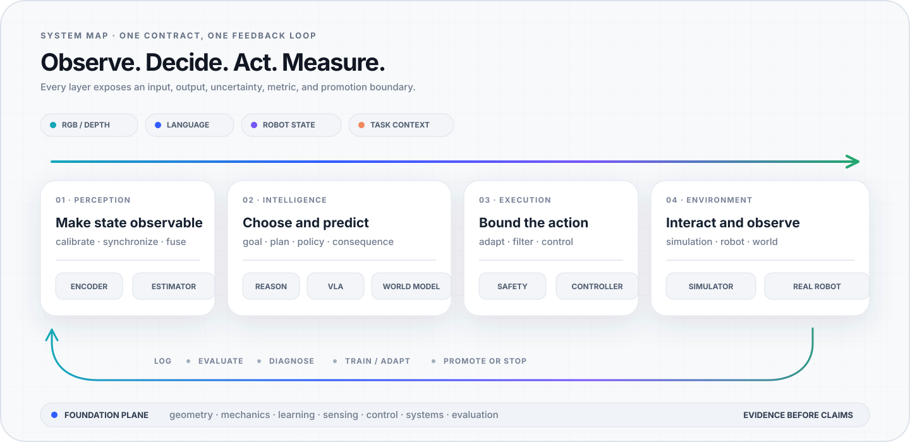
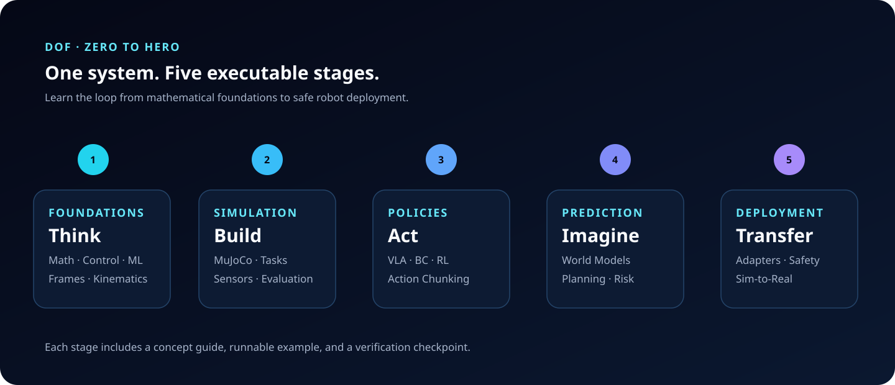

<h1 align="center">Embodied AI · Zero to Hero</h1>

<p align="center">
  <b>English</b> · <a href="README_CN.md">简体中文</a>
</p>

<p align="center">
  <picture>
    <source media="(prefers-color-scheme: dark)" srcset="assets/dof-hero-dark.svg">
    
  </picture>
</p>

<p align="center">
  <a href="#start"><b>Start</b></a>&nbsp;&nbsp;·&nbsp;&nbsp;
  <a href="docs/field-map.md"><b>Field Map</b></a>&nbsp;&nbsp;·&nbsp;&nbsp;
  <a href="#routes"><b>Research Routes</b></a>&nbsp;&nbsp;·&nbsp;&nbsp;
  <a href="#system"><b>System</b></a>&nbsp;&nbsp;·&nbsp;&nbsp;
  <a href="#pipelines"><b>Pipelines</b></a>&nbsp;&nbsp;·&nbsp;&nbsp;
  <a href="#evidence"><b>Evidence</b></a>&nbsp;&nbsp;·&nbsp;&nbsp;
  <a href="#docs"><b>Docs</b></a>
</p>

<p align="center">
  <a href="https://github.com/Dld0621/Embodied-AI-Zero-to-Hero/actions/workflows/tests.yml"></a>
  <a href="https://github.com/Dld0621/Embodied-AI-Zero-to-Hero"></a>
  <a href="LICENSE"></a>
  <a href="THIRD_PARTY_NOTICES.md"></a>
</p>

<p align="center">
  <b>An evidence-aware learning and research stack for embodied intelligence.</b><br>
  <sub>Foundations → runnable systems → measurable evidence → guarded deployment.</sub>
</p>

| **14** foundation lessons | **11** engineering pipelines | **7** research routes | **8** smoke-tested paths |
|:---:|:---:|:---:|:---:|
| Math to robot systems | Data to deployment | Question to evidence | One command each |

> [!IMPORTANT]
> A runnable script proves execution, not task-level performance. DoF separates **smoke-tested interfaces**, **teaching-scale results**, and **hardware-dependent validation** so that every claim has a visible boundary.

<a id="start"></a>
## Start Here

| Learn | Build | Research |
|:---|:---|:---|
| Start from the [14-lesson Foundations Layer](docs/foundations/00-roadmap.md). | Choose one of the [seven research routes](docs/learning-paths/README.md), then execute its registered Pipelines. | Inspect the [benchmark protocol](BENCHMARK.md) before comparing methods. |
| **Outcome:** understand the math, learning, sensing, control, and safety stack. | **Outcome:** produce an artifact and evaluate it with explicit metrics. | **Outcome:** reproduce a baseline, analyze failure, and define the next experiment. |

The smallest complete loop takes about a minute:

```bash
git clone https://github.com/Dld0621/Embodied-AI-Zero-to-Hero.git
cd Embodied-AI-Zero-to-Hero

pip install numpy
python scripts/run_pipeline.py --run simulation-data
```

Then discover every registered path:

```bash
python scripts/run_pipeline.py --list
python scripts/run_pipeline.py --show vla-policy
python scripts/run_pipeline.py --run vla-policy --dry-run
python scripts/run_pipeline.py --run perception-state-estimation
python scripts/run_pipeline.py --run navigation-locomotion
python scripts/run_pipeline.py --run dexterous-manipulation
```

If you already know your research question, generate an experiment brief instead of browsing folders:

```bash
python scripts/run_learning_path.py --list
python scripts/run_learning_path.py --show dexterity-teleoperation
python scripts/run_learning_path.py --validate
```

<a id="system"></a>
## One System

<p align="center">
  
</p>

DoF treats embodied AI as one feedback system, not a set of unrelated topics.

| Layer | Core question | Output |
|:---|:---|:---|
| **Perception** | What is happening in the world and the robot? | Synchronized observations |
| **Reasoning** | What goal and sub-goal should be pursued next? | Typed task plan |
| **Policy / VLA** | What action should the robot take? | Action or action chunk |
| **World Model** | What is likely to happen after that action? | Predicted state, reward, risk |
| **RL Post-training** | How should the policy improve through interaction? | Updated policy |
| **Control & Safety** | How can the command be executed within constraints? | Bounded robot command |
| **Evaluation** | Did it work, generalize, and remain safe? | Reproducible evidence |

<a id="pipelines"></a>
## Eleven Engineering Pipelines

Every track defines prerequisites, inputs, stages, artifacts, metrics, promotion gates, and common failures. The runnable system tracks include deterministic **synthetic smoke tests**; they verify wiring and scoped task evidence, not reproduced real-world baselines.

| Track | Closed loop | Evidence | Guide |
|:---|:---|:---|:---:|
| Simulation & Data | task → simulator → expert → episodes → QA | Smoke-tested | [Open](docs/pipelines/01-simulation-data.md) |
| VLA Policy | image + language + state → policy → closed-loop evaluation | Teaching baseline smoke-tested | [Open](docs/pipelines/02-vla-policy.md) |
| World Model | transitions → dynamics → rollout → planning | Model smoke-tested | [Open](docs/pipelines/03-world-model-planning.md) |
| RL Post-training | MDP → reward → PPO → evaluation → regression | Teaching baseline smoke-tested | [Open](docs/pipelines/04-rl-post-training.md) |
| Robot Foundation Models | canonical observation → adapter → action chunk → safety | Interface-tested | [Open](docs/pipelines/05-rfm-cross-embodiment.md) |
| Embodied Reasoning | instruction → typed plan → skills → feedback → replan | Interface-tested | [Open](docs/pipelines/06-embodied-reasoning.md) |
| Sim-to-Real | robustness → HIL → shadow mode → guarded rollout | Documented; hardware-dependent | [Open](docs/pipelines/07-sim-to-real.md) |
| Dexterous Retargeting | landmarks → geometry → optimization → smoothing | Synthetic smoke-tested | [Open](docs/pipelines/08-dexterous-retargeting.md) |
| Perception & State Estimation | calibration → synchronization → fusion → uncertainty | Synthetic smoke-tested | [Open](docs/pipelines/09-perception-state-estimation.md) |
| Navigation & Locomotion | state → map/terrain → planning → control → recovery | Grid-navigation smoke-tested | [Open](docs/pipelines/10-navigation-locomotion.md) |
| Dexterous Grasping & Fine Manipulation | state → pre-grasp → contact → lift → hold/recover | Abstract contact-dynamics smoke-tested | [Open](docs/pipelines/11-dexterous-manipulation.md) |

The machine-readable source of truth is [`pipelines/manifest.json`](pipelines/manifest.json). The runner executes argument arrays without shell interpolation:

```bash
python scripts/run_pipeline.py --validate
python scripts/run_pipeline.py --run world-model-planning
python scripts/run_pipeline.py --run rl-post-training --full
```

## Learning Path

<p align="center">
  
</p>

| 01 · Foundations | 02 · Baselines | 03 · Evidence | 04 · Research |
|:---|:---|:---|:---|
| Python, math, deep learning, robotics, sensing, safety | VLA, world model, RL, RFM, reasoning | Closed-loop success, latency, generalization, failure analysis | Cross-embodiment, long-horizon planning, guarded deployment |
| [Course roadmap](docs/foundations/00-roadmap.md) | [Pipeline catalog](docs/pipelines/README.md) | [Benchmark](BENCHMARK.md) | [Research positioning](docs/17-research-trends-and-positioning.md) |

The full foundation route is about 45–69 hours. Goal-oriented learners can follow only the prerequisites listed by their chosen Pipeline.

<a id="routes"></a>
## Seven Research Routes

The [bilingual route map](docs/learning-paths/README.md) turns each direction into a question, prerequisites, Pipeline sequence, deliverable, metrics, promotion gate, and evidence boundary.

| Research direction | Pipeline sequence | Required output |
|:---|:---|:---|
| [Foundation Models & VLA](docs/learning-paths/README.md#foundation-models-vla) | Data → VLA → RFM | Policy + adapter + ablation |
| [Manipulation & Imitation](docs/learning-paths/README.md#manipulation-imitation) | Data → VLA → RL | Closed-loop baseline + failure taxonomy |
| [Dexterity & Teleoperation](docs/learning-paths/README.md#dexterity-teleoperation) | Retargeting → State → Grasp → Sim-to-Real | Motion + contact/task evidence report |
| [Navigation & Embodied Agents](docs/learning-paths/README.md#navigation-embodied-agents) | State → Navigation → Reasoning | Agent loop + recovery report |
| [Humanoids & Locomotion](docs/learning-paths/README.md#humanoids-locomotion) | Locomotion → RL → Sim-to-Real | Motion protocol + safety gates |
| [Perception & World Models](docs/learning-paths/README.md#perception-world-models) | State → World model | Uncertain state + predictive rollout |
| [Simulation, Data & Evaluation](docs/learning-paths/README.md#simulation-data-evaluation) | Data → World model → Sim-to-Real | Datasheet + benchmark + promotion decision |

The route contract is machine-readable in [`learning_paths/manifest.json`](learning_paths/manifest.json). It covers every registered Pipeline without changing its evidence status.

<a id="evidence"></a>
## Evidence First

### Teaching-scale PushCube snapshot

All methods share the same dual-cube, language-conditioned task, but training budgets and evaluation episode counts vary. This is a research teaching benchmark, not a controlled leaderboard.

| Method | Input | Data / compute | Eval episodes | Success rate |
|:---|:---|:---|---:|---:|
| Expert | State | Heuristic / CPU | 50 | **~100%** |
| State-BC | 14-D state | 100 episodes / CPU | 100 | **90%** |
| RL, BC-init PPO | 14-D state | 500 episodes / CPU | 20 | **15%** |
| VLA | RGB + language | 100 episodes / CPU | 100 | **0%** |
| WM-MPC | 14-D state | 100 episodes / CPU | 20 | **0%** |
| SmolVLA 450M | RGB + language + state | 50 episodes, 10K steps / GPU | 20 | **0%** |
| Action Chunking / Diffusion | RGB + language | 100 episodes / CPU | — | **N/A** |

State-BC shows that the task is learnable from structured state. The vision-based gap highlights data scale, representation, and closed-loop distribution shift—not a positive VLA result. See [`BENCHMARK.md`](BENCHMARK.md) and [`docs/benchmark_report.md`](docs/benchmark_report.md) for raw artifacts, commands, and failure analysis.

### Evidence vocabulary

| Label | What it proves | What it does not prove |
|:---|:---|:---|
| **Smoke-tested** | The minimum path runs to completion. | The method reaches a useful task score. |
| **Interface-tested** | Schemas, shapes, and adapters are connected. | Real weights or hardware are validated. |
| **Benchmark** | A fixed protocol produced a recorded result. | The result transfers to another setup. |
| **Hardware-dependent** | The gate requires a specific robot and safety process. | Simulation is sufficient authorization. |

## Unified Task

PushCube keeps the task fixed while policies and learning paradigms change.

| Contract | Definition |
|:---|:---|
| Observation | 128×128 RGB, language instruction, optional 14-D structured state |
| Action | 2-D end-effector delta `[dx, dy]` |
| Goal | Push the language-selected cube into the target region |
| Evaluation | Correct-cube success, wrong-cube success, selection accuracy, latency |
| Baselines | Expert, State-BC, VLA, PPO, world model + MPC, action chunking, diffusion |

Core entry points: [`unified_pushcube_env.py`](examples/unified_pushcube_env.py) · [`unified_pushcube_vla.py`](examples/unified_pushcube_vla.py) · [`unified_pushcube_wm.py`](examples/unified_pushcube_wm.py) · [`unified_pushcube_rl.py`](examples/unified_pushcube_rl.py)

## Robot Foundation Models

The RFM layer connects a canonical observation protocol to model adapters, embodiment conversion, action chunking, safety filters, and closed-loop evaluation.

| Model | Role | Repository evidence | Recommended use |
|:---|:---|:---|:---|
| SmolVLA | Lightweight VLA | Reported GPU fine-tuning aggregate; raw per-episode evidence pending | Fine-tuning and adapter study |
| Lightweight VLA | CPU teaching model | Real checkpoint; 65% selection accuracy | Fast interface experiments |
| OpenVLA | Generalist VLA | Adapter scaffold | LoRA and standard benchmark work |
| Octo | Diffusion-policy family | Tutorial adapter | Cross-embodiment study |
| GR00T | Humanoid foundation model | Planned integration | Humanoid and bimanual research |

Start with [`docs/23-robot-foundation-models.md`](docs/23-robot-foundation-models.md), then use the [SmolVLA runbook](docs/28-smolvla-gpu-finetuning-runbook.md) for weight-level work.

## Compatibility

| Platform | Local model / environment | Adapter | Hardware evidence |
|:---|:---:|:---:|:---|
| PushCube 2D | Verified | Verified | Not applicable |
| Franka Panda | Available model | Experimental | External |
| UR5e | Planned | Planned | External |
| AgiBot X1 | Available model | Experimental | External |
| Unitree G1 | Planned | Planned | External |

“External” means this repository does not claim a locally reproduced real-robot result.

## Repository Map

```text
Embodied-AI-Zero-to-Hero/
├─ assets/                 Brand system, bilingual diagrams, visuals
├─ docs/
│  ├─ foundations/        14 prerequisite lessons
│  └─ pipelines/          11 evidence-labelled engineering guides
├─ examples/              Runnable teaching and research baselines
├─ learning_paths/        Seven bilingual research-route contracts
├─ pipelines/             Machine-readable pipeline manifest
├─ benchmarks/            Unified evaluation entry points
├─ results/               Recorded benchmark and training artifacts
├─ scripts/               Validation and pipeline commands
├─ tests/                 Contracts, smoke tests, regressions
└─ tutorials/             Step-by-step implementation guides
```

<a id="docs"></a>
## Documentation

| Area | Best entry point |
|:---|:---|
| Documentation home | [Published site](https://dld0621.github.io/Embodied-AI-Zero-to-Hero/) · [`docs/index.md`](docs/index.md) |
| Field map | [English](docs/field-map.md) · [Chinese](docs/field-map-cn.md) |
| Research routes | [English](docs/learning-paths/README.md) · [Chinese](docs/learning-paths/README_CN.md) |
| Full index | [`docs/README.md`](docs/README.md) |
| Foundations | [English contract](docs/foundations/README_EN.md) · [Chinese roadmap](docs/foundations/00-roadmap.md) |
| MuJoCo scene building | [Bilingual guide](docs/tutorials/mujoco-scene-building.md) · [Runnable template](examples/mujoco_scene_builder/README.md) |
| Pipelines | [`docs/pipelines/README.md`](docs/pipelines/README.md) |
| VLA | [`docs/13-vla-zero-to-one.md`](docs/13-vla-zero-to-one.md) |
| World models | [`docs/15-world-model-zero-to-one.md`](docs/15-world-model-zero-to-one.md) |
| Reinforcement learning | [`docs/14-rl-zero-to-one.md`](docs/14-rl-zero-to-one.md) |
| Robot foundation models | [`docs/23-robot-foundation-models.md`](docs/23-robot-foundation-models.md) |
| Sim-to-Real | [`docs/19-sim-to-real-guide.md`](docs/19-sim-to-real-guide.md) |
| Research frontier | [`docs/18-frontier-papers-online.md`](docs/18-frontier-papers-online.md) |
| Validation and sources | [Evidence policy](docs/VALIDATION.md) · [Accuracy gate](docs/CLAIM_REVIEW.md) · [Primary sources](docs/SOURCES.md) |
| Governance | [Security](SECURITY.md) · [Citation](CITATION.cff) · [Third-party notices](THIRD_PARTY_NOTICES.md) |

## Reproducibility

DoF uses a five-level evidence ladder: import → smoke → deterministic test → benchmark → hardware validation. Every result should retain the command, seed, commit, dataset version, checkpoint, hardware, episode count, and machine-readable metrics.

```bash
python scripts/check_markdown_links.py
python scripts/run_pipeline.py --validate
python scripts/audit_repository.py
python -m pytest tests/ -q
python benchmarks/run_benchmark.py --help
```

The core discovery path is also containerized (optional model, GPU, simulator, and robot dependencies remain outside this minimal image):

```bash
docker build -t embodied-ai-zero-to-hero .
docker run --rm embodied-ai-zero-to-hero
```

Continuous integration checks repository links, evidence contracts, the strict documentation build, dependency paths, and regressions on every relevant change. Hardware validation remains explicitly separate from local simulation.

## Roadmap

| Horizon | Focus |
|:---|:---|
| **Now** | Keep foundations, bilingual docs, pipeline contracts, and benchmark artifacts coherent. |
| **Next** | Scale data, improve closed-loop VLA success, and complete OpenVLA evaluation. |
| **Then** | Cross-embodiment comparison, long-horizon reasoning, and world-model planning. |
| **Hardware gate** | Domain randomization, HIL, shadow mode, and guarded real-robot deployment. |

## Contributing

Issues and pull requests are welcome. Read [`CONTRIBUTING.md`](CONTRIBUTING.md) before proposing a new tutorial, pipeline, benchmark claim, or robot adapter.

High-value contributions include reproducible baselines, failing cases, bilingual documentation, additional embodiment adapters, and evidence-backed corrections.

## Citation

```bibtex
@misc{embodied-ai-zero-to-hero,
  title={Embodied AI: Zero to Hero — A Reproducible Learning and Research Stack},
  author={Gangwei Li},
  year={2026},
  howpublished={\url{https://github.com/Dld0621/Embodied-AI-Zero-to-Hero}},
}
```

## License

Original DoF content is released under the [MIT License](LICENSE). Bundled upstream code, models, and assets retain their own terms; see [Third-Party Notices](THIRD_PARTY_NOTICES.md) before reuse.

## Acknowledgments

Built with ideas and tools from [MuJoCo Menagerie](https://github.com/google-deepmind/mujoco_menagerie), [OpenVLA](https://github.com/openvla/openvla), [LeRobot](https://github.com/huggingface/lerobot), [Stable Baselines3](https://stable-baselines3.readthedocs.io/), and the broader open robotics community.

<p align="center">
  <b>Build intelligence that moves.</b><br>
  Maintained by <a href="https://github.com/Dld0621">Gangwei Li</a>
</p>
