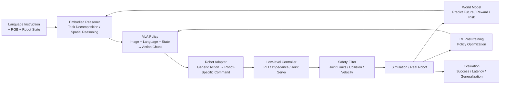

<h1 align="center">Embodied AI: Zero to Hero</h1>

<p align="center">
  English | <a href="README_CN.md">中文</a>
</p>

<p align="center">
  <b>An executable learning repository for robot learning:</b><br>
  <b>Robot Foundation Models · VLA · World Models · Reinforcement Learning · Simulation & Deployment</b>
</p>

<p align="center">
  <a href="https://github.com/Dld0621/Embodied-AI-Zero-to-Hero/actions/workflows/tests.yml"></a>
  <a href="https://github.com/Dld0621/Embodied-AI-Zero-to-Hero"></a>
  <a href="LICENSE"></a>
  <a href="https://python.org"></a>
  <a href="https://mujoco.org"></a>
</p>

<p align="center">
  <b>Maintainer:</b> <a href="https://github.com/Dld0621">Gangwei Li</a> — Robot Foundation Models · VLA · World Models · Robot Learning
</p>

<p align="center">
  <a href="#five-minute-quick-start"><b>Run Demo</b></a> ·
  <a href="#documentation-map"><b>Read Docs</b></a> ·
  <a href="#benchmarks"><b>View Results</b></a>
</p>

<p align="center">


<br>

<br>


<br>


<br>
<sub> </sub>
</p>

---

## Why This Repository

Robot learning resources are fragmented across vision-language-action policies, world models, reinforcement learning, and deployment. This repository organizes them into a unified, executable path — from understanding core concepts to reproducing algorithms and building research prototypes.

| | |
|:---|:---|
| **Systematic** | Not a link dump — a unified system structure where VLA, WM, and RL form a policy–prediction–optimization pipeline |
| **Executable** | Every direction includes a minimal runnable example with a clear entry point |
| **Research-oriented** | Progresses from teaching implementations to paper reproduction and original research |

### Scope & Boundaries

This repository focuses on the **robot-learning core** of embodied AI: policies, predictive models, and interactive optimization. It does **not** aim to be a comprehensive encyclopedia of all embodied AI subfields.

<details>
<summary><b>Covered vs Not Covered (click to expand)</b></summary>

| **Covered** | **Not Covered** |
|:---|:---|
| Robot foundation models & cross-embodiment adaptation | Full 3D perception & SLAM |
| VLA (vision-language-action) policies | Legged locomotion & navigation |
| World models & latent dynamics | Complete hardware driver stacks |
| RL for continuous control | Mobile manipulation platforms |
| Simulation, evaluation & sim-to-real | Large-scale dataset curation |

</details>

---

## Project Status

✅ Real GPU training (SmolVLA 450M, 10K steps) · ✅ Unified PushCube task · 🟡 Task-level VLA success pending (0% at teaching scale)

<details>
<summary><b>Core Research Tracks & Engineering Layers (click to expand)</b></summary>

### Core Research Tracks

| Track | Concepts | Tutorial | Runnable Demo | Benchmark | Research Extension |
|:------|:--------:|:--------:|:-------------:|:---------:|:------------------:|
| **Robot Foundation Models** | ✅ | ✅ | ✅ | ✅ | ⏳ |
| **Vision-Language-Action** | ✅ | ✅ | ✅ | ⏳ | ⏳ |
| **World Models** | ✅ | ✅ | ✅ | ⏳ | ⏳ |
| **Reinforcement Learning** | ✅ | ✅ | 🟡 | 🟡 | ⏳ |
| **Embodied Reasoning** | ✅ | ✅ | 🟡 | ⏳ | ⏳ |

### Engineering Layers

| Layer | Concepts | Tutorial | Runnable Demo | Status |
|:------|:--------:|:--------:|:-------------:|:------:|
| **Sim-to-Real** | ✅ | ✅ | ⏳ | ⏳ |
| **VLA Deployment** | ✅ | ✅ | ⏳ | ⏳ |
| **Evaluation Framework** | ✅ | 🟡 | ⏳ | ⏳ |

**Legend:** ✅ Verified (clean env, logged) · 🟡 Experimental (CI exists, but full data/model/benchmark validation pending) · ⏳ Planned · 🔒 External

</details>

---

## Embodied AI System Overview

This project is structured around a single research stack, not four independent topics. Each module answers a distinct question within the full pipeline:


```mermaid
flowchart LR
    A[Language Instruction<br/>+ RGB + Robot State]
    B[Embodied Reasoner<br/>Task Decomposition / Spatial Reasoning]

    A --> B
    B --> C[VLA Policy<br/>Image + Language + State → Action Chunk]
    C --> D[Robot Adapter<br/>Generic Action → Robot-Specific Command]
    D --> E[Low-level Controller<br/>PID / Impedance / Joint Servo]
    E --> F[Safety Filter<br/>Joint Limits / Collision / Velocity]
    F --> G[Simulation / Real Robot]

    G --> H[World Model<br/>Predict Future / Reward / Risk]
    H --> B
    G --> I[RL Post-training<br/>Policy Optimization]
    I --> C

    G --> J[Evaluation<br/>Success / Latency / Generalization]
```

| Module | Question It Answers |
|:-------|:--------------------|
| **Robot Foundation Models** | How to unify reasoning, VLA, world models, and RL into one deployment-ready pipeline? |
| **VLA** | Given an image and a language instruction, what should the robot do? |
| **World Models** | If the robot executes an action, what will happen in the future? |
| **RL** | When the current policy underperforms, how to optimize it through interaction? |
| **Embodied Reasoning** | How to decompose a long-horizon task into executable sub-goals? |

**Core research line:** Robot Foundation Models is the primary unifying framework. VLA, World Models, RL, and Embodied Reasoning form the policy, prediction, optimization, and planning layers that connect perception to physical execution.

---

<a id="choose-your-path"></a>
## Choose Your Path

| Who you are | Recommended Track | First Task | Expected Outcome |
|:------------|:------------------|:-----------|:-----------------|
| **Zero background** | [Foundations](docs/foundations/00-roadmap.md) | Run PushCube VLA | Understand robot action representation |
| **Robot learning student** | VLA Track | Run minimal VLA | Understand multimodal-to-action pipeline |
| **Foundation model researcher** | RFM Track | Run SmolVLA adapter | Understand unified model interface & action chunks |
| **RL learner** | RL Track | Run Q-Learning / SAC | Understand policy optimization |
| **World model researcher** | World Model Track | Run latent dynamics demo | Complete prediction + planning loop |
| **Engineering developer** | Simulation & Evaluation | Load MuJoCo model | Integrate your own robot |

---

<a id="five-minute-quick-start"></a>
## Five-Minute Quick Start

The single most stable entry point — run a complete VLA pipeline on the dual-cube PushCube environment.

```bash
git clone https://github.com/Dld0621/Embodied-AI-Zero-to-Hero.git
cd Embodied-AI-Zero-to-Hero

pip install numpy torch --index-url https://download.pytorch.org/whl/cpu

cd examples
python unified_pushcube_vla.py --smoke-test --no-ablation
```

**Input:** 128×128 RGB image + language instruction ("push the red cube to the target")
**Method:** CNN + word embedding → MLP policy head
**Output:** 2-D action [dx, dy] (arm movement)
**Evaluation:** Task success rate, language ablation (correct / shuffled / vision-only)

---

## Visual Demos

### PushCube Benchmark Results

Unified leaderboard across 10 methods on the same dual-cube PushCube task. See [Benchmarks](#benchmarks) for full table.

| Method | Type | Success Rate ↑ |
|:-------|:-----|:---:|
| Expert | Heuristic | **~100%** |
| State-BC | State-based MLP | **90%** |
| RL (BC-init PPO) | State-based RL | **10–20%** |
| VLA / ACT / Diffusion / WM-MPC / SmolVLA | Vision-based | **0%** |

> At teaching scale (50–200 episodes), vision-based methods cannot learn contact-rich manipulation. State-BC proves the task is learnable; the gap motivates more data and larger models.

### SmolVLA GPU Training (Real)

SmolVLA 450M fine-tuned on RTX 3060 (bf16, 10K steps). Loss: 0.47→0.03 (best 0.004). Closed-loop: 0% success (BC overfitting at teaching scale). Full results: [`results/smolvla/`](results/smolvla/).

### World Model Visuals

<details>
<summary><b>RSSM Training Analysis & WM+Policy Fusion (click to expand)</b></summary>

Held-out synthetic 2D navigation trajectories comparing posterior reconstruction, prior imagination, reward prediction, and termination prediction.


Reward comparison across four WM-policy fusion strategies on synthetic Nav2D.


> Concept demonstration on synthetic Nav2D; not a standard benchmark.

</details>

<details>
<summary><b>RL Training Curves (illustrative, not from completed benchmark)</b></summary>


</details>

| Track | Input | Method | Result |
|:---|:---|:---|:---|
| **VLA** | Synthetic image + language instruction | Minimal CNN + GRU + MLP policy head | Predicted action chunk (concept demo) |
| **World Model** | Current observation + action | Latent dynamics model (RSSM-style) | Predicted next observation |
| **RL** | Synthetic state + goal | PPO + REINFORCE | 10–20% success (PushCube) |
| **RFM** | Image + language + state | Lightweight VLA (195K params, real checkpoint) | 0% closed-loop success, 65% selection accuracy |

> All visuals generated from code in this repository. GIF / video exports are WIP.

---

## Unified Task: PushCube (Dual-Cube, Language-Conditioned)

All PushCube baselines share a single lightweight task: **push the *correct* colored cube into a target zone**. Two cubes of distinct colors (red, green) sit on the table. A language instruction specifies which cube to push. A vision-only policy cannot disambiguate which cube to push without the language signal.

```
PushCube Environment (dual-cube)
├── State (14-D): [arm_x, arm_y, cube1_x, cube1_y, cube2_x, cube2_y,
│                  target_x, target_y, cube1_r, cube1_g, cube2_r, cube2_g,
│                  goal_red, goal_green]
├── Action (2-D): [dx, dy] (arm movement)
├── Observation (VLA): 128x128 RGB render + language instruction
├── Language: "push the {red|green} cube to the {direction}"
└── Success: active cube enters target zone within max_steps
```

| Track | File | What It Does | Key Technique |
|:---|:---|:---|:---|
| **VLA** | [`unified_pushcube_vla.py`](examples/unified_pushcube_vla.py) | Image + language → action | CNN + word embedding → MLP; 3-condition ablation (full / lang-shuffled / vision-only) |
| **World Model** | [`unified_pushcube_wm.py`](examples/unified_pushcube_wm.py) | Predict next state + reward | MLP dynamics (14-D state) |
| **WM-MPC** | [`unified_pushcube_wm_mpc.py`](examples/unified_pushcube_wm_mpc.py) | WM → planner → action → env | Model Predictive Control with Random Shooting / CEM |
| **RL** | [`unified_pushcube_rl.py`](examples/unified_pushcube_rl.py) | Learn policy from scratch | BC-initialized PPO (main) + REINFORCE (concept demo) |
| **Action-Chunking** | [`unified_pushcube_act.py`](examples/unified_pushcube_act.py) | Imitation with action chunking | Multi-frame Transformer encoder + exponential temporal ensembling (no CVAE) |
| **Diffusion Policy** | [`unified_pushcube_diffusion.py`](examples/unified_pushcube_diffusion.py) | Imitation via diffusion | DDPM with action horizon, deterministic eval |

> **Note:** The Action-Chunking Policy is *not* a full ACT (Zhao et al., 2023). It implements multi-frame observation tokens and temporal ensembling but omits the CVAE latent variable. See the file header for details.

### Language Ablation (VLA)

To verify that the VLA policy actually uses the language signal, a **single trained model** is evaluated under three language conditions on the *same* set of evaluation episodes:

| Condition | Eval Language | Expected Behavior |
|:---|:---|:---|
| **Full VLA** | Correct ("push the red cube…") | Should push the right cube |
| **Language-shuffled** | Swapped ("push the green cube…") | Should push the *wrong* cube (proves language matters) |
| **Vision-only** | Zeroed (all-pad tokens) | Performance drop vs. full VLA |

A separately trained **Vision-Only baseline** (language tokens zeroed during training) is also included as a stronger control.

### Expert Policy

Demonstrations use a three-phase heuristic: (1) flank around the active cube, (2) approach from behind, then (3) push toward the target. Expert success rate: **~100%** on 50 random seeds.

Run all PushCube baselines:

<details>
<summary><b>Full PushCube commands (click to expand)</b></summary>

```bash
cd examples
python unified_pushcube_env.py             # Environment self-test + expert baseline
python unified_pushcube_vla.py             # VLA + State-BC + 3-condition ablation
python unified_pushcube_wm.py              # World model, multi-step prediction
python unified_pushcube_wm_mpc.py          # WM-MPC control loop (CEM + Random Shooting)
python unified_pushcube_rl.py --algo ppo   # BC-initialized PPO (main RL baseline)
python unified_pushcube_act.py             # Action-chunking policy + temporal ensembling
python unified_pushcube_diffusion.py       # Diffusion policy, action horizon

# CI smoke tests (fast, 2 episodes each)
python unified_pushcube_vla.py --smoke-test --no-ablation
python unified_pushcube_rl.py --smoke-test
python unified_pushcube_wm.py --smoke-test
python unified_pushcube_wm_mpc.py --smoke-test
python unified_pushcube_act.py --smoke-test
python unified_pushcube_diffusion.py --smoke-test
```

</details>

> PushCube is intentionally lightweight—no MuJoCo dependency, pure NumPy/PyTorch—so you can focus on algorithm logic rather than simulation plumbing. Success rates are teaching-level (limited data, small models); they illustrate algorithm differences, not production performance.

---

## Robot Foundation Models

A unified robot-learning layer that connects embodied reasoning, VLA policies, world models, RL post-training, robot adaptation, safety control, simulation, and real-robot deployment. Instead of treating "robot foundation models" as an isolated direction, this module wraps existing VLA as the action-generation layer and connects it to World Model predictions, RL post-training, and robot control interfaces.

```text
Language Instruction → Embodied Reasoner → Robot Foundation Model / VLA
    → Robot Adapter → Low-level Controller → Safety Filter
    → Simulation / Real Robot

    ↑ World Model predictions · RL post-training
```

### Unified Interface

All models implement the same protocol — the control loop never changes when swapping models:

```python
class RobotFoundationModel(Protocol):
    def reset(self) -> None: ...
    def predict_action(self, observation: RobotObservation) -> ActionChunk: ...
```

### Model Status

| Model | Type | Scale | Status | Recommended Use |
|:------|:-----|------:|:------:|:----------------|
| SmolVLA | Lightweight VLA | 450M | ✅ Pipeline Verified · 🟡 Task Success Pending | Entry, fine-tuning, consumer GPU |
| OpenVLA/OFT | Generalist VLA | 7B | 🟡 Adapter | LIBERO, LoRA, standard benchmark |
| Octo | Generalist Diffusion Policy | 27M/93M | 🟡 Tutorial | Cross-embodiment learning |
| GR00T N1.6 | Humanoid Foundation Model | Large | ⏳ Planned | Humanoid, bimanual manipulation |

> **Status legend:** ✅ Pipeline Verified (real model loaded + real fine-tuning + closed-loop evaluation complete) · 🟡 Task Success Pending (0% closed-loop success at teaching scale) or Adapter interface + mock pipeline · ⏳ Planned. SmolVLA 450M has been **fine-tuned on GPU** (RTX 3060, bf16, 10K steps, 100M trainable params) with a full closed-loop evaluation pipeline. Training loss: 0.47→0.03 (best 0.004). Closed-loop eval (20 episodes × 3 language modes): 0% success (50 episodes insufficient; BC overfitting at teaching scale), 50% selection accuracy. Lightweight VLA (195K params, CPU) achieves **65% selection accuracy** confirming language grounding. See [`docs/28-smolvla-gpu-finetuning-runbook.md`](docs/28-smolvla-gpu-finetuning-runbook.md) for GPU fine-tuning guide.

### Quick Start

<details>
<summary><b>RFM commands (click to expand)</b></summary>

```bash
# Test SmolVLA adapter in mock mode (no GPU/download needed)
cd examples/robot_foundation_models/smolvla
python inference.py

# Train lightweight VLA on real PushCube data (CPU, ~2 min)
python train_lightweight_vla.py --epochs 100 --batch_size 64

# Closed-loop evaluation with real checkpoint
python evaluate.py --mode closed_loop \
    --checkpoint models/lightweight_vla/lightweight_vla_pushcube.pt \
    --n_episodes 20

# Rule-based task planner
cd ../planners
python rule_based_planner.py

# RFM benchmarks (mock mode)
cd ../../../benchmarks/robot_foundation_models
python evaluate_offline.py --mock --smoke-test
python evaluate_closed_loop.py --mock --smoke-test
python language_ablation.py --mock --smoke-test
```

</details>

### Directory Structure

```
examples/robot_foundation_models/
├── common/          # RobotObservation, ActionChunk, Protocol, EmbodimentAdapter, SafetyFilter
├── smolvla/         # SmolVLAAdapter (450M, first priority)
├── openvla/         # OpenVLAAdapter (7B, LoRA config)
└── planners/        # Rule-based + VLM-based task decomposition
```

Documentation: [`docs/23-robot-foundation-models.md`](docs/23-robot-foundation-models.md) → [24](docs/24-action-representation-and-tokenization.md) → [25](docs/25-cross-embodiment-adaptation.md) → [26](docs/26-rfm-finetuning-and-evaluation.md) → [27](docs/27-embodied-reasoning-and-planning.md)

---

## Core Learning & Research Tracks

Each track follows a unified template: Definition → Pipeline → Learning Levels → Known Limitations. Detailed breakdowns (pipelines, learning-level tables, implementation status) are in [`docs/29-learning-tracks-detail.md`](docs/29-learning-tracks-detail.md).

| # | Track | Layer | Pipeline Summary | Key Entry Points | Status |
|---|-------|-------|------------------|------------------|--------|
| 1 | **VLA** | Policy | RGB + language + state → encoder → fusion → action chunk | [`minimal_vla.py`](examples/minimal_vla.py) · [`unified_pushcube_vla.py`](examples/unified_pushcube_vla.py) | ✅ Concept · ✅ Tutorial · 🟡 Benchmark |
| 2 | **World Models** | Prediction | obs + action → latent dynamics → predicted future | [`world_model_demo.py`](examples/world_model_demo.py) · [`dreamer_rssm.py`](examples/dreamer_rssm.py) | ✅ Concept · ✅ Tutorial · 🟡 Benchmark |
| 3 | **RL** | Optimization | state → policy gradient / actor-critic → optimized π | [`rl_demo.py`](examples/rl_demo.py) · [`unified_pushcube_rl.py`](examples/unified_pushcube_rl.py) | ✅ Concept · ✅ Tutorial · 🟡 Benchmark |
| 4 | **Embodied Reasoning** | Planning | instruction → decomposition → subgoals → VLA execution | [`rule_based_planner.py`](examples/robot_foundation_models/planners/rule_based_planner.py) | ✅ Concept · 🟡 Runnable |

> See [`docs/29-learning-tracks-detail.md`](docs/29-learning-tracks-detail.md) for full pipelines, learning-level tables, implementation status, and known limitations per track.

---

<a id="benchmarks"></a>
## Benchmarks

### PushCube Benchmark (Dual-Cube, Language-Conditioned)

All methods evaluated on the **same environment**, **task definition**, **action space**, **metric**, and **evaluation seeds**. Training data and compute budgets differ by method.

| Method | Input | Success Rate ↑ | Notes |
|:-------|:------|:---:|:------|
| Expert | State | **~100%** | Three-phase heuristic |
| State-BC | 14-D state | **90%** | MLP + geometric features |
| RL (BC-init PPO) | 14-D state | **10–20%** | BC warm-start + expert guidance |
| VLA / SmolVLA | RGB + language | **0%** | Teaching-scale; needs more data |

> **Full benchmark details** — complete leaderboard, resource table, SmolVLA ablation, reproduction commands, and analysis — see [`BENCHMARK.md`](BENCHMARK.md).

**Quick commands:** `cd examples && python unified_pushcube_vla.py` · `python unified_pushcube_rl.py --algo ppo` · `python unified_pushcube_wm_mpc.py --planner cem`

| Track | Metric | Status |
|:------|:-------|:-------|
| VLA | Task success / inference latency | 🟡 |
| World Models | One-step / multi-step prediction error | 🟡 |
| RL | Reward curve / success rate / sample count | 🟡 |

**Results location:** `results/benchmarks/` and `results/smolvla/`

---

## Supported Robots and Environments

<details>
<summary><b>Robot support matrix (click to expand)</b></summary>

| Robot | Type | DOF | Model Status | Adapter Status | Hardware Verified |
|:------|:-----|:---:|:------------:|:--------------:|:-----------------:|
| **PushCube (2D)** | Simulated arm | 2 | ✅ | ✅ | N/A |
| **Franka Panda** | Arm + gripper | 7+1 | 🟡 | 🟡 | 🔒 External |
| **UR5e** | Arm + gripper | 6+1 | ⏳ | ⏳ | 🔒 External |
| **AgiBot X1** | Humanoid upper body | 7+7 | 🟡 | 🟡 | 🔒 External |
| **Unitree G1** | Humanoid | 23+ | ⏳ | ⏳ | 🔒 External |

**Legend:** ✅ Done · 🟡 In Progress · ⏳ Planned · 🔒 External

</details>

---

## Learning Roadmap

```
Foundations Layer → Runnable Baselines → Unified Benchmarks → Research & Real Robot
```

**New to robotics or deep learning?** Start with the [Foundations Layer](docs/foundations/00-roadmap.md) — 10 self-contained lessons covering Python, linear algebra, deep learning, coordinate transforms, SO(3)/SE(3), FK/IK, control, MuJoCo, and dataset training. ~25–35 hours total.

For the full Stage 0–10 breakdown, see [`docs/README.md`](docs/README.md).

---

<a id="documentation-map"></a>
## Documentation Map

All detailed concepts, paper lists, commands, and tutorials live in [`docs/`](docs/). See [`docs/README.md`](docs/README.md) for the full index.

| Category | Documents |
|:---------|:----------|
| **Foundations Layer** | Python, linear algebra, deep learning, Transformer, coordinate transforms, SO(3)/SE(3), FK/IK, control, MuJoCo, dataset & training — [`docs/foundations/`](docs/foundations/00-roadmap.md) |
| **Core Concepts** | Joint concepts, FK/IK basics, glossary |
| **Robot Foundation Models** | RFM overview, action tokenization, cross-embodiment, fine-tuning & evaluation, embodied reasoning |
| **VLA** | Core concepts, key papers, learning path, fine-tuning, deployment, interview prep |
| **World Models** | Concepts, RSSM, integration with VLA/RL |
| **RL** | Fundamentals, SAC/HER, sim-to-real |
| **Sim-to-Real** | Domain randomization, system ID, visual adaptation, latency compensation |
| **Datasets & Tools** | Manipulation datasets, open-source projects |
| **Research** | ArXiv scan, research trends, frontier papers with online links |

---

## Reproducibility

| Level | Requirement | Status |
|:------|:------------|:-------|
| L1 Import | Modules import without errors | ✅ |
| L2 Demo | Example commands run to completion | 🟡 |
| L3 Deterministic | Fixed seed produces repeatable results | 🟡 |
| L4 Benchmark | Unified evaluation script passes | ⏳ |
| L5 Hardware | Real-robot result validation | 🔒 External |

**Tested on:** Ubuntu 22.04 ✅ · Windows 11 🟡 · macOS 🟡 (Python 3.10 · MuJoCo 3.x · PyTorch 2.x)

---

## Research Roadmap

| Phase | Goal | Timeline |
|:------|:-----|:---------|
| **Phase 1: Foundation** | Complete all tutorials and runnable demos | Done |
| **Phase 2: RFM Integration** | SmolVLA real fine-tuning + PushCube closed-loop | ✅ Pipeline verified (GPU fine-tuning + closed-loop eval complete) |
| **Phase 3: Cross-embodiment** | OpenVLA adapter, multi-robot evaluation | 2026 Q4 |
| **Phase 4: Sim-to-Real** | Domain randomization + real-hardware validation | 2026 Q4 |
| **Phase 5: Frontier** | Long-horizon tasks, VLM planning, real deployment | 2027 |

---

## Contributing

See [`CONTRIBUTING.md`](CONTRIBUTING.md) for issue/PR standards, content quality requirements, and review checklists.

Issues and PRs are welcome! Current high-priority directions:
- Scale up SmolVLA training (10K→100K steps + 100+ episodes for task-level success)
- Add OpenVLA adapter with LoRA fine-tuning
- Add more robot adapters (Franka Panda, UR5e, Unitree G1)
- Complete VLA fine-tuning tutorials and evaluation benchmarks
- Add latest advances in World Model + Policy fusion
- Add frontier paper code reproduction guides

---

## Citation

If you use this repository in your research, please cite:

```bibtex
@misc{embodied-ai-zero-to-hero,
  title={Embodied AI: Zero to Hero — A Reproducible Learning and Research Stack},
  author={Gangwei Li},
  year={2026},
  howpublished={\url{https://github.com/Dld0621/Embodied-AI-Zero-to-Hero}},
}
```

---

## License

[MIT License](LICENSE)

---

## Acknowledgments

- [MuJoCo Menagerie](https://github.com/google-deepmind/mujoco_menagerie) — Pre-built robot model library
- [OpenVLA](https://github.com/openvla/openvla) — Stanford / Berkeley open-source VLA
- [LeRobot](https://github.com/huggingface/lerobot) — HuggingFace robot learning framework
- [Stable Baselines3](https://stable-baselines3.readthedocs.io/) — PyTorch RL algorithm library
- [DreamDojo](https://github.com/NVIDIA/DreamDojo) — NVIDIA general world model
- [SmolVLA](https://github.com/huggingface/lerobot/tree/main/lerobot/common/policies/smolvla) — HuggingFace lightweight VLA
