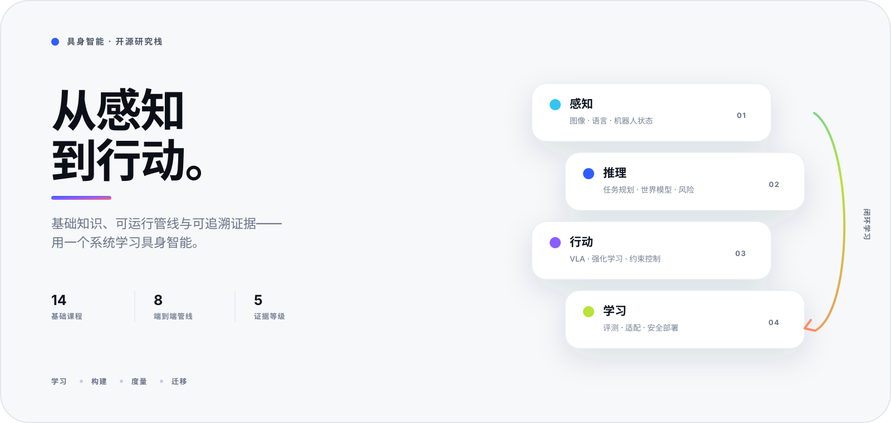
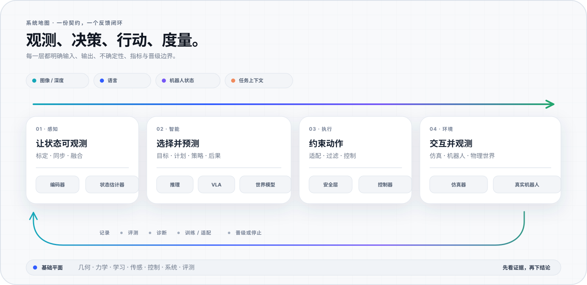
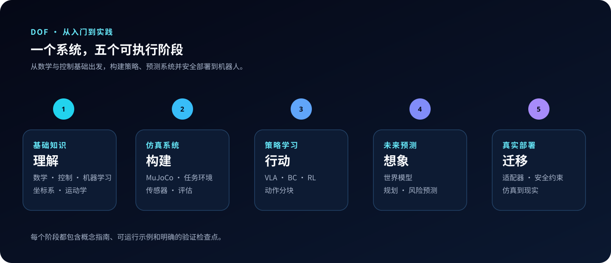

<h1 align="center">具身智能 · 从入门到实践</h1>

<p align="center">
  <a href="README.md">English</a> · <b>简体中文</b>
</p>

<p align="center">
  <picture>
    <source media="(prefers-color-scheme: dark)" srcset="assets/dof-hero-cn-dark.svg">
    
  </picture>
</p>

<p align="center">
  <a href="#start"><b>开始</b></a>&nbsp;&nbsp;·&nbsp;&nbsp;
  <a href="docs/field-map-cn.md"><b>领域地图</b></a>&nbsp;&nbsp;·&nbsp;&nbsp;
  <a href="#routes"><b>科研路线</b></a>&nbsp;&nbsp;·&nbsp;&nbsp;
  <a href="#system"><b>系统</b></a>&nbsp;&nbsp;·&nbsp;&nbsp;
  <a href="#pipelines"><b>管线</b></a>&nbsp;&nbsp;·&nbsp;&nbsp;
  <a href="#evidence"><b>证据</b></a>&nbsp;&nbsp;·&nbsp;&nbsp;
  <a href="#docs"><b>文档</b></a>
</p>

<p align="center">
  <a href="https://github.com/Dld0621/Embodied-AI-Zero-to-Hero/actions/workflows/tests.yml"></a>
  <a href="https://github.com/Dld0621/Embodied-AI-Zero-to-Hero"></a>
  <a href="LICENSE"></a>
</p>

<p align="center">
  <b>一个证据优先的具身智能学习与研究栈。</b><br>
  <sub>基础知识 → 可运行系统 → 可度量证据 → 受控部署。</sub>
</p>

| **14** 章基础课程 | **11** 条工程管线 | **7** 条科研路线 | **8** 条已冒烟验证管线 |
|:---:|:---:|:---:|:---:|
| 从数学到机器人系统 | 从数据到部署 | 从问题到证据 | 每条一条命令 |

> [!IMPORTANT]
> 脚本能运行，只能证明执行链路接通，不能证明任务性能达标。DoF 明确区分**接口 Smoke Test**、**教学规模结果**与**依赖硬件的验证**，让每个结论都带有可见边界。

<a id="start"></a>
## 从这里开始

| 学习 | 构建 | 研究 |
|:---|:---|:---|
| 从 [14 章基础课程](docs/foundations/00-roadmap.md)开始。 | 选择一条[七方向科研路线](docs/learning-paths/README_CN.md)，再执行其中登记的 Pipeline。 | 比较方法前先阅读[基准协议](BENCHMARK.md)。 |
| **成果：** 理解数学、学习、感知、控制与安全系统。 | **成果：** 生成明确产物，并用指定指标完成评估。 | **成果：** 复现基线、分析失败并定义下一项实验。 |

最小完整闭环大约一分钟即可运行：

```bash
git clone https://github.com/Dld0621/Embodied-AI-Zero-to-Hero.git
cd Embodied-AI-Zero-to-Hero

pip install numpy
python scripts/run_pipeline.py --run simulation-data
```

然后查看所有已登记方向：

```bash
python scripts/run_pipeline.py --list
python scripts/run_pipeline.py --show vla-policy
python scripts/run_pipeline.py --run vla-policy --dry-run
python scripts/run_pipeline.py --run perception-state-estimation
python scripts/run_pipeline.py --run navigation-locomotion
python scripts/run_pipeline.py --run dexterous-manipulation
```

如果已经明确研究问题，可直接生成实验任务书，无需浏览目录：

```bash
python scripts/run_learning_path.py --list --lang zh
python scripts/run_learning_path.py --show dexterity-teleoperation --lang zh
python scripts/run_learning_path.py --validate
```

<a id="system"></a>
## 一个系统

<p align="center">
  
</p>

DoF 把具身智能视为一个反馈系统，而不是互不相关的主题集合。

| 层级 | 核心问题 | 输出 |
|:---|:---|:---|
| **感知** | 世界和机器人当前发生了什么？ | 同步后的观测 |
| **推理** | 下一步应该追求哪个目标或子目标？ | 类型化任务计划 |
| **策略 / VLA** | 机器人应该采取什么动作？ | 动作或动作块 |
| **世界模型** | 执行动作后可能发生什么？ | 预测状态、奖励与风险 |
| **RL 后训练** | 策略如何通过交互继续改进？ | 更新后的策略 |
| **控制与安全** | 如何在约束内执行命令？ | 有界机器人命令 |
| **评估** | 是否成功、泛化并保持安全？ | 可复现证据 |

<a id="pipelines"></a>
## 十一条工程管线

每个方向都明确前置知识、输入、阶段、产物、指标、晋级门槛和常见失败。可运行主线提供确定性的**合成 smoke test**；它们验证连通性与限定范围内的任务证据，不伪装成真实场景复现基线。

| 方向 | 闭环 | 当前证据 | 文档 |
|:---|:---|:---|:---:|
| 仿真与数据 | 任务 → 仿真器 → 专家 → 轨迹 → 质检 | 已有 Smoke Test | [进入](docs/pipelines/01-simulation-data.md) |
| VLA 策略 | 图像 + 语言 + 状态 → 策略 → 闭环评估 | 教学基线可 Smoke Test | [进入](docs/pipelines/02-vla-policy.md) |
| 世界模型 | 转移数据 → 动力学 → Rollout → 规划 | 模型可 Smoke Test | [进入](docs/pipelines/03-world-model-planning.md) |
| RL 后训练 | MDP → 奖励 → PPO → 评估 → 回归检查 | 教学基线可 Smoke Test | [进入](docs/pipelines/04-rl-post-training.md) |
| 机器人基础模型 | 标准观测 → 模型适配 → 动作块 → 安全层 | 接口已验证 | [进入](docs/pipelines/05-rfm-cross-embodiment.md) |
| 具身推理 | 指令 → 类型化计划 → 技能 → 反馈 → 重规划 | 接口已验证 | [进入](docs/pipelines/06-embodied-reasoning.md) |
| Sim-to-Real | 鲁棒性 → HIL → 影子模式 → 受控上线 | 已文档化；依赖硬件 | [进入](docs/pipelines/07-sim-to-real.md) |
| 灵巧手重定向 | 关键点 → 几何 → 优化 → 平滑 | 合成输入可 Smoke Test | [进入](docs/pipelines/08-dexterous-retargeting.md) |
| 感知与状态估计 | 标定 → 同步 → 融合 → 不确定性 | 合成数据 smoke-tested | [进入](docs/pipelines/09-perception-state-estimation.md) |
| 导航与运动控制 | 状态 → 地图/地形 → 规划 → 控制 → 恢复 | 栅格导航 smoke-tested | [进入](docs/pipelines/10-navigation-locomotion.md) |
| 灵巧抓取与精细操作 | 状态 → 预抓取 → 接触 → 抬升 → 保持/恢复 | 抽象接触动力学 smoke-tested | [进入](docs/pipelines/11-dexterous-manipulation.md) |

机器可读的唯一入口是 [`pipelines/manifest.json`](pipelines/manifest.json)。统一运行器使用参数数组执行命令，不进行 Shell 字符串插值：

```bash
python scripts/run_pipeline.py --validate
python scripts/run_pipeline.py --run world-model-planning
python scripts/run_pipeline.py --run rl-post-training --full
```

## 学习路线

<p align="center">
  
</p>

| 01 · 基础 | 02 · 基线 | 03 · 证据 | 04 · 研究 |
|:---|:---|:---|:---|
| Python、数学、深度学习、机器人学、感知与安全 | VLA、世界模型、RL、RFM、具身推理 | 闭环成功率、延迟、泛化、失败分析 | 跨本体、长时序规划、受控部署 |
| [课程路线图](docs/foundations/00-roadmap.md) | [Pipeline 总览](docs/pipelines/README_CN.md) | [基准测试](BENCHMARK.md) | [研究定位](docs/17-research-trends-and-positioning.md) |

完整基础路线约 45–69 小时。目标明确的读者可以只学习所选管线列出的前置章节。

<a id="routes"></a>
## 七条科研路线

[双语路线地图](docs/learning-paths/README_CN.md)把每个方向拆成研究问题、前置课程、Pipeline 顺序、交付物、指标、晋级门槛与证据边界。

| 科研方向 | Pipeline 顺序 | 必须交付 |
|:---|:---|:---|
| [基础模型与 VLA](docs/learning-paths/README_CN.md#foundation-models-vla) | 数据 → VLA → RFM | 策略 + 适配器 + 消融 |
| [操作与模仿学习](docs/learning-paths/README_CN.md#manipulation-imitation) | 数据 → VLA → RL | 闭环基线 + 失败分类 |
| [灵巧操作与遥操作](docs/learning-paths/README_CN.md#dexterity-teleoperation) | 重定向 → 状态 → 抓取 → Sim-to-Real | 运动 + 接触/任务证据报告 |
| [导航与具身智能体](docs/learning-paths/README_CN.md#navigation-embodied-agents) | 状态 → 导航 → 推理 | 智能体闭环 + 恢复报告 |
| [人形与运动控制](docs/learning-paths/README_CN.md#humanoids-locomotion) | 运动 → RL → Sim-to-Real | 运动协议 + 安全门槛 |
| [感知与世界模型](docs/learning-paths/README_CN.md#perception-world-models) | 状态 → 世界模型 | 不确定状态 + 预测 rollout |
| [仿真、数据与评测](docs/learning-paths/README_CN.md#simulation-data-evaluation) | 数据 → 世界模型 → Sim-to-Real | 数据说明 + 基准 + 晋级决策 |

路线的机器可读契约位于 [`learning_paths/manifest.json`](learning_paths/manifest.json)，覆盖所有已登记 Pipeline，但不会改变其证据状态。

<a id="evidence"></a>
## 证据优先

### 教学规模 PushCube 快照

所有方法共享同一个双方块语言条件任务，但训练预算和评估回合数并不完全一致。这是研究教学基准，不是严格受控的排行榜。

| 方法 | 输入 | 数据 / 计算 | 评估回合 | 成功率 |
|:---|:---|:---|---:|---:|
| 专家策略 | 状态 | 启发式 / CPU | 50 | **~100%** |
| State-BC | 14 维状态 | 100 回合 / CPU | 100 | **90%** |
| RL，BC 初始化 PPO | 14 维状态 | 500 回合 / CPU | 20 | **15%** |
| VLA | RGB + 语言 | 100 回合 / CPU | 100 | **0%** |
| WM-MPC | 14 维状态 | 100 回合 / CPU | 20 | **0%** |
| SmolVLA 450M | RGB + 语言 + 状态 | 50 回合、10K 步 / GPU | 20 | **0%** |
| Action Chunking / Diffusion | RGB + 语言 | 100 回合 / CPU | — | **N/A** |

State-BC 说明任务可以由结构化状态学习。视觉方法的差距暴露了数据规模、表示和闭环分布偏移问题，不能被包装成 VLA 正向结果。原始产物、命令与失败分析见 [`BENCHMARK.md`](BENCHMARK.md) 和 [`docs/benchmark_report.md`](docs/benchmark_report.md)。

### 证据词汇

| 标签 | 能证明什么 | 不能证明什么 |
|:---|:---|:---|
| **Smoke-tested** | 最小路径可以运行结束。 | 方法达到可用任务指标。 |
| **Interface-tested** | 协议、形状和适配器已经接通。 | 真实权重或硬件已经验证。 |
| **Benchmark** | 固定协议产生了可记录结果。 | 结果能迁移到其他环境。 |
| **Hardware-dependent** | 门禁依赖指定机器人和安全流程。 | 仿真通过即可授权真机。 |

## 统一任务

PushCube 固定任务，仅改变策略和学习范式。

| 契约 | 定义 |
|:---|:---|
| 观测 | 128×128 RGB、语言指令、可选 14 维结构化状态 |
| 动作 | 二维末端增量 `[dx, dy]` |
| 目标 | 将语言指定的方块推入目标区域 |
| 评估 | 正确方块成功率、错误方块成功率、选择准确率、延迟 |
| 基线 | 专家、State-BC、VLA、PPO、世界模型 + MPC、动作分块、扩散策略 |

核心入口：[`unified_pushcube_env.py`](examples/unified_pushcube_env.py) · [`unified_pushcube_vla.py`](examples/unified_pushcube_vla.py) · [`unified_pushcube_wm.py`](examples/unified_pushcube_wm.py) · [`unified_pushcube_rl.py`](examples/unified_pushcube_rl.py)

## 机器人基础模型

RFM 层将标准观测协议连接到模型适配器、本体转换、动作块、安全过滤和闭环评估。

| 模型 | 角色 | 仓库证据 | 推荐用途 |
|:---|:---|:---|:---|
| SmolVLA | 轻量 VLA | 已完成真实 GPU 微调；任务成功率待提升 | 微调与适配器研究 |
| Lightweight VLA | CPU 教学模型 | 真实 checkpoint；65% 选择准确率 | 快速接口实验 |
| OpenVLA | 通用 VLA | 适配器骨架 | LoRA 与标准基准 |
| Octo | 扩散策略家族 | 教程适配器 | 跨本体研究 |
| GR00T | 人形基础模型 | 规划接入 | 人形与双臂研究 |

先阅读 [`docs/23-robot-foundation-models.md`](docs/23-robot-foundation-models.md)，需要真实权重时再进入 [SmolVLA 运行手册](docs/28-smolvla-gpu-finetuning-runbook.md)。

## 兼容性

| 平台 | 本地模型 / 环境 | 适配器 | 硬件证据 |
|:---|:---:|:---:|:---|
| PushCube 2D | 已验证 | 已验证 | 不适用 |
| Franka Panda | 有模型 | 实验性 | 外部 |
| UR5e | 规划中 | 规划中 | 外部 |
| AgiBot X1 | 有模型 | 实验性 | 外部 |
| Unitree G1 | 规划中 | 规划中 | 外部 |

“外部”表示本仓库不声称已经在本地复现对应真实机器人结果。

## 仓库结构

```text
Embodied-AI-Zero-to-Hero/
├─ assets/                 品牌系统、双语图示与视觉资源
├─ docs/
│  ├─ foundations/        14 章前置课程
│  └─ pipelines/          11 条带证据标签的工程指南
├─ examples/              可运行教学与研究基线
├─ learning_paths/        七条双语科研路线契约
├─ pipelines/             机器可读 Pipeline 清单
├─ benchmarks/            统一评估入口
├─ results/               已记录基准与训练产物
├─ scripts/               校验与 Pipeline 命令
├─ tests/                 契约、Smoke Test 与回归测试
└─ tutorials/             分步骤实现教程
```

<a id="docs"></a>
## 文档导航

| 领域 | 最佳入口 |
|:---|:---|
| 文档首页 | [在线站点](https://dld0621.github.io/Embodied-AI-Zero-to-Hero/) · [`docs/index.md`](docs/index.md) |
| 领域地图 | [中文](docs/field-map-cn.md) · [English](docs/field-map.md) |
| 科研路线 | [中文](docs/learning-paths/README_CN.md) · [English](docs/learning-paths/README.md) |
| 完整索引 | [`docs/README.md`](docs/README.md) |
| 基础课程 | [English contract](docs/foundations/README_EN.md) · [中文路线图](docs/foundations/00-roadmap.md) |
| MuJoCo 场景搭建 | [双语完整教程](docs/tutorials/mujoco-scene-building.md) · [可运行模板](examples/mujoco_scene_builder/README.md) |
| Pipeline 总览 | [`docs/pipelines/README_CN.md`](docs/pipelines/README_CN.md) |
| VLA | [`docs/13-vla-zero-to-one.md`](docs/13-vla-zero-to-one.md) |
| 世界模型 | [`docs/15-world-model-zero-to-one.md`](docs/15-world-model-zero-to-one.md) |
| 强化学习 | [`docs/14-rl-zero-to-one.md`](docs/14-rl-zero-to-one.md) |
| 机器人基础模型 | [`docs/23-robot-foundation-models.md`](docs/23-robot-foundation-models.md) |
| Sim-to-Real | [`docs/19-sim-to-real-guide.md`](docs/19-sim-to-real-guide.md) |
| 研究前沿 | [`docs/18-frontier-papers-online.md`](docs/18-frontier-papers-online.md) |
| 验证与来源 | [声明规范](docs/VALIDATION.md) · [权威来源](docs/SOURCES.md) |
| 项目治理 | [安全政策](SECURITY.md) · [引用信息](CITATION.cff) · [第三方声明](THIRD_PARTY_NOTICES.md) |

## 可复现性

DoF 使用五级证据链：导入 → Smoke → 确定性测试 → 基准 → 硬件验证。每项结果都应保留命令、seed、commit、数据版本、checkpoint、硬件、回合数和机器可读指标。

```bash
python scripts/check_markdown_links.py
python scripts/run_pipeline.py --validate
python scripts/audit_repository.py
python -m pytest tests/ -q
python benchmarks/run_benchmark.py --help
```

核心发现路径也提供最小容器（可选模型、GPU、仿真器和真机依赖不包含在该镜像中）：

```bash
docker build -t embodied-ai-zero-to-hero .
docker run --rm embodied-ai-zero-to-hero
```

持续集成会在相关改动后自动检查仓库链接、证据契约、严格文档构建、依赖路径和回归测试；真机验证始终与本地仿真分开处理。

## 路线图

| 阶段 | 重点 |
|:---|:---|
| **当前** | 保持基础课、双语文档、Pipeline 契约和基准产物一致。 |
| **下一步** | 扩大数据规模、提升 VLA 闭环成功率、完成 OpenVLA 评估。 |
| **随后** | 跨本体比较、长时序推理与世界模型规划。 |
| **硬件门禁** | 域随机化、HIL、影子模式与受控真机部署。 |

## 贡献

欢迎提交 Issue 和 Pull Request。新增教程、Pipeline、基准结论或机器人适配器前，请先阅读 [`CONTRIBUTING.md`](CONTRIBUTING.md)。

高价值贡献包括可复现基线、失败案例、双语文档、新本体适配器和有证据支持的纠错。

## 引用

```bibtex
@misc{embodied-ai-zero-to-hero,
  title={Embodied AI: Zero to Hero — A Reproducible Learning and Research Stack},
  author={Gangwei Li},
  year={2026},
  howpublished={\url{https://github.com/Dld0621/Embodied-AI-Zero-to-Hero}},
}
```

## 许可证

[MIT License](LICENSE)

## 致谢

本项目受益于 [MuJoCo Menagerie](https://github.com/google-deepmind/mujoco_menagerie)、[OpenVLA](https://github.com/openvla/openvla)、[LeRobot](https://github.com/huggingface/lerobot)、[Stable Baselines3](https://stable-baselines3.readthedocs.io/) 以及开放机器人社区的工作。

<p align="center">
  <b>让智能理解世界，并采取行动。</b><br>
  维护者：<a href="https://github.com/Dld0621">Gangwei Li</a>
</p>
