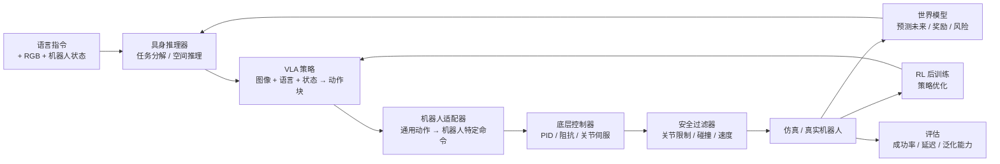

<h1 align="center">Embodied AI: Zero to Hero</h1>

<p align="center">
  <a href="README.md">English</a> | 简体中文
</p>

<p align="center">
  <b>面向机器人学习的可执行教程与实验仓库：</b><br>
  <b>机器人基础模型 · VLA · 世界模型 · 强化学习 · 仿真与部署</b>
</p>

<p align="center">
  <a href="https://github.com/Dld0621/Embodied-AI-Zero-to-Hero/actions/workflows/tests.yml"></a>
  <a href="https://github.com/Dld0621/Embodied-AI-Zero-to-Hero"></a>
  <a href="LICENSE"></a>
  <a href="https://python.org"></a>
  <a href="https://mujoco.org"></a>
</p>

<p align="center">
  <b>维护者：</b> <a href="https://github.com/Dld0621">Gangwei Li</a> — 机器人基础模型 · VLA · 世界模型 · 机器人学习
</p>

<p align="center">
  <a href="#five-minute-quick-start">快速开始</a> ·
  <a href="#choose-your-path">学习路线</a> ·
  <a href="#documentation-map">文档导航</a> ·
  <a href="#benchmarks">基准测试</a>
</p>

---

## 为什么选择本仓库

机器人学习资源散落在视觉-语言-动作策略、世界模型、强化学习和部署等多个方向。本项目将它们组织成一条统一、可执行的路径——从理解核心概念，到复现算法，再到构建研究原型。

| | |
|:---|:---|
| **系统性** | 不是论文链接集合，而是统一的系统结构，VLA、WM 和 RL 形成策略—预测—优化链路 |
| **可执行** | 每个方向都包含最小可运行示例和清晰的入口 |
| **研究导向** | 从教学实现逐步过渡到论文复现与原创研究 |

### 覆盖范围与边界

本仓库聚焦于**具身智能中的机器人学习核心**：策略、预测模型和交互式优化。它**不**追求涵盖所有具身智能子领域的百科全书式覆盖。

| **已覆盖** | **未覆盖** |
|:---|:---|
| VLA（视觉-语言-动作）策略 | 完整三维感知与 SLAM |
| 世界模型与隐空间动力学 | 足式运动与导航 |
| 连续控制强化学习 | 完整硬件驱动栈 |
| 机器人基础模型与跨具身适应 | 移动操作平台 |
| 仿真、评估与 Sim-to-Real | 大规模数据集构建 |

如果你正在寻找导航、运动控制或工业机器人编程的完整综述，本仓库无法满足这些需求。它的目标读者是希望理解并复现现代机器人学习中基于学习的决策流程的研究者和学生。

---

## 项目状态

### 核心研究方向

| 方向 | 概念 | 教程 | 可运行示例 | 基准测试 | 研究扩展 |
|:------|:--------:|:--------:|:-------------:|:---------:|:------------------:|
| **机器人基础模型** | ✅ | ✅ | 🟡 | 🟡 | ⏳ |
| **视觉-语言-动作 (VLA)** | ✅ | ✅ | ✅ | ⏳ | ⏳ |
| **世界模型** | ✅ | ✅ | ✅ | ⏳ | ⏳ |
| **强化学习** | ✅ | ✅ | 🟡 | 🟡 | ⏳ |
| **具身推理** | ✅ | ✅ | 🟡 | ⏳ | ⏳ |

### 工程层

| 层级 | 概念 | 教程 | 可运行示例 | 状态 |
|:------|:--------:|:--------:|:-------------:|:------:|
| **Sim-to-Real** | ✅ | ✅ | ⏳ | ⏳ |
| **VLA 部署** | ✅ | ✅ | ⏳ | ⏳ |
| **评估框架** | ✅ | 🟡 | ⏳ | ⏳ |

**图例：** ✅ 已验证（干净环境，已记录） · 🟡 实验性（已有 CI，但完整数据/模型/基准验证尚未完成） · ⏳ 计划中 · 🔒 外部依赖

---

## 具身智能系统概览

本项目围绕单一研究技术栈构建，而非四个独立主题。每个模块回答完整流程中的一个核心问题：



| 模块 | 回答的核心问题 |
|:-------|:--------------------|
| **机器人基础模型** | 如何将推理、VLA、世界模型和 RL 统一为一个可部署的流程？ |
| **VLA** | 给定图像和语言指令，机器人应该做什么？ |
| **世界模型** | 如果机器人执行某个动作，未来会发生什么？ |
| **RL** | 当当前策略表现不佳时，如何通过交互优化它？ |
| **具身推理** | 如何将长时序任务分解为可执行的子目标？ |

**核心研究主线：** 机器人基础模型是主要的统一框架。VLA、世界模型、RL 和具身推理构成策略层、预测层、优化层和规划层，连接感知与物理执行。

---

<a id="choose-your-path"></a>
## 选择你的路径

| 你的背景 | 推荐方向 | 第一个任务 | 预期成果 |
|:------------|:------------------|:-----------|:-----------------|
| **零基础** | 基础篇 | 运行 PushCube VLA | 理解机器人动作表示 |
| **机器人学习学生** | VLA 方向 | 运行最小 VLA | 理解多模态到动作的流程 |
| **基础模型研究者** | RFM 方向 | 运行 SmolVLA 适配器 | 理解统一模型接口与动作块 |
| **RL 学习者** | RL 方向 | 运行 Q-Learning / SAC | 理解策略优化 |
| **世界模型研究者** | 世界模型方向 | 运行潜在动力学 Demo | 完成预测 + 规划闭环 |
| **工程开发者** | 仿真与评估 | 加载 MuJoCo 模型 | 集成你自己的机器人 |

---

<a id="five-minute-quick-start"></a>

## 五分钟快速开始

最稳定的单一入口——在双方块 PushCube 环境上运行完整的 VLA 流程。

```bash
git clone https://github.com/Dld0621/Embodied-AI-Zero-to-Hero.git
cd Embodied-AI-Zero-to-Hero

pip install numpy torch --index-url https://download.pytorch.org/whl/cpu

cd examples
python unified_pushcube_vla.py --smoke-test --no-ablation
```

**输入：** 128×128 RGB 图像 + 语言指令（"push the red cube to the target"）
**方法：** CNN + 词嵌入 → MLP 策略头
**输出：** 2-D 动作 [dx, dy]（机械臂移动）
**评估：** 任务成功率，语言消融（正确 / 打乱 / 纯视觉）

---

## 可视化演示

### RL 训练曲线

示意性合成 RL 学习曲线，展示预期的报告格式（非来自已完成的 SAC+HER 基准）。


### 世界模型：RSSM 训练分析

保留集上的合成 2D 导航轨迹，比较后验重建、先验想象（含 5 步后验预热）、奖励预测和状态相关终止预测。使用确定性种子的训练/验证/测试划分。


### 世界模型 + 策略集成

在合成 Nav2D 上四种 WM-策略融合策略的奖励比较：BC 基线、WM 辅助奖励增强、WM 动作评估器、WM 基于模型的规划器和潜在空间行为克隆。


> 基于 Nav2D 合成数据的概念演示；非标准基准。

| 方向 | 输入 | 方法 | 结果 |
|:---|:---|:---|:---|
| **VLA** | 合成图像 + 语言指令 | 最小 CNN + GRU + MLP 策略头 | 预测动作块（概念演示） |
| **世界模型** | 当前观测 + 动作 | 潜在动力学模型（RSSM 风格） | 预测的下一观测 |
| **RL** | 合成状态 + 目标 | 概念策略 | 示意性奖励曲线（格式演示） |
| **RFM** | 图像 + 语言 + 状态 | SmolVLA 适配器（mock 模式） | 通过统一协议生成动作块 |

> 所有可视化均来自本仓库代码。GIF / 视频导出正在开发中。

---

## 统一任务：PushCube（双方块，语言条件）

统一 PushCube 基线共享同一个轻量级任务——**将正确的彩色方块推入目标区域**。桌面上放置两个不同颜色（红、绿）的方块，语言指令指定要推哪个方块。仅靠视觉的策略无法区分应该推哪个方块，必须依赖语言信号。

```
PushCube 环境（双方块）
├── 状态 (14-D): [arm_x, arm_y, cube1_x, cube1_y, cube2_x, cube2_y,
│                 target_x, target_y, cube1_r, cube1_g, cube2_r, cube2_g,
│                 goal_red, goal_green]
├── 动作 (2-D): [dx, dy]（机械臂移动）
├── 观测 (VLA): 128x128 RGB 渲染 + 语言指令
├── 语言: "push the {red|green} cube to the {direction}"
└── 成功条件: active 方块在 max_steps 内进入目标区域
```

| 路线 | 文件 | 功能 | 核心技术 |
|:---|:---|:---|:---|
| **VLA** | [`unified_pushcube_vla.py`](examples/unified_pushcube_vla.py) | 图像 + 语言 → 动作 | CNN + 词嵌入 → MLP；三条件消融（完整 / 语言打乱 / 纯视觉）|
| **世界模型** | [`unified_pushcube_wm.py`](examples/unified_pushcube_wm.py) | 预测下一状态与奖励 | MLP 动力学（14-D 状态）|
| **RL** | [`unified_pushcube_rl.py`](examples/unified_pushcube_rl.py) | 从零学习策略 | PPO（主基线）+ REINFORCE（概念演示）|
| **动作分块** | [`unified_pushcube_act.py`](examples/unified_pushcube_act.py) | 带动作分块的模仿学习 | 多帧 Transformer 编码器 + 指数时间集成（无 CVAE）|
| **Diffusion Policy** | [`unified_pushcube_diffusion.py`](examples/unified_pushcube_diffusion.py) | 扩散模型模仿学习 | DDPM + action horizon + 确定性评估 |

> **注意：** 动作分块策略*不是*完整的 ACT（Zhao et al., 2023）。它实现了多帧观测 token 和时间集成，但省略了 CVAE 隐变量。详见文件头说明。

### 语言消融实验（VLA）

为验证 VLA 策略确实使用了语言信号，**同一个训练好的模型**在同一组评估回合上使用三种语言条件进行评估：

| 条件 | 评估语言 | 预期行为 |
|:---|:---|:---|
| **完整 VLA** | 正确（"push the red cube…"）| 应推正确的方块 |
| **语言打乱** | 交换（"push the green cube…"）| 应推*错误*的方块（证明语言有用）|
| **纯视觉** | 清零（全 pad token）| 性能下降 |

另外包含一个独立训练的**纯视觉基线**（训练时语言 token 清零），作为更强的对照组。

### 专家策略

演示数据使用三阶段启发式策略：(1) 绕到 active 方块侧面，(2) 移动到方块后方，(3) 朝目标方向推送。专家成功率：**~100%**（50 个随机种子）。

一键运行全部五条基线：
```bash
cd examples
python unified_pushcube_env.py             # 环境自测 + 专家基线
python unified_pushcube_vla.py             # VLA + State-BC + 三条件消融
python unified_pushcube_wm.py              # 世界模型，多步预测
python unified_pushcube_rl.py --algo ppo   # PPO（主 RL 基线）
python unified_pushcube_act.py             # 动作分块策略 + 时间集成
python unified_pushcube_diffusion.py       # 扩散策略，action horizon

# CI 冒烟测试（快速，每个 2 回合）
python unified_pushcube_vla.py --smoke-test --no-ablation
python unified_pushcube_rl.py --smoke-test
python unified_pushcube_wm.py --smoke-test
python unified_pushcube_act.py --smoke-test
python unified_pushcube_diffusion.py --smoke-test
```

> PushCube 刻意保持轻量——不依赖 MuJoCo，纯 NumPy/PyTorch——让你专注于算法逻辑而非仿真 plumbing。成功率为教学级别（数据量有限，模型小）；用于展示算法差异，不代表生产级性能。

---

## 机器人基础模型 (Robot Foundation Models)

一个统一的机器人学习层，连接具身推理、VLA 策略、世界模型、RL 后训练、机器人适配、安全控制、仿真和真实机器人部署。它不把"机器人基础模型"作为孤立的方向，而是将现有 VLA 作为动作生成层，连接 World Model 预测、RL 后训练和机器人控制接口。

```text
语言指令 → 具身推理器 → 机器人基础模型 / VLA
    → 机器人适配器 → 底层控制器 → 安全过滤器
    → 仿真 / 真实机器人

    ↑ World Model 预测 · RL 后训练
```

### 统一接口

所有模型实现同一协议——换模型时控制循环代码不需要修改：

```python
class RobotFoundationModel(Protocol):
    def reset(self) -> None: ...
    def predict_action(self, observation: RobotObservation) -> ActionChunk: ...
```

### 模型状态

| 模型 | 类型 | 规模 | 状态 | 推荐用途 |
|:------|:-----|-----:|:----:|:---------|
| SmolVLA | 轻量 VLA | 450M | 🟡 适配器 + Mock | 入门、微调、消费级硬件 |
| OpenVLA/OFT | 通用 VLA | 7B | 🟡 适配器 | LIBERO、LoRA、标准基准 |
| Octo | 通用 Diffusion Policy | 27M/93M | 🟡 教程 | Cross-embodiment |
| GR00T N1.6 | 人形基础模型 | Large | ⏳ 规划中 | 人形、双臂操作 |

> **状态图例：** ✅ 真实模型加载 + 真实基准测试 · 🟡 适配器接口 + mock 流水线（真实权重/训练尚未接入）· ⏳ 规划中。SmolVLA 当前运行在 mock 模式——真实 LeRobot 微调与闭环评估待完成。

### 快速开始

```bash
# 测试 SmolVLA 适配器（mock 模式，无需 GPU/下载）
cd examples/robot_foundation_models/smolvla
python inference.py

# PushCube 闭环评估（mock 模式）
python evaluate.py --mode closed_loop --mock --n_episodes 5

# 基于规则的任务规划器
cd ../planners
python rule_based_planner.py

# RFM 基准测试（mock 模式）
cd ../../../benchmarks/robot_foundation_models
python evaluate_offline.py --mock --smoke-test
python evaluate_closed_loop.py --mock --smoke-test
python language_ablation.py --mock --smoke-test
```

### 目录结构

```
examples/robot_foundation_models/
├── common/          # RobotObservation, ActionChunk, Protocol, EmbodimentAdapter, SafetyFilter
├── smolvla/         # SmolVLAAdapter（450M，第一优先级）
├── openvla/         # OpenVLAAdapter（7B，LoRA 配置）
└── planners/        # 规则 + VLM 任务分解
```

文档：[`docs/23-robot-foundation-models.md`](docs/23-robot-foundation-models.md) → [24](docs/24-action-representation-and-tokenization.md) → [25](docs/25-cross-embodiment-adaptation.md) → [26](docs/26-rfm-finetuning-and-evaluation.md) → [27](docs/27-embodied-reasoning-and-planning.md)

---

## 核心学习与研究方向

所有四个方向遵循相同的模板：

| 板块 | 内容 |
|:--------|:--------|
| **定义** | 一句话说明目的 |
| **流程** | 输入 → 核心方法 → 输出 → 评估 |
| **学习层级** | 概念 / 教程 / 基准测试 / 研究 |
| **入口** | 学习 · 运行 · 评估 · 探索论文 |
| **已知局限** | 每个组件的真实状态 |

---

### 1. 视觉-语言-动作 — 策略层

> **定义：** 从视觉感知和自然语言指令生成机器人动作。VLA 作为策略层，将人类高层意图转化为可执行的机器人命令。
>
> **定位：** 从视觉感知和自然语言指令生成机器人动作。VLA 作为策略层，将人类高层意图转化为可执行的机器人命令。

**流程：**

```
多模态输入 (RGB / 语言 / 本体感知)
    → 编码 (视觉编码器 + 语言编码器 + 状态编码器)
    → 融合 (交叉注意力 / Token 融合 / 统一 Transformer)
    → 动作表示 (关节位置 / 增量位姿 / 动作块 / 扩散轨迹)
    → 训练 (行为克隆 → 预训练 / 微调)
    → 推理 (观测 + 指令 → 策略 → 动作块 → 安全过滤器 → 控制器)
```

**输入 / 方法 / 输出 / 评估：**

| 输入 | 核心方法 | 输出 | 评估 |
|:------|:------------|:-------|:-----------|
| RGB 图像、语言指令、本体感知、历史动作 | CNN/Transformer 编码器、多模态融合、策略头 (MLP / Diffusion / Transformer) | 动作块 (T 步关节目标 / 末端位姿) | 任务成功率、推理延迟、动作平滑度、泛化能力 |

**学习层级：**

| 层级 | 内容 | 状态 | 入口 |
|:------|:--------|:------:|:------|
| 概念 | VLA 架构、动作分块、BC 与 RL | ✅ | [`docs/01-what-is-vla.md`](docs/01-what-is-vla.md) |
| 教程 | 最小 VLA 结构（随机初始化，概念演示） | ✅ | [`examples/minimal_vla.py`](examples/minimal_vla.py) |
| 教程 | 数据组织：episode、同步、归一化、feature mapping | ✅ | [`docs/21-vla-dataset-organization.md`](docs/21-vla-dataset-organization.md) |
| 教程 | ACT vs Diffusion Policy 对比与最小实现 | ✅ | [`docs/22-act-vs-diffusion-policy.md`](docs/22-act-vs-diffusion-policy.md) |
| 可运行 | 使用 LeRobot 的 SmolVLA 推理、OpenVLA 风格加载 | 🟡 | [`examples/vla_demo.py`](examples/vla_demo.py) |
| 可运行 | 统一 PushCube（双方块）：VLA + 语言消融 / 动作分块 / Diffusion Policy | ✅ | [`unified_pushcube_vla.py`](examples/unified_pushcube_vla.py) · [`unified_pushcube_act.py`](examples/unified_pushcube_act.py) · [`unified_pushcube_diffusion.py`](examples/unified_pushcube_diffusion.py) |
| 基准测试 | LIBERO / ALOHA 成功率比较 | ⏳ | 参见 [`docs/13-vla-zero-to-one.md`](docs/13-vla-zero-to-one.md) |
| 研究 | 微调、跨具身适应、真实机器人 | ⏳ | [`docs/02-key-papers.md`](docs/02-key-papers.md) |

**已知局限：**
- `minimal_vla.py` 是使用随机权重的结构演示，非预训练策略。
- `vla_demo.py` 中的 `--mode aloha` 需要 GPU、网络和 LeRobot 数据集；CPU 回退仅支持合成数据。
- PushCube VLA 包含三条件语言消融（完整 / 打乱 / 纯视觉）以验证语言使用。动作分块策略省略 CVAE（非完整 ACT）。成功率为教学级别。
- 真实机器人部署指南已计划但尚未包含。

---

### 2. 世界模型 — 预测层

> **定义：** 给定当前状态与动作，预测未来观测与奖励，支持规划、数据生成和安全策略评估。
>
> **定位：** 给定当前状态与动作，预测未来观测与奖励，支持规划、数据生成和安全策略评估。

**流程：**

```
数据集 (o_t, a_t, r_t, o_{t+1})
    → 表征学习 (像素 / 点云 / 状态 → 潜在表示)
    → 动力学学习 (p(z_{t+1} | z_t, a_t)：确定性 / 随机性 / RSSM / Transformer)
    → 预测头 (未来观测 / 奖励 / 终止 / 不确定性)
    → 想象 (展开候选动作，选择最优)
    → 与 VLA 集成 (动作验证)、RL 集成 (想象训练)、机器人适配器集成 (动作可行性)
```

**输入 / 方法 / 输出 / 评估：**

| 输入 | 核心方法 | 输出 | 评估 |
|:------|:------------|:-------|:-----------|
| 观测序列、动作序列、奖励 | 潜在动力学模型（线性 / RSSM / Transformer / Diffusion） | 预测的下一观测、奖励、终止、不确定性 | 单步 / 多步预测误差、视觉保真度、规划成功率 |

**学习层级：**

| 层级 | 内容 | 状态 | 入口 |
|:------|:--------|:------:|:------|
| 概念 | 基于模型的 RL、RSSM、DreamerV3、规划 | ✅ | [`docs/07-world-models-for-vla.md`](docs/07-world-models-for-vla.md) |
| 教程 | 最小线性世界模型 + MPC | ✅ | [`examples/world_model_demo.py`](examples/world_model_demo.py) |
| 可运行 | DreamerV3 风格 RSSM 深度实现 | ✅ | [`examples/dreamer_rssm.py`](examples/dreamer_rssm.py) |
| 基准测试 | 标准控制任务上的预测误差 | 🟡 | 待定 |
| 研究 | WM + Policy 融合、PointWorld 风格 3D 光流 | ⏳ | [`docs/07-world-models-for-vla.md`](docs/07-world-models-for-vla.md) |

**已知局限：**
- RSSM 实现与完整 DreamerV3 相比做了简化；图像编解码器非像素级精确。
- 多步展开的累积误差尚未在标准控制任务上进行基准测试。

**实现状态：**

| 能力 | 状态 |
|:-----------|:------:|
| 观测重建（RSSM 解码器） | ✅ |
| 潜在转移（GRU + 先验/后验） | ✅ |
| 想象展开（先验 vs 后验） | ✅ |
| 奖励预测头 | ✅ (RSSM + minimal_world_model) |
| 终止预测头 | ✅ (continue_head 已实现；有意义的评估需要非平凡的终止标签) |
| 不确定性校准 | ⏳ |
| Actor–Critic 想象训练 | ⏳ |

---

### 3. 强化学习 — 优化层

> **定义：** 通过环境交互与奖励反馈优化策略。RL 作为微调和探索层，通过试错改进预训练策略（VLA 或 BC）。
>
> **定位：** 通过环境交互与奖励反馈优化策略。RL 作为微调和探索层，通过试错改进预训练策略（VLA 或 BC）。

**流程：**

```
任务定义 (环境、物体、目标、成功/失败条件)
    → 观测与动作空间 (RGB + 本体感知 + 物体状态 → 关节目标 / 力矩 / 末端增量)
    → 奖励设计 (任务 + 进度 + 接触 + 平滑度 - 碰撞 - 能耗)
    → 算法选择 (Q-Learning / SAC / PPO / HER / Offline RL)
    → 训练 (重置 → 展开 → 缓冲区 → 更新 → 评估)
    → Sim-to-Real (域随机化、延迟仿真、安全约束)
```

**输入 / 方法 / 输出 / 评估：**

| 输入 | 核心方法 | 输出 | 评估 |
|:------|:------------|:-------|:-----------|
| 状态观测、动作空间、奖励函数 | Q-Learning、SAC、PPO、HER、Offline RL | 训练后的策略 π(a|s) | 成功率、样本效率、训练稳定性、Sim-to-Real 性能下降 |

**学习层级：**

| 层级 | 内容 | 状态 | 入口 |
|:------|:--------|:------:|:------|
| 概念 | MDP、价值函数、策略梯度、Q-Learning | ✅ | [`docs/06-rl-fundamentals-for-vla.md`](docs/06-rl-fundamentals-for-vla.md) |
| 教程 | 纯 NumPy Q-Learning 演示 | ✅ | [`examples/rl_demo.py --mode demo`](examples/rl_demo.py) |
| 可运行 | PushCube 上的 PPO（PyTorch，主基线）+ REINFORCE（纯 NumPy，概念演示） | ✅ | [`examples/unified_pushcube_rl.py`](examples/unified_pushcube_rl.py) |
| 基准测试 | 标准任务上的成功率 vs 样本数 | 🟡 | 待定 |
| 研究 | VLA 策略的 RL 微调、真实机器人 RL | ⏳ | [`docs/14-rl-zero-to-one.md`](docs/14-rl-zero-to-one.md) |

**已知局限：**
- SAC+HER 训练需要大量算力；CPU 训练可行但较慢。
- 真实机器人 RL 安全约束和 Sim-to-Real 转移已有文档记录，但尚未端到端实现。

---

<a id="benchmarks"></a>
## 基准测试

提供基准测试配置和参考结果。干净环境复现正在验证中。

### PushCube 基准测试（双方块，语言条件）

统一 PushCube 基线在同一双方块 PushCube 环境上评估。

| 方法 | 输入 | 训练 | 成功率 ↑ | 备注 |
|:-------|:------|:------|:---:|:------|
| 专家 | 状态 | — | **~100%** | 三阶段启发式（绕侧面 → 绕后 → 推送） |
| State-BC | 14-D 状态（含目标颜色 one-hot） | 100 回合 / 50 epochs | **90%** | MLP + 几何特征工程 |
| VLA（完整） | RGB + 语言 | 100 回合 / 50 epochs | **0%** | CNN + 词嵌入 → MLP；需要更多数据 |
| 动作分块 | RGB 历史 + 语言 | 50 epochs | TBD | K 帧 Transformer，无 CVAE |
| Diffusion Policy | RGB + 语言 | 50 epochs | TBD | DDPM, 20 步, action horizon=10 |
| RL (PPO) | 14-D 状态 | 500 回合 | **10–20%** | Actor-Critic + GAE + BC 预热；BC 预热 40% |

**世界模型（MLP 动力学）：** val_loss=0.041, 多步误差 H=1: 0.071, H=5: 0.296, H=10: 0.556

**环境：** 14-D 状态, 2-D 动作, 128×128 RGB, 双方块（红+绿）, 语言条件
**命令：** `cd examples && python unified_pushcube_vla.py`（及其他 unified_pushcube_*.py）

> **注意：** State-BC 证明了统一任务可学习（90% 成功率）。VLA 仍为 0%，因为视觉策略需要显著更多数据（>1000 回合）和/或更大模型，超出教学级设置的规模。PPO 达到非零成功率，但对超参数敏感——BC 预热达 40%，但 PPO 微调部分破坏了策略稳定性。这些均为教学级结果，用于展示算法差异，不代表生产级性能。

### VLA / 世界模型 / RL

| 方向 | 指标 | 状态 |
|:------|:-------|:-------|
| VLA | 任务成功率 / 推理延迟 | 🟡 |
| 世界模型 | 单步 / 多步预测误差 | 🟡 |
| RL | 奖励曲线 / 成功率 / 样本数 | 🟡 |

### RL 基准协议：PushCube (PPO)

在 PushCube 双方块环境上的 PPO（主基线）与 REINFORCE（概念演示）。

| 配置 | 值 |
|:-------|:------|
| 环境 | PushCube（双方块, 14-D 状态） |
| 主算法 | PPO（Actor-Critic + GAE, PyTorch） |
| 概念演示 | REINFORCE（2 层 MLP, 纯 NumPy） |
| 回合数 | 500（PPO）；1000（REINFORCE） |
| BC 预热 | 200 回合专家数据，500 epochs |
| 评估 | 20 回合 |
| 指标 | 成功率 (%)、平均奖励 |

**命令：**
```bash
cd examples
python unified_pushcube_rl.py --algo ppo   # PPO 主基线
python unified_pushcube_rl.py --algo reinforce # REINFORCE 概念演示
python unified_pushcube_rl.py --smoke-test # CI 冒烟测试
```

**结果位置：** `results/unified_pushcube/rl/rl_results.json`

---

## 支持的机器人与环境

| 机器人 | 类型 | 自由度 | 模型状态 | 适配器状态 | 硬件已验证 |
|:------|:-----|:---:|:------------:|:--------------:|:-----------------:|
| **PushCube (2D)** | 仿真机械臂 | 2 | ✅ | ✅ | N/A |
| **Franka Panda** | 机械臂 + 夹爪 | 7+1 | 🟡 | 🟡 | 🔒 外部 |
| **UR5e** | 机械臂 + 夹爪 | 6+1 | ⏳ | ⏳ | 🔒 外部 |
| **AgiBot X1** | 人形上半身 | 7+7 | 🟡 | 🟡 | 🔒 外部 |
| **Unitree G1** | 人形机器人 | 23+ | ⏳ | ⏳ | 🔒 外部 |

**图例：** ✅ 已完成 · 🟡 进行中 · ⏳ 计划中 · 🔒 外部

---

## 学习路线

```
基础 → 可运行基线 → 统一基准 → 研究与真实机器人
```

完整的 Stage 0–10 分解参见 [`docs/README.md`](docs/README.md)。

---

<a id="documentation-map"></a>

## 文档导航

所有详细概念、论文列表、命令和教程位于 [`docs/`](docs/)。完整索引参见 [`docs/README.md`](docs/README.md)。

| 类别 | 文档 |
|:---------|:----------|
| **基础** | 关节概念、FK/IK 基础、术语表 |
| **机器人基础模型** | RFM 概述、动作分词、跨具身适应、微调与评估、具身推理 |
| **VLA** | 核心概念、关键论文、学习路径、微调、部署、面试准备 |
| **世界模型** | 概念、RSSM、与 VLA/RL 的集成 |
| **RL** | 基础、SAC/HER、Sim-to-Real |
| **Sim-to-Real** | 域随机化、系统辨识、视觉适应、延迟补偿 |
| **数据集与工具** | 操作数据集、开源项目 |
| **研究** | ArXiv 扫描、研究趋势、含在线链接的前沿论文 |

---

## 可复现性

### 测试环境

| 操作系统 | Python | MuJoCo | PyTorch | 状态 |
|:---|:-------|:-------|:--------|:-------|
| Ubuntu 22.04 | 3.10 | 3.x | 2.x | ✅ |
| Windows 11 | 3.10 | 3.x | 2.x | 🟡 |
| macOS | 3.10 | 3.x | 2.x | 🟡 |

### 复现层级

| 层级 | 要求 | 状态 |
|:------|:------------|:-------|
| L1 导入 | 模块可无错导入 | ✅ |
| L2 演示 | 示例命令可运行至完成 | 🟡 |
| L3 确定性 | 固定种子产生可重复结果 | 🟡 |
| L4 基准 | 统一评估脚本通过 | ⏳ |
| L5 硬件 | 真实机器人结果验证 | 🔒 外部 |

---

## 研究路线图

| 阶段 | 目标 | 时间线 |
|:------|:-----|:---------|
| **第一阶段：基础** | 完成所有教程和可运行演示 | 已完成 |
| **第二阶段：RFM 集成** | SmolVLA 真实微调 + PushCube 闭环评估 | 2026 Q3 |
| **第三阶段：跨具身** | OpenVLA 适配器、多机器人评估 | 2026 Q4 |
| **第四阶段：Sim-to-Real** | 域随机化 + 真实硬件验证 | 2026 Q4 |
| **第五阶段：前沿** | 长时序任务、VLM 规划、真实部署 | 2027 |

---

## 贡献

参见 [`CONTRIBUTING.md`](CONTRIBUTING.md) 了解 Issue/PR 规范、内容质量要求和审查清单。

欢迎提交 Issue 和 PR！当前高优先级方向：
- 完成 SmolVLA 真实微调和 PushCube 闭环评估
- 添加带 LoRA 微调的 OpenVLA 适配器
- 添加更多机器人适配器（Franka Panda、UR5e、Unitree G1）
- 完善 VLA 微调教程和评估基准
- 补充世界模型与 Policy 融合的最新进展
- 补充前沿论文代码复现指南

---

## 引用

如果您在研究中使用了本仓库，请引用：

```bibtex
@misc{embodied-ai-zero-to-hero,
  title={Embodied AI: Zero to Hero — A Reproducible Learning and Research Stack},
  author={Gangwei Li},
  year={2026},
  howpublished={\url{https://github.com/Dld0621/Embodied-AI-Zero-to-Hero}},
}
```

---

## 许可证

[MIT License](LICENSE)

---

## 致谢

- [MuJoCo Menagerie](https://github.com/google-deepmind/mujoco_menagerie) — 预构建机器人模型库
- [OpenVLA](https://github.com/openvla/openvla) — Stanford / Berkeley 开源 VLA
- [LeRobot](https://github.com/huggingface/lerobot) — HuggingFace 机器人学习框架
- [Stable Baselines3](https://stable-baselines3.readthedocs.io/) — PyTorch RL 算法库
- [DreamDojo](https://github.com/NVIDIA/DreamDojo) — NVIDIA 通用世界模型
- [SmolVLA](https://github.com/huggingface/lerobot/tree/main/lerobot/common/policies/smolvla) — HuggingFace 轻量级 VLA
