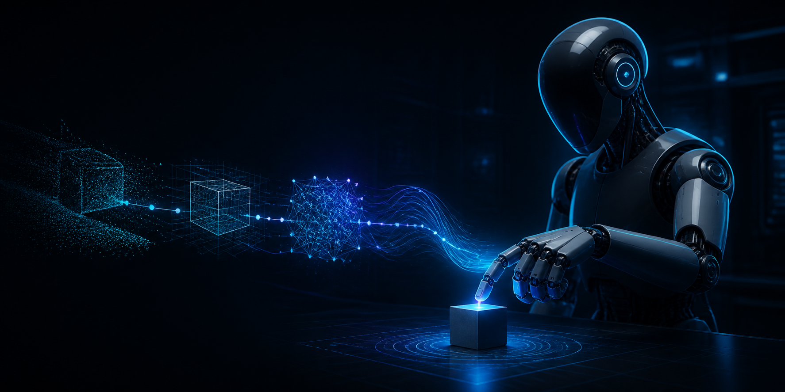
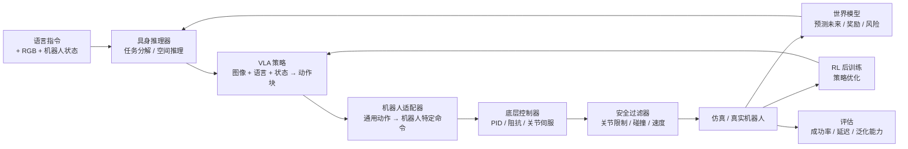

<p align="center">
  
</p>

<h1 align="center">DoF · 具身智能从入门到实践</h1>

<p align="center">
  <a href="README.md">English</a> · <b>简体中文</b>
</p>

<p align="center">
  <b>通过构建完整闭环，真正学会具身智能。</b><br>
  感知 · 推理 · 策略 · 预测 · 控制 · 部署
</p>

<p align="center">
  <a href="https://github.com/Dld0621/Embodied-AI-Zero-to-Hero/actions/workflows/tests.yml"></a>
  <a href="https://github.com/Dld0621/Embodied-AI-Zero-to-Hero"></a>
  <a href="LICENSE"></a>
  <a href="https://python.org"></a>
  <a href="https://mujoco.org"></a>
</p>

<p align="center">
  <b>维护者：</b> <a href="https://github.com/Dld0621">Gangwei Li</a> — 机器人基础模型 · VLA · 世界模型 · 机器人学习
</p>

<p align="center">
  <a href="#选择你的路径"><b>选择路径</b></a> ·
  <a href="#五分钟快速开始"><b>运行演示</b></a> ·
  <a href="#学习路线"><b>跟随路线</b></a> ·
  <a href="#基准测试"><b>检查证据</b></a>
</p>

> [!IMPORTANT]
> 本仓库明确区分**已验证结果**、**教学规模实验**和**计划工作**。脚本能运行不等于任务性能已经成立；引用结论前，请先检查状态与基准说明。

<p align="center"></p>

---

## 为什么选择本仓库

机器人学习资源散落在视觉-语言-动作策略、世界模型、强化学习和部署等多个方向。本项目将它们组织成一条统一、可执行的路径——从理解核心概念，到复现算法，再到构建研究原型。

| | |
|:---|:---|
| **系统性** | 不是论文链接集合，而是统一的系统结构，VLA、WM 和 RL 形成策略—预测—优化链路 |
| **可执行** | 每个方向都包含最小可运行示例和清晰的入口 |
| **研究导向** | 从教学实现逐步过渡到论文复现与原创研究 |

### 覆盖范围与边界

本仓库聚焦于**具身智能中的机器人学习核心**：策略、预测模型和交互式优化。它**不**追求涵盖所有具身智能子领域的百科全书式覆盖。

<details>
<summary><b>已覆盖 vs 未覆盖（点击展开）</b></summary>

| **已覆盖** | **未覆盖** |
|:---|:---|
| VLA（视觉-语言-动作）策略 | 完整三维感知与 SLAM |
| 世界模型与隐空间动力学 | 足式运动与导航 |
| 连续控制强化学习 | 完整硬件驱动栈 |
| 机器人基础模型与跨具身适应 | 移动操作平台 |
| 仿真、评估与 Sim-to-Real | 大规模数据集构建 |

</details>

---

## 项目状态

✅ 真实 GPU 训练（SmolVLA 450M, 10K 步） · ✅ 统一 PushCube 任务 · 🟡 任务级 VLA 成功率待提升（教学规模下 0%）

<details>
<summary><b>核心研究方向与工程层（点击展开）</b></summary>

### 核心研究方向

| 方向 | 概念 | 教程 | 可运行示例 | 基准测试 | 研究扩展 |
|:------|:--------:|:--------:|:-------------:|:---------:|:------------------:|
| **机器人基础模型** | ✅ | ✅ | ✅ | ✅ | ⏳ |
| **视觉-语言-动作 (VLA)** | ✅ | ✅ | ✅ | ⏳ | ⏳ |
| **世界模型** | ✅ | ✅ | ✅ | ⏳ | ⏳ |
| **强化学习** | ✅ | ✅ | 🟡 | 🟡 | ⏳ |
| **具身推理** | ✅ | ✅ | 🟡 | ⏳ | ⏳ |

### 工程层

| 层级 | 概念 | 教程 | 可运行示例 | 状态 |
|:------|:--------:|:--------:|:-------------:|:------:|
| **Sim-to-Real** | ✅ | ✅ | ⏳ | ⏳ |
| **VLA 部署** | ✅ | ✅ | ⏳ | ⏳ |
| **评估框架** | ✅ | 🟡 | ⏳ | ⏳ |

**图例：** ✅ 已验证（干净环境，已记录） · 🟡 实验性（已有 CI，但完整数据/模型/基准验证尚未完成） · ⏳ 计划中 · 🔒 外部依赖

</details>

---

## 具身智能系统概览

<p align="center"></p>

本项目围绕单一研究技术栈构建，而非四个独立主题。每个模块回答完整流程中的一个核心问题：



| 模块 | 回答的核心问题 |
|:-------|:--------------------|
| **机器人基础模型** | 如何将推理、VLA、世界模型和 RL 统一为一个可部署的流程？ |
| **VLA** | 给定图像和语言指令，机器人应该做什么？ |
| **世界模型** | 如果机器人执行某个动作，未来会发生什么？ |
| **RL** | 当当前策略表现不佳时，如何通过交互优化它？ |
| **具身推理** | 如何将长时序任务分解为可执行的子目标？ |

**核心研究主线：** 机器人基础模型是主要的统一框架。VLA、世界模型、RL 和具身推理构成策略层、预测层、优化层和规划层，连接感知与物理执行。

---

<a id="choose-your-path"></a>
## 选择你的路径

| 你的背景 | 推荐方向 | 第一个任务 | 预期成果 |
|:------------|:------------------|:-----------|:-----------------|
| **零基础** | [基础课程](docs/foundations/00-roadmap.md) | 运行 PushCube VLA | 理解机器人动作表示 |
| **机器人学习学生** | VLA 方向 | 运行最小 VLA | 理解多模态到动作的流程 |
| **基础模型研究者** | RFM 方向 | 运行 SmolVLA 适配器 | 理解统一模型接口与动作块 |
| **RL 学习者** | RL 方向 | 运行 Q-Learning / SAC | 理解策略优化 |
| **世界模型研究者** | 世界模型方向 | 运行潜在动力学 Demo | 完成预测 + 规划闭环 |
| **工程开发者** | 仿真与评估 | 加载 MuJoCo 模型 | 集成你自己的机器人 |

---

<a id="five-minute-quick-start"></a>
## 五分钟快速开始

最稳定的单一入口——在双方块 PushCube 环境上运行完整的 VLA 流程。

```bash
git clone https://github.com/Dld0621/Embodied-AI-Zero-to-Hero.git
cd Embodied-AI-Zero-to-Hero

pip install numpy torch --index-url https://download.pytorch.org/whl/cpu

cd examples
python unified_pushcube_vla.py --smoke-test --no-ablation
```

**输入：** 128×128 RGB 图像 + 语言指令（"push the red cube to the target"）
**方法：** CNN + 词嵌入 → MLP 策略头
**输出：** 2-D 动作 [dx, dy]（机械臂移动）
**评估：** 任务成功率，语言消融（正确 / 打乱 / 纯视觉）

---

## 可视化演示

### PushCube 基准测试结果

统一排行榜，10 种方法在同一双方块 PushCube 任务上评估。完整表格见[基准测试](#benchmarks)。

| 方法 | 类型 | 成功率 ↑ |
|:-------|:-----|:---:|
| 专家 | 启发式 | **~100%** |
| State-BC | 状态 MLP | **90%** |
| RL (BC-init PPO) | 状态 RL | **15%** |
| VLA / WM-MPC / SmolVLA | 视觉/状态 | **0%** |
| Action-Chunking / Diffusion | 视觉 | **N/A** |

> 在教学规模（50–500 回合）下，基于视觉的方法无法学习接触丰富的操作。Action-Chunking 和 Diffusion 已训练但尚未进行闭环成功率评估。State-BC 证明任务可学习；差距驱动更多数据和更大模型的需求。

### SmolVLA GPU 训练（真实）

SmolVLA 450M 在 RTX 3060 上微调（bf16, 10K 步）。Loss：0.47→0.03（最佳 0.004）。闭环：0% 成功率（教学规模下 BC 过拟合）。完整结果：[`results/smolvla/`](results/smolvla/)。

### 世界模型可视化

<details>
<summary><b>RSSM 训练分析 & WM+策略融合（点击展开）</b></summary>

保留集上的合成 2D 导航轨迹，比较后验重建、先验想象、奖励预测和终止预测。


在合成 Nav2D 上四种 WM-策略融合策略的奖励比较。


> 基于 Nav2D 合成数据的概念演示；非标准基准。

</details>

<details>
<summary><b>RL 训练曲线（示意性，非来自已完成的基准）</b></summary>


</details>

| 方向 | 输入 | 方法 | 结果 |
|:---|:---|:---|:---|
| **VLA** | 合成图像 + 语言指令 | 最小 CNN + GRU + MLP 策略头 | 预测动作块（概念演示） |
| **世界模型** | 当前观测 + 动作 | 潜在动力学模型（RSSM 风格） | 预测的下一观测 |
| **RL** | 合成状态 + 目标 | PPO + REINFORCE | 15% 成功率（PushCube） |
| **RFM** | 图像 + 语言 + 状态 | 轻量 VLA（195K 参数，真实 checkpoint） | 0% 闭环成功率，65% 选择准确率 |

> 所有可视化均来自本仓库代码。GIF / 视频导出正在开发中。

---

## 统一任务：PushCube（双方块，语言条件）

统一 PushCube 基线共享同一个轻量级任务——**将正确的彩色方块推入目标区域**。桌面上放置两个不同颜色（红、绿）的方块，语言指令指定要推哪个方块。仅靠视觉的策略无法区分应该推哪个方块，必须依赖语言信号。

```
PushCube 环境（双方块）
├── 状态 (14-D): [arm_x, arm_y, cube1_x, cube1_y, cube2_x, cube2_y,
│                 target_x, target_y, cube1_r, cube1_g, cube2_r, cube2_g,
│                 goal_red, goal_green]
├── 动作 (2-D): [dx, dy]（机械臂移动）
├── 观测 (VLA): 128x128 RGB 渲染 + 语言指令
├── 语言: "push the {red|green} cube to the {direction}"
└── 成功条件: active 方块在 max_steps 内进入目标区域
```

| 路线 | 文件 | 功能 | 核心技术 |
|:---|:---|:---|:---|
| **VLA** | [`unified_pushcube_vla.py`](examples/unified_pushcube_vla.py) | 图像 + 语言 → 动作 | CNN + 词嵌入 → MLP；三条件消融（完整 / 语言打乱 / 纯视觉）|
| **世界模型** | [`unified_pushcube_wm.py`](examples/unified_pushcube_wm.py) | 预测下一状态与奖励 | MLP 动力学（14-D 状态）|
| **WM-MPC** | [`unified_pushcube_wm_mpc.py`](examples/unified_pushcube_wm_mpc.py) | WM → 规划器 → 动作 → 环境 | 模型预测控制（Random Shooting / CEM）|
| **RL** | [`unified_pushcube_rl.py`](examples/unified_pushcube_rl.py) | 从零学习策略 | BC-initialized PPO（主基线）+ REINFORCE（概念演示）|
| **动作分块** | [`unified_pushcube_act.py`](examples/unified_pushcube_act.py) | 带动作分块的模仿学习 | 多帧 Transformer 编码器 + 指数时间集成（无 CVAE）|
| **Diffusion Policy** | [`unified_pushcube_diffusion.py`](examples/unified_pushcube_diffusion.py) | 扩散模型模仿学习 | DDPM + action horizon + 确定性评估 |

> **注意：** 动作分块策略*不是*完整的 ACT（Zhao et al., 2023）。它实现了多帧观测 token 和时间集成，但省略了 CVAE 隐变量。详见文件头说明。

### 语言消融实验（VLA）

为验证 VLA 策略确实使用了语言信号，**同一个训练好的模型**在同一组评估回合上使用三种语言条件进行评估：

| 条件 | 评估语言 | 预期行为 |
|:---|:---|:---|
| **完整 VLA** | 正确（"push the red cube…"）| 应推正确的方块 |
| **语言打乱** | 交换（"push the green cube…"）| 应推*错误*的方块（证明语言有用）|
| **纯视觉** | 清零（全 pad token）| 性能下降 |

另外包含一个独立训练的**纯视觉基线**（训练时语言 token 清零），作为更强的对照组。

### 专家策略

演示数据使用三阶段启发式策略：(1) 绕到 active 方块侧面，(2) 移动到方块后方，(3) 朝目标方向推送。专家成功率：**~100%**（50 个随机种子）。

一键运行全部基线：

<details>
<summary><b>完整 PushCube 命令（点击展开）</b></summary>

```bash
cd examples
python unified_pushcube_env.py             # 环境自测 + 专家基线
python unified_pushcube_vla.py             # VLA + State-BC + 三条件消融
python unified_pushcube_wm.py              # 世界模型，多步预测
python unified_pushcube_wm_mpc.py          # WM-MPC 控制闭环（CEM + Random Shooting）
python unified_pushcube_rl.py --algo ppo   # BC-initialized PPO（主 RL 基线）
python unified_pushcube_act.py             # 动作分块策略 + 时间集成
python unified_pushcube_diffusion.py       # 扩散策略，action horizon

# CI 冒烟测试（快速，每个 2 回合）
python unified_pushcube_vla.py --smoke-test --no-ablation
python unified_pushcube_rl.py --smoke-test
python unified_pushcube_wm.py --smoke-test
python unified_pushcube_wm_mpc.py --smoke-test
python unified_pushcube_act.py --smoke-test
python unified_pushcube_diffusion.py --smoke-test
```

</details>

> PushCube 刻意保持轻量——不依赖 MuJoCo，纯 NumPy/PyTorch——让你专注于算法逻辑而非仿真 plumbing。成功率为教学级别（数据量有限，模型小）；用于展示算法差异，不代表生产级性能。

---

## 机器人基础模型 (Robot Foundation Models)

一个统一的机器人学习层，连接具身推理、VLA 策略、世界模型、RL 后训练、机器人适配、安全控制、仿真和真实机器人部署。它不把"机器人基础模型"作为孤立的方向，而是将现有 VLA 作为动作生成层，连接 World Model 预测、RL 后训练和机器人控制接口。

```text
语言指令 → 具身推理器 → 机器人基础模型 / VLA
    → 机器人适配器 → 底层控制器 → 安全过滤器
    → 仿真 / 真实机器人

    ↑ World Model 预测 · RL 后训练
```

### 统一接口

所有模型实现同一协议——换模型时控制循环代码不需要修改：

```python
class RobotFoundationModel(Protocol):
    def reset(self) -> None: ...
    def predict_action(self, observation: RobotObservation) -> ActionChunk: ...
```

### 模型状态

| 模型 | 类型 | 规模 | 状态 | 推荐用途 |
|:------|:-----|-----:|:----:|:---------|
| SmolVLA | 轻量 VLA | 450M | ✅ Pipeline Verified · 🟡 Task Success Pending | 入门、微调、消费级硬件 |
| OpenVLA/OFT | 通用 VLA | 7B | 🟡 适配器 | LIBERO、LoRA、标准基准 |
| Octo | 通用 Diffusion Policy | 27M/93M | 🟡 教程 | Cross-embodiment |
| GR00T N1.6 | 人形基础模型 | Large | ⏳ 规划中 | 人形、双臂操作 |

> **状态图例：** ✅ Pipeline Verified（真实模型加载 + 真实微调 + 闭环评估完成）· 🟡 Task Success Pending（教学规模下闭环成功率为 0%）或 适配器接口 + mock 流水线 · ⏳ 规划中。SmolVLA 450M 已在 **GPU 上完成微调**（RTX 3060, bf16, 10K 步, 100M 可训练参数），并完成完整闭环评估流水线。训练 loss：0.47→0.03（最佳 0.004）。闭环评估（20 episodes × 3 种语言模式）：0% 成功率（50 episodes 不足；教学规模下 BC 过拟合），50% 选择准确率。轻量 VLA（195K 参数, CPU）达到 **65% 选择准确率**，证明语言 grounding 生效。GPU 微调指南见 [`docs/28-smolvla-gpu-finetuning-runbook.md`](docs/28-smolvla-gpu-finetuning-runbook.md)。

### 策略生成范式

VLA 模型在动作生成方式上存在根本差异。下表明确四种范式及各自代表的模型：

| 范式 | 机制 | 模型 | 优势 | 劣势 |
|:---------|:----------|:-------|:-----|:-----|
| **回归 (Regression)** | 直接 MLP 输出，L1/MSE 损失 | OpenVLA-OFT, ACT, State-BC | 推理快、简单 | 单峰分布，无法表达多峰动作 |
| **自回归 Token (Autoregressive)** | 动作分箱离散化，逐 token 生成 | RT-2, vanilla OpenVLA (256-bin) | 复用 LLM 基础设施 | 推理慢、量化误差 |
| **扩散 (Diffusion)** | 从高斯噪声迭代去噪 | Diffusion Policy, Octo | 多峰分布、平滑轨迹 | 去噪步数多、推理慢 |
| **流匹配 (Flow Matching)** | 学习向量场将噪声传输到动作分布 | **π0**, **SmolVLA** | 比扩散更快、确定性 ODE 求解 | 较新、生态尚不成熟 |

> **关键区分：** π0 和 SmolVLA 使用**流匹配 (flow matching)**，不是标准扩散。流匹配学习确定性向量场（通过 ODE），而非随机逆向扩散过程，因此推理步数更少。详见 [`docs/24-action-representation-and-tokenization.md`](docs/24-action-representation-and-tokenization.md)。

### 快速开始

<details>
<summary><b>RFM 命令（点击展开）</b></summary>

```bash
# 测试 SmolVLA 适配器（mock 模式，无需 GPU/下载）
cd examples/robot_foundation_models/smolvla
python inference.py

# 在真实 PushCube 数据上训练轻量 VLA（CPU，约 2 分钟）
python train_lightweight_vla.py --epochs 100 --batch_size 64

# 使用真实 checkpoint 进行闭环评估
python evaluate.py --mode closed_loop \
    --checkpoint models/lightweight_vla/lightweight_vla_pushcube.pt \
    --n_episodes 20

# 基于规则的任务规划器
cd ../planners
python rule_based_planner.py

# RFM 基准测试（mock 模式）
cd ../../../benchmarks/robot_foundation_models
python evaluate_offline.py --mock --smoke-test
python evaluate_closed_loop.py --mock --smoke-test
python language_ablation.py --mock --smoke-test
```

</details>

### 目录结构

```
examples/robot_foundation_models/
├── common/          # RobotObservation, ActionChunk, Protocol, EmbodimentAdapter, SafetyFilter
├── smolvla/         # SmolVLAAdapter（450M，第一优先级）
├── openvla/         # OpenVLAAdapter（7B，LoRA 配置）
└── planners/        # 规则 + VLM 任务分解
```

文档：[`docs/23-robot-foundation-models.md`](docs/23-robot-foundation-models.md) → [24](docs/24-action-representation-and-tokenization.md) → [25](docs/25-cross-embodiment-adaptation.md) → [26](docs/26-rfm-finetuning-and-evaluation.md) → [27](docs/27-embodied-reasoning-and-planning.md)

---

## 核心学习与研究方向

每个方向遵循统一模板：定义 → 流程 → 学习层级 → 已知局限。详细分解（流程图、学习层级表、实现状态）见 [`docs/29-learning-tracks-detail.md`](docs/29-learning-tracks-detail.md)。

| # | 方向 | 层级 | 流程概要 | 关键入口 | 状态 |
|---|------|------|----------|----------|------|
| 1 | **VLA** | 策略 | RGB + 语言 + 状态 → 编码 → 融合 → 动作块 | [`minimal_vla.py`](examples/minimal_vla.py) · [`unified_pushcube_vla.py`](examples/unified_pushcube_vla.py) | ✅ 概念 · ✅ 教程 · 🟡 基准 |
| 2 | **世界模型** | 预测 | 观测 + 动作 → 潜在动力学 → 预测未来 | [`world_model_demo.py`](examples/world_model_demo.py) · [`dreamer_rssm.py`](examples/dreamer_rssm.py) | ✅ 概念 · ✅ 教程 · 🟡 基准 |
| 3 | **强化学习** | 优化 | 状态 → 策略梯度 / Actor-Critic → 优化后 π | [`rl_demo.py`](examples/rl_demo.py) · [`unified_pushcube_rl.py`](examples/unified_pushcube_rl.py) | ✅ 概念 · ✅ 教程 · 🟡 基准 |
| 4 | **具身推理** | 规划 | 指令 → 分解 → 子目标 → VLA 执行 | [`rule_based_planner.py`](examples/robot_foundation_models/planners/rule_based_planner.py) | ✅ 概念 · 🟡 可运行 |

> 完整流程图、学习层级表、实现状态和已知局限见 [`docs/29-learning-tracks-detail.md`](docs/29-learning-tracks-detail.md)。

---

<a id="benchmarks"></a>
## 基准测试

### PushCube 基准测试（双方块，语言条件）

所有方法在**同一环境**、**任务定义**、**动作空间**、**指标**和**最大步数**（80）上评估。评估回合数和种子因方法而异。训练数据和计算预算也因方法而异。

| 方法 | 输入 | 数据 | 计算 | 评估回合 | 成功率 ↑ | 备注 |
|:-------|:------|:-----|:-----|---:|:---:|:------|
| 专家 | 状态 | — | CPU | 50 | **~100%** | 三阶段启发式 |
| State-BC | 14-D 状态 | 100 回合 | CPU | 100 | **90%** | MLP + 几何特征 |
| RL (BC-init PPO) | 14-D 状态 | 500 回合 | CPU | 20 | **15%** | BC 预热 + expert guidance |
| VLA (Full) | RGB + 语言 | 100 回合 | CPU | 100 | **0%** | CNN + word embedding → MLP |
| WM-MPC (CEM/Random) | 14-D 状态 | 100 回合 | CPU | 20 | **0%** | CEM + Random Shooting |
| SmolVLA (10K 步) | RGB + 语言 + 状态 | 50 回合 | GPU | 20 | **0%** | 450M 参数，BC 过拟合 |
| Action-Chunking | RGB + 语言 | 100 回合 | CPU | — | **N/A** | 已训练，尚未评估 |
| Diffusion Policy | RGB + 语言 | 100 回合 | CPU | — | **N/A** | 已训练，尚未评估 |

> **完整基准测试详情** — 完整排行榜、资源表、SmolVLA 消融实验、复现命令和论文式分析 — 见 [`BENCHMARK.md`](BENCHMARK.md) 和 [`docs/benchmark_report.md`](docs/benchmark_report.md)。

**快速命令：** `cd examples && python unified_pushcube_vla.py` · `python unified_pushcube_rl.py --algo ppo` · `python unified_pushcube_wm_mpc.py --planner cem`

| 方向 | 指标 | 状态 |
|:------|:-------|:-------|
| VLA | 任务成功率 / 推理延迟 | 🟡 |
| 世界模型 | 单步 / 多步预测误差 | 🟡 |
| RL | 奖励曲线 / 成功率 / 样本数 | 🟡 |

**结果位置：** `results/benchmarks/` 和 `results/smolvla/`

---

## 支持的机器人和环境

<details>
<summary><b>机器人支持矩阵（点击展开）</b></summary>

| 机器人 | 类型 | 自由度 | 模型状态 | 适配器状态 | 硬件验证 |
|:------|:-----|:---:|:------------:|:--------------:|:-----------------:|
| **PushCube (2D)** | 仿真机械臂 | 2 | ✅ | ✅ | N/A |
| **Franka Panda** | 臂 + 夹爪 | 7+1 | 🟡 | 🟡 | 🔒 外部 |
| **UR5e** | 臂 + 夹爪 | 6+1 | ⏳ | ⏳ | 🔒 外部 |
| **AgiBot X1** | 人形上肢 | 7+7 | 🟡 | 🟡 | 🔒 外部 |
| **Unitree G1** | 人形 | 23+ | ⏳ | ⏳ | 🔒 外部 |

**图例：** ✅ 完成 · 🟡 进行中 · ⏳ 计划中 · 🔒 外部

</details>

---

## 学习路线

```
基础课程 → 可运行基线 → 统一基准 → 研究与真实机器人
```

**机器人或深度学习零基础？** 从[基础课程](docs/foundations/00-roadmap.md)开始——10 个独立课程，涵盖 Python、线性代数、深度学习、坐标变换、SO(3)/SE(3)、FK/IK、控制、MuJoCo 和数据集训练。总计约 25–35 小时。

完整的 Stage 0–10 分解参见 [`docs/README.md`](docs/README.md)。

---

<a id="documentation-map"></a>
## 文档导航

所有详细概念、论文列表、命令和教程位于 [`docs/`](docs/)。完整索引参见 [`docs/README.md`](docs/README.md)。

| 类别 | 文档 |
|:---------|:----------|
| **基础课程** | Python、线性代数、深度学习、Transformer、坐标变换、SO(3)/SE(3)、FK/IK、控制、MuJoCo、数据集与训练 — [`docs/foundations/`](docs/foundations/00-roadmap.md) |
| **核心概念** | 关节概念、FK/IK 基础、术语表 |
| **机器人基础模型** | RFM 概述、动作分词、跨具身适应、微调与评估、具身推理 |
| **VLA** | 核心概念、关键论文、学习路径、微调、部署、面试准备 |
| **世界模型** | 概念、RSSM、与 VLA/RL 的集成 |
| **RL** | 基础、SAC/HER、Sim-to-Real |
| **Sim-to-Real** | 域随机化、系统辨识、视觉适应、延迟补偿 |
| **数据集与工具** | 操作数据集、开源项目 |
| **研究** | ArXiv 扫描、研究趋势、含在线链接的前沿论文 |

---

## 可复现性

| 层级 | 要求 | 状态 |
|:------|:------------|:-------|
| L1 导入 | 模块可无错导入 | ✅ |
| L2 演示 | 示例命令可运行至完成 | 🟡 |
| L3 确定性 | 固定种子产生可重复结果 | 🟡 |
| L4 基准 | 统一评估脚本通过 | ⏳ |
| L5 硬件 | 真实机器人结果验证 | 🔒 外部 |

**测试环境：** Ubuntu 22.04 ✅ · Windows 11 🟡 · macOS 🟡（Python 3.10 · MuJoCo 3.x · PyTorch 2.x）

---

## 研究路线图

| 阶段 | 目标 | 时间线 |
|:------|:-----|:---------|
| **第一阶段：基础** | 完成所有教程和可运行演示 | 已完成 |
| **第二阶段：RFM 集成** | SmolVLA 真实微调 + PushCube 闭环评估 | ✅ 流水线验证完成（GPU 微调 + 闭环评估） |
| **第三阶段：跨具身** | OpenVLA 适配器、多机器人评估 | 2026 Q4 |
| **第四阶段：Sim-to-Real** | 域随机化 + 真实硬件验证 | 2026 Q4 |
| **第五阶段：前沿** | 长时序任务、VLM 规划、真实部署 | 2027 |

---

## 贡献

参见 [`CONTRIBUTING.md`](CONTRIBUTING.md) 了解 Issue/PR 规范、内容质量要求和审查清单。

欢迎提交 Issue 和 PR！当前高优先级方向：
- 扩大 SmolVLA 训练规模（10K→100K 步 + 100+ 回合，实现任务级成功率）
- 添加带 LoRA 微调的 OpenVLA 适配器
- 添加更多机器人适配器（Franka Panda、UR5e、Unitree G1）
- 完善 VLA 微调教程和评估基准
- 补充世界模型与 Policy 融合的最新进展
- 补充前沿论文代码复现指南

---

## 引用

如果您在研究中使用了本仓库，请引用：

```bibtex
@misc{embodied-ai-zero-to-hero,
  title={Embodied AI: Zero to Hero — A Reproducible Learning and Research Stack},
  author={Gangwei Li},
  year={2026},
  howpublished={\url{https://github.com/Dld0621/Embodied-AI-Zero-to-Hero}},
}
```

---

## 许可证

[MIT License](LICENSE)

---

## 致谢

- [MuJoCo Menagerie](https://github.com/google-deepmind/mujoco_menagerie) — 预构建机器人模型库
- [OpenVLA](https://github.com/openvla/openvla) — Stanford / Berkeley 开源 VLA
- [LeRobot](https://github.com/huggingface/lerobot) — HuggingFace 机器人学习框架
- [Stable Baselines3](https://stable-baselines3.readthedocs.io/) — PyTorch RL 算法库
- [DreamDojo](https://github.com/NVIDIA/DreamDojo) — NVIDIA 通用世界模型
- [SmolVLA](https://github.com/huggingface/lerobot/tree/main/lerobot/common/policies/smolvla) — HuggingFace 轻量级 VLA
