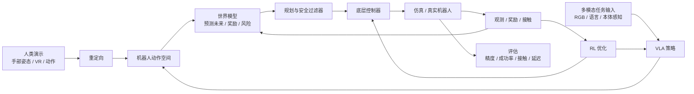
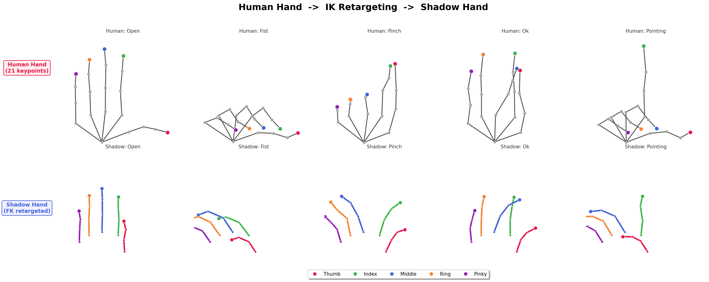
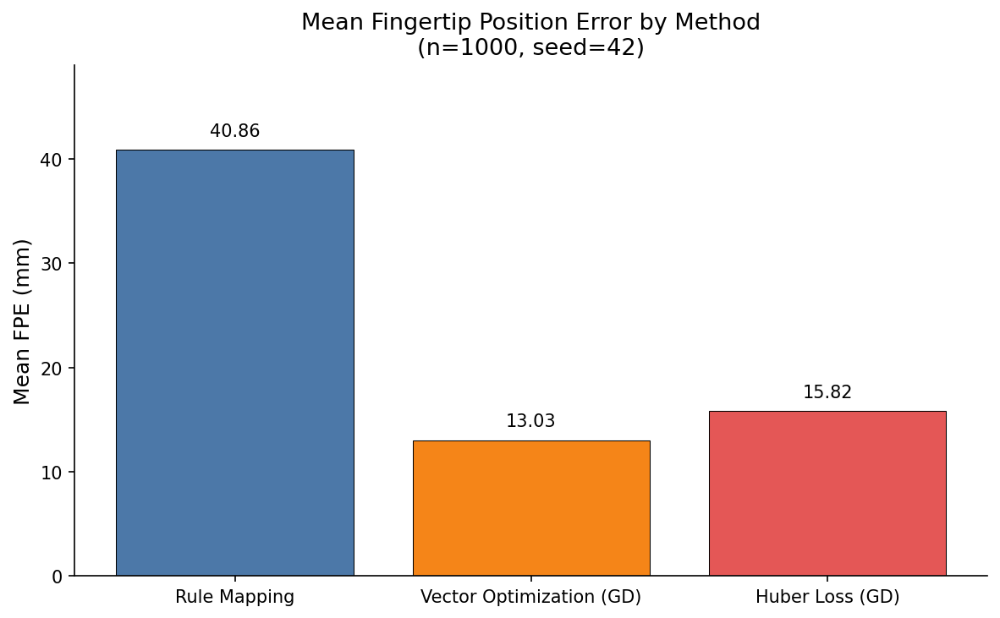
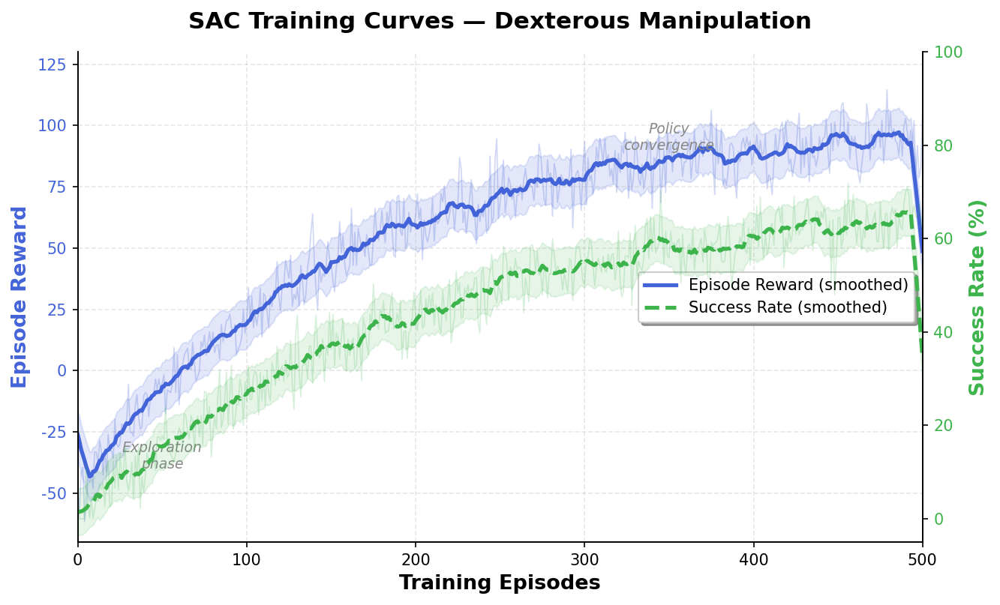
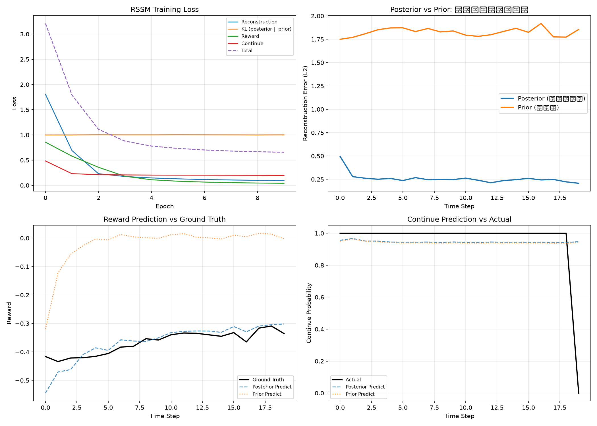
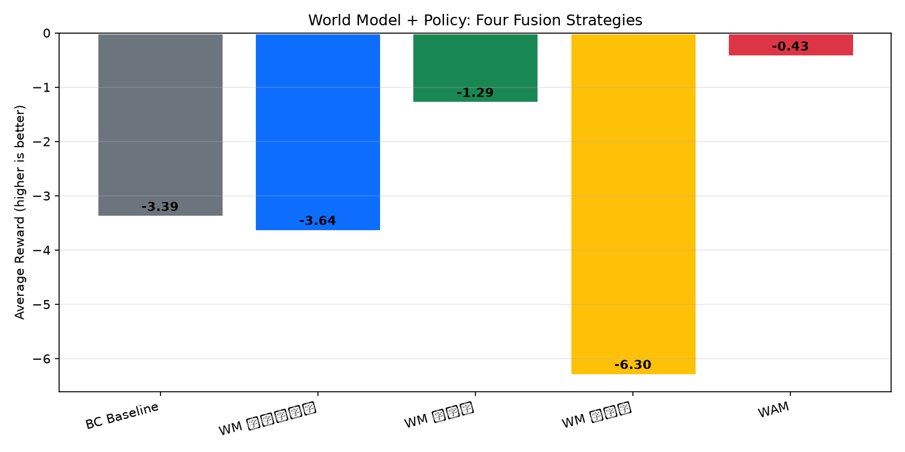

[English](README.md) | 中文

<h1 align="center">Embodied AI: Zero to Hero</h1>

<p align="center">
  <b>一体化技术栈。四大核心能力。从基础概念到可复现的机器人研究。</b><br>
  <b>一体化具身智能开源体系：从核心概念到可复现的机器人研究</b>
</p>

<p align="center">
  <a href="https://github.com/Dld0621/Embodied-AI-Zero-to-Hero/actions/workflows/tests.yml"></a>
  <a href="https://github.com/Dld0621/Embodied-AI-Zero-to-Hero"></a>
  <a href="LICENSE"></a>
  <a href="https://python.org"></a>
  <a href="https://mujoco.org"></a>
</p>

<p align="center">
  <b>维护者：</b> <a href="https://github.com/Dld0621">Gangwei Li</a> — 灵巧手重定向 · VLA · 世界模型 · 机器人学习
</p>

<p align="center">
  <a href="#five-minute-quick-start">快速开始</a> ·
  <a href="#choose-your-path">学习路线</a> ·
  <a href="#documentation-map">文档导航</a> ·
  <a href="#benchmarks">基准测试</a>
</p>

---

## 为什么选择本仓库

具身智能的学习资源散落在感知、策略学习、仿真、控制和硬件等多个领域。本项目将它们组织成一条统一、可执行的路径——从理解核心概念，到复现算法，再到构建研究原型。

| | |
|:---|:---|
| **系统性** | 不是论文链接集合，而是统一的系统结构，四个方向形成端到端链路 |
| **可执行** | 每个方向都包含最小可运行示例和清晰的入口 |
| **研究导向** | 从教学实现逐步过渡到论文复现与原创研究 |

---

## 项目状态

### 核心研究方向

| 方向 | 概念 | 教程 | 可运行示例 | 基准测试 | 研究扩展 |
|:------|:--------:|:--------:|:-------------:|:---------:|:------------------:|
| **灵巧手重定向** | ✅ | ✅ | ✅ | 🟡 | 🟡 |
| **视觉-语言-动作 (VLA)** | ✅ | ✅ | 🟡 | 🟡 | ⏳ |
| **世界模型** | ✅ | ✅ | 🟡 | 🟡 | ⏳ |
| **强化学习** | ✅ | ✅ | 🟡 | 🟡 | ⏳ |

### 工程层

| 层级 | 概念 | 教程 | 可运行示例 | 状态 |
|:------|:--------:|:--------:|:-------------:|:------:|
| **Sim-to-Real** | ✅ | ✅ | ⏳ | ⏳ |
| **VLA 部署** | ✅ | ✅ | ⏳ | ⏳ |
| **评估框架** | ✅ | 🟡 | ⏳ | ⏳ |

**图例：** ✅ 已验证（干净环境，已记录） · 🟡 可运行 / 实验性（部分测试，无 CI） · ⏳ 计划中 · 🔒 外部依赖

---

## 具身智能系统概览

本项目围绕单一研究技术栈构建，而非四个独立主题。每个模块回答完整流程中的一个核心问题：



| 模块 | 回答的核心问题 |
|:-------|:--------------------|
| **世界模型** | 如果机器人执行某个动作，未来会发生什么？ |
| **VLA** | 给定图像和语言指令，机器人应该做什么？ |
| **RL** | 当当前策略表现不佳时，如何通过交互优化它？ |
| **重定向** | 高层动作意图如何映射到具体的机器人形态和关节？ |

**核心研究主线：** 灵巧手重定向是主要研究焦点和差异化方向。VLA、世界模型和 RL 构成策略层、预测层和优化层，连接感知与物理执行。

---

## 选择你的路径

| 你的背景 | 推荐方向 | 第一个任务 | 预期成果 |
|:------------|:------------------|:-----------|:-----------------|
| **零基础** | 基础篇 | 运行 FK/IK Demo | 理解机器人动作表示 |
| **机器人学习学生** | VLA 方向 | 运行最小 VLA | 理解多模态到动作的流程 |
| **灵巧手研究者** | 重定向方向 | 21 点 → Shadow Hand | 从人手关键点获取机器人关节角度 |
| **RL 学习者** | RL 方向 | 运行 Q-Learning / SAC | 理解策略优化 |
| **世界模型研究者** | 世界模型方向 | 运行潜在动力学 Demo | 完成预测 + 规划闭环 |
| **工程开发者** | 仿真与评估 | 加载 MuJoCo 模型 | 集成你自己的机器人 |

---

## 五分钟快速开始

最稳定的单一入口——在 MuJoCo 中运行从合成人手关键点到 Shadow Hand 关节角度的完整重定向流程。

```bash
git clone https://github.com/Dld0621/Embodied-AI-Zero-to-Hero.git
cd Embodied-AI-Zero-to-Hero

pip install numpy scipy mujoco matplotlib

cd examples
python freshman_zero_to_one.py --gesture open --model shadow
```

**输入：** 合成 21 点人手关键点（MediaPipe 格式，单位：米）
**方法：** SLSQP + Huber 指尖 IK 基线，含时序平滑
**输出：** Shadow Hand 24 自由度关节位置 (`qpos`)
**评估：** 指尖位置误差（FPE）和逐帧推理延迟

预期输出：
```
[DexMVRetargeter] Loaded: 24 DOFs, 5 fingertips
  Scale factor: 1.518
  Retargeting time: 0.003s (2.5 ms/frame)
  Mean FPE: ~60 mm (synthetic data, uncalibrated)
```

> **注意：** 报告的合成 FPE 不能直接与论文基准进行比较，因为坐标归一化、机器人形态、目标定义和评估协议不同。使用标准化指标的真实数据评估将添加到基准测试部分。

---

## 可视化演示

### 重定向：合成 5 指运动学重建

由简化 5 指运动学模型生成的五种合成姿态。上图：目标指尖位置；下图：通过梯度下降 IK 重建的指尖位置。



### 方法对比

三种 IK 求解器在合成运动学校验基准上的指尖位置误差（简化 5 指 10 自由度手，n=1000 样本，seed=42）。



### RL 训练曲线

示意性合成 RL 学习曲线，展示预期的报告格式（非来自已完成的 SAC+HER 基准）。



### 世界模型：RSSM 训练分析

保留集上的合成 2D 导航轨迹，比较后验重建、先验想象（含 5 步后验预热）、奖励预测和状态相关终止预测。使用确定性种子的训练/验证/测试划分。



### 世界模型 + 策略集成

在合成 Nav2D 上四种 WM-策略融合策略的奖励比较：BC 基线、WM 辅助奖励增强、WM 动作评估器、WM 基于模型的规划器和潜在空间行为克隆。



> 基于 Nav2D 合成数据的概念演示；非标准基准。

| 方向 | 输入 | 方法 | 结果 |
|:---|:---|:---|:---|
| **重定向** | 合成 5 指尖位置 | 带时序平滑的约束指尖 IK | 简化 5 指 10 自由度关节轨迹 |
| **VLA** | 合成图像 + 语言指令 | 最小 CNN + GRU + MLP 策略头 | 预测动作块（概念演示） |
| **世界模型** | 当前观测 + 动作 | 潜在动力学模型（RSSM 风格） | 预测的下一观测 |
| **RL** | 合成状态 + 目标 | 概念策略 | 示意性奖励曲线（格式演示） |

> 所有可视化均来自本仓库代码。GIF / 视频导出正在开发中。

---

## 核心学习与研究方向

所有四个方向遵循相同的模板：

| 板块 | 内容 |
|:--------|:--------|
| **定义** | 一句话说明目的 |
| **流程** | 输入 → 核心方法 → 输出 → 评估 |
| **学习层级** | 概念 / 教程 / 基准测试 / 研究 |
| **入口** | 学习 · 运行 · 评估 · 探索论文 |
| **已知局限** | 每个组件的真实状态 |

---

### 1. 灵巧手重定向 — 核心研究主线

> **定义：** 将人手运动（21 点关键点、MANO 或 VR 输入）映射到灵巧机器人手关节角度，弥合人与机器人手的形态差异。
>
> **定位：** 将人手运动映射到机器人灵巧手关节角度，弥合人与机器人手的形态差异。这是本项目的核心研究主线。

**流程：**

```
人类运动输入
    → 坐标处理（局部坐标系、镜像、归一化）
    → 任务表示（指尖位置 / 骨骼向量 / 接触图）
    → 求解器（基于规则 / 数值 IK / 基于学习 / 物理感知）
    → 约束（关节限制、碰撞、时序平滑、拟态关节）
    → 机器人执行（qpos / ctrl / 轨迹）
    → 评估（FPE、关节限制违规、接触保持、运行时间）
```

**输入 / 方法 / 输出 / 评估：**

| 输入 | 核心方法 | 输出 | 评估 |
|:------|:------------|:-------|:-----------|
| 21 点关键点、MANO 姿态、VR 控制器、InterHand 数据 | SLSQP + Huber 损失、向量优化、基于规则的映射、神经重定向 | 关节角度 (`qpos`)、执行器目标 (`ctrl`)、轨迹 | FPE、关节限制违规、碰撞率、运行时间 |

**学习层级：**

| 层级 | 内容 | 状态 | 入口 |
|:------|:--------|:------:|:------|
| 概念 | FK/IK 基础、21 点模型、坐标系 | ✅ | [`tutorials/01-fk-ik-basics/`](tutorials/01-fk-ik-basics/) |
| 教程 | 基于规则的映射、使用 scipy 的向量优化 | ✅ | [`tutorials/02-rule-based-retargeting/`](tutorials/02-rule-based-retargeting/) · [`tutorials/03-vector-optimization/`](tutorials/03-vector-optimization/) |
| 可运行 | DexMV 风格 SLSQP + Huber 损失、完整流程 | ✅ | [`examples/freshman_zero_to_one.py`](examples/freshman_zero_to_one.py) · [`examples/dexmv_style_retargeting/`](examples/dexmv_style_retargeting/) |
| 基准测试 | 跨方法的统一评估 | 🟡 | [`benchmarks/run_benchmark.py`](benchmarks/run_benchmark.py) |
| 研究 | 接触感知、物理感知、功能性重定向 | 🟡 | [`docs/17-research-trends-and-positioning.md`](docs/17-research-trends-and-positioning.md) |

**已知局限：**
- 基准测试指标仅限合成数据；真实硬件验证为外部依赖。
- 拟态关节补偿已为 OmniHand O10 实现，但尚未与其他手的基准进行对比测试。
- 接触保持重定向（TopoRetarget 风格）已有文档记录，但尚未在代码中实现。

---

### 2. 视觉-语言-动作 — 策略层

> **定义：** 从视觉感知和自然语言指令生成机器人动作。VLA 作为策略层，将人类高层意图转化为可执行的机器人命令。
>
> **定位：** 从视觉感知和自然语言指令生成机器人动作。VLA 作为策略层，将人类高层意图转化为可执行的机器人命令。

**流程：**

```
多模态输入 (RGB / 语言 / 本体感知)
    → 编码 (视觉编码器 + 语言编码器 + 状态编码器)
    → 融合 (交叉注意力 / Token 融合 / 统一 Transformer)
    → 动作表示 (关节位置 / 增量位姿 / 动作块 / 扩散轨迹)
    → 训练 (行为克隆 → 预训练 / 微调)
    → 推理 (观测 + 指令 → 策略 → 动作块 → 安全过滤器 → 控制器)
```

**输入 / 方法 / 输出 / 评估：**

| 输入 | 核心方法 | 输出 | 评估 |
|:------|:------------|:-------|:-----------|
| RGB 图像、语言指令、本体感知、历史动作 | CNN/Transformer 编码器、多模态融合、策略头 (MLP / Diffusion / Transformer) | 动作块 (T 步关节目标 / 末端位姿) | 任务成功率、推理延迟、动作平滑度、泛化能力 |

**学习层级：**

| 层级 | 内容 | 状态 | 入口 |
|:------|:--------|:------:|:------|
| 概念 | VLA 架构、动作分块、BC 与 RL | ✅ | [`docs/01-what-is-vla.md`](docs/01-what-is-vla.md) |
| 教程 | 最小 VLA 结构（随机初始化，概念演示） | ✅ | [`examples/minimal_vla.py`](examples/minimal_vla.py) |
| 可运行 | 使用 LeRobot 的 SmolVLA 推理、OpenVLA 风格加载 | 🟡 | [`examples/vla_demo.py`](examples/vla_demo.py) |
| 基准测试 | LIBERO / ALOHA 成功率比较 | 🟡 | 参见 [`docs/13-vla-zero-to-one.md`](docs/13-vla-zero-to-one.md) |
| 研究 | 微调、跨具身适应、真实机器人 | ⏳ | [`docs/02-key-papers.md`](docs/02-key-papers.md) |

**已知局限：**
- `minimal_vla.py` 是使用随机权重的结构演示，非预训练策略。
- `vla_demo.py` 中的 `--mode aloha` 需要 GPU、网络和 LeRobot 数据集；CPU 回退仅支持合成数据。
- 真实机器人部署指南已计划但尚未包含。

---

### 3. 世界模型 — 预测层

> **定义：** 给定当前状态与动作，预测未来观测与奖励，支持规划、数据生成和安全策略评估。
>
> **定位：** 给定当前状态与动作，预测未来观测与奖励，支持规划、数据生成和安全策略评估。

**流程：**

```
数据集 (o_t, a_t, r_t, o_{t+1})
    → 表征学习 (像素 / 点云 / 状态 → 潜在表示)
    → 动力学学习 (p(z_{t+1} | z_t, a_t)：确定性 / 随机性 / RSSM / Transformer)
    → 预测头 (未来观测 / 奖励 / 终止 / 不确定性)
    → 想象 (展开候选动作，选择最优)
    → 与 VLA 集成 (动作验证)、RL 集成 (想象训练)、重定向集成 (轨迹可行性)
```

**输入 / 方法 / 输出 / 评估：**

| 输入 | 核心方法 | 输出 | 评估 |
|:------|:------------|:-------|:-----------|
| 观测序列、动作序列、奖励 | 潜在动力学模型（线性 / RSSM / Transformer / Diffusion） | 预测的下一观测、奖励、终止、不确定性 | 单步 / 多步预测误差、视觉保真度、规划成功率 |

**学习层级：**

| 层级 | 内容 | 状态 | 入口 |
|:------|:--------|:------:|:------|
| 概念 | 基于模型的 RL、RSSM、DreamerV3、规划 | ✅ | [`docs/07-world-models-for-vla.md`](docs/07-world-models-for-vla.md) |
| 教程 | 最小线性世界模型 + MPC | ✅ | [`examples/world_model_demo.py`](examples/world_model_demo.py) |
| 可运行 | DreamerV3 风格 RSSM 深度实现 | ✅ | [`examples/dreamer_rssm.py`](examples/dreamer_rssm.py) |
| 基准测试 | 标准控制任务上的预测误差 | 🟡 | 待定 |
| 研究 | WM + Policy 融合、PointWorld 风格 3D 光流 | ⏳ | [`docs/07-world-models-for-vla.md`](docs/07-world-models-for-vla.md) |

**已知局限：**
- RSSM 实现与完整 DreamerV3 相比做了简化；图像编解码器非像素级精确。
- 多步展开的累积误差尚未在标准控制任务上进行基准测试。

**实现状态：**

| 能力 | 状态 |
|:-----------|:------:|
| 观测重建（RSSM 解码器） | ✅ |
| 潜在转移（GRU + 先验/后验） | ✅ |
| 想象展开（先验 vs 后验） | ✅ |
| 奖励预测头 | ✅ (RSSM + minimal_world_model) |
| 终止预测头 | ✅ (continue_head 已实现；有意义的评估需要非平凡的终止标签) |
| 不确定性校准 | ⏳ |
| Actor–Critic 想象训练 | ⏳ |

---

### 4. 强化学习 — 优化层

> **定义：** 通过环境交互与奖励反馈优化策略。RL 作为微调和探索层，通过试错改进预训练策略（VLA 或 BC）。
>
> **定位：** 通过环境交互与奖励反馈优化策略。RL 作为微调和探索层，通过试错改进预训练策略（VLA 或 BC）。

**流程：**

```
任务定义 (环境、物体、目标、成功/失败条件)
    → 观测与动作空间 (RGB + 本体感知 + 物体状态 → 关节目标 / 力矩 / 末端增量)
    → 奖励设计 (任务 + 进度 + 接触 + 平滑度 - 碰撞 - 能耗)
    → 算法选择 (Q-Learning / SAC / PPO / HER / Offline RL)
    → 训练 (重置 → 展开 → 缓冲区 → 更新 → 评估)
    → Sim-to-Real (域随机化、延迟仿真、安全约束)
```

**输入 / 方法 / 输出 / 评估：**

| 输入 | 核心方法 | 输出 | 评估 |
|:------|:------------|:-------|:-----------|
| 状态观测、动作空间、奖励函数 | Q-Learning、SAC、PPO、HER、Offline RL | 训练后的策略 π(a|s) | 成功率、样本效率、训练稳定性、Sim-to-Real 性能下降 |

**学习层级：**

| 层级 | 内容 | 状态 | 入口 |
|:------|:--------|:------:|:------|
| 概念 | MDP、价值函数、策略梯度、Q-Learning | ✅ | [`docs/06-rl-fundamentals-for-vla.md`](docs/06-rl-fundamentals-for-vla.md) |
| 教程 | 纯 NumPy Q-Learning 演示 | ✅ | [`examples/rl_demo.py --mode demo`](examples/rl_demo.py) |
| 可运行 | Shadow Hand 上的 SAC + HER (Gymnasium-Robotics) | 🟡 | [`examples/rl_demo.py --mode train`](examples/rl_demo.py) |
| 基准测试 | 标准任务上的成功率 vs 样本数 | 🟡 | 待定 |
| 研究 | VLA 策略的 RL 微调、真实机器人 RL | ⏳ | [`docs/14-rl-zero-to-one.md`](docs/14-rl-zero-to-one.md) |

**已知局限：**
- SAC+HER 训练需要大量算力；CPU 训练可行但较慢。
- 真实机器人 RL 安全约束和 Sim-to-Real 转移已有文档记录，但尚未端到端实现。

---

## 基准测试

提供基准测试配置和参考结果。干净环境复现正在验证中。

### 合成运动学 IK 校验基准 (n=1000, seed=42)

这是一个受控的运动学重建测试，非完整的重定向基准。随机关节角度通过正运动学转换为 5 个指尖位置，然后三种 IK 方法尝试恢复原始角度。它验证了求解器的正确性和运行时间，但不包含形态差异、21 点人手输入或 MuJoCo 物理。

| 方法 | 输入 | 模型 | 平均 FPE (mm) ↓ | P95 FPE (mm) ↓ | FPE 标准差 (mm) ↓ | 运行时间 (ms) ↓ | 限制违规 (%) ↓ |
|:-------|:------|:------|:---:|:---:|:---:|:---:|:---:|
| 规则映射 | 5 个合成指尖 | 简化 5 指 10 自由度手 | 40.86 | 81.20 | 8.37 | 0.029 | 0.0 |
| 向量优化 (GD) | 5 个合成指尖 | 简化 5 指 10 自由度手 | 13.03 | 32.17 | 3.48 | 31.6 | 0.0 |
| Huber 损失 (GD) | 5 个合成指尖 | 简化 5 指 10 自由度手 | 15.82 | 41.72 | 4.59 | 68.2 | 0.0 |

**环境：** Windows, Python 3.14, NumPy 2.5.1
**求解器：** 数值梯度下降 IK（纯 NumPy，无 scipy 依赖）
**命令：** `python benchmarks/run_benchmark.py 1000 42`
**模型：** 简化 5 指平面手（10 自由度：每指 MCP+PIP）

> **注意：** 此基准测试衡量的是简化运动学模型上的 IK 重建误差。正式的灵巧手重定向基准（21 点人手 → MuJoCo 中 24 自由度 Shadow Hand，含形态缩放和时序序列）已计划。

### VLA / 世界模型 / RL

| 方向 | 指标 | 状态 |
|:------|:-------|:-------|
| VLA | 任务成功率 / 推理延迟 | ⏳ |
| 世界模型 | 单步 / 多步预测误差 | ⏳ |
| RL | 奖励曲线 / 成功率 / 样本数 | 🟡 |

### RL 基准：Shadow Hand Reach (SAC+HER)

在 `HandReach-v1` 上使用 SAC + HER 的三种子可复现性基准。

| 配置 | 值 |
|:-------|:------|
| 环境 | `HandReach-v1` (Gymnasium-Robotics) |
| 算法 | SAC + HER (future, n_sampled_goal=4) |
| 训练步数 | 每种子 100,000 |
| 种子 | 0, 1, 2 |
| 评估 | 每种子 100 回合（确定性策略） |
| 指标 | 成功率 (%)、平均奖励、奖励标准差、奖励中位数 |

**命令：**
```bash
# 完整基准（训练 + 评估 + 绘图 + 汇总）
python scripts/run_rl_benchmark.py

# 或分步执行
python examples/rl_demo.py --mode train --env HandReach-v1 --timesteps 100000 --seed 0
python examples/rl_demo.py --mode eval --model handreach_sac_her_seed0 --episodes 100 --output results/rl/handreach_sac_her/seed_0/eval_detail
python scripts/plot_rl_curves.py --log-dir results/rl/handreach_sac_her/seed_0
```

**结果位置：** `results/rl/handreach_sac_her/seed_{0,1,2}/`（曲线、配置、评估日志）+ `results/rl/aggregate_results.json`

---

## 支持的机器人与环境

| 机器人 | 自由度 | 手指数 | 模型状态 | IK 已验证 | 基准已验证 | 硬件已验证 |
|:------|:---:|:-------:|:------------:|:-----------:|:------------------:|:-----------------:|
| **Shadow Hand** | 24 | 5 | ✅ 已加载 | ✅ | 🟡 | 🔒 外部 |
| **Allegro Hand** | 16 | 4 | ✅ 已加载 | ✅ | 🟡 | 🔒 外部 |
| **LEAP Hand** | 16 | 4 | ✅ 已加载 | ✅ | 🟡 | 🔒 外部 |
| **OmniHand O10** | 10 | 5 | 🔒 外部 | 🔒 外部 | 🔒 外部 | 🔒 外部 |

**图例：** ✅ 已完成 · 🟡 进行中 · 🔒 外部 / 计划中

---

## 学习路线

```
基础 → 可运行基线 → 统一基准 → 研究与真实机器人
```

完整的 Stage 0–10 分解参见 [`docs/README.md`](docs/README.md)。

---

## 文档导航

所有详细概念、论文列表、命令和教程位于 [`docs/`](docs/)。完整索引参见 [`docs/README.md`](docs/README.md)。

| 类别 | 文档 |
|:---------|:----------|
| **基础** | 关节概念、FK/IK 基础、21 点模型、术语表 |
| **重定向** | 分类体系、人→机器人映射、优化方法、学习方法、DexMV 指南、入门 0→1、评估指标 |
| **VLA** | 核心概念、关键论文、学习路径、微调、部署、面试准备 |
| **世界模型** | 概念、RSSM、与 VLA/RL 的集成 |
| **RL** | 基础、SAC/HER、Sim-to-Real |
| **Sim-to-Real** | 域随机化、系统辨识、视觉适应、延迟补偿 |
| **数据集与工具** | 操作数据集、灵巧手分析、开源项目 |
| **研究** | ArXiv 扫描、研究趋势、含在线链接的前沿论文 |

---

## 可复现性

### 测试环境

| 操作系统 | Python | MuJoCo | PyTorch | 状态 |
|:---|:-------|:-------|:--------|:-------|
| Ubuntu 22.04 | 3.10 | 3.x | 2.x | ✅ |
| Windows 11 | 3.10 | 3.x | 2.x | 🟡 |
| macOS | 3.10 | 3.x | 2.x | 🟡 |

### 复现层级

| 层级 | 要求 | 状态 |
|:------|:------------|:-------|
| L1 导入 | 模块可无错导入 | ✅ |
| L2 演示 | 示例命令可运行至完成 | 🟡 |
| L3 确定性 | 固定种子产生可重复结果 | 🟡 |
| L4 基准 | 统一评估脚本通过 | ⏳ |
| L5 硬件 | 真实机器人结果验证 | 🔒 外部 |

---

## 研究路线图

| 阶段 | 目标 | 时间线 |
|:------|:-----|:---------|
| **第一阶段：基础** | 完成所有教程和可运行演示 | 已完成 |
| **第二阶段：基准测试** | 跨重定向方法的统一评估 | 2026 Q3 |
| **第三阶段：集成** | 端到端 VLA → 重定向 → MuJoCo 流程 | 2026 Q3 |
| **第四阶段：Sim-to-Real** | 域随机化 + 真实硬件验证 | 2026 Q4 |
| **第五阶段：前沿** | 接触感知重定向、RL 增强远程操作 | 2027 |

---

## 贡献

参见 [`CONTRIBUTING.md`](CONTRIBUTING.md) 了解 Issue/PR 规范、内容质量要求和审查清单。

欢迎提交 Issue 和 PR！当前高优先级方向：
- 补充数值回归测试（L4 复现层级）
- 添加更多机器人手模型（Inspire Hand、SVH）
- 完善 VLA 微调教程和评估基准
- 补充世界模型与 Policy 融合的最新进展
- 补充前沿论文代码复现指南

---

## 引用

如果您在研究中使用了本仓库，请引用：

```bibtex
@misc{embodied-ai-zero-to-hero,
  title={Embodied AI: Zero to Hero — A Reproducible Learning and Research Stack},
  author={Gangwei Li},
  year={2026},
  howpublished={\url{https://github.com/Dld0621/Embodied-AI-Zero-to-Hero}},
}
```

---

## 许可证

[MIT License](LICENSE)

---

## 致谢

- [MediaPipe](https://mediapipe-studio.webapps.google.com/demo/hand_landmarker) — 实时手部关键点检测
- [InterHand2.6M](https://mks0601.github.io/InterHand2.6M/) — 双手 3D 姿态数据集
- [MuJoCo Menagerie](https://github.com/google-deepmind/mujoco_menagerie) — 预构建机器人模型库
- [DexMV](https://github.com/yzqin/dexmv-sim) — ECCV 2022 高精度 IK 重定向
- [OpenVLA](https://github.com/openvla/openvla) — Stanford / Berkeley 开源 VLA
- [LeRobot](https://github.com/huggingface/lerobot) — HuggingFace 机器人学习框架
- [Stable Baselines3](https://stable-baselines3.readthedocs.io/) — PyTorch RL 算法库
- [SPIDER](https://github.com/facebookresearch/spider) — Meta FAIR 物理感知重定向
- [DreamDojo](https://github.com/NVIDIA/DreamDojo) — NVIDIA 通用世界模型
