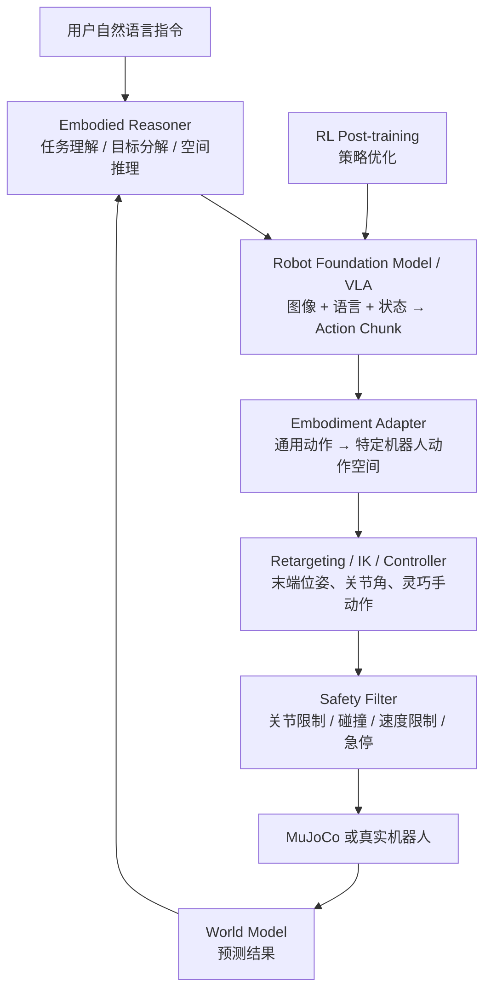
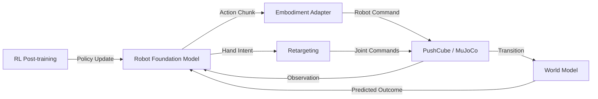

# 23 — Robot Foundation Models 总览

> **如何把 VLA、World Model、RL 和 Retargeting 统一在一个上层模块下，而不是让"机器人大模型"成为孤立的第五方向。**

| 标签 | 内容 |
|:-----|:-----|
| **Tag** | Concept · Architecture · Tutorial |
| **Related** | [13-vla-zero-to-one](13-vla-zero-to-one.md) · [15-world-model-zero-to-one](15-world-model-zero-to-one.md) · [21-vla-dataset-organization](21-vla-dataset-organization.md) · [22-act-vs-diffusion-policy](22-act-vs-diffusion-policy.md) |
| **Code** | `examples/robot_foundation_models/` |
| **Next** | [24-action-representation-and-tokenization](24-action-representation-and-tokenization.md) |

---

## 目录

1. [为什么需要 Robot Foundation Models](#1-为什么需要-robot-foundation-models)
2. [整体架构](#2-整体架构)
3. [统一接口设计](#3-统一接口设计)
4. [模型清单与优先级](#4-模型清单与优先级)
5. [数据层统一](#5-数据层统一)
6. [评测协议](#6-评测协议)
7. [与现有模块的连接](#7-与现有模块的连接)
8. [与灵巧手项目的连接](#8-与灵巧手项目的连接)
9. [实施路线图](#9-实施路线图)

---

## 1. 为什么需要 Robot Foundation Models

本仓库已经有 VLA、World Model、RL 和 Retargeting 四个方向。如果再把"机器人大模型"作为孤立的第五方向硬塞进来，会出现两个问题：

1. **重复**：VLA 本身就是一种机器人基础模型的动作生成层。
2. **割裂**：大模型与底层控制脱节，无法形成闭环。

正确的做法是新增一个上层模块 **Robot Foundation Models (RFM)**，把现有 VLA 作为其中的"动作生成层"，再连接 World Model、RL、Retargeting 和底层控制。

这也符合当前机器人基础模型的发展方式：高层具身推理和低层 VLA 动作模型通常分开设计，而不是让普通 LLM 直接输出电机指令。Gemini Robotics 目前就采用 VLA 与 Embodied Reasoning 双模型结构。

---

## 2. 整体架构



| 层 | 职责 | 仓库对应 |
|:---|:-----|:---------|
| Embodied Reasoner | 任务分解、物体识别、空间推理 | `planners/` |
| Foundation Model | 图像+语言+状态 → 动作块 | `smolvla/`, `openvla/` |
| Embodiment Adapter | 通用动作 → 机器人特定命令 | `common/embodiment_adapter.py` |
| Safety Filter | 最后一道安全防线 | `common/safety_filter.py` |
| Simulation | 执行动作并返回观测 | `unified_pushcube_env.py`, MuJoCo |

---

## 3. 统一接口设计

### 核心原则

> 所有模型必须使用同一套内部接口，而不是每个模型写一套无法复用的代码。

以后无论接 SmolVLA、OpenVLA、π0、GR00T，外层控制代码都不用改，只替换 Adapter。

### 三个核心数据结构

#### RobotObservation — 统一观测格式

```python
@dataclass
class RobotObservation:
    images: dict[str, np.ndarray]      # 相机名 → RGB 图像
    state: np.ndarray | None           # 机器人本体状态
    language_instruction: str          # 语言指令
    timestamp: float                   # 时间戳（用于多相机同步）
    extras: dict                       # 模型特定元数据
```

设计要点：
- **Camera-agnostic**：`images` 是 `dict`，按相机名索引。单相机模型只读 `images["front"]`。
- **State 可选**：某些模型（如纯视觉 Diffusion Policy）不用 state，设为 `None`。
- **Language 必须存在**：即使模型不用语言，指令也随观测传递，用于日志和消融实验。

#### ActionChunk — 统一动作格式

```python
@dataclass
class ActionChunk:
    actions: np.ndarray                # (horizon, action_dim)
    action_type: str                   # "joint_position" | "ee_delta" | ...
    control_frequency: float           # Hz
    confidence: float | None           # 模型置信度（用于安全门控）
```

`action_type` 支持五种类型：

| 类型 | 含义 | 典型模型 |
|:-----|:-----|:---------|
| `joint_position` | 绝对关节角 (rad) | OpenVLA |
| `joint_velocity` | 关节速度 (rad/s) | 部分RL策略 |
| `ee_pose` | 末端位姿 [x,y,z,qx,qy,qz,qw] | 高层规划器 |
| `ee_delta` | 末端增量 [dx,dy,dz,droll,dpitch,dyaw] | SmolVLA |
| `joint_delta` | 关节角增量 (rad) | Diffusion Policy |

#### RobotFoundationModel — 统一模型协议

```python
@runtime_checkable
class RobotFoundationModel(Protocol):
    def reset(self) -> None: ...
    def predict_action(self, observation: RobotObservation) -> ActionChunk: ...
```

使用 `typing.Protocol` 实现结构化子类型——任何有 `reset()` 和 `predict_action()` 的类自动满足协议，不需要继承。

### 控制循环示例

```python
def run_episode(model: RobotFoundationModel, env):
    model.reset()
    obs = env.reset()

    while not done:
        # 1. 构建标准观测
        robot_obs = RobotObservation(
            images={"front": obs["image"]},
            state=obs["state"],
            language_instruction=obs["language"],
            timestamp=time.time(),
        )

        # 2. 模型预测动作块
        chunk = model.predict_action(robot_obs)

        # 3. 安全过滤
        safe_chunk, statuses = safety_filter.check_chunk(chunk, current_state)

        # 4. 执行第一个动作（receding horizon）
        action = safe_chunk.first_action()
        obs, reward, done, info = env.step(action)
```

**这段控制循环代码不需要随模型变化而修改**——换模型只换 Adapter。

---

## 4. 模型清单与优先级

| 模型 | 类型 | 规模 | 开放性 | 仓库状态 | 推荐用途 |
|:-----|:-----|-----:|:------:|:--------:|:---------|
| SmolVLA | 轻量 VLA | 450M | Open | ✅ Runnable | 入门、微调、消费级硬件 |
| OpenVLA/OFT | 通用 VLA | 7B | Open | 🟡 Adapter | LIBERO、LoRA、标准 Benchmark |
| Octo | 通用 Diffusion Policy | 27M/93M | Open | 🟡 Tutorial | Cross-embodiment |
| GR00T N1.6 | 人形基础模型 | Large | Open-weight | ⏳ Planned | 人形、双臂操作 |
| Gemini Robotics 1.5 | VLA | Undisclosed | Private preview | 🔒 Research Only | 具身推理案例 |
| π 系列 | 通用策略 | Large | Varies | 🔒/🟡 Research | 长时序与开放世界 |

### 第一优先级：SmolVLA

SmolVLA 是 450M 参数的轻量机器人基础模型，输入可以包含多相机图像、机器人状态和语言指令，输出连续动作块。官方围绕 LeRobot 数据集和下游微调设计。

仓库中已实现 `SmolVLAAdapter`：
- 将 `RobotObservation` 转换为 LeRobot 输入格式
- 调用 `SmolVLAPolicy.select_action`
- 输出转换为 `ActionChunk`
- 支持 mock 模式（无需 GPU 即可测试接口）

### 第二优先级：OpenVLA / OpenVLA-OFT

OpenVLA-7B 适合作为"较大规模 VLA"的对照模型：
- 支持 LoRA 微调（r=32, ~50M 可训练参数）
- 支持 RLDS 数据格式
- 有 LIBERO 等标准评测
- OFT 提供更高频的连续动作输出和多图像输入

仓库中提供 `OpenVLAAdapter`（接口定义 + mock 模式）和 `lora_config.yaml`。

### 第三优先级：Octo

Octo 适合用来讲解：
- 多机器人预训练（800k episodes）
- Cross-embodiment 泛化
- 语言与目标图像条件
- Diffusion action decoding
- 不同摄像头与动作空间适配

### 第四优先级：GR00T N1.6

GR00T 更适合人形机器人、双臂和灵巧操作方向。NVIDIA 将其定位为面向通用人形机器人的开放基础模型。

---

## 5. 数据层统一

机器人大模型最难的通常不是模型，而是：

| 维度 | 问题 |
|:-----|:-----|
| 相机名称 | front / wrist_left / wrist_right 命名不统一 |
| 图像尺寸 | 128×128 vs 224×224 vs 480×640 |
| state 维度 | 7-DOF vs 14-DOF vs 21-DOF |
| action 含义 | 关节角 vs 末端位姿 vs 增量 |
| 坐标系 | 基座坐标系 vs 世界坐标系 |
| 控制频率 | 5 Hz vs 20 Hz vs 500 Hz |
| episode 划分 | 任务边界、成功/失败定义 |
| action normalization | Z-score vs Min-Max vs 无归一化 |

### Canonical Dataset 标准

```python
episode = {
    "task": "Push the red cube to the target",
    "timestamps": ...,
    "observation.images.front": ...,       # (H, W, 3) uint8
    "observation.images.wrist_left": ...,  # optional
    "observation.images.wrist_right": ..., # optional
    "observation.state": ...,              # (state_dim,) float32
    "action": ...,                         # (action_dim,) float32
    "action_type": "joint_position",
    "robot_type": "agibot_x1_omnihand",
    "control_frequency": 20,
}
```

### 转换器（规划中）

```
Canonical Dataset
├── to_lerobot.py   → SmolVLA / π0
└── to_rlds.py      → OpenVLA / Octo
```

不要让每个模型直接读取自己独有的数据格式，否则仓库会迅速失控。

---

## 6. 评测协议

机器人基础模型至少要有四组评测。

### 6.1 Offline Action Evaluation

| 指标 | 说明 |
|:-----|:-----|
| Action MAE | 预测动作与专家动作的平均绝对误差 |
| Action L2 | L2 距离 |
| 方向一致率 | 预测方向与专家方向夹角 < 90° 的比例 |
| 动作平滑度 | 相邻动作差的范数 |
| 推理延迟 | 单次前向传播耗时 |

### 6.2 Closed-loop Evaluation

| 指标 | 说明 |
|:-----|:-----|
| 任务成功率 | 正确方块到达目标的比例 |
| 错误物体操作率 | 错误方块到达目标的比例 |
| 选择准确率 | 正确方块离目标更近的比例 |
| 碰撞率 | 非目标方块被推动的比例 |
| 超时率 | 达到最大步数的比例 |
| 平均完成步数 | 成功 episode 的平均步数 |

### 6.3 Generalization

| 维度 | 测试方法 |
|:-----|:---------|
| 新位置 | 方块位置从训练分布外采样 |
| 新颜色 | 使用训练中未出现的颜色组合 |
| 新背景 | 改变桌面纹理/颜色 |
| 新语言表达 | "push the crimson cube" 代替 "push the red cube" |
| 遮挡和干扰 | 增加无关物体到场景中 |

### 6.4 Language Ablation

必须使用**同一个模型、同一个场景**：

| 条件 | 输入语言 | 预期结果 |
|:-----|:---------|:---------|
| Correct | 正确指令 | 高成功率 |
| Swapped | 交换颜色词 | 低成功率，高错误方块率 |
| None | 零化语言 token | 50% 选择准确率（随机） |
| Paraphrased | 同义词替换 | 接近正确成功率 |
| Contradictory | 方向词反转 | 低成功率 |

> ⚠️ 不要通过重新训练不同模型来替代严格消融。详见 [26-rfm-finetuning-and-evaluation](26-rfm-finetuning-and-evaluation.md)。

仓库中的 `benchmarks/robot_foundation_models/language_ablation.py` 实现了完整的 5 条件消融。

---

## 7. 与现有模块的连接

RFM 不是孤立模块，它将现有四条路线连接成一个闭环：



| 现有模块 | RFM 中的角色 |
|:---------|:-------------|
| VLA (`unified_pushcube_vla.py`) | RFM 的动作生成层（简化版） |
| World Model (`unified_pushcube_wm.py`) | 预测 RFM 动作的结果 |
| RL (`unified_pushcube_rl.py`) | RL 后训练优化 RFM 策略 |
| Retargeting (`dexmv_style_retargeting/`) | RFM 输出 → 关节命令 |
| PushCube (`unified_pushcube_env.py`) | RFM 的统一评测环境 |
| SmolVLA (`vla_demo.py`) | 升级为 `SmolVLAAdapter` |

---

## 8. 与灵巧手项目的连接

最有价值的方向不是只接一个机械臂 VLA，而是做：

```text
语言 + RGB
     ↓
Robot Foundation Model
     ↓
高层动作意图（例如："用右手捏住杯柄"）
     ↓
Arm target pose + hand functional target
     ↓
Morphology-aware Retargeting
     ↓
OmniHand / Shadow Hand qpos 与 ctrl
     ↓
Contact-aware Safety Filter
     ↓
MuJoCo / Real Robot
```

### 中间表示设计

大模型不应该直接输出 OmniHand 的每个关节角，而是输出中间表示：

```python
GenericAction(
    arm_target_pose=[x, y, z, qx, qy, qz, qw],
    hand_intent="power_grasp",        # 功能性抓取意图
    target_object="cup_handle",
    contact_regions=["thumb_pad", "index_pad"],
    grasp_phase="approach",           # approach / contact / lift
)
```

然后交给 Retargeting、IK 和 Contact-aware 优化器生成真正的机器人动作。

这会形成比"再接一个 VLA Demo"更有研究价值的路线：

> **Robot Foundation Model → Functional Hand Intent → Morphology-aware Retargeting → Contact-aware Execution**

详见 [27-embodied-reasoning-and-planning](27-embodied-reasoning-and-planning.md)。

---

## 9. 实施路线图

### 最推荐的实施顺序

| 阶段 | 任务 | 状态 |
|:-----|:-----|:----:|
| 1 | 新建 RFM 总览与统一接口 | ✅ 完成 |
| 2 | 把现有 SmolVLA 重构成标准 Adapter | ✅ 完成 |
| 3 | 建立 Canonical Dataset，并提供 LeRobot/RLDS 转换 | ⏳ 规划中 |
| 4 | 在双方块 PushCube 上完成 SmolVLA 微调和严格语言消融 | ⏳ 规划中 |
| 5 | 加入 OpenVLA Adapter，作为大模型对照 | ✅ 接口完成 |
| 6 | 将大模型输出连接到 Arm IK + Dexterous Retargeting | ⏳ 规划中 |
| 7 | 最后再考虑 GR00T、π 系列和真实人形机器人 | ⏳ 规划中 |

### 核心不是"收录更多模型名字"

而是让仓库形成：

> **同一数据接口、同一动作接口、同一任务环境、同一评测协议下的机器人基础模型实验闭环。**

---

## 延伸阅读

| 文档 | 内容 |
|:-----|:-----|
| [24-action-representation-and-tokenization](24-action-representation-and-tokenization.md) | 动作表示与 Tokenization |
| [25-cross-embodiment-adaptation](25-cross-embodiment-adaptation.md) | Cross-Embodiment 适配 |
| [26-rfm-finetuning-and-evaluation](26-rfm-finetuning-and-evaluation.md) | RFM 微调与评测 |
| [27-embodied-reasoning-and-planning](27-embodied-reasoning-and-planning.md) | 具身推理与规划 |
| [13-vla-zero-to-one](13-vla-zero-to-one.md) | VLA 实战（SmolVLA） |
| [21-vla-dataset-organization](21-vla-dataset-organization.md) | 数据集组织 |

### 外部参考

- [SmolVLA — HuggingFace Docs](https://huggingface.co/docs/lerobot/main/en/smolvla)
- [OpenVLA — GitHub](https://github.com/openvla/openvla)
- [Octo — Project Page](https://octo-models.github.io/)
- [NVIDIA GR00T N1](https://research.nvidia.com/publication/2025-03_nvidia-isaac-gr00t-n1-open-foundation-model-humanoid-robots)
- [Gemini Robotics — Google DeepMind](https://deepmind.google/models/gemini-robotics/)
