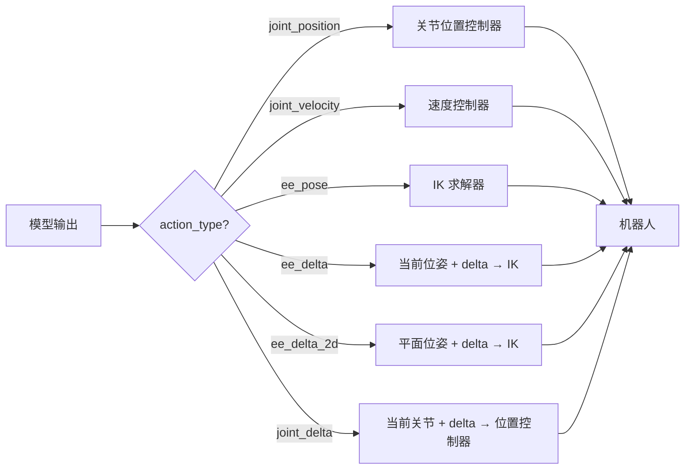
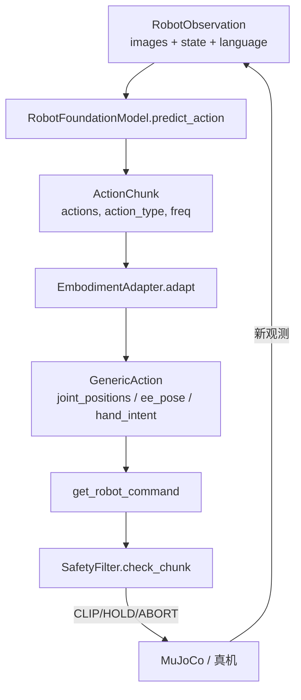

# 动作表示与 Tokenization：从连续控制到离散序列

> **逐点图解 / Concept close-ups：**[动作空间、分块、Token 与扩散](knowledge-atlas/learning-action-representations/index.md)。每个小点配原理、算例、图、自测；这是中文细解，保留英文术语。

> **目标**：理解 Robot Foundation Model (RFM) 输出动作的多种表示方式——连续值、离散化 token、扩散去噪——以及 Action Chunking、动作归一化等关键工程细节，并能将本仓库 `ActionChunk` 数据结构与主流 VLA 模型对齐。

**Tags**: `#action-representation` `#tokenization` `#action-chunking` `#normalization` `#VLA`

**Related Docs**:
- [22-act-vs-diffusion-policy.md](./22-act-vs-diffusion-policy.md) — Action Chunking 与 Diffusion Policy 对比
- [25-cross-embodiment-adaptation.md](./25-cross-embodiment-adaptation.md) — 动作空间差异带来的跨本体问题
- [26-rfm-finetuning-and-evaluation.md](./26-rfm-finetuning-and-evaluation.md) — 归一化统计量与微调

---

## 目录

1. [为什么动作表示至关重要](#1-为什么动作表示至关重要)
2. [六种动作类型 (Action Types)](#2-六种动作类型-action-types)
3. [Action Chunking：预测未来一段而非单步](#3-action-chunking预测未来一段而非单步)
4. [动作归一化 (Normalization)](#4-动作归一化-normalization)
5. [四种 Tokenization 路线](#5-四种-tokenization-路线)
6. [本仓库 ActionChunk 如何映射到这些表示](#6-本仓库-actionchunk-如何映射到这些表示)
7. [从模型输出到机器人命令的完整链路](#7-从模型输出到机器人命令的完整链路)
8. [常见问题](#8-常见问题)

---

## 1. 为什么动作表示至关重要

机器人策略的输出是**动作 (action)**，它最终要驱动真实硬件。但“动作到底是什么”在不同模型、不同机器人之间差异巨大：

- **连续 (continuous)**：直接回归浮点向量，如 `[0.12, -0.03, 0.45, ...]`，对应关节角或末端位姿。OpenVLA-OFT、ACT 属于此类。
- **离散 (discrete)**：把每个维度分箱 (binning) 成有限个 token，像语言模型一样自回归生成。RT-2、vanilla OpenVLA 属于此类。
- **扩散 (diffusion)**：从随机噪声出发，迭代去噪得到一整段动作序列。Octo、Diffusion Policy 属于此类。
- **流匹配 (flow matching)**：学习向量场将噪声传输到动作分布，比扩散更高效。π0、SmolVLA 属于此类。

> **注意**：vanilla OpenVLA 使用 256-bin 离散 token（与 RT-2 相同）；而 OpenVLA-OFT 改用连续动作输出（L1 回归），支持 action chunking 和更高频率。两者是同一模型的不同微调方案。SmolVLA 和 π0 使用 flow matching action expert，并非简单的 MLP 回归或扩散。

表示方式直接决定了**损失函数**、**推理速度**、**多模态能力**和**部署复杂度**：

| 表示方式 | 损失函数 | 多模态动作 | 推理速度 | 典型模型 |
|---------|---------|-----------|---------|---------|
| 连续回归 | MSE / L1 | 差（取平均） | 快 | OpenVLA-OFT, ACT |
| 离散 token | Cross-Entropy | 好 | 慢（自回归） | RT-2, vanilla OpenVLA |
| 扩散去噪 | 去噪 MSE | 好 | 中（多步迭代） | Diffusion Policy, Octo |
| 流匹配 | Flow matching | 好 | 中（ODE 积分） | π0, SmolVLA |

> **核心权衡**：离散 token 借用 LLM 的 Next-Token 范式，泛化强但慢；连续回归快但难以表达多模态；扩散在表达力和速度之间折中。

---

## 2. 六种动作类型 (Action Types)

本仓库在 `examples/robot_foundation_models/common/action_schema.py` 中定义了六种合法的 `action_type`，覆盖了主流机器人的控制接口：

```python
VALID_ACTION_TYPES = frozenset({
    "joint_position",   # 绝对关节角 (rad)
    "joint_velocity",   # 关节速度指令 (rad/s)
    "ee_pose",          # 末端位姿 [x, y, z, qx, qy, qz, qw]
    "ee_delta",         # 末端增量 [dx, dy, dz, droll, dpitch, dyaw]
    "ee_delta_2d",      # 平面末端增量 [dx, dy]（PushCube 专用）
    "joint_delta",      # 关节角增量 (rad)
})
```

它们的物理含义与适用场景：

| action_type | 物理含义 | 维度示例 | 适用场景 | 特点 |
|-------------|---------|---------|---------|------|
| `joint_position` | 绝对关节角 | 7 (Franka) | 关节空间控制 | 交给关节位置控制器，需限位 |
| `joint_velocity` | 关节速度 | 7 | 阻抗/速度控制 | 平滑，但需积分 |
| `ee_pose` | 末端绝对位姿 | 7 (xyz+四元数) | 笛卡尔控制 | 需 IK，坐标系敏感 |
| `ee_delta` | 末端相对增量 | 6 (dxyz+d euler) | 视觉伺服 | 需明确参考系、旋转约定与步长 |
| `ee_delta_2d` | 平面末端增量 | 2 (dx, dy) | PushCube | 轻量任务，SmolVLA PushCube 默认 |
| `joint_delta` | 关节相对增量 | 7 | 增量控制 | 应基于实测关节状态更新，避免开环累计 |

**绝对 vs 增量 (absolute vs delta)** 是最关键的区别：

- **绝对动作** (`joint_position`, `ee_pose`)：模型直接预测目标状态。优点是无累积误差；缺点是对初始状态不鲁棒，且数值范围大、难归一化。
- **增量动作** (`joint_delta`, `ee_delta`)：模型预测“相对于当前状态的变化量”。优点是数值小、分布集中、对初始位姿鲁棒；缺点是长时间执行会累积漂移，因此常配合 Action Chunking 短时执行后重新观测。



> **动作语义由 checkpoint、训练数据和控制器共同约定，不由模型名或文件格式决定。** 本仓库 SmolVLA 的 `ee_delta_2d` / `action_dim=2` 只是 PushCube 微调接口；[官方基础模型配置](https://huggingface.co/lerobot/smolvla_base/blob/main/config.json) 并不是这一二维合同。[vanilla OpenVLA](https://arxiv.org/html/2406.09246v3) 使用末端控制数据，不能把原始输出直接解释成绝对关节角。本仓库 OpenVLA 适配器中的旧 `joint_position` 标签尚未完成语义转换验证，不能据此下发硬件。

---

## 3. Action Chunking：预测未来一段而非单步

传统 Behavior Cloning 每步预测一个动作，存在**复合误差 (Compounding Error)**：微小预测误差在长序列中雪崩式累积。Action Chunking 的核心思想是**一次性预测未来 T 步动作**，然后只执行前几步（Receding Horizon），再根据新观测重新预测。

### 3.1 为什么有效

- **减少推理频率**：模型每 T 步才推理一次，对 5Hz 的 OpenVLA 尤为重要。
- **时间一致性**：一个 chunk 内的动作由同一次前向传播生成，轨迹更平滑。
- **缓解复合误差**：执行前 k 步后重新观测，相当于闭环修正。

### 3.2 本仓库的实现

`ActionChunk` 的 `actions` 字段形状为 `(horizon, action_dim)`，即“未来 horizon 步、每步 action_dim 维”：

```python
@dataclass
class ActionChunk:
    actions: np.ndarray              # shape (horizon, action_dim)
    action_type: str
    control_frequency: float
    confidence: Optional[float] = None

    @property
    def horizon(self) -> int:
        return self.actions.shape[0]

    def first_action(self) -> np.ndarray:
        """只取第一步——用于 receding-horizon 控制。"""
        return self.actions[0]
```

不同模型的 chunk 大小差异很大：

| 模型 | horizon (chunk_size) | control_frequency | 执行策略 |
|------|---------------------|-------------------|---------|
| SmolVLA | 10 | 20 Hz | temporal ensemble (指数加权) |
| OpenVLA | 1 | 5 Hz | 单步直接执行 |
| ACT (完整版) | 100+ | 50 Hz | 执行前 k 步 |
| Diffusion Policy | 16 | 10 Hz | receding horizon |

SmolVLA 配置文件 `smolvla/finetune_config.yaml` 中明确指定了 chunking 与时间集成：

```yaml
training:
  chunk_size: 10                        # 预测未来 10 步
  temporal_ensemble:
    enabled: true
    decay: 0.01                         # 指数加权衰减
```

> **Receding Horizon 示意**：若 `chunk_size=10`，可执行前 5 步（`actions[0:5]`）后重新调用 `predict_action`。`first_action()` 是最极端的情况——只执行第一步，每步都重新预测，精度最高但延迟最大。

### 3.3 时间集成 (Temporal Ensemble)

当多个 chunk 在时间上重叠时，不同 chunk 对同一时刻的预测可能不同。SmolVLA 采用指数加权聚合：越靠后（越新）的预测权重越大。这与 [22-act-vs-diffusion-policy.md](./22-act-vs-diffusion-policy.md) 中讨论的 ACT 时间集成一致。

---

## 4. 动作归一化 (Normalization)

无论哪种表示，原始动作的数值范围差异巨大（关节角 ±π，末端位移毫米级，夹爪 0~1）。归一化是让模型稳定训练的必要步骤。

### 4.1 两种主流方案

| 方案 | 公式 | 特点 | 使用者 |
|------|------|------|--------|
| **Z-score (per-dim mean/std)** | `a_norm = (a - μ) / σ` | 对异常值敏感，但保留分布形状 | SmolVLA, Diffusion Policy |
| **Min-Max (bin discretization)** | `a_norm = (a - min) / (max - min)` | 适合离散化到 [0, 255] | vanilla OpenVLA |

### 4.2 归一化统计量的来源

归一化统计量（mean/std 或 min/max）从**训练集**计算，并随模型一起保存。推理时必须用**相同的统计量**反归一化。OpenVLA 的 LoRA 配置 `openvla/lora_config.yaml` 单独保存了归一化统计：

```yaml
dataset:
  norm_stats_path: "data/norm_stats/pushcube_norm.json"

training:
  unnorm_key: "pushcube"    # 反归一化时使用的统计量 key
```

OpenVLA 推理时通过 `unnorm_key` 指定用哪套统计量反归一化（见 `openvla/inference.py`）：

```python
action = self._policy.predict_action(**inputs, unnorm_key=None, do_sample=False)
```

> **跨本体陷阱**：若把在机器人 A 上训练的模型部署到机器人 B，归一化统计量必须**重新计算**或对齐，否则动作幅度会完全错误。详见 [25-cross-embodiment-adaptation.md](./25-cross-embodiment-adaptation.md)。

---

## 5. 四种 Tokenization 路线

### 5.1 Bin 离散化 (vanilla OpenVLA / RT-2)

vanilla OpenVLA 和 RT-2 把每个动作维度**独立地**分到 256 个 bin 中，用整数 token 表示。这样动作序列就变成了"语言"，可以直接用 LLM 的 Cross-Entropy 损失训练：

```
原始动作: [0.12, -0.03, 0.45, ...]
    ↓ min-max 归一化到 [0, 1]
    ↓ × 255 取整
离散 token: [31, 12, 115, ...]   # 每个维度一个 token
```

推理时模型自回归生成 token，再反归一化回浮点。

**优点**：借用 LLM 范式，泛化性强，可表达多模态分布。
**缺点**：自回归生成慢；维度越多 token 越多，7-DOF 需生成 7 个 token。

### 5.2 连续输出 (OpenVLA-OFT)

OpenVLA-OFT 不离散化，直接用 MLP 头回归连续动作向量，配合 L1 损失，并支持 action chunking 和更高频率：

```python
# OpenVLA-OFT 的做法：MLP 回归连续动作
action = mlp(hidden_states)  # 输出 [dx, dy, dz, droll, dpitch, dyaw, gripper]
```

**优点**：推理快（一次前向）；数值连续，适合精细控制；支持 action chunking。
**缺点**：L1/MSE 会平均多模态分布，难处理"向左或向右都行"的情况。

### 5.3 流匹配 (SmolVLA / π0)

SmolVLA 和 π0 使用 **flow matching action expert**：从噪声动作出发，学习一个向量场将其传输到目标动作分布。与扩散不同，flow matching 使用确定性 ODE 路径（线性插值），推理时沿向量场积分即可生成连续动作块：

```python
# SmolVLA / π0 的做法：flow matching
# 训练时：学习向量场 v_θ(x_t, t)
x_t = (1 - t) * noise + t * action_target  # 线性插值路径
v_pred = flow_model(x_t, t, observation_embedding)
loss = mse(v_pred, action_target - noise)  # 目标向量

# 推理时：从噪声出发，沿向量场积分
x = torch.randn_like(action_template)
for t in torch.linspace(0, 1, num_steps):
    v = flow_model(x, t, observation_embedding)
    x = x + v * dt  # Euler 积分
action = x  # 最终动作块
```

本仓库 `SmolVLAAdapter._real_predict` 通过 LeRobot 框架调用 SmolVLA 的 flow matching 推理：

```python
with torch.no_grad():
    action_tensor = self._policy.select_action(lerobot_obs)

actions = action_tensor.cpu().numpy()
if actions.ndim == 1:
    actions = actions.reshape(1, -1)

return ActionChunk(
    actions=actions,
    action_type=self.action_type,        # "ee_delta_2d"
    control_frequency=self.control_frequency,
)
```

**优点**：比标准扩散推理更快（确定性 ODE 求解器）；可建模多峰分布；支持 action chunking（非自回归生成整段动作）。
**缺点**：需要专门的 action expert 模块；训练流程与标准扩散不同。

### 5.4 扩散去噪 (Octo / Diffusion Policy)

将动作生成视为去噪过程：从纯噪声 `a_T` 出发，经 T 步去噪得到干净动作 `a_0`。每步去噪由网络预测噪声并减去：

```
a_T (噪声) → a_{T-1} → ... → a_0 (干净动作序列)
```

**优点**：天然支持多模态动作分布；可生成一整段 horizon。
**缺点**：推理需多次前向（如 10~100 步去噪），延迟较高。

### 5.5 四者对比

```mermaid
graph TD
    subgraph 离散 Bin
        A1[连续动作] --> A2[归一化 0-1]
        A2 --> A3[×255 离散化]
        A3 --> A4[自回归生成 token]
        A4 --> A5[反归一化]
    end
    subgraph 连续回归
        B1[观测] --> B2[一次前向]
        B2 --> B3[MLP 回归浮点]
        B3 --> B4[反归一化]
    end
    subgraph 扩散
        C1[随机噪声] --> C2[多步去噪]
        C2 --> C3[干净动作序列]
        C3 --> C4[反归一化]
    end
    subgraph 流匹配
        D1[随机噪声] --> D2[向量场积分]
        D2 --> D3[连续动作块]
        D3 --> D4[反归一化]
    end
```



---

## 6. 本仓库 ActionChunk 如何映射到这些表示

`ActionChunk` 是一个**表示无关 (representation-agnostic)** 的容器：它不关心模型内部用离散还是连续，只记录最终的浮点动作和元数据。这使得控制循环对所有模型统一：

```python
# 无论 SmolVLA (连续) 还是 OpenVLA (离散)，控制循环完全一致
chunk = model.predict_action(obs)        # 统一返回 ActionChunk
action = chunk.first_action()            # 取第一步
# chunk.action_type 告诉适配器如何解释 action
```

`action_type` 字段是关键的“解释协议”：

- 对已按本仓库 PushCube 数据微调且核对归一化的 checkpoint，`ee_delta_2d` 表示平面增量；还要匹配仿真的动作缩放。
- 对 OpenVLA，先查训练数据的末端动作、夹爪通道、坐标系和归一化统计，再实现对应转换。只修改 `action_type` 字符串不会把末端动作转换成关节角。

`confidence` 字段为 Safety Filter 和集成方法提供了置信度门控：

```python
if chunk.confidence is not None and chunk.confidence < threshold:
    # 低置信度时降级到安全策略
    action = safety_filter.hold_last_safe()
```

`control_frequency` 字段确保动作按正确频率执行。例如 OpenVLA 在 5Hz 运行，而 SmolVLA 在 20Hz，下游控制器据此决定调度间隔。

---

## 7. 从模型输出到机器人命令的完整链路

结合本仓库的全部组件，一条完整的动作链路如下：



1. **模型** 输出 `ActionChunk`（含 `action_type` 解释协议）。
2. **EmbodimentAdapter** 根据 `action_type` 和机器人类型，把通用动作转为 `GenericAction`（详见 [25-cross-embodiment-adaptation.md](./25-cross-embodiment-adaptation.md)）。
3. **SafetyFilter** 是教学检查框架，目标是覆盖关节限位、动作变化和碰撞；当前实现仍有检查链与停止语义缺陷，不能作为真机安全保障。
4. 本仓库示例应先限于离线和仿真验证。真实硬件还需要经验证的动作转换、底层控制器与独立安全机制；绝对位置的全零指令不等于停止。

`ActionResult` 用于闭环反馈，记录每次执行是否成功、是否碰撞、最终 reward，供世界模型训练和评测使用：

```python
@dataclass
class ActionResult:
    success: bool
    collision: bool = False
    timeout: bool = False
    steps_executed: int = 0
    final_reward: float = 0.0
    info: dict = None
```

---

## 8. 常见问题

**Q1: 能否只根据 SmolVLA / OpenVLA 的名称决定动作类型？**

不能。LeRobot 与 RLDS 是数据组织格式，不规定必须使用末端增量或关节位置。本文的二维增量只属于本仓库 PushCube 任务。vanilla OpenVLA 预训练使用含 BridgeData 的真实机器人混合数据，LIBERO 属于后续仿真微调评估，不是其预训练数据；原模型的末端控制动作也不能直接当成关节角。接入前逐通道确认单位、坐标系、夹爪含义、归一化和控制频率。

**Q2: Action Chunking 的 horizon 设多大合适？**

取决于控制频率和任务时长。20Hz 下 horizon=10 对应 0.5 秒预测窗口，适合 PushCube 这类短时任务；精细装配可能需要更大 horizon。SmolVLA 默认 10，可参考 `finetune_config.yaml`。

**Q3: 离散化的 bin 数 (256) 会限制精度吗？**

会。256 bin 在 [-π, π] 范围内分辨率约 0.025 rad，对精细任务可能不足。但离散化的泛化收益通常大于精度损失，必要时可用更细的 bin 或混合表示。

**Q4: 扩散 Policy 推理慢，能加速吗？**

可以减少去噪步数（如 DDIM 从 100 步降到 10 步）、用一致性模型 (Consistency Model) 一步生成，或缓存部分去噪结果。本仓库的 Diffusion Policy 实现见 [22-act-vs-diffusion-policy.md](./22-act-vs-diffusion-policy.md)。

---

> **小结**：动作表示是连接“模型预测”与“物理执行”的桥梁。本仓库用 `ActionChunk` 统一了连续、离散、扩散三种范式的输出接口，用 `action_type` 字段声明语义，用 `confidence` 和 `control_frequency` 支撑安全门控与调度。理解这些设计，才能在 [25-cross-embodiment-adaptation.md](./25-cross-embodiment-adaptation.md) 中正确处理跨本体的动作空间差异。
