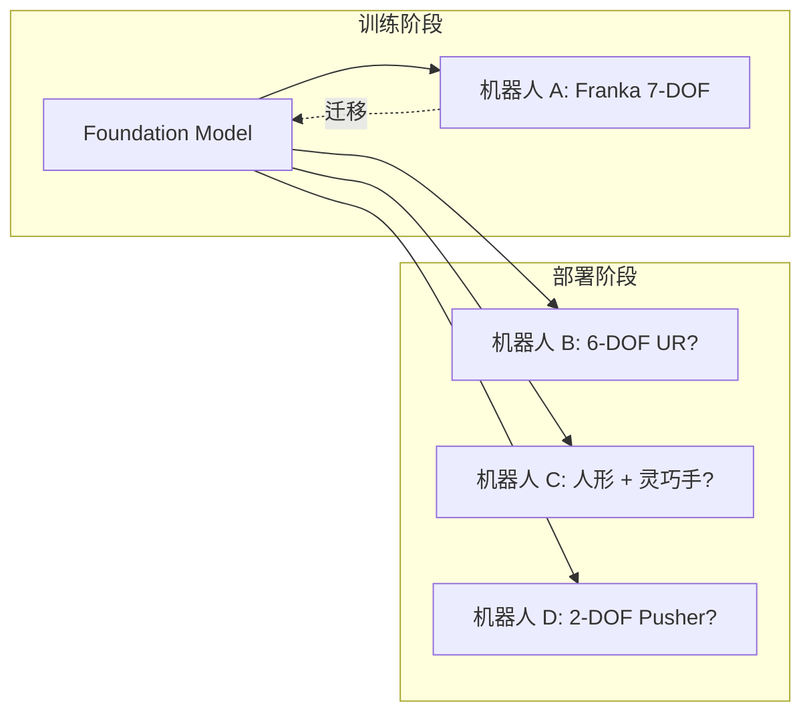
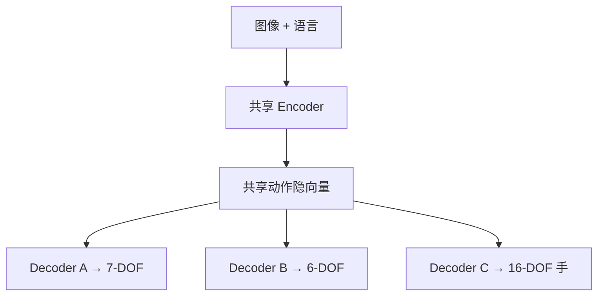
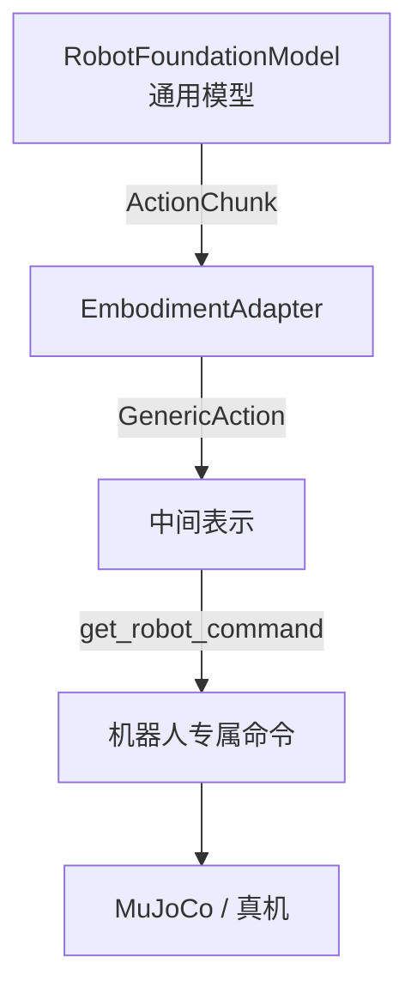
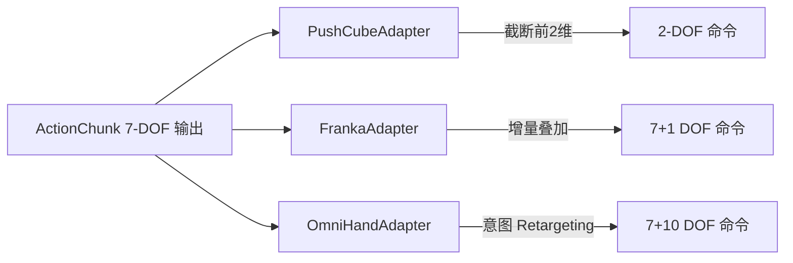
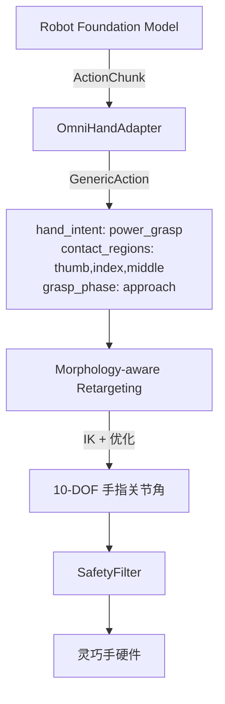

# Cross-Embodiment 适配：让一个模型控制多种机器人

> **目标**：理解为什么在机器人 A 上训练的 Foundation Model 难以直接部署到机器人 B，掌握主流的跨本体 (cross-embodiment) 适配方法，并能用本仓库 `EmbodimentAdapter` + `GenericAction` 抽象为不同机器人编写适配器。

**Tags**: `#cross-embodiment` `#embodiment-adapter` `#action-rescaling` `#Octo` `#dexterous-hand`

**Related Docs**:
- [24-action-representation-and-tokenization.md](./24-action-representation-and-tokenization.md) — 动作空间与归一化基础
- [27-embodied-reasoning-and-planning.md](./27-embodied-reasoning-and-planning.md) — 高层意图与底层动作的解耦
- [03-human-hand-to-robot-hand.md](./03-human-hand-to-robot-hand.md) — 灵巧手 Retargeting

---

## 目录

1. [什么是 Cross-Embodiment](#1-什么是-cross-embodiment)
2. [为什么跨本体很难](#2-为什么跨本体很难)
3. [主流适配方法](#3-主流适配方法)
4. [Octo 的多机器人预训练方案](#4-octo-的多机器人预训练方案)
5. [本仓库的 EmbodimentAdapter 抽象](#5-本仓库的-embodimentadapter-抽象)
6. [三个具体适配器示例](#6-三个具体适配器示例)
7. [如何添加一个新机器人](#7-如何添加一个新机器人)
8. [与灵巧手 Retargeting 的衔接](#8-与灵巧手-retargeting-的衔接)

---

## 1. 什么是 Cross-Embodiment

**Cross-Embodiment（跨本体）** 指的是：在机器人 A（如 Franka 7-DOF 机械臂）上训练的策略，部署到机器人 B（如 6-DOF UR 臂、或带灵巧手的人形机器人）上仍能工作。

理想情况下，我们希望一个 Foundation Model 像“通用大脑”——只要给它摄像头画面和语言指令，无论挂在哪个机器人上都能正确输出动作。但现实中，不同机器人的硬件差异让这件事极具挑战。



| 场景 | 训练本体 | 部署本体 | 难度 |
|------|---------|---------|------|
| 同型号迁移 | Franka Panda | Franka Panda (另一台) | 低 |
| 近似本体 | Franka 7-DOF | UR5 6-DOF | 中 |
| 跨形态 | 7-DOF 臂 + 夹爪 | 7-DOF 臂 + 16-DOF 灵巧手 | 高 |
| 极端跨本体 | 7-DOF 臂 | 2-DOF 平面推杆 | 高（需降维） |

---

## 2. 为什么跨本体很难

跨本体的核心困难来自四个维度的硬件不匹配：

### 2.1 自由度 (DOF) 不同

- Franka Panda：7 个关节 + 1 个夹爪 = 8 维动作
- UR5：6 个关节 + 1 个夹爪 = 7 维动作
- Allegro 灵巧手：16 个手指关节
- PushCube 环境：仅 2 维（x, y 平面位移）

模型的输出维度是固定的。一个 7-DOF 模型无法直接输出 16 维灵巧手动作，反之亦然。

### 2.2 动作空间 (Action Space) 不同

正如 [24-action-representation-and-tokenization.md](./24-action-representation-and-tokenization.md) 所述，有的机器人吃 `joint_position`，有的吃 `ee_delta`，有的吃 `joint_velocity`。即使 DOF 相同，语义不同也无法直接对接。

### 2.3 控制频率 (Control Frequency) 不同

| 机器人 | 典型控制频率 | 模型推理频率 |
|--------|------------|------------|
| Franka (实时) | 500~1000 Hz | 5~20 Hz |
| PushCube (仿真) | 20 Hz | 20 Hz |
| 灵巧手 | 100~200 Hz | 5~20 Hz |

模型 20Hz 输出，但机器人需要 500Hz 指令，中间必须插值或保持。

### 2.4 坐标系 (Coordinate Frame) 不同

末端位姿 `ee_pose` 依赖于基座坐标系：Franka 的基座在桌面，人形机器人的基座在腰部且会移动。同样的 `[x, y, z]` 在不同坐标系下指向完全不同的物理位置。

> **归一化陷阱**：如 [24-action-representation-and-tokenization.md](./24-action-representation-and-tokenization.md) 第 4 节所述，跨本体时归一化统计量 (mean/std) 必须重新对齐，否则动作幅度全错。

---

## 3. 主流适配方法

### 3.1 动作重缩放 (Action Rescaling)

最简单的方法：把模型输出的动作线性映射到目标机器人的范围。

```
a_target = a_model * (range_B / range_A)
```

适用于 DOF 相同、动作类型相同的近邻本体（如两台 Franka 之间）。但无法处理 DOF 不同的情况。

### 3.2 共享动作嵌入 (Shared Action Embedding)

把不同机器人的动作都投影到一个**共享的隐空间 (shared latent space)**，模型在隐空间中预测，再由各机器人的 decoder 解码回自己的动作空间。Octo 采用这种思路（见第 4 节）。



### 3.3 目标条件策略 (Goal-Conditioned Policy)

不让模型输出底层关节指令，而是输出**高层目标**（如末端目标位姿、抓取意图），再由各机器人自己的 IK / Retargeting 算法生成关节命令。本仓库的 `GenericAction` 就是这个思路（见第 5 节）。

---

## 4. Octo 的多机器人预训练方案

Octo 是斯坦福提出的通用 Robot Foundation Model，其核心贡献是**在 80 万条 (800k) 跨机器人 episode 上预训练**，覆盖 Open X-Embodiment 数据集中多种机器人。

Octo 的跨本体策略：

1. **统一观测接口**：所有机器人的观测被转成相同的 tokenizer 输入（图像 token + 语言 token + 可选状态 token）。
2. **读写头 (readout head) 解耦**：模型 trunk 共享，但针对不同数据集训练不同的 readout token。推理时根据机器人类型选择对应的 head。
3. **扩散动作头**：用扩散模型生成动作，天然支持不同维度（扩散目标的维度可变）。

| 维度 | Octo 做法 |
|------|----------|
| 观测统一 | 图像 + 语言 token 化，状态可选 |
| 动作维度 | 扩散头支持变维输出 |
| 机器人区分 | 不同的 readout token / dataset conditioning |
| 预训练规模 | 800k episodes, Open X-Embodiment |

> 本仓库将 Octo 列为“教学级 Tutorial”（见 `README.md` 模型状态表），主要用于理解 cross-embodiment 思想。

---

## 5. 本仓库的 EmbodimentAdapter 抽象

本仓库采用**目标条件策略**思路：模型输出通用的 `ActionChunk`，由 `EmbodimentAdapter` 翻译成机器人专属命令。中间通过 `GenericAction` 解耦。

### 5.1 设计理念



关键思想：**模型输出空间** 与 **机器人控制空间** 解耦。模型不需要知道下游是几 DOF 的机器人，适配器负责翻译。

### 5.2 EmbodimentAdapter 接口

来自 `examples/robot_foundation_models/common/embodiment_adapter.py`：

```python
class EmbodimentAdapter(ABC):
    """机器人专属动作翻译的抽象基类。"""

    def __init__(self, robot_type: str, control_frequency: float):
        self.robot_type = robot_type
        self.control_frequency = control_frequency

    @abstractmethod
    def adapt(self, action_chunk: ActionChunk) -> GenericAction:
        """把模型输出转成机器人专属中间动作。"""
        ...

    @abstractmethod
    def get_robot_command(self, generic: GenericAction) -> np.ndarray:
        """把 GenericAction 转成原始机器人命令向量。"""
        ...
```

两个抽象方法形成两阶段翻译：`ActionChunk → GenericAction → np.ndarray`。

### 5.3 GenericAction：通用中间表示

`GenericAction` 是解耦的核心——它既能承载底层关节指令，也能承载高层意图：

```python
@dataclass
class GenericAction:
    arm_target_pose: Optional[np.ndarray] = None   # [x,y,z,qx,qy,qz,qw]
    joint_positions: Optional[np.ndarray] = None   # [n_joints]
    joint_velocities: Optional[np.ndarray] = None
    hand_intent: Optional[str] = None               # "power_grasp", "pinch", ...
    target_object: Optional[str] = None
    contact_regions: Optional[list] = None
    grasp_phase: Optional[str] = None               # "approach", "contact", "lift"
    extras: Dict = None
```

- **底层字段** (`joint_positions`, `arm_target_pose`)：直接对应关节/位姿命令，适合简单臂。
- **高层字段** (`hand_intent`, `contact_regions`, `grasp_phase`)：描述“想做什么”而非“怎么动”，适合灵巧手——把动作生成交给 Retargeting（见第 8 节）。

这种设计让同一个模型既能驱动 2-DOF 推杆，也能驱动 7+10 DOF 人形手。

---

## 6. 三个具体适配器示例

`embodiment_adapter.py` 的文档字符串中列出了三个典型适配器，它们代表三种截然不同的本体复杂度：

### 6.1 PushCubeAdapter — 2-DOF 平面推杆

PushCube 环境只需 2 维动作（x, y 平面位移），是最简本体。适配器需把模型的 7 维输出降维到 2 维：

```python
class PushCubeAdapter(EmbodimentAdapter):
    """2-DOF 平面推杆适配器。"""

    def __init__(self):
        super().__init__(robot_type="pushcube_2dof", control_frequency=20.0)

    def adapt(self, action_chunk: ActionChunk) -> GenericAction:
        # 模型输出可能是 7 维，取前 2 维作为平面位移
        first = action_chunk.first_action()
        delta_xy = first[:2]
        return GenericAction(
            arm_target_pose=np.array([delta_xy[0], delta_xy[1], 0.0,
                                      0, 0, 0, 1]),  # 平面 + 单位四元数
            grasp_phase="push",
        )

    def get_robot_command(self, generic: GenericAction) -> np.ndarray:
        # PushCube env 只接受 2 维 [dx, dy]
        pose = generic.arm_target_pose
        return np.array([pose[0], pose[1]])
```

这正对应 `smolvla/evaluate.py` 中的 `action = chunk.first_action()[:2]`——把模型 7 维输出截断为 2 维送给 PushCube env。

### 6.2 FrankaAdapter — 7-DOF 臂 + 夹爪

Franka 是最常见的 7-DOF 机械臂，加一个平行夹爪共 8 维。模型若输出 `joint_delta`，适配器做增量叠加：

```python
class FrankaAdapter(EmbodimentAdapter):
    """7-DOF 臂 + 平行夹爪。"""

    def __init__(self):
        super().__init__(robot_type="franka_panda", control_frequency=20.0)
        self._current_joints = np.zeros(7)

    def adapt(self, action_chunk: ActionChunk) -> GenericAction:
        first = action_chunk.first_action()
        if action_chunk.action_type == "joint_delta":
            # 增量叠加：当前关节 + delta
            target_joints = self._current_joints + first[:7]
            gripper = first[7] if first.shape[0] > 7 else 0.0
        elif action_chunk.action_type == "joint_position":
            target_joints = first[:7]
            gripper = first[7] if first.shape[0] > 7 else 0.0
        else:
            raise ValueError(f"Unsupported action_type: {action_chunk.action_type}")

        return GenericAction(
            joint_positions=target_joints,
            hand_intent="parallel_gripper",
            grasp_phase="approach" if gripper > 0.5 else "release",
        )

    def get_robot_command(self, generic: GenericAction) -> np.ndarray:
        self._current_joints = generic.joint_positions.copy()
        return generic.joint_positions  # 7 维关节指令
```

### 6.3 OmniHandAdapter — 7-DOF 臂 + 10-DOF 灵巧手

这是最复杂的本体：7 个臂关节 + 10 个手指关节（如 AGIBot X1 OmniHand）。直接让模型预测 17 维精细手指动作极难收敛，因此采用**高层意图**路线：

```python
class OmniHandAdapter(EmbodimentAdapter):
    """7-DOF 臂 + 10-DOF 灵巧手，采用高层意图驱动。"""

    def __init__(self):
        super().__init__(robot_type="agibot_x1_omnihand", control_frequency=20.0)

    def adapt(self, action_chunk: ActionChunk) -> GenericAction:
        first = action_chunk.first_action()
        # 臂部分：前 7 维作为末端位姿目标
        arm_pose = first[:7]  # 假设模型输出 ee_pose
        # 手部分：不直接用模型的手指输出，而是推断意图
        hand_intent = self._infer_intent(action_chunk)
        return GenericAction(
            arm_target_pose=arm_pose,
            hand_intent=hand_intent,           # "power_grasp" / "pinch" / "release"
            target_object="cup",
            contact_regions=["thumb_pad", "index_pad", "middle_pad"],
            grasp_phase="approach",
        )

    def get_robot_command(self, generic: GenericAction) -> np.ndarray:
        # 臂命令直接用
        arm_cmd = generic.arm_target_pose[:7]
        # 手指命令由 Retargeting 从 hand_intent 生成（见第 8 节）
        hand_cmd = self._retarget_intent(generic.hand_intent)  # 10 维
        return np.concatenate([arm_cmd, hand_cmd])  # 17 维
```

三个适配器的对比：

| 适配器 | DOF | 动作类型 | 策略 | GenericAction 关键字段 |
|--------|-----|---------|------|----------------------|
| PushCubeAdapter | 2 | ee_delta (截断) | 降维 | `arm_target_pose` (前2维) |
| FrankaAdapter | 7+1 | joint_delta/position | 增量叠加 | `joint_positions` |
| OmniHandAdapter | 7+10 | ee_pose + intent | 高层意图 | `hand_intent` + `contact_regions` |



---

## 7. 如何添加一个新机器人

添加新机器人只需两步：实现 `adapt()` 和 `get_robot_command()`。

### 步骤 1：确定动作空间

明确新机器人的：DOF 数、动作类型（关节/末端）、控制频率、坐标系。

### 步骤 2：继承 EmbodimentAdapter

```python
from examples.robot_foundation_models.common.embodiment_adapter import (
    EmbodimentAdapter, GenericAction,
)
from examples.robot_foundation_models.common.action_schema import ActionChunk
import numpy as np


class MyRobotAdapter(EmbodimentAdapter):
    def __init__(self):
        super().__init__(robot_type="my_robot", control_frequency=30.0)

    def adapt(self, action_chunk: ActionChunk) -> GenericAction:
        first = action_chunk.first_action()
        # 在此把模型输出翻译成 GenericAction
        return GenericAction(joint_positions=first[:6])

    def get_robot_command(self, generic: GenericAction) -> np.ndarray:
        # 在此把 GenericAction 转成最终命令向量
        return generic.joint_positions
```

### 步骤 3：接入控制循环

```python
from examples.robot_foundation_models.smolvla.inference import SmolVLAAdapter
from examples.robot_foundation_models.common.safety_filter import SafetyFilter

model = SmolVLAAdapter(device="cuda")
adapter = MyRobotAdapter()
safety = SafetyFilter(joint_lower=q_min, joint_upper=q_max)

model.reset()
obs = env.reset()
while not done:
    chunk = model.predict_action(obs)
    generic = adapter.adapt(chunk)
    cmd = adapter.get_robot_command(generic)
    safe_cmd, status = safety.check(cmd, current_state=obs.state)
    obs, reward, done = env.step(safe_cmd)
```

注意 `SafetyFilter`（来自 `common/safety_filter.py`）会在适配器之后做最终安全检查：关节限位、速度限制、碰撞、NaN 检测、急停。新适配器无需重复实现这些检查。

---

## 8. 与灵巧手 Retargeting 的衔接

对于灵巧手，`GenericAction` 的高层意图字段 (`hand_intent`, `contact_regions`, `grasp_phase`) 是连接 RFM 与 Retargeting 的桥梁：



这条链路正是本仓库的核心架构（见 `robot_foundation_models/README.md`）：

> RFM outputs high-level intent → Retargeting generates joint commands

具体而言：
- RFM 输出“我要做 power_grasp，接触区域在拇指和食指指腹”。
- Retargeting 算法（如 DexMV）根据人手抓取示范和机器人手的形态学，把这些意图映射成 10 个手指关节的目标角度。
- 这比让 RFM 直接回归 10 维手指动作更鲁棒，因为抓取的“形状”是跨形态可迁移的，而具体关节角不是。

> 详细的 Retargeting 方法见 [03-human-hand-to-robot-hand.md](./03-human-hand-to-robot-hand.md) 和 [05-learning-based-methods.md](./05-learning-based-methods.md)。

---

## 9. 常见问题

**Q1: 同一个模型能同时支持 Franka 和灵巧手吗？**

可以，但前提是模型输出**高层意图**（`ee_pose` + `hand_intent`）而非底层关节角。`GenericAction` 的设计正是为此——模型只关心“去哪、抓什么、怎么抓”，具体关节由适配器和 Retargeting 解决。

**Q2: 动作重缩放在 DOF 不同时怎么用？**

不能直接用。DOF 不同时必须走共享隐空间（如 Octo）或高层意图（如本仓库 `GenericAction`）路线。重缩放仅适用于 DOF 相同的近邻本体。

**Q3: 跨本体时归一化统计量怎么处理？**

两种方案：(1) 用目标机器人的数据重新微调并重算统计量；(2) 采用不需要维度对齐的高层意图表示，绕过归一化问题。详见 [24-action-representation-and-tokenization.md](./24-action-representation-and-tokenization.md) 第 4 节。

**Q4: PushCube 的 2-DOF 和 Franka 的 7-DOF 差异这么大，模型怎么兼容？**

本仓库的策略是让模型统一输出 7 维（`mock_predict` 中 `action_dim = 7`），PushCubeAdapter 截断前 2 维。这是教学简化；生产环境应让模型输出与任务匹配的维度，或使用高层意图。

---

> **小结**：Cross-embodiment 是 Robot Foundation Model 走向通用的核心挑战。本仓库用 `EmbodimentAdapter` + `GenericAction` 两层抽象实现了“一个模型，多种机器人”的解耦设计：底层关节指令走 `joint_positions`/`arm_target_pose`，高层抓取意图走 `hand_intent`/`contact_regions`。掌握这套抽象，就能在 [26-rfm-finetuning-and-evaluation.md](./26-rfm-finetuning-and-evaluation.md) 中针对特定机器人高效微调。
