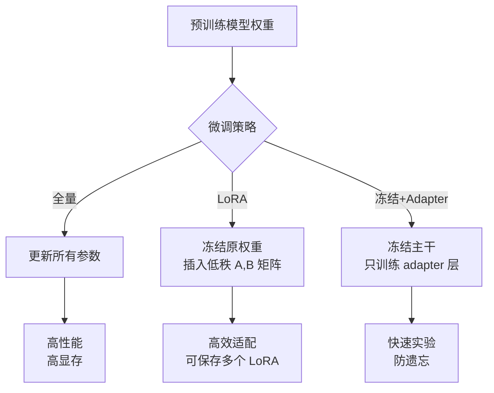
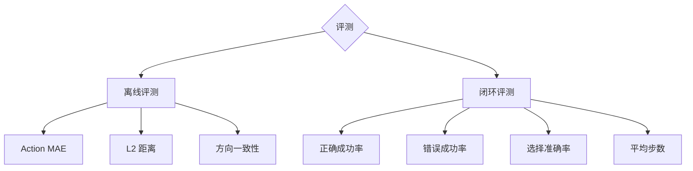
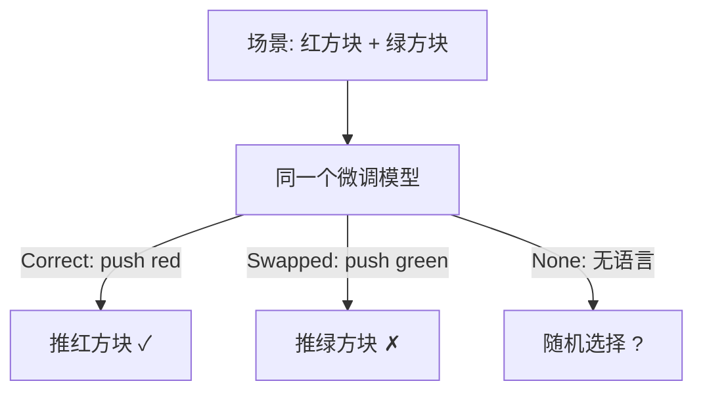
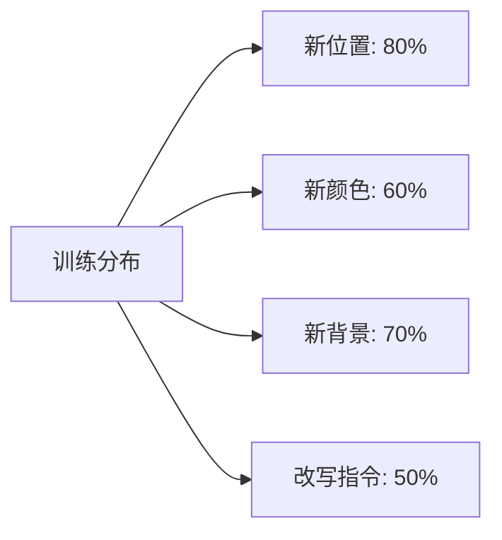

# RFM 微调与评测：从预训练模型到可部署策略

> **目标**：掌握 Robot Foundation Model 的三种微调策略（全量微调、LoRA、冻结主干+适配器），理解 SmolVLA 与 OpenVLA 的数据格式与超参配置，并能用本仓库 `evaluate.py` 完成离线与闭环评测、语言消融与泛化评测。

**Tags**: `#fine-tuning` `#LoRA` `#evaluation` `#LeRobot` `#RLDS` `#ablation`

**Related Docs**:
- [24-action-representation-and-tokenization.md](./24-action-representation-and-tokenization.md) — 归一化与动作块
- [21-vla-dataset-organization.md](./21-vla-dataset-organization.md) — 数据集组织
- [20-vla-deployment-guide.md](./20-vla-deployment-guide.md) — 部署优化
- [06-evaluation-metrics.md](./06-evaluation-metrics.md) — 评测指标体系

---

## 目录

1. [三种微调策略](#1-三种微调策略)
2. [SmolVLA 微调详解](#2-smolvla-微调详解)
3. [OpenVLA LoRA 微调详解](#3-openvla-lora-微调详解)
4. [评测协议总览](#4-评测协议总览)
5. [离线评测 (Offline Evaluation)](#5-离线评测-offline-evaluation)
6. [闭环评测 (Closed-Loop Evaluation)](#6-闭环评测-closed-loop-evaluation)
7. [语言消融 (Language Ablation)](#7-语言消融-language-ablation)
8. [泛化评测 (Generalization Eval)](#8-泛化评测-generalization-eval)
9. [常见问题](#9-常见问题)

---

## 1. 三种微调策略

预训练的 Robot Foundation Model（如 SmolVLA 450M、OpenVLA 7B）已在海量机器人数据上训练，但针对特定任务/机器人仍需微调 (fine-tuning)。三种主流策略：

| 策略 | 可训练参数 | 显存需求 | 适用场景 | 优点 | 缺点 |
|------|-----------|---------|---------|------|------|
| **全量微调 (Full FT)** | 100% | 高 | 任务与预训练差异大、算力充足 | 性能上限最高 | 灾难性遗忘、昂贵 |
| **LoRA** | ~1% (低秩矩阵) | 低 | 消费级 GPU、多任务适配 | 高效、可插拔 | 性能略低于全量 |
| **冻结主干 + Adapter** | 仅 adapter 层 | 最低 | 快速实验、保预训练知识 | 防遗忘、极快 | 表达力受限 |



### 1.1 LoRA 原理速览

LoRA (Low-Rank Adaptation) 把权重更新 `ΔW` 分解为两个低秩矩阵的乘积：`ΔW = A · B`，其中 `A ∈ R^{d×r}`、`B ∈ R^{r×d}`，秩 `r << d`。原权重 `W` 冻结，只训练 `A` 和 `B`。

- 参数量从 `d²` 降到 `2dr`（如 r=32 时减少数十倍）。
- 多个任务的 LoRA 可随时切换，像“插件”一样。

---

## 2. SmolVLA 微调详解

SmolVLA 是 450M 参数的轻量 VLA，适合消费级 GPU 微调。本仓库配置在 `examples/robot_foundation_models/smolvla/finetune_config.yaml`。

### 2.1 数据格式：LeRobot

SmolVLA 使用 HuggingFace LeRobot 数据集格式，每条样本是一个字典：

```python
episode = {
    "observation.images.front": np.ndarray,      # (H, W, 3) RGB
    "observation.state": np.ndarray,              # (state_dim,) 机器人状态
    "action": np.ndarray,                         # (action_dim,) 专家动作
    "task": "push the red cube to the target",    # 语言指令 (LeRobot 用 "task" 字段)
}
```

配置文件中对应字段：

```yaml
dataset:
  repo_id: "local/pushcube_demo"       # 本地或 HF Hub 数据集 ID
  root: "data/pushcube_lerobot"        # 本地路径
  image_keys:
    - "observation.images.front"
  state_key: "observation.state"
  action_key: "action"
  language_key: "task"                  # LeRobot 用 "task" 存语言
```

### 2.2 数据量建议

官方建议**每个任务变体至少 50 条高质量 episode**（见配置文件注释）。质量比数量更重要——50 条精准遥操数据胜过 200 条噪声数据。

### 2.3 关键超参

```yaml
training:
  batch_size: 16
  num_epochs: 50
  learning_rate: 1.0e-4                 # 全量微调典型 LR
  weight_decay: 0.01
  warmup_steps: 500
  lr_scheduler: "cosine"                # 余弦退火
  grad_clip_norm: 1.0
  chunk_size: 10                        # 预测未来 10 步
  temporal_ensemble:
    enabled: true
    decay: 0.01                         # 指数加权衰减
  augment:                              # 数据增强防过拟合
    brightness: 0.1
    contrast: 0.1
    saturation: 0.1
    hue: 0.05
    random_crop: true

hardware:
  device: "cuda"
  mixed_precision: "bf16"               # Ampere+ 用 bf16
```

| 超参 | 值 | 说明 |
|------|-----|------|
| `learning_rate` | 1e-4 | 全量微调；LoRA 可用更高 (5e-4) |
| `num_epochs` | 50 | 配合早停 |
| `chunk_size` | 10 | Action Chunking horizon |
| `mixed_precision` | bf16 | 省显存、防溢出 |
| `augment` | 启用 | 颜色抖动 + 随机裁剪 |

### 2.4 评测与保存

```yaml
logging:
  eval_every_n_epochs: 5
  save_every_n_epochs: 10
  save_best_model: true
  best_metric: "eval_success_rate"      # 按闭环成功率保存最优
```

> 注意 `best_metric` 优先选 `eval_success_rate`（闭环成功率）而非 `eval_loss`（训练损失），因为低损失不等于高成功率——模型可能学到了平均动作而无法完成任务。

---

## 3. OpenVLA LoRA 微调详解

OpenVLA 是 7B 参数的通用 VLA。LoRA 可降低训练显存，但不能由参数量推导“24GB 一定足够”。[官方 LoRA 示例](https://github.com/openvla/openvla#fine-tuning-openvla-via-lora) 在减小 batch 后给出的显存下限约为 27GB。本仓库 `examples/robot_foundation_models/openvla/lora_config.yaml` 是配置参考，没有对应的本地 OpenVLA 训练回执；错误的 24GB 注释已更正，配置参数未改，也不因此产生显存实测证据。

### 3.1 数据格式：RLDS

OpenVLA 使用 RLDS (Reinforcement Learning Datasets) 格式，与 LeRobot 不同：

```yaml
dataset:
  rlds_dir: "data/rlds"
  dataset_name: "pushcube"
  image_key: "observation/image"
  state_key: "observation/state"
  action_key: "action"
  language_key: "language_instruction"
  norm_stats_path: "data/norm_stats/pushcube_norm.json"   # 归一化统计量
```

> **关键**：RLDS 格式的归一化统计量单独存于 JSON，推理时通过 `unnorm_key` 加载（见 [24-action-representation-and-tokenization.md](./24-action-representation-and-tokenization.md) 第 4 节）。

### 3.2 LoRA 配置

```yaml
lora:
  r: 32                    # 低秩矩阵的秩
  lora_alpha: 16           # 缩放因子
  target_modules:          # 在哪些层插入 LoRA
    - "q_proj"
    - "k_proj"
    - "v_proj"
    - "o_proj"
    - "gate_proj"
    - "up_proj"
    - "down_proj"
  lora_dropout: 0.05
  bias: "none"
  task_type: "CAUSAL_LM"
```

| 参数 | 值 | 说明 |
|------|-----|------|
| `r` | 32 | 秩，越大表达力越强但参数越多 |
| `lora_alpha` | 16 | 缩放，实际更新幅度 = alpha/r |
| `target_modules` | 7 个 | 覆盖 attention + MLP 全部投影层 |
| `lora_dropout` | 0.05 | 防过拟合 |

### 3.3 训练超参与显存

```yaml
training:
  batch_size: 2
  num_epochs: 20
  learning_rate: 5.0e-4     # LoRA 用比全量更高的 LR
  warmup_ratio: 0.03
  lr_scheduler: "cosine"
  grad_clip_norm: 1.0
  gradient_accumulation_steps: 8  # 有效 batch = 2×8 = 16

hardware:
  device: "cuda"
  mixed_precision: "bf16"
  num_gpus: 1
  # 显存取决于 batch、图像、精度和实现；本配置尚无峰值显存实测
```

**显存估算的边界**：7B 参数的 bf16 权重约占 14GB（十进制粗算），还需激活、LoRA 参数、梯度、优化器状态和临时缓冲；后几项不能统一指定为固定 GB 数。单卡 `batch_size=2`、累积 8 次的有效 batch 为 16，但梯度累积不会消除单个 microbatch 的显存需求。24GB 设备是否可用，必须以经验证的量化/检查点配置和实际峰值显存为准。

```mermaid
graph LR
    subgraph 显存构成：需按实际配置测量
        W[冻结模型权重：受精度影响] --> MEM[实测峰值显存]
        A[激活：受图像和 microbatch 影响] --> MEM
        L[LoRA 参数与梯度：受 rank 和层数影响] --> MEM
        O[优化器状态与临时缓冲] --> MEM
    end
```

---

## 4. 评测协议总览

微调后必须评测。本仓库 `examples/robot_foundation_models/smolvla/evaluate.py` 实现了两类评测：

| 评测类型 | 是否需环境 | 指标 | 回答的问题 |
|---------|-----------|------|-----------|
| **离线 (Offline)** | 否（只需专家数据） | Action MAE, L2, 方向一致性 | 模型预测准不准？ |
| **闭环 (Closed-Loop)** | 是（PushCube env） | 成功率、选错率、选择准确率 | 模型能完成任务吗？ |



---

## 5. 离线评测 (Offline Evaluation)

离线评测把模型预测与专家示范逐帧对比，无需运行环境，速度快、可复现。

### 5.1 指标定义

来自 `evaluate.py` 的 `run_offline_eval`：

- **Action MAE (Mean Absolute Error)**：预测动作与专家动作逐元素绝对误差的均值。
- **Action L2**：预测与专家动作向量的欧氏距离。
- **Direction Consistency (方向一致性)**：预测方向与专家方向夹角 < 90°（即余弦相似度 > 0）的样本比例。

```python
# 来自 evaluate.py run_offline_eval
mae = np.mean(np.abs(pred - expert))
l2 = np.linalg.norm(pred - expert)

# 方向一致性
if np.linalg.norm(pred) > 1e-6 and np.linalg.norm(expert) > 1e-6:
    cos_sim = np.dot(pred, expert) / (
        np.linalg.norm(pred) * np.linalg.norm(expert)
    )
    if cos_sim > 0:
        direction_matches += 1
```

### 5.2 运行方式

```bash
# Mock 模式（CI 用，无需 GPU/模型下载）
python evaluate.py --mode offline --mock

# 真实模型 + 专家数据
python evaluate.py --mode offline --data results/benchmarks/pushcube_expert.json
```

### 5.3 指标解读

| 指标 | 好的范围 | 含义 |
|------|---------|------|
| Action MAE | < 0.05 (归一化后) | 数值误差小 |
| Action L2 | < 0.1 | 整体偏差小 |
| Direction Consistency | > 0.8 | 80% 以上步骤方向正确 |

> **注意**：离线指标好不等于闭环成功。模型可能 MAE 很低但无法完成任务（如卡在局部最优）。离线评测是必要不充分条件。

---

## 6. 闭环评测 (Closed-Loop Evaluation)

闭环评测在 PushCube 环境中真实 rollout 模型，测量任务完成度。这是最终的“黄金标准”。

### 6.1 PushCube 双方块任务

PushCube 是本仓库的标准评测环境（见 `README.md`）：场景中有**两个不同颜色的方块**，语言指令指定推动哪一个。这天然测试了模型的**语言 grounding** 能力。

### 6.2 指标定义

来自 `evaluate.py` 的 `run_closed_loop_eval`：

| 指标 | 含义 | 计算方式 |
|------|------|---------|
| `correct_success` | 正确方块被推到目标的成功率 | active cube 距目标 < threshold |
| `wrong_success` | 错误方块被推到目标的成功率 | other cube 距目标 < threshold |
| `selection_accuracy` | 选对方块的比例 | active 距离 < other 距离 |
| `avg_steps` | 平均完成步数 | 总步数 / episode 数 |

```python
# 来自 evaluate.py run_closed_loop_eval
active_dist = float(np.linalg.norm(active_cube - target))
other_dist = float(np.linalg.norm(other_cube - target))

if active_dist < env.goal_threshold:
    correct_success += 1
if other_dist < env.goal_threshold:
    wrong_success += 1
if active_dist < other_dist:
    selection_accuracy += 1
```

### 6.3 运行方式

```bash
# 闭环评测（mock 模式）
python evaluate.py --mode closed_loop --mock --n_episodes 5

# 闭环评测（真实模型）
python evaluate.py --mode closed_loop --n_episodes 20
```

### 6.4 关键观察

- **`wrong_success` 应趋近 0**：若 wrong_success 高，说明模型没听懂语言，在乱推。
- **`selection_accuracy` 是语言 grounding 的直接指标**：> 90% 说明模型能根据颜色选择正确方块。
- **`avg_steps` 反映效率**：步数过多可能说明模型在打转。

---

## 7. 语言消融 (Language Ablation)

语言消融用于验证模型**是否真的在用语言指令**，而非只靠视觉记忆。方法：同一模型、同一场景，只改变语言输入。

### 7.1 三种语言条件

| 条件 | 语言输入 | 预期结果 |
|------|---------|---------|
| **Correct** | "push the red cube" (与场景一致) | 高成功率 |
| **Swapped** | "push the green cube" (颜色对调) | 选错方块、成功率下降 |
| **None** | 空字符串或无关文本 | 随机选择、成功率 ~50% |



### 7.2 如何在本仓库实现

`evaluate.py` 的闭环评测已支持不同语言指令（通过 `env.get_language_instruction()`）。要做消融，可在评测循环中替换语言：

```python
# 语言消融示例
conditions = {
    "correct": env.get_language_instruction(),
    "swapped": env.get_swapped_instruction(),   # 颜色对调
    "none": "",                                  # 无语言
}

for cond_name, lang in conditions.items():
    results[cond_name] = run_closed_loop_eval_with_lang(adapter, lang, n_episodes=20)
```

### 7.3 判读标准

- 若 Correct 成功率高、Swapped 选错率高 → 模型确实用了语言。
- 若三者成功率接近 → 模型忽略了语言，只靠视觉（需检查训练数据是否语言-动作对齐）。

---

## 8. 泛化评测 (Generalization Eval)

泛化评测测试模型对**分布外 (Out-of-Distribution, OOD)** 场景的鲁棒性。

### 8.1 四个泛化维度

| 维度 | 训练分布 | 测试分布 | 测试什么 |
|------|---------|---------|---------|
| **新位置 (New Positions)** | 方块在固定区域 | 方块随机位置 | 空间泛化 |
| **新颜色 (New Colors)** | 红/绿方块 | 蓝/黄方块 | 颜色不变性 |
| **新背景 (New Backgrounds)** | 纯色桌面 | 纹理桌面 | 背景鲁棒性 |
| **改写指令 (Paraphrased)** | "push the red cube" | "move the crimson block" | 语言泛化 |

### 8.2 评测方法

每个维度独立评测，保持其他条件不变：

```python
# 泛化评测示例
generalization_tests = {
    "new_position": {"seed_range": (3000, 3020), "lang": "push the red cube"},
    "new_color":    {"color_map": {"red": "blue", "green": "yellow"}},
    "new_bg":       {"bg_texture": "wood.png"},
    "paraphrase":   {"lang": "move the crimson block to the target"},
}

for test_name, config in generalization_tests.items():
    results[test_name] = run_closed_loop_eval(
        adapter, n_episodes=20, **config
    )
```

### 8.3 结果分析



- 新位置泛化通常最好（空间不变性较强）。
- 改写指令泛化最难（需要语言理解而非模式匹配），下降明显说明模型在死记短语。
- 颜色泛化下降说明模型过拟合训练颜色——数据增强 (`augment.hue`) 可缓解。

---

## 9. 常见问题

**Q1: 50 条 episode 够微调吗？**

SmolVLA 官方建议 50 条起步。对于简单任务（如 PushCube）足够；复杂任务（如装配）可能需要 200+。关键是数据质量和多样性（覆盖不同初始位置、光照）。

**Q2: LoRA 的 rank 设多少？**

r=32 是经验默认值（本仓库 `lora_config.yaml`）。r=8 适合简单任务，r=64/128 适合复杂任务但更易过拟合。建议从 32 开始网格搜索 {8, 16, 32, 64}。

**Q3: 离线 MAE 很低但闭环成功率也低，为什么？**

常见原因：(1) 模型预测了“平均动作”，MAE 低但无法完成任务；(2) 复合误差——单步误差小但累积偏离；(3) 安全过滤器过度 CLIP 导致动作被截断。需检查闭环 rollout 轨迹。

**Q4: 语言消融中 None 条件应该用什么？**

用空字符串 `""` 或无关节点（如 "hello"）。若用空字符串成功率仍高，说明模型完全靠视觉；若成功率骤降，说明模型强依赖语言。

**Q5: 闭环评测为什么用 PushCube 双方块？**

双方块场景天然需要语言 grounding——模型必须根据颜色指令选择正确方块，单方块场景无法区分“听懂语言”和“靠视觉记忆”。这正是 `evaluate.py` 同时测量 `correct_success` 和 `wrong_success` 的原因。

---

> **小结**：微调与评测是 RFM 落地的最后一公里。本文提供 SmolVLA 的 LeRobot 数据示例和 OpenVLA 的 RLDS / LoRA 配置参考；它们不是已验证的训练效果或显存承诺。评测遵循“离线→闭环→消融→泛化”：分别检查数值误差、任务完成、语言依赖与分布外表现。复用本仓库 `evaluate.py` 前仍需核对 checkpoint 和动作合同。下一篇 [27-embodied-reasoning-and-planning.md](./27-embodied-reasoning-and-planning.md) 将讨论推理与规划层。
