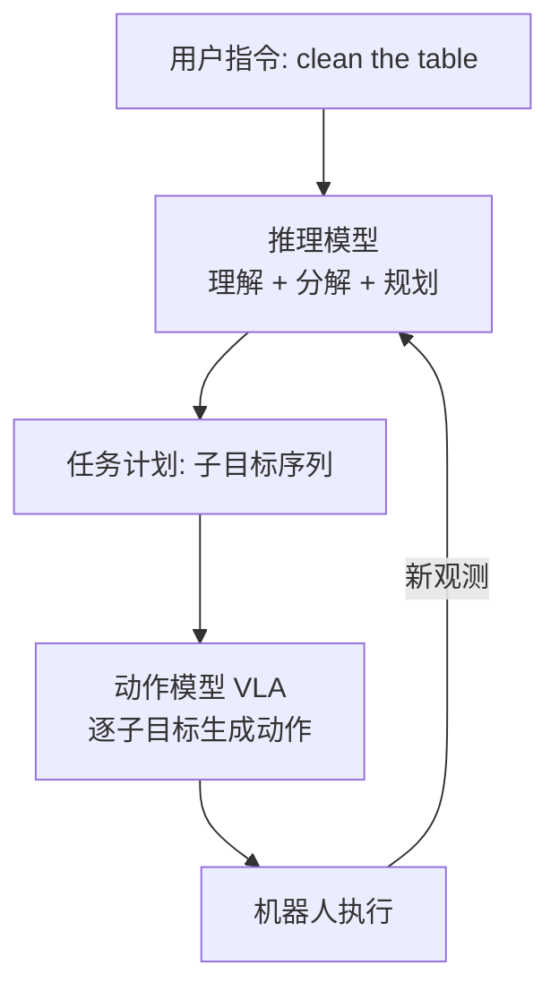
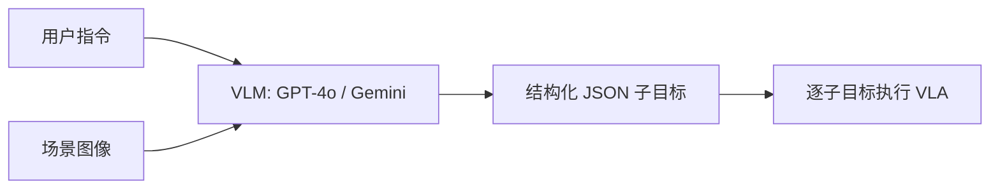
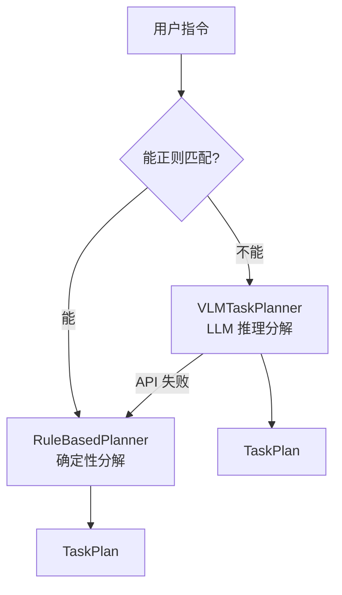
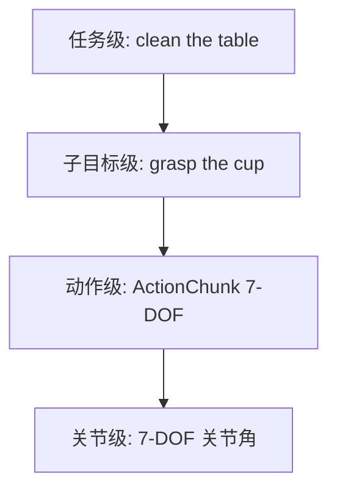

# 具身推理与规划：让机器人先想清楚再动手

> **目标**：理解为什么需要在 Robot Foundation Model (RFM) 之上增加推理与规划层，掌握任务分解 (task decomposition) 的思想，对比规则规划器与 VLM 规划器，并了解 ECoT（Embodied Chain-of-Thought）如何让 VLA“边想边做”，最终把高层意图衔接到通用机器人动作策略与控制器。

**Tags**: `#embodied-reasoning` `#task-planning` `#VLM` `#ECoT` `#task-decomposition` `#robot-foundation-model` `#long-horizon-manipulation`

**Related Docs**:
- [25-cross-embodiment-adaptation.md](./25-cross-embodiment-adaptation.md) — GenericAction 与跨本体适配
- [01-what-is-vla.md](./01-what-is-vla.md) — VLA 基础概念

---

## 目录

1. [为什么要把推理和动作分开](#1-为什么要把推理和动作分开)
2. [任务分解 (Task Decomposition)](#2-任务分解-task-decomposition)
3. [规则规划器 (Rule-Based Planner)](#3-规则规划器-rule-based-planner)
4. [VLM 规划器 (VLM Task Planner)](#4-vlm-规划器-vlm-task-planner)
5. [两种规划器对比](#5-两种规划器对比)
6. [ECoT：具身思维链](#6-ecot具身思维链)
7. [高层意图 vs 底层动作](#7-高层意图-vs-底层动作)
8. [与灵巧操作的衔接](#8-与灵巧操作的衔接)
9. [常见问题](#9-常见问题)

---

## 1. 为什么要把推理和动作分开

一个纯粹的 VLA 模型（如 SmolVLA）接收“图像 + 语言”，直接输出动作。这对简单任务（推方块）足够，但面对复杂长程任务时会力不从心：

- **"clean the table"** 涉及定位垃圾、抓取、移动到垃圾桶、释放、再找下一个……单一动作预测无法规划全局顺序。
- **"make a cup of coffee"** 需要判断杯子在哪、咖啡机状态、先放胶囊还是先倒水——这需要**推理**而非反射式动作。

Gemini Robotics 等前沿系统采用**双模型架构 (dual-model approach)**：



- **推理模型 (Reasoner)**：负责理解指令、空间推理、任务分解、异常处理。通常是大 LLM/VLM（如 GPT-4o、Gemini）。
- **动作模型 (Actor/VLA)**：负责把每个子目标翻译成底层动作。即本仓库的 SmolVLA / OpenVLA。

分开的好处：

| 维度 | 单一 VLA | 推理 + VLA 双模型 |
|------|---------|------------------|
| 长程任务 | 易丢失目标 | 推理层保持全局视野 |
| 异常恢复 | 难以重规划 | 推理层可重新分解 |
| 模糊指令 | 直接猜动作 | 先推理再行动 |
| 可解释性 | 黑盒动作 | 子目标序列可审计 |
| 计算成本 | 低 | 高（需调用 LLM） |

> 本仓库的 `planners/` 目录正是这个“推理层”的教学实现：`rule_based_planner.py` 是最简基线，`vlm_task_planner.py` 是 LLM 增强版。

---

## 2. 任务分解 (Task Decomposition)

任务分解的核心思想：把一个长程复杂指令拆成**原子子目标 (atomic sub-goals)**，每个子目标可被 VLA 一次执行完成。

### 2.1 经典分解示例

以 "clean the table"（清理桌面）为例：

```
clean the table
  ├─ [locate] 找到桌上的脏盘子
  ├─ [approach] 移动到盘子附近
  ├─ [grasp] 抓取盘子
  ├─ [move] 移动到洗碗池
  ├─ [place] 放下盘子
  ├─ [release] 松开夹爪
  ├─ [locate] 找到桌上的纸巾
  ├─ [approach] 移动到纸巾
  ├─ [grasp] 抓取纸巾
  └─ [verify] 检查桌面是否干净
```

每个 `[action]` 后跟一个简短语言指令，直接喂给 VLA。VLA 不需要理解“清理桌面”是什么，只需执行“找到脏盘子”“抓取盘子”等原子动作。

### 2.2 子目标的设计原则

| 原则 | 说明 | 示例 |
|------|------|------|
| **原子性** | 每个子目标可被 VLA 一次完成 | "grasp the cup" 而非 "prepare tea" |
| **可验证** | 有明确的成功条件 | "cup at target" 可测量距离 |
| **顺序性** | 子目标间有逻辑依赖 | 先 grasp 才能 lift |
| **语言友好** | 转成 VLA 能理解的自然语言 | "move behind the red cube" |

---

## 3. 规则规划器 (Rule-Based Planner)

本仓库 `examples/robot_foundation_models/planners/rule_based_planner.py` 实现了最简单的确定性规划器——用正则表达式做模式匹配，无 LLM、无神经网络。

### 3.1 数据结构

规划器输出两个数据结构：

```python
@dataclass
class SubGoal:
    """分解后的单个子目标。"""
    action: str              # "locate", "approach", "push", "grasp", ...
    target: str = ""         # 目标物体
    destination: str = ""    # 移动目的地 (push/place 用)
    condition: str = ""      # 成功条件 (verify 用)
    language: str = ""       # 给 VLA 的精炼语言指令


@dataclass
class TaskPlan:
    """完整的任务计划。"""
    original_instruction: str
    sub_goals: List[SubGoal] = field(default_factory=list)
```

### 3.2 模式匹配

规划器用一组正则模式把指令分类：

```python
PATTERNS = [
    (r"push\s+(?:the\s+)?(.+?)\s+to\s+(?:the\s+)?(.+)", "push"),
    (r"pick\s+up\s+(?:the\s+)?(.+)", "pick_up"),
    (r"place\s+(?:the\s+)?(.+?)\s+on\s+(?:the\s+)?(.+)", "place"),
    (r"move\s+to\s+(?:the\s+)?(.+)", "move"),
]
```

### 3.3 分解模板

每种模式对应固定的子目标序列：

| 指令模式 | 分解结果 |
|---------|---------|
| "push X to Y" | locate → approach → push → verify |
| "pick up X" | locate → approach → grasp → lift |
| "place X on Y" | locate → approach → grasp → move → place → release |
| "move to X" | locate → move |

以 push 为例（来自 `_plan_push`）：

```python
def _plan_push(self, instruction, target, destination):
    return TaskPlan(
        original_instruction=instruction,
        sub_goals=[
            SubGoal(action="locate", target=target,
                    language=f"find the {target}"),
            SubGoal(action="approach", target=target,
                    language=f"move behind the {target}"),
            SubGoal(action="push", target=target, destination=destination,
                    language=f"push the {target} to the {destination}"),
            SubGoal(action="verify", condition=f"{target} at {destination}",
                    language=f"check if the {target} is at the {destination}"),
        ],
    )
```

### 3.4 优缺点

**优点**：完全确定性、可复现、易调试、零延迟、无需 API key。适合做基线和教学。

**缺点**：只能处理预定义模式，无法理解 "clean the table" 这类抽象指令，无法做空间推理（如“最左边的杯子”）。

---

## 4. VLM 规划器 (VLM Task Planner)

`examples/robot_foundation_models/planners/vlm_task_planner.py` 用 VLM（GPT-4o / Gemini）做任务分解，能处理模糊指令和空间推理。

### 4.1 架构



VLM 在 episode 开始时**调用一次**生成完整计划，之后 VLA 反复执行每个子目标。

### 4.2 System Prompt

规划器用一段 system prompt 约束 VLM 输出结构化 JSON：

```python
VLM_SYSTEM_PROMPT = """You are a robot task planner. Given a natural language
instruction and a scene image, decompose the task into a sequence of atomic
sub-goals.

Each sub-goal must have:
- "action": one of ["locate", "approach", "push", "grasp", "lift",
                    "move", "place", "release", "verify"]
- "target": the object to interact with
- "destination": where to move it (for push/place/move)
- "language": a clear, simple instruction for the VLA policy

Return ONLY a JSON array of sub-goals. Example:
[
  {"action": "locate", "target": "red cube", ...},
  ...
]
"""
```

关键设计：限定 action 取值集合，保证输出与 `SubGoal` 数据结构兼容。

### 4.3 多模态输入

VLM 规划器同时接收文本指令和场景图像，因此能做空间推理：

```python
def plan(self, instruction, scene_image=None):
    """分解任务，可选传入场景图像做空间推理。"""
    if self._mock:
        return self._fallback.plan(instruction)   # 退回规则规划器
    return self._vlm_plan(instruction, scene_image)
```

- 传入图像时，VLM 能识别“最左边的杯子”“红色的方块在哪”，输出针对性子目标。
- 不传图像时，VLM 仅凭指令推理（如 "clean the table" → 通用清理流程）。

### 4.4 响应解析与容错

VLM 返回的 JSON 可能带 markdown 代码围栏，需清洗后解析：

```python
def _parse_vlm_response(self, instruction, response_text):
    text = response_text.strip()
    if text.startswith("```"):
        text = text.split("\n", 1)[1]      # 去掉 ```json 头
        text = text.rsplit("```", 1)[0]     # 去掉尾部 ```

    sub_goals_raw = json.loads(text)
    sub_goals = [SubGoal(action=sg["action"], ...) for sg in sub_goals_raw]
    return TaskPlan(original_instruction=instruction, sub_goals=sub_goals)
```

解析失败时自动**退回规则规划器**，保证系统不会因 VLM 异常而崩溃。

### 4.5 API 适配

规划器同时支持 OpenAI 和 Gemini：

| VLM | API Key 环境变量 | 调用方法 |
|-----|-----------------|---------|
| GPT-4o | `OPENAI_API_KEY` | `client.chat.completions.create` |
| Gemini | `GOOGLE_API_KEY` | `genai.GenerativeModel.generate_content` |

无 API key 时自动 mock，退回规则规划器，便于 CI 测试。

---

## 5. 两种规划器对比

| 维度 | RuleBasedPlanner | VLMTaskPlanner |
|------|------------------|----------------|
| 实现复杂度 | 低（正则匹配） | 高（API 调用 + 解析） |
| 指令理解 | 仅预定义模式 | 任意自然语言 |
| 空间推理 | 无 | 有（需图像） |
| 模糊指令 | 不支持 | 支持 |
| 延迟 | ~0ms | 数百 ms~数秒 |
| 成本 | 免费 | API 计费 |
| 确定性 | 完全确定 | 可能变化 |
| 依赖 | 无 | API key / 网络 |
| 适用场景 | 基线、教学、CI | 复杂任务、真实部署 |



> 本仓库的 `VLMTaskPlanner` 在 mock 模式下直接复用 `RuleBasedPlanner`，两者输出相同的 `TaskPlan` 结构，因此下游 VLA 无需区分来源。

---

## 6. ECoT：具身思维链

ECoT (Embodied Chain-of-Thought) 是一种让 VLA **在输出动作前先输出推理过程**的方法，把“思维链”引入具身智能。

### 6.1 核心思想

标准 VLA：`观测 → 动作`
ECoT-VLA：`观测 → 推理（任务理解、子目标、空间分析、动作选择理由）→ 动作`

推理过程作为“中间 token”生成，帮助模型在动作前“想清楚”：

```
[观测: 桌上有红蓝两杯，指令"给我红色的"]
[推理]: 我需要识别红色杯子。左侧是蓝色，右侧是红色。
        目标是右侧杯子。应先 approach 再 grasp。
[动作]: approach right cup
```

### 6.2 与双模型架构的区别

| 维度 | 双模型 (Reasoner + VLA) | ECoT (单模型) |
|------|------------------------|--------------|
| 推理位置 | 独立的推理模型 | VLA 内部 |
| 推理频率 | episode 开始一次 | 每步推理 |
| 推理粒度 | 子目标级 | 动作级 |
| 模型数量 | 2 个 | 1 个 |
| 延迟 | 推理一次 + 多次 VLA | 每步多生成推理 token |

ECoT 的优势是推理与动作紧密耦合，能处理需要逐步推理的精细任务；劣势是每步都生成推理 token，延迟更高。

### 6.3 与本仓库的关系

本仓库的双模型架构（`planners/` + `smolvla/`）对应 Reasoner + VLA 路线。ECoT 是另一种思路——把推理融入 VLA 本身。两者可以结合：推理模型做高层分解，ECoT-VLA 在每个子目标内做动作级推理。

---

## 7. 高层意图 vs 底层动作

任务分解产生了**高层意图 (high-level intent)**，而 VLA 输出**底层动作 (low-level actions)**。两者之间需要一个桥梁，这正是 [25-cross-embodiment-adaptation.md](./25-cross-embodiment-adaptation.md) 中 `GenericAction` 的设计目的。

### 7.1 意图的层次



| 层次 | 例子 | 产生者 | 跨本体可迁移? |
|------|------|--------|-------------|
| 任务级 | "clean the table" | 用户 | 是 |
| 子目标级 | "grasp the cup" | 规划器 | 是 |
| 动作级 | `[0.1, -0.3, ...]` | VLA | 部分 |
| 关节级 | 7-DOF 关节角 | Controller | 否 |

越往上越抽象、越跨本体可迁移；越往下越具体、越依赖具体机器人形态。

### 7.2 GenericAction 中的动作字段

`GenericAction`（来自 `embodiment_adapter.py`）承载从 VLA 到控制器的通用动作表示：

```python
@dataclass
class GenericAction:
    arm_target_pose: Optional[np.ndarray] = None   # 末端位姿 [x,y,z,qx,qy,qz,qw]
    joint_positions: Optional[np.ndarray] = None   # 关节角 (rad)
```

- 简单臂（Franka）用底层字段直接驱动控制器。
- 移动底盘可扩展 `base_velocity` 字段；人形可扩展 `whole_body_joints`。

---

## 8. 与机器人执行器和控制器的衔接

RFM 输出通用动作，最终必须适配到不同形态的机器人和执行器。根据机器人类型，衔接方式有所不同。

### 8.1 典型机器人类型与动作映射

**Franka / UR5 等固定臂 + 夹爪**

```
RFM / VLA → ActionChunk (joint_position / ee_delta / gripper)
       ↓
Robot Adapter
       ↓
Low-level Controller (PID joint servo)
       ↓
Gripper (parallel-jaw: open/close or position)
```

动作类型：
- `joint_position`：7-DOF 绝对关节角
- `ee_delta`：末端 6-DOF 增量
- `gripper`：夹爪开度或开合指令

**移动机械臂（Mobile Manipulator）**

```
RFM → ActionChunk (base_velocity + arm_joint_position + gripper)
       ↓
MobileBaseAdapter + ArmAdapter
       ↓
底盘控制器 (diff-drive / omni-wheel) + 臂控制器
```

底座速度通常与臂动作解耦控制：RFM 输出包含 `base_vel [vx, vy, vtheta]` 和 `arm_action`。

**人形机器人（Humanoid）**

```
RFM → ActionChunk (whole_body_joints)
       ↓
WholeBodyAdapter
       ↓
WBC (Whole-Body Control) 或独立腿/臂控制器
```

人形通常采用全身控制（WBC）或模型预测控制（MPC）来协调平衡与操作。

### 8.2 动作类型对照表

| 动作类型 | 维度 | 典型机器人 | 说明 |
|:---------|-----:|:-----------|:-----|
| `joint_position` | n-DOF | Franka, UR5 | 绝对关节角 (rad) |
| `joint_delta` | n-DOF | xArm, Kinova | 关节角增量 |
| `ee_pose` | 7 | 高层规划器 | [x,y,z,qx,qy,qz,qw] |
| `ee_delta` | 6 | SmolVLA | [dx,dy,dz,droll,dpitch,dyaw] |
| `gripper` | 1 | 二指夹爪 | 开度或开/关 |
| `base_velocity` | 2–3 | 移动底盘 | [vx, vtheta] 或 [vx, vy, vtheta] |
| `whole_body` | 20+ | 人形 | 全身关节目标 |

> 所有动作类型都通过同一套 `ActionChunk` 接口传递，由具体 `RobotAdapter` 负责解析和映射。详见 [23-robot-foundation-models.md](./23-robot-foundation-models.md) 和 [25-cross-embodiment-adaptation.md](./25-cross-embodiment-adaptation.md)。

---

## 9. 常见问题

**Q1: 规则规划器和 VLM 规划器应该选哪个？**

简单、模式固定的任务用规则规划器（快、免费、确定）。复杂、模糊、需空间推理的任务用 VLM 规划器。本仓库 `VLMTaskPlanner` 在无 API key 时自动退回规则规划器，可无缝切换。

**Q2: VLM 规划器每步都调用吗？**

不是。VLM 在 episode 开始时调用一次生成完整 `TaskPlan`，之后 VLA 反复执行子目标。只在需要重新规划（如异常、子目标失败）时才再次调用 VLM。

**Q3: ECoT 和双模型架构矛盾吗？**

不矛盾。双模型架构做高层任务分解，ECoT 在 VLA 内部做动作级推理。可以组合使用：推理模型分解出子目标，ECoT-VLA 在执行每个子目标时逐步推理动作。

**Q4: `SubGoal.language` 和原始指令有什么区别？**

`language` 是给 VLA 的**精炼指令**，更短、更明确。例如原始指令 "push the red cube to the target" 的 locate 子目标 `language` 是 "find the red cube"——只关注当前子目标，降低 VLA 的理解负担。

**Q5: 模型输出的动作空间与机器人输入不匹配怎么办？**

这是跨本体部署最常见的问题。解决方案：

1. **动作类型转换**：`ee_delta` → `joint_position` 通过数值 IK（如 `pybullet` 或 `trac_ik`）。
2. **维度裁剪/填充**：模型输出 8-DOF（臂+夹爪），机器人只有 7-DOF，去掉最后一维或单独处理夹爪。
3. **Adapter 学习**：用一个小型 MLP 把模型动作空间映射到机器人动作空间，在目标机器人数据上微调。
4. **统一规范**：本仓库的 `ActionChunk` 要求显式声明 `action_type`，Adapter 根据类型选择转换路径，避免隐式假设。

---

> **小结**：具身推理与规划是 RFM 之上的“认知层”。本仓库用 `RuleBasedPlanner`（确定性基线）和 `VLMTaskPlanner`（LLM 增强）两种实现，统一输出 `TaskPlan`/`SubGoal` 结构。子目标的 `language` 字段直接喂给 VLA，VLA 输出的 `ActionChunk` 经 `RobotAdapter` 映射为特定机器人的底层控制指令，再经安全过滤后送达执行器，形成“推理→动作→控制”的完整链路。理解这条链路，就理解了从语言指令到通用机器人执行的完整 pipeline。
