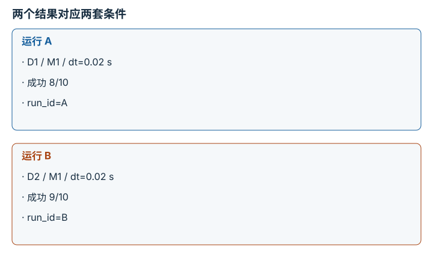
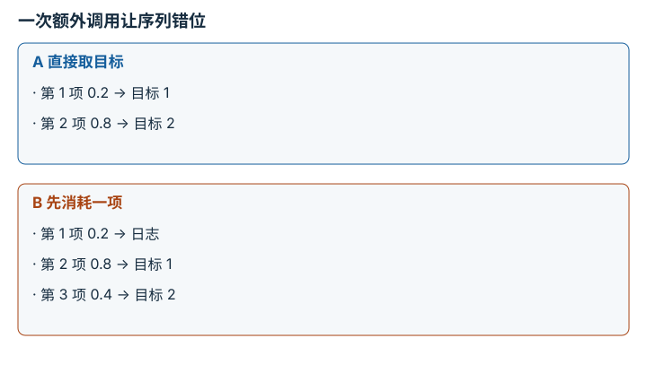
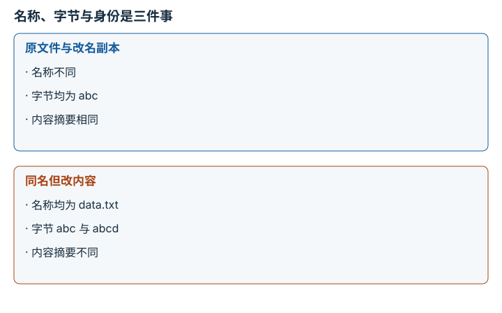
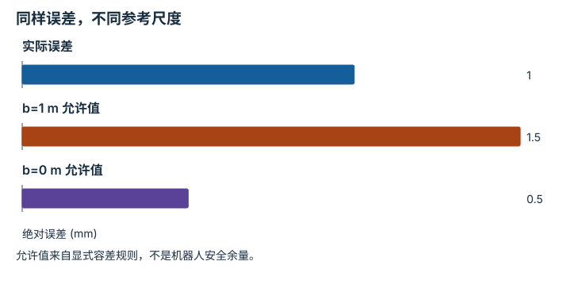

---
search:
  exclude: true
---

# 实验流程与溯源：逐点细解

<!-- Generated by scripts/build_knowledge_atlas.py; edit knowledge/atlas/*.json. -->

[按小节学习](../index.md) · [全部知识点](../../index.md) · [返回原课程](../../../foundations/14-evaluation-and-reproducibility.md)

Experiment workflow and provenance · 本页拆成 **4 个小知识点**。

先阅读直觉和原理，再独立完成算例、自测；图是解释工具，不是已掌握或真机验证的证明。

## 前置知识

[Python、NumPy 与张量形状](../../computing-python-numpy/index.md)

## 本页知识点

1. [实验回执把结果连回产生它的条件](#workflow-run-receipt)
2. [随机种子固定的是生成过程的一部分](#workflow-random-stream)
3. [同名文件不等于同一份数据](#workflow-content-identity)
4. [复现要先声明比较什么误差](#workflow-numerical-tolerance)

## 1. 实验回执把结果连回产生它的条件

**Experiment provenance**

**需要先懂：**文件路径、最终配置

### 一句话直觉

一张成功率截图没有告诉别人该用哪份数据、哪份代码和哪一个模型重新运行。

### 原理拆开看

1. 为一次运行分配 run_id，把命令、代码版本、未提交差异、环境、数据摘要和配置绑定起来。
2. 运行完成后记录退出状态、指标定义及产物路径；失败也保留回执。
3. 复现从回执恢复输入条件，再检查产物，而不是凭记忆挑一个相似设置。

### 手算或追踪一个例子

1. 教学运行 A 用数据 D1、配置 dt=0.02 s、模型 M1，记录 8/10 次成功。
2. 另一运行 B 只把数据改为 D2，得到 9/10；两者需使用不同 run_id。
3. 差异只能表明两个条件不同的结果，不能单凭 80% 与 90% 宣布算法改进。

### 用图理解

<figure class="atlas-visual" tabindex="0" aria-label="两个结果对应两套条件；窄屏可在图内横向滚动">
<picture>
<source media="(max-width: 600px)" srcset="../../../assets/knowledge-atlas/workflow-run-receipt-mobile.svg">

</picture>
<figcaption>教学示意，非实测；两组数字仅示范溯源。</figcaption>
</figure>

- 模型相同而数据不同，所以不能把差值直接归因于模型。
- 10 次的分母很小，图也没有给出任务覆盖与不确定性。

### 容易混淆的地方

**常见误解：**记住成功率就能复现。

**为什么不成立：**指标是多项输入共同产生的结果，缺少来源就无法还原因果。

**正确理解：**保留输入身份、运行条件、失败状态和指标分母。

### 自测

代码 commit 相同，工作区还有未提交修改，回执是否完整？

展开答案与推理

不完整；commit 不包含工作区差异，应保留差异或先形成明确版本。

**原始资料：**[Git diff: working tree and index](https://git-scm.com/docs/git-diff)

## 2. 随机种子固定的是生成过程的一部分

**Random streams and reproducibility**

**需要先懂：**函数调用、实验回执

### 一句话直觉

相同 seed 后多调用一次随机数，后续场景就可能全部移位；seed 不是一张结果保证书。

### 原理拆开看

1. 伪随机生成器按内部状态依次产生值；seed 初始化状态，但算法与调用顺序也参与决定序列。
2. 把数据打乱和环境扰动分成独立随机流，可避免一种随机操作消耗另一种的状态。
3. 同时记录生成器类型、库版本和调用方案；多线程、设备算子仍可能带来非确定性。

### 手算或追踪一个例子

1. 教学序列假定为 [0.2,0.8,0.4]，不是任何具体 seed 的实测输出。
2. 程序 A 直接取前两项作目标，得到 [0.2,0.8]；程序 B 先取一项作日志示例。
3. B 的目标变成 [0.8,0.4]；相同初始状态不能抵消调用次数变化。

### 用图理解

<figure class="atlas-visual" tabindex="0" aria-label="一次额外调用让序列错位；窄屏可在图内横向滚动">
<picture>
<source media="(max-width: 600px)" srcset="../../../assets/knowledge-atlas/workflow-random-stream-mobile.svg">

</picture>
<figcaption>教学示意，非实测；序列人为指定。</figcaption>
</figure>

- 错位来自状态消耗，不是随机数失去随机性。
- 本图只解释一个串行生成器，未描述并行调度影响。

### 容易混淆的地方

**常见误解：**同 seed 必然跨版本、跨设备逐位相同。

**为什么不成立：**生成器实现、调用顺序和非确定性算子都是额外条件。

**正确理解：**固定可控条件并报告复现容差，再用多 seed 检查结论稳健性。

### 自测

为何应给环境和数据加载器分别设随机流？

展开答案与推理

这样改变数据加载随机调用时，环境扰动序列不必跟着移位，便于归因。

**原始资料：**[NumPy random compatibility policy](https://numpy.org/doc/stable/reference/random/compatibility.html)

## 3. 同名文件不等于同一份数据

**Content hashes**

**需要先懂：**文件字节、实验回执

### 一句话直觉

两个目录都叫 dataset_v1，内容却可能不同；摘要用于核对内容身份，而不是证明内容科学正确。

### 原理拆开看

1. 密码学摘要把文件字节映射到固定长度标识，输入字节变化通常会改变摘要。
2. 文件名、路径和内容身份分开记录；大数据集还需清单列出每个文件及其摘要。
3. 读取前核对清单，可发现传输损坏或版本混用；摘要不能验证标签质量或数据授权。

### 手算或追踪一个例子

1. 教学文件 A 含字节 abc，文件 B 含 abcd，两者文件名都可叫 data.txt。
2. 比较长度分别为 3 与 4 字节，随后比较 SHA-256 摘要，会得到不同身份。
3. 把 A 改名而不改字节，其摘要保持不变；路径变化不等于内容变化。

### 用图理解

<figure class="atlas-visual" tabindex="0" aria-label="名称、字节与身份是三件事；窄屏可在图内横向滚动">
<picture>
<source media="(max-width: 600px)" srcset="../../../assets/knowledge-atlas/workflow-content-identity-mobile.svg">

</picture>
<figcaption>教学示意，非实测；不展示伪造摘要值。</figcaption>
</figure>

- 左侧名称变化不影响内容标识，右侧同名不能保证一致。
- 摘要不提供传感器标定、成功标准或伦理合规证据。

### 容易混淆的地方

**常见误解：**摘要一致说明标注没有错误。

**为什么不成立：**同一份错误标注也有稳定摘要，摘要只检查身份。

**正确理解：**用摘要做完整性和溯源检查，用独立抽检与任务规则评估质量。

### 自测

只保存压缩包摘要，能否定位包内哪一帧改变？

展开答案与推理

不能；只能发现整体不同。要定位帧级变化，需要包内文件清单和各文件摘要。

**原始资料：**[Python hashlib](https://docs.python.org/3/library/hashlib.html)

## 4. 复现要先声明比较什么误差

**Numerical reproducibility tolerance**

**需要先懂：**绝对值、单位

### 一句话直觉

几乎相同的浮点输出可能不逐位相同；但任意放大容差又会掩盖真实错误。

### 原理拆开看

1. 先区分逐位一致与数值接近；后者必须给出绝对容差 atol 和相对容差 rtol。
2. 一种常见判据是 |a-b|≤atol+rtol×|b|，其中 b 为参考；atol 与数值本身同单位。
3. 把容差绑定任务尺度，并检查形状和有限性；数值接近不能代替任务成功判定。

### 手算或追踪一个例子

1. 教学参考位置 b=1.000 m，复现 a=1.001 m；设 atol=0.0005 m，rtol=0.001。
2. 允许误差为 0.0005+0.001×1=0.0015 m，实际误差 0.001 m，故通过。
3. 若 b=0 m、a=0.001 m，相同设置只允许 0.0005 m，故拒绝。

### 用图理解

<figure class="atlas-visual" tabindex="0" aria-label="同样误差，不同参考尺度；窄屏可在图内横向滚动">
<picture>
<source media="(max-width: 600px)" srcset="../../../assets/knowledge-atlas/workflow-numerical-tolerance-mobile.svg">

</picture>
<figcaption>教学示意，非实测；统一用毫米显示。</figcaption>
</figure>

- 实际误差低于第二根柱，却高于第三根柱，说明相对项依赖参考尺度。
- 通过这一数值比较不表示轨迹无碰撞或任务成功。

查看作图数据，自己复算

图上数值可能为便于阅读而取近似值，以下保留作图输入。

| 项目 | 绝对误差 (mm) |
| --- | --- |
| 实际误差 | 1 |
| b=1 m 允许值 | 1.5 |
| b=0 m 允许值 | 0.5 |

### 容易混淆的地方

**常见误解：**只设相对误差，在零附近也够用。

**为什么不成立：**参考值接近零时，相对项趋近零，无法表达固定测量或数值精度。

**正确理解：**按单位和任务尺度设定绝对与相对项，并在测试中覆盖近零情况。

### 自测

把位置单位从 m 改成 mm，atol 要如何变化？

展开答案与推理

乘 1000 变成 0.5 mm；rtol 无量纲，仍为 0.001。

**原始资料：**[NumPy isclose](https://numpy.org/doc/stable/reference/generated/numpy.isclose.html)

## 从理解走向证据

本节点原有验收要求：仅凭实验回执重新生成一个产物，不依赖隐藏状态。

完成图解自测后，回到[原课程](../../../foundations/14-evaluation-and-reproducibility.md)运行对应示例并保留证据；浏览页面和查看答案不会自动获得课程晋级。
