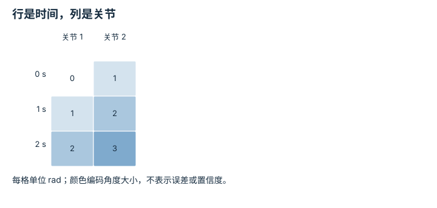
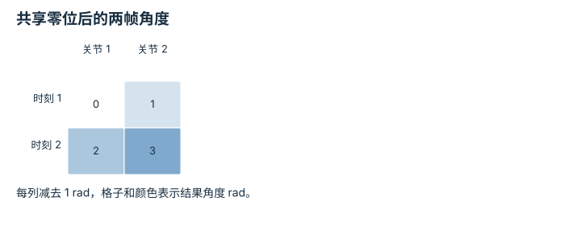
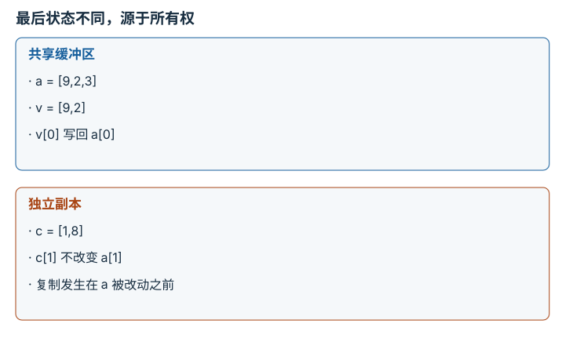

---
search:
  exclude: true
---

# Python、NumPy 与张量形状：逐点细解

<!-- Generated by scripts/build_knowledge_atlas.py; edit knowledge/atlas/*.json. -->

[按小节学习](../index.md) · [全部知识点](../../index.md) · [返回原课程](../../../foundations/01-python-for-robotics.md)

Python, NumPy, and tensor shapes · 本页拆成 **4 个小知识点**。

先阅读直觉和原理，再独立完成算例、自测；图是解释工具，不是已掌握或真机验证的证明。

## 本页知识点

1. [先给每根轴命名，再看 shape](#numpy-axis-semantics)
2. [广播是对齐轴，不是猜测意图](#numpy-broadcast-alignment)
3. [dtype 和物理单位是两份合同](#numpy-dtype-physical-unit)
4. [切片可能仍共享原始观测](#numpy-copy-aliasing)

## 1. 先给每根轴命名，再看 shape

**Tensor axis semantics**

**需要先懂：**列表与索引

### 一句话直觉

形状只说明有多少格，不说明格里是时间、关节还是机器人。轴含义弄反，程序可能照常运行，却控制错对象。

### 原理拆开看

1. 规定 q 的第 0 轴是采样时刻、第 1 轴是关节，元素单位 rad。
2. q.shape=(3,2) 因而表示 3 个时刻、每时刻 2 个关节；q[1] 取第二个时刻。
3. 沿 axis=0 求均值消去时间，留下每个关节的平均角度；沿 axis=1 则混合不同关节，回答另一个问题。

### 手算或追踪一个例子

1. 教学输入 q=[[0,1],[1,2],[2,3]] rad，行对应 t=0、1、2 s。
2. 时间均值分别为 (0+1+2)/3=1、(1+2+3)/3=2 rad。
3. 结果 shape=(2,)，不是 (3,)；若得到 [0.5,1.5,2.5]，说明平均了关节轴。

### 用图理解

<figure class="atlas-visual" tabindex="0" aria-label="行是时间，列是关节；窄屏可在图内横向滚动">
<picture>
<source media="(max-width: 600px)" srcset="../../../assets/knowledge-atlas/numpy-axis-semantics-mobile.svg">

</picture>
<figcaption>教学示意，非实测；数值对应算例 q。</figcaption>
</figure>

- 沿一列向下读是单关节随时间变化，沿一行读是同一时刻的状态。
- 矩阵没有给出速度或插值方式，不能直接当作可执行轨迹。

查看作图数据，自己复算

图上数值可能为便于阅读而取近似值，以下保留作图输入。

| 行 / 列 | 关节 1 | 关节 2 |
| --- | --- | --- |
| 0 s | 0 | 1 |
| 1 s | 1 | 2 |
| 2 s | 2 | 3 |

### 容易混淆的地方

**常见误解：**维度数量相同就能交换轴。

**为什么不成立：**时间和关节的语义不同，转置改变索引含义。

**正确理解：**在接口同时记录 shape、轴名和单位，再选择 reduction 的轴。

### 自测

q[2,0] 和 q[:,0] 分别是什么？

展开答案与推理

前者是第三时刻第一关节的 2 rad；后者是该关节的整条轨迹 [0,1,2] rad。

**原始资料：**[NumPy fundamentals](https://numpy.org/doc/stable/user/basics.html)

## 2. 广播是对齐轴，不是猜测意图

**Broadcasting**

**需要先懂：**张量轴语义

### 一句话直觉

给一批关节状态减去同一个零位很方便，但少写一个轴也可能把两组向量扩成一张表。

### 原理拆开看

1. NumPy 从末轴对齐；两个轴长度相等，或其中一个为 1，才可广播。
2. q 的形状 (2,2) 与零位 b 的 (2,) 对齐后，每行都减去相同 b。
3. (2,1) 减 (2,) 会得到 (2,2)，因此计算成功并不证明形状合同正确。

### 手算或追踪一个例子

1. 教学输入 q=[[1,2],[3,4]] rad，b=[1,1] rad。
2. 逐行相减得到 [[0,1],[2,3]] rad。
3. 若把 [1,3] 误写为列向量，再减 [1,1]，则得到 [[0,0],[2,2]]，并非长度为 2 的逐项差。

### 用图理解

<figure class="atlas-visual" tabindex="0" aria-label="共享零位后的两帧角度；窄屏可在图内横向滚动">
<picture>
<source media="(max-width: 600px)" srcset="../../../assets/knowledge-atlas/numpy-broadcast-alignment-mobile.svg">

</picture>
<figcaption>教学示意，非实测；显示 q-b 的结果。</figcaption>
</figure>

- 两行复用同一零位，不是把第一行与第二行互减。
- 图中结果正确依赖零位按关节排序；广播本身不能检查关节名称。

查看作图数据，自己复算

图上数值可能为便于阅读而取近似值，以下保留作图输入。

| 行 / 列 | 关节 1 | 关节 2 |
| --- | --- | --- |
| 时刻 1 | 0 | 1 |
| 时刻 2 | 2 | 3 |

### 容易混淆的地方

**常见误解：**广播不报错就代表逐项配对正确。

**为什么不成立：**规则只验证轴长度，不知道哪一项属于哪一个关节。

**正确理解：**先推导输出 shape，再断言输出轴与输入合同一致。

### 自测

(4,3) 减去 (4,) 能否广播？

展开答案与推理

不能，末轴 3 与 4 不相等且都不是 1；若想每行减一个数，需要把后者写成 (4,1)。

**原始资料：**[NumPy broadcasting](https://numpy.org/doc/stable/user/basics.broadcasting.html)

## 3. dtype 和物理单位是两份合同

**Data type and units**

**需要先懂：**整数与浮点数

### 一句话直觉

一个整数 1000 可能表示毫米，也可能表示像素。改成浮点数不会自动把毫米换成米。

### 原理拆开看

1. dtype 规定字节如何表示数值；uint16 能保存非负整数，float32 能保存近似实数。
2. 单位来自传感器协议，而非 dtype；本例原始深度每一计数对应 0.001 m。
3. 先转为合适的浮点类型，再乘比例因子，并把无效深度按协议单独标记。

### 手算或追踪一个例子

1. 教学输入 depth=[500,1000,1500]，dtype=uint16，单位 mm。
2. 转浮点并乘 0.001，得到 [0.5,1.0,1.5] m。
3. 只执行 astype(float32) 仍得到 [500,1000,1500]；若误标为 m，距离将放大 1000 倍。

### 用图理解

<figure class="atlas-visual" tabindex="0" aria-label="换算后的有效深度；窄屏可在图内横向滚动">
<picture>
<source media="(max-width: 600px)" srcset="../../../assets/knowledge-atlas/numpy-dtype-physical-unit-mobile.svg">

</picture>
<figcaption>教学示意，非实测；毫米已转换为米。</figcaption>
</figure>

- 输入数字减少 1000 倍，但描述的物理距离没有改变。
- 柱高不能告诉你深度噪声或量程边界，这些需要额外规格。

查看作图数据，自己复算

图上数值可能为便于阅读而取近似值，以下保留作图输入。

| 项目 | 深度 (m) |
| --- | --- |
| 500 mm | 0.5 |
| 1000 mm | 1 |
| 1500 mm | 1.5 |

### 容易混淆的地方

**常见误解：**浮点深度一定是米。

**为什么不成立：**数值表示与单位换算是独立操作。

**正确理解：**同时保存 dtype、scale、unit、invalid_value；不要凭数字大小猜单位。

### 自测

原始 0 被定义为无效深度，可否转换为 0 m 的真实表面？

展开答案与推理

不可以；0 乘比例仍为 0，但缺失语义必须由有效性掩码保留，不能创造相机原点上的障碍物。

**原始资料：**[NumPy dtype objects](https://numpy.org/doc/stable/reference/arrays.dtypes.html)

## 4. 切片可能仍共享原始观测

**Copies and views**

**需要先懂：**数组切片

### 一句话直觉

为了画图修改一个切片，却把训练数据改坏，是共享内存而不是随机故障。

### 原理拆开看

1. NumPy ndarray 的 view 持有同一数据缓冲区的另一种索引方式，不一定分配独立数据。
2. ndarray 基础切片产生 view；经 view 写入会改变原数组的对应位置。Python list 的切片则是新的浅复制列表，不能混为一谈。
3. 需要保留原始观测时显式 copy，并通过内存共享检查或回归测试确认边界。

### 手算或追踪一个例子

1. 先执行 import numpy as np；教学输入 a=np.array([1,2,3])，令 v=a[:2]，另令 c=a[:2].copy()。这里 a 是 ndarray，不是 Python list。
2. 执行 v[0]=9，会使 a 的元素变为 [9,2,3]；c 仍为 [1,2]。
3. 再执行 c[1]=8，只改变 c 的元素为 [1,8]，a 保持 [9,2,3]。

### 用图理解

<figure class="atlas-visual" tabindex="0" aria-label="最后状态不同，源于所有权；窄屏可在图内横向滚动">
<picture>
<source media="(max-width: 600px)" srcset="../../../assets/knowledge-atlas/numpy-copy-aliasing-mobile.svg">

</picture>
<figcaption>教学示意，非实测；展示两次赋值后的数组。</figcaption>
</figure>

- v 与 a 的首项一起变成 9，说明共享不是逐帧同步算法。
- 副本图不代表复制没有成本；大图像仍需评估内存和吞吐。

### 容易混淆的地方

**常见误解：**新变量名代表一份新数据。

**为什么不成立：**变量可以引用相同缓冲区；名称与所有权不是一回事。

**正确理解：**把只读原始数据和可修改工作副本分开，避免隐式就地修改。

### 自测

若缓存每帧观测时只保存同一个可变数组引用，会发生什么？

展开答案与推理

后续覆盖缓冲区可能令多帧都变成最后一帧；采集时复制或使用不可变快照才能保留历史。

**原始资料：**[NumPy copies and views](https://numpy.org/doc/stable/user/basics.copies.html)

## 从理解走向证据

本节点原有验收要求：运行课程示例，并解释每个输入输出的形状。

完成图解自测后，回到[原课程](../../../foundations/01-python-for-robotics.md)运行对应示例并保留证据；浏览页面和查看答案不会自动获得课程晋级。
