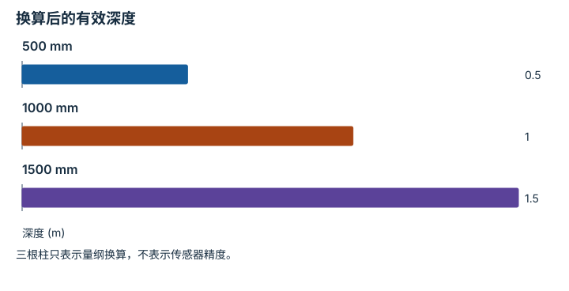

---
hide:
  - navigation
---

<!-- Generated by scripts/build_knowledge_atlas.py; edit knowledge/atlas/*.json. -->

<nav class="study-breadcrumb" aria-label="学习位置" markdown="1">
[知识目录](../../index.md) / [Python、NumPy 与张量形状](../index.md)
</nav>

L0 · 本章第 3 / 4 节

# dtype 和物理单位是两份合同

**Data type and units**

一个整数 1000 可能表示毫米，也可能表示像素。改成浮点数不会自动把毫米换成米。

先确认：这些前置知识我懂了吗？

整数与浮点数

<section class="study-section " markdown="1">

## 1 · 原理拆开看

1. dtype 规定字节如何表示数值；uint16 能保存非负整数，float32 能保存近似实数。
2. 单位来自传感器协议，而非 dtype；本例原始深度每一计数对应 0.001 m。
3. 先转为合适的浮点类型，再乘比例因子，并把无效深度按协议单独标记。

</section>

<section class="study-section " markdown="1">

## 2 · 跟着例子算一遍

1. 教学输入 depth=[500,1000,1500]，dtype=uint16，单位 mm。
2. 转浮点并乘 0.001，得到 [0.5,1.0,1.5] m。
3. 只执行 astype(float32) 仍得到 [500,1000,1500]；若误标为 m，距离将放大 1000 倍。

</section>

<section class="study-section " markdown="1">

## 3 · 对照图，解释变化

<figure class="atlas-visual" tabindex="0" aria-label="换算后的有效深度；窄屏可在图内横向滚动">
<picture>
<source media="(max-width: 600px)" srcset="../../../assets/knowledge-atlas/numpy-dtype-physical-unit-mobile.svg">

</picture>
<figcaption>教学示意，非实测；毫米已转换为米。</figcaption>
</figure>

- 输入数字减少 1000 倍，但描述的物理距离没有改变。
- 柱高不能告诉你深度噪声或量程边界，这些需要额外规格。

查看作图数据，自己复算

图上数值可能为便于阅读而取近似值，以下保留作图输入。

| 项目 | 深度 (m) |
| --- | --- |
| 500 mm | 0.5 |
| 1000 mm | 1 |
| 1500 mm | 1.5 |

</section>

<section class="study-section study-misconception" markdown="1">

## 4 · 避开一个误区

**容易误以为：**浮点深度一定是米。

**为什么不成立：**数值表示与单位换算是独立操作。

**正确理解：**同时保存 dtype、scale、unit、invalid_value；不要凭数字大小猜单位。

</section>

<section class="study-section study-check" markdown="1">

## 5 · 先独立回答

原始 0 被定义为无效深度，可否转换为 0 m 的真实表面？

我已作答，查看推理

不可以；0 乘比例仍为 0，但缺失语义必须由有效性掩码保留，不能创造相机原点上的障碍物。

</section>

继续查阅原始资料

- [NumPy dtype objects](https://numpy.org/doc/stable/reference/arrays.dtypes.html)

<nav class="study-pagination" aria-label="相邻小节" markdown="1">

[← 广播是对齐轴，不是猜测意图](../numpy-broadcast-alignment/index.md)

[切片可能仍共享原始观测 →](../numpy-copy-aliasing/index.md)

</nav>

[返回本章目录](../index.md) · [整章连续阅读](../complete/index.md)

本章最后需要提交什么？

运行课程示例，并解释每个输入输出的形状。

回到[原课程](../../../foundations/01-python-for-robotics.md)完成实践。阅读位置或查看答案不计为通过验收。

