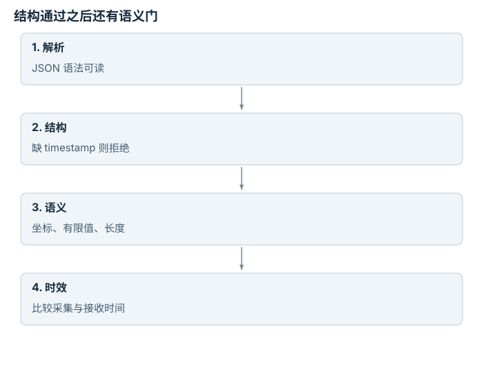
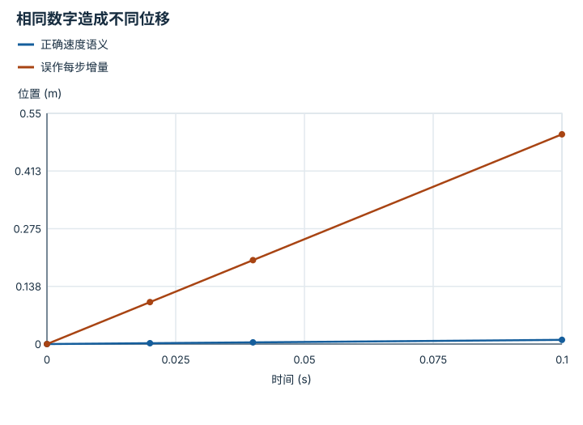
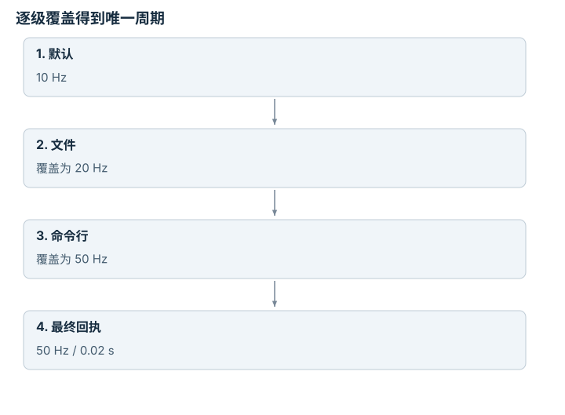
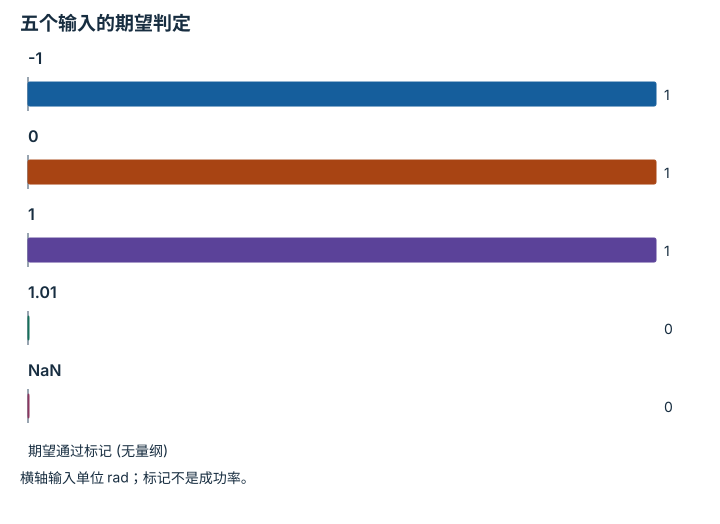

---
search:
  exclude: true
---

# 接口、配置与测试：逐点细解

<!-- Generated by scripts/build_knowledge_atlas.py; edit knowledge/atlas/*.json. -->

[按小节学习](../index.md) · [全部知识点](../../index.md) · [返回原课程](../../../foundations/13-robot-systems-and-safety.md)

Interfaces, configuration, and tests · 本页拆成 **4 个小知识点**。

先阅读直觉和原理，再独立完成算例、自测；图是解释工具，不是已掌握或真机验证的证明。

## 前置知识

[Python、NumPy 与张量形状](../../computing-python-numpy/index.md)

## 本页知识点

1. [接口要拒绝缺字段，而非静默猜值](#contract-required-fields)
2. [动作是位置、增量还是速度](#contract-action-rate)
3. [保存最终配置，不只保存配置文件](#contract-config-resolution)
4. [边界测试要证明错误被挡住](#contract-boundary-tests)

## 1. 接口要拒绝缺字段，而非静默猜值

**Schema validation**

**需要先懂：**字典与数据类型

### 一句话直觉

缺少时间戳的观测看起来仍有图像，但控制器无法判断它是刚拍的还是缓存的。

### 原理拆开看

1. 先定义 required 字段及类型，例如 position、frame、timestamp；数字本身不包含坐标系语义。
2. 解析只证明文本能读懂；schema 再检查字段、类型与禁止的额外键。
3. 跨字段规则仍需业务验证，例如关节名数量必须等于角度数量；失败应返回明确原因并阻断执行。

### 手算或追踪一个例子

1. 教学合同要求 position 有 2 个有限数，frame='world'，timestamp 是秒。
2. 输入 position=[0.2,0.3]、frame='world' 却缺 timestamp，解析成功但合同失败。
3. 补入 timestamp=1.25 后通过结构检查；是否太旧仍需与接收时钟比较。

### 用图理解

<figure class="atlas-visual" tabindex="0" aria-label="结构通过之后还有语义门；窄屏可在图内横向滚动">
<picture>
<source media="(max-width: 600px)" srcset="../../../assets/knowledge-atlas/contract-required-fields-mobile.svg">

</picture>
<figcaption>教学示意，非实测；补齐 timestamp 只完成其中一层。</figcaption>
</figure>

- 原始输入停在第二步，不能因为第一步通过就继续控制。
- 图只描述验证顺序，不代表已实现独立硬件安全系统。

### 容易混淆的地方

**常见误解：**JSON 能解析就可以执行。

**为什么不成立：**合法语法不保证字段齐全、单位正确或时间新鲜。

**正确理解：**把语法、结构、语义和运行时安全检查分层。

### 自测

position 长度正确但含 NaN，能否只检查 shape？

展开答案与推理

不能；还要检查有限性。否则 NaN 可能传播到距离、限幅和执行指令中。

**原始资料：**[JSON Schema object validation](https://json-schema.org/understanding-json-schema/reference/object)

## 2. 动作是位置、增量还是速度

**Action semantics and rate**

**需要先懂：**单位换算、采样周期

### 一句话直觉

同一个 0.1 如果被当作米、米每秒或每步位移，会让机器人走出完全不同的路。

### 原理拆开看

1. 先声明动作语义和坐标：本例是在世界 x 轴上的恒定速度 0.1 m/s。
2. 离散周期 Δt=0.02 s，则每步位移是速度乘时间，即 0.002 m。
3. 若执行器接口接收位置，适配层累计增量；若它接收速度，就不能再重复积分。

### 手算或追踪一个例子

1. 教学输入起点 x=0，速度 0.1 m/s，执行 5 步，每步 0.02 s。
2. 总时长 0.1 s；正确位置为 0.1×0.1=0.01 m。
3. 若每步把 0.1 当作位置增量，5 步会得到 0.5 m，偏大 50 倍。

### 用图理解

<figure class="atlas-visual" tabindex="0" aria-label="相同数字造成不同位移；窄屏可在图内横向滚动">
<picture>
<source media="(max-width: 600px)" srcset="../../../assets/knowledge-atlas/contract-action-rate-mobile.svg">

</picture>
<figcaption>教学示意，非实测；按恒速离散模型连接采样点。</figcaption>
</figure>

- 两条线斜率的差来自单位误解，不是不同策略能力。
- 此图忽略加速度和执行器动态，不能直接作为运动许可。

查看作图数据，自己复算

图上数值可能为便于阅读而取近似值，以下保留作图输入。线段的含义以本图图注和读图说明为准，不应自行解释为实测连续轨迹。

| 曲线 | 时间 (s) | 位置 (m) |
| --- | --- | --- |
| 正确速度语义 | 0 | 0 |
| 正确速度语义 | 0.02 | 0.002 |
| 正确速度语义 | 0.04 | 0.004 |
| 正确速度语义 | 0.1 | 0.01 |
| 误作每步增量 | 0 | 0 |
| 误作每步增量 | 0.02 | 0.1 |
| 误作每步增量 | 0.04 | 0.2 |
| 误作每步增量 | 0.1 | 0.5 |

### 容易混淆的地方

**常见误解：**动作数值一致就能跨控制频率复用。

**为什么不成立：**每步增量隐含周期，速度则需要显式乘周期。

**正确理解：**在合同中写清语义、单位、frame、频率及积分责任。

### 自测

频率改成 100 Hz，保持速度不变，每步增量是多少？

展开答案与推理

周期变为 0.01 s，所以每步为 0.001 m；不是仍然 0.002 m，否则速度会翻倍。

**原始资料：**[Modern Robotics: control system overview](https://modernrobotics.northwestern.edu/nu-gm-book-resource/11-1-control-system-overview/)

## 3. 保存最终配置，不只保存配置文件

**Resolved configuration**

**需要先懂：**字典与函数参数

### 一句话直觉

文件中写 20 Hz，实际运行却是 50 Hz，常常因为命令行覆盖了配置而日志没记录。

### 原理拆开看

1. 先规定覆盖顺序，本例是默认值→配置文件→命令行；这是应用合同，不是 Python 自动保证。
2. 相同键按优先级覆盖，得到唯一 resolved configuration。
3. 在初始化前验证最终值，再连同运行产物保存，避免只留下被覆盖的旧值。

### 手算或追踪一个例子

1. 教学默认 rate=10 Hz，文件设 rate=20 Hz，命令行设 rate=50 Hz。
2. 依次合并后最终 rate=50 Hz，对应周期 0.02 s。
3. 回执应保存 50 Hz 及覆盖来源；仅抄文件的 20 Hz 会把周期错记为 0.05 s。

### 用图理解

<figure class="atlas-visual" tabindex="0" aria-label="逐级覆盖得到唯一周期；窄屏可在图内横向滚动">
<picture>
<source media="(max-width: 600px)" srcset="../../../assets/knowledge-atlas/contract-config-resolution-mobile.svg">

</picture>
<figcaption>教学示意，非实测；优先级为本例自行规定。</figcaption>
</figure>

- 箭头表示覆盖顺序，不是四个同时工作的控制器。
- 其他项目可能使用不同优先级，必须查看其配置合同。

### 容易混淆的地方

**常见误解：**保存了 YAML 就保存了真实实验设置。

**为什么不成立：**环境变量、默认值和命令行仍可能修改最终参数。

**正确理解：**保存解析后的完整配置，同时保留原配置来源。

### 自测

最终 rate=0 Hz 时，是否应先创建控制循环再处理？

展开答案与推理

不应。初始化前拒绝非法频率，避免计算 1/rate 或进入没有定义的周期。

**原始资料：**[Python argparse](https://docs.python.org/3/library/argparse.html)

## 4. 边界测试要证明错误被挡住

**Boundary and negative tests**

**需要先懂：**条件判断、断言

### 一句话直觉

测试一个正常角度能通过，不能说明越界、NaN 或错误单位会被拒绝。

### 原理拆开看

1. 把规则写成可检查谓词：本例角度必须有限且落在闭区间 [-1,1] rad。
2. 选择内部、两端、刚越界和非有限输入，各自给出预期通过或拒绝。
3. 参数化测试逐例比对；异常应发生在发送动作之前，不能只在日志里报警。

### 手算或追踪一个例子

1. 教学输入分别为 -1、0、1、1.01 rad 及 NaN。
2. 有限性和上下界检查使前三个通过，后两个拒绝。
3. 预期结果为 [1,1,1,0,0]；若 1 被拒绝，则实现误用了开区间。

### 用图理解

<figure class="atlas-visual" tabindex="0" aria-label="五个输入的期望判定；窄屏可在图内横向滚动">
<picture>
<source media="(max-width: 600px)" srcset="../../../assets/knowledge-atlas/contract-boundary-tests-mobile.svg">

</picture>
<figcaption>教学示意，非实测；1=通过、0=拒绝。</figcaption>
</figure>

- 端点通过体现闭区间，1.01 被拒绝体现越界检查。
- 这些例子只能证明指定输入行为，不能覆盖所有物理风险。

查看作图数据，自己复算

图上数值可能为便于阅读而取近似值，以下保留作图输入。

| 项目 | 期望通过标记 (无量纲) |
| --- | --- |
| -1 | 1 |
| 0 | 1 |
| 1 | 1 |
| 1.01 | 0 |
| NaN | 0 |

### 容易混淆的地方

**常见误解：**覆盖率 100% 就证明安全。

**为什么不成立：**执行过分支不等于检查了所有语义、异常组合和硬件失效。

**正确理解：**明确测试保护哪条合同，并把单元测试与系统安全证据分开。

### 自测

只写 abs(q)>1 时拒绝，能可靠拦截 NaN 吗？

展开答案与推理

不能；与 NaN 的普通大小比较通常为假，所以还必须显式检查有限性。

**原始资料：**[pytest parametrization](https://docs.pytest.org/en/stable/how-to/parametrize.html)

## 从理解走向证据

本节点原有验收要求：验证一个协议，并演示非法输入被拒绝。

完成图解自测后，回到[原课程](../../../foundations/13-robot-systems-and-safety.md)运行对应示例并保留证据；浏览页面和查看答案不会自动获得课程晋级。
