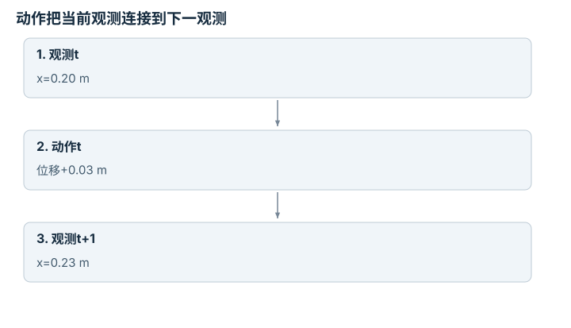
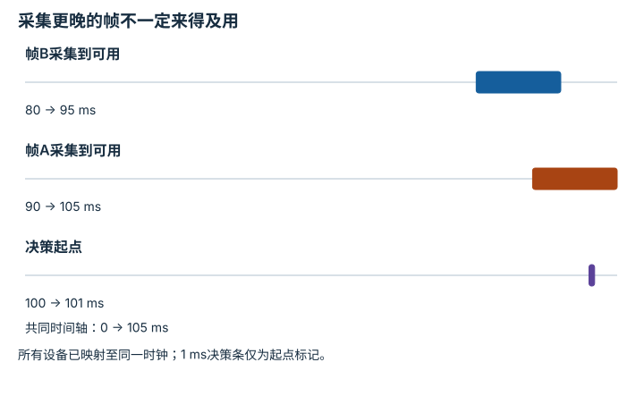

---
search:
  exclude: true
---

# Episode 协议与多模态对齐：逐点细解

<!-- Generated by scripts/build_knowledge_atlas.py; edit knowledge/atlas/*.json. -->

[按小节学习](../index.md) · [全部知识点](../../index.md) · [返回原课程](../../../foundations/10-dataset-and-training.md)

Episode schema and multimodal alignment · 本页拆成 **4 个小知识点**。

先阅读直觉和原理，再独立完成算例、自测；图是解释工具，不是已掌握或真机验证的证明。

## 前置知识

[标定与时间同步](../../system-calibration-synchronization/index.md) → [接口、配置与测试](../../computing-software-contracts/index.md)

## 改一个参数试试看

区分观测采样、数据可用、推理结束与执行时刻，再检查自己的 episode 字段。

[打开对应交互实验](../../../learning-lab-cn.md#timing)。滑块在文档站运行，GitHub 文件预览提供静态推导；不连接机器人。

## 本页知识点

1. [转移记录：动作作用在哪两个状态之间](#episode-transition-schema)
2. [多模态对齐：对的是采样时刻而非文件序号](#episode-timestamp-alignment)
3. [因果对齐：训练时也不能偷看未来](#episode-causal-alignment)
4. [终止与截断：回合结束为什么不同](#episode-termination-truncation)

## 1. 转移记录：动作作用在哪两个状态之间

**Transition schema**

**需要先懂：**离散时间、观测与动作

### 一句话直觉

一行数组若没说明时间关系，很容易把上一条动作当成下一条动作的标签。

### 原理拆开看

1. 教学转移记录包含observation_t、action_t、reward_t和observation_t+1，并另存终止标记。
2. action_t在observation_t可用之后发出，影响后续状态；reward索引须在数据协议中明确定义。
3. 同时固定动作维度、单位和坐标系，使加载器能拒绝错位或错维字段。

### 手算或追踪一个例子

1. 教学一维记录位置x_t=0.2 m，动作是位移+0.03 m。
2. 执行后理想位置x_t+1=0.23 m；将这两个位置与同一action_t组成转移。
3. 如果把下一时刻另一个+0.01 m动作写入本行，监督标签与状态转移就不一致。

### 用图理解

<figure class="atlas-visual" tabindex="0" aria-label="动作把当前观测连接到下一观测；窄屏可在图内横向滚动">
<picture>
<source media="(max-width: 600px)" srcset="../../../assets/knowledge-atlas/episode-transition-schema-mobile.svg">

</picture>
<figcaption>理想位移模型的教学转移。</figcaption>
</figure>

- 中间动作对应的是左右这对状态，而非任意相邻行。
- 真实执行误差存在时，下一状态不必等于动作的简单相加。

### 容易混淆的地方

**常见误解：**每个字段长度一样，时间就一定对齐。

**为什么不成立：**整体平移一行仍有相同长度，但含义已经错位。

**正确理解：**用时间戳和可检查的转移算例验证协议。

### 自测

一个含10条转移的无重叠episode通常需要多少个状态端点？

展开答案与推理

需要11个连续状态端点；若采用逐行存前后观测，会有重复存储，但时间关系不变。

**原始资料：**[Gymnasium Env: step return values](https://gymnasium.farama.org/api/env/#gymnasium.Env.step)

## 2. 多模态对齐：对的是采样时刻而非文件序号

**Multimodal timestamp alignment**

**需要先懂：**时间戳、插值

### 一句话直觉

相机30 Hz、关节传感器100 Hz时，第10帧和第10条关节记录不是同一时刻。

### 原理拆开看

1. 保留采集时间与接收时间，先确认多个设备是否使用同一时钟或已校正时钟偏差。
2. 将关节状态插值到目标图像采样时刻，需明确所用信号适合怎样的插值。
3. 插值只能补齐已有时间样本，不能恢复漏失的高速接触事件。

### 手算或追踪一个例子

1. 教学关节样本在0 ms为0 rad、10 ms为0.1 rad；图像采集于6 ms。
2. 线性插值权重为6/10=0.6，得到对应角度0.06 rad。
3. 若图像20 ms才到达，仍应保留6 ms采集时刻，不能拿20 ms状态冒充同时观测。

### 用图理解

<figure class="atlas-visual" tabindex="0" aria-label="把关节状态插值到图像时刻；窄屏可在图内横向滚动">
<picture>
<source media="(max-width: 600px)" srcset="../../../assets/knowledge-atlas/episode-timestamp-alignment-mobile.svg">

</picture>
<figcaption>教学线性变化假设，不适用于任意冲击信号。</figcaption>
</figure>

- 插值点位于两个已知采样之间，与6 ms图像对应。
- 连线是线性假设，不是对真实关节连续轨迹的完整观测。

查看作图数据，自己复算

图上数值可能为便于阅读而取近似值，以下保留作图输入。线段的含义以本图图注和读图说明为准，不应自行解释为实测连续轨迹。

| 曲线 | 采集时间（ms） | 关节角（rad） |
| --- | --- | --- |
| 已知关节样本 | 0 | 0 |
| 已知关节样本 | 10 | 0.1 |
| 6 ms插值点 | 6 | 0.06 |
| 6 ms插值点 | 6 | 0.06 |

### 容易混淆的地方

**常见误解：**把所有设备接收时间写成当前时间就完成同步。

**为什么不成立：**传输延迟不同会隐藏真实采样差。

**正确理解：**分别记录采集、接收、对齐规则及误差。

### 自测

若两个时钟相差5 ms，直接插值能修复吗？

展开答案与推理

不能；应先处理时钟偏差，否则插值目标本身就错了。

**原始资料：**[ROS 2 message_filters: Approximate Time Synchronizer](https://docs.ros.org/en/rolling/p/message_filters/doc/Tutorials/Approximate-Synchronizer-Python.html)

## 3. 因果对齐：训练时也不能偷看未来

**Causal observation alignment**

**需要先懂：**采集与接收时间、策略推理

### 一句话直觉

离线文件包含整个未来，部署策略却只能使用当时已经到达的观测。

### 原理拆开看

1. 对每个决策时刻，区分传感器何时采集与何时可供策略使用。
2. 即使某帧采集早于动作，若当时尚未到达，也不能当作在线可见输入。
3. 离线构造训练对时复现可用信息集合，未来动作标签可以用于监督，但未来观测不能混入因果输入。

### 手算或追踪一个例子

1. 教学决策在100 ms开始；帧A采集90 ms、到达105 ms，帧B采集80 ms、到达95 ms。
2. 100 ms时A尚不可用，B已经可用。
3. 选择B作为当时输入；用A会获得部署时不存在的额外信息。

### 用图理解

<figure class="atlas-visual" tabindex="0" aria-label="采集更晚的帧不一定来得及用；窄屏可在图内横向滚动">
<picture>
<source media="(max-width: 600px)" srcset="../../../assets/knowledge-atlas/episode-causal-alignment-mobile.svg">

</picture>
<figcaption>教学消息延迟时间轴。</figcaption>
</figure>

- 比较每条观测的结束时刻与100 ms决策起点。
- 时间轴不说明图像内容质量，较旧可用帧仍可能不够及时。

查看作图数据，自己复算

图上数值可能为便于阅读而取近似值，以下保留作图输入。

| 事件 | 开始 (ms) | 结束 (ms) |
| --- | --- | --- |
| 帧B采集到可用 | 80 | 95 |
| 帧A采集到可用 | 90 | 105 |
| 决策起点 | 100 | 101 |

### 容易混淆的地方

**常见误解：**只要图像时间戳比动作早，就不会泄漏。

**为什么不成立：**时间戳可能是采集时间，而策略受实际到达时间约束。

**正确理解：**按真实链路定义可用时刻，并保留因果性审计。

### 自测

训练标签包含之后4步动作是否必然是未来泄漏？

展开答案与推理

不是；预测未来动作是合法监督目标。问题在于输入包含部署时不可获得的未来信息。

**原始资料：**[ROS 2 Design: Real-time Programming](https://design.ros2.org/articles/realtime_background.html)

## 4. 终止与截断：回合结束为什么不同

**Termination versus truncation**

**需要先懂：**episode、价值估计

### 一句话直觉

任务已经结束与只是评估预算耗尽不同，后续是否还有价值会影响学习目标。

### 原理拆开看

1. terminated表示MDP定义的终止事件，truncated表示任务之外的时间或资源截断。
2. 对继续任务的时间截断，价值目标通常保留下一状态bootstrap；真实终止则去掉。
3. 若时间上限本身属于有限时域任务，应将剩余时间纳入状态并按任务定义终止，而非机械套用规则。

### 手算或追踪一个例子

1. 教学r=1、折扣γ=0.9、下一状态估值V=5，奖励按无量纲教学分数。
2. 非终止或外部时间截断目标为1+0.9×5=5.5。
3. 真正终止的目标为1；把两个结束标记合并会错误地丢失4.5的bootstrap项。

### 用图理解

<figure class="atlas-visual" tabindex="0" aria-label="两类结束产生不同学习目标；窄屏可在图内横向滚动">
<picture>
<source media="(max-width: 600px)" srcset="../../../assets/knowledge-atlas/episode-termination-truncation-mobile.svg">

</picture>
<figcaption>固定r、γ与下一状态估值的教学比较。</figcaption>
</figure>

- 差值来自是否保留下一状态的估计价值。
- 图不代表截断回合实际获得了额外奖励。

查看作图数据，自己复算

图上数值可能为便于阅读而取近似值，以下保留作图输入。

| 项目 | 价值目标（教学奖励分） |
| --- | --- |
| 真正终止 | 1 |
| 外部截断 | 5.5 |

### 容易混淆的地方

**常见误解：**done=true时总把下一状态价值设为零。

**为什么不成立：**done可能把两种结束原因混在一起。

**正确理解：**存储并使用terminated与truncated的独立语义。

### 自测

任务明确规定30步内完成，时间耗尽是任务结果的一部分时怎么办？

展开答案与推理

按有限时域任务建模，包含剩余时间；不能把它无条件当作外部截断继续bootstrap。

**原始资料：**[Gymnasium: Handling Time Limits](https://gymnasium.farama.org/tutorials/gymnasium_basics/handling_time_limits/)

## 从理解走向证据

本节点原有验收要求：验证一条 episode，并拒绝缺失、错位或不兼容字段。

完成图解自测后，回到[原课程](../../../foundations/10-dataset-and-training.md)运行对应示例并保留证据；浏览页面和查看答案不会自动获得课程晋级。
