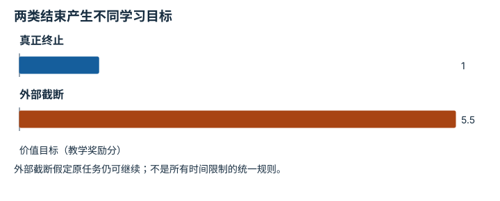

---
hide:
  - navigation
---

<!-- Generated by scripts/build_knowledge_atlas.py; edit knowledge/atlas/*.json. -->

<nav class="study-breadcrumb" aria-label="学习位置" markdown="1">
[知识目录](../../index.md) / [Episode 协议与多模态对齐](../index.md)
</nav>

L3 · 本章第 4 / 4 节

# 终止与截断：回合结束为什么不同

**Termination versus truncation**

任务已经结束与只是评估预算耗尽不同，后续是否还有价值会影响学习目标。

先确认：这些前置知识我懂了吗？

episode、价值估计

[标定与时间同步](../../system-calibration-synchronization/index.md) · [接口、配置与测试](../../computing-software-contracts/index.md)

<section class="study-section " markdown="1">

## 1 · 原理拆开看

1. terminated表示MDP定义的终止事件，truncated表示任务之外的时间或资源截断。
2. 对继续任务的时间截断，价值目标通常保留下一状态bootstrap；真实终止则去掉。
3. 若时间上限本身属于有限时域任务，应将剩余时间纳入状态并按任务定义终止，而非机械套用规则。

</section>

<section class="study-section " markdown="1">

## 2 · 跟着例子算一遍

1. 教学r=1、折扣γ=0.9、下一状态估值V=5，奖励按无量纲教学分数。
2. 非终止或外部时间截断目标为1+0.9×5=5.5。
3. 真正终止的目标为1；把两个结束标记合并会错误地丢失4.5的bootstrap项。

</section>

<section class="study-section " markdown="1">

## 3 · 对照图，解释变化

<figure class="atlas-visual" tabindex="0" aria-label="两类结束产生不同学习目标；窄屏可在图内横向滚动">
<picture>
<source media="(max-width: 600px)" srcset="../../../assets/knowledge-atlas/episode-termination-truncation-mobile.svg">

</picture>
<figcaption>固定r、γ与下一状态估值的教学比较。</figcaption>
</figure>

- 差值来自是否保留下一状态的估计价值。
- 图不代表截断回合实际获得了额外奖励。

查看作图数据，自己复算

图上数值可能为便于阅读而取近似值，以下保留作图输入。

| 项目 | 价值目标（教学奖励分） |
| --- | --- |
| 真正终止 | 1 |
| 外部截断 | 5.5 |

</section>

<section class="study-section study-misconception" markdown="1">

## 4 · 避开一个误区

**容易误以为：**done=true时总把下一状态价值设为零。

**为什么不成立：**done可能把两种结束原因混在一起。

**正确理解：**存储并使用terminated与truncated的独立语义。

</section>

<section class="study-section study-check" markdown="1">

## 5 · 先独立回答

任务明确规定30步内完成，时间耗尽是任务结果的一部分时怎么办？

我已作答，查看推理

按有限时域任务建模，包含剩余时间；不能把它无条件当作外部截断继续bootstrap。

</section>

继续查阅原始资料

- [Gymnasium: Handling Time Limits](https://gymnasium.farama.org/tutorials/gymnasium_basics/handling_time_limits/)

<nav class="study-pagination" aria-label="相邻小节" markdown="1">

[← 因果对齐：训练时也不能偷看未来](../episode-causal-alignment/index.md)

[回原课程动手验证 →](../../../foundations/10-dataset-and-training.md)

</nav>

[返回本章目录](../index.md) · [整章连续阅读](../complete/index.md)

本章最后需要提交什么？

验证一条 episode，并拒绝缺失、错位或不兼容字段。

回到[原课程](../../../foundations/10-dataset-and-training.md)完成实践。阅读位置或查看答案不计为通过验收。

