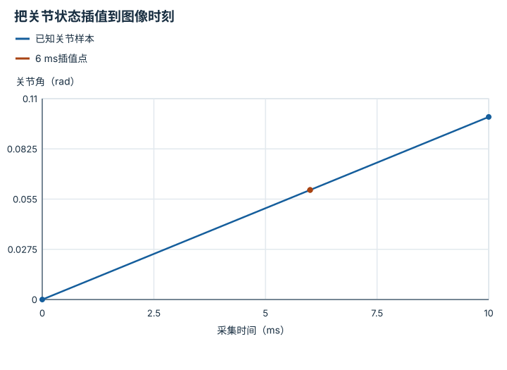

---
hide:
  - navigation
---

<!-- Generated by scripts/build_knowledge_atlas.py; edit knowledge/atlas/*.json. -->

<nav class="study-breadcrumb" aria-label="学习位置" markdown="1">
[知识目录](../../index.md) / [Episode 协议与多模态对齐](../index.md)
</nav>

L3 · 本章第 2 / 4 节

# 多模态对齐：对的是采样时刻而非文件序号

**Multimodal timestamp alignment**

相机30 Hz、关节传感器100 Hz时，第10帧和第10条关节记录不是同一时刻。

先确认：这些前置知识我懂了吗？

时间戳、插值

[标定与时间同步](../../system-calibration-synchronization/index.md) · [接口、配置与测试](../../computing-software-contracts/index.md)

<section class="study-section " markdown="1">

## 1 · 原理拆开看

1. 保留采集时间与接收时间，先确认多个设备是否使用同一时钟或已校正时钟偏差。
2. 将关节状态插值到目标图像采样时刻，需明确所用信号适合怎样的插值。
3. 插值只能补齐已有时间样本，不能恢复漏失的高速接触事件。

</section>

<section class="study-section " markdown="1">

## 2 · 跟着例子算一遍

1. 教学关节样本在0 ms为0 rad、10 ms为0.1 rad；图像采集于6 ms。
2. 线性插值权重为6/10=0.6，得到对应角度0.06 rad。
3. 若图像20 ms才到达，仍应保留6 ms采集时刻，不能拿20 ms状态冒充同时观测。

</section>

<section class="study-section " markdown="1">

## 3 · 对照图，解释变化

<figure class="atlas-visual" tabindex="0" aria-label="把关节状态插值到图像时刻；窄屏可在图内横向滚动">
<picture>
<source media="(max-width: 600px)" srcset="../../../assets/knowledge-atlas/episode-timestamp-alignment-mobile.svg">

</picture>
<figcaption>教学线性变化假设，不适用于任意冲击信号。</figcaption>
</figure>

- 插值点位于两个已知采样之间，与6 ms图像对应。
- 连线是线性假设，不是对真实关节连续轨迹的完整观测。

查看作图数据，自己复算

图上数值可能为便于阅读而取近似值，以下保留作图输入。线段的含义以本图图注和读图说明为准，不应自行解释为实测连续轨迹。

| 曲线 | 采集时间（ms） | 关节角（rad） |
| --- | --- | --- |
| 已知关节样本 | 0 | 0 |
| 已知关节样本 | 10 | 0.1 |
| 6 ms插值点 | 6 | 0.06 |
| 6 ms插值点 | 6 | 0.06 |

</section>

<section class="study-section study-misconception" markdown="1">

## 4 · 避开一个误区

**容易误以为：**把所有设备接收时间写成当前时间就完成同步。

**为什么不成立：**传输延迟不同会隐藏真实采样差。

**正确理解：**分别记录采集、接收、对齐规则及误差。

</section>

<section class="study-section study-check" markdown="1">

## 5 · 先独立回答

若两个时钟相差5 ms，直接插值能修复吗？

我已作答，查看推理

不能；应先处理时钟偏差，否则插值目标本身就错了。

</section>

继续查阅原始资料

- [ROS 2 message_filters: Approximate Time Synchronizer](https://docs.ros.org/en/rolling/p/message_filters/doc/Tutorials/Approximate-Synchronizer-Python.html)

<nav class="study-pagination" aria-label="相邻小节" markdown="1">

[← 转移记录：动作作用在哪两个状态之间](../episode-transition-schema/index.md)

[因果对齐：训练时也不能偷看未来 →](../episode-causal-alignment/index.md)

</nav>

[返回本章目录](../index.md) · [整章连续阅读](../complete/index.md)

本章最后需要提交什么？

验证一条 episode，并拒绝缺失、错位或不兼容字段。

回到[原课程](../../../foundations/10-dataset-and-training.md)完成实践。阅读位置或查看答案不计为通过验收。

