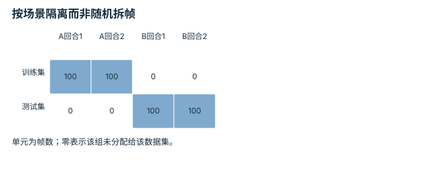
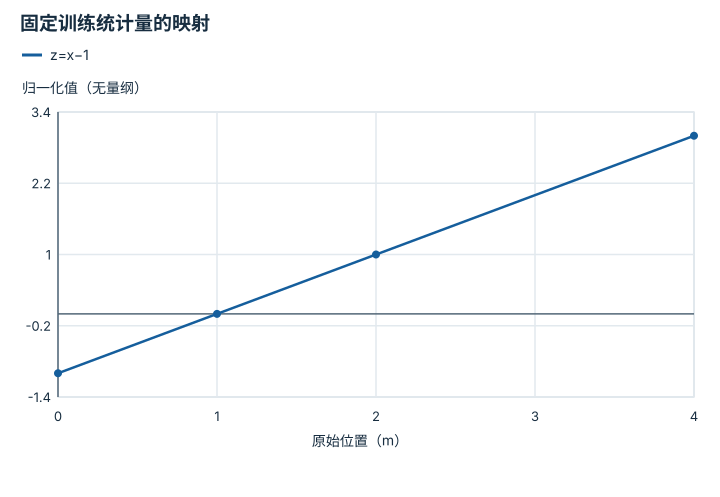
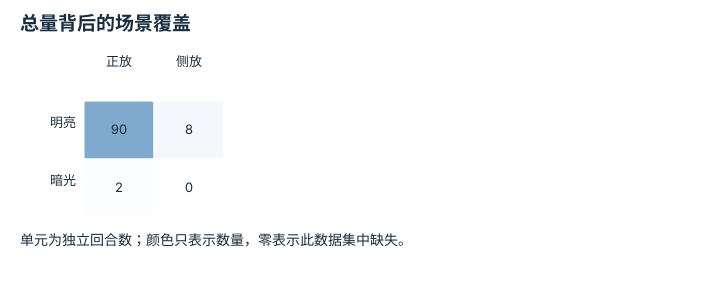
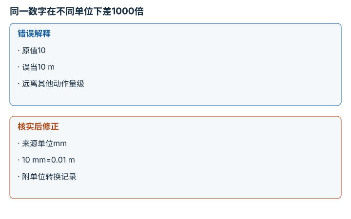

---
search:
  exclude: true
---

# 数据质量、覆盖与无泄漏切分：逐点细解

<!-- Generated by scripts/build_knowledge_atlas.py; edit knowledge/atlas/*.json. -->

[按小节学习](../index.md) · [全部知识点](../../index.md) · [返回原课程](../../../foundations/10-dataset-and-training.md)

Data quality, coverage, and leakage-free splits · 本页拆成 **4 个小知识点**。

先阅读直觉和原理，再独立完成算例、自测；图是解释工具，不是已掌握或真机验证的证明。

## 前置知识

[Episode 协议与多模态对齐](../../data-episode-schema/index.md) → [概率、估计与不确定性](../../math-probability-statistics/index.md)

## 本页知识点

1. [切分单位：相邻帧不能伪装成独立测试](#data-grouped-splits)
2. [归一化统计：只能从训练集学习](#data-train-only-normalization)
3. [覆盖与数量：一千段相似视频缺少什么](#data-coverage-versus-count)
4. [质量门槛：异常不应静默混入训练](#data-quality-validation)

## 1. 切分单位：相邻帧不能伪装成独立测试

**Grouped data splits**

**需要先懂：**episode、泛化

### 一句话直觉

同一段演示相邻帧几乎相同，随机按帧切分会让测试集包含训练画面的近似副本。

### 原理拆开看

1. 先定义希望泛化到什么：新episode、新场景、新物体还是新操作者。
2. 以对应group为单位切分，避免同组近重复样本跨越训练与测试。
3. 保存group清单和切分版本，调参与最终报告使用不同数据角色。

### 手算或追踪一个例子

1. 教学数据有场景A两回合、场景B两回合，每回合100帧。
2. 若目标是跨场景，训练使用A的200帧，测试使用B的200帧。
3. 按帧随机各取200帧虽然数量相同，却不再测量未见场景泛化。

### 用图理解

<figure class="atlas-visual" tabindex="0" aria-label="按场景隔离而非随机拆帧；窄屏可在图内横向滚动">
<picture>
<source media="(max-width: 600px)" srcset="../../../assets/knowledge-atlas/data-grouped-splits-mobile.svg">

</picture>
<figcaption>教学数据分配表。</figcaption>
</figure>

- 同一场景的回合全部位于同一侧。
- 该表没有验证图像重复或标注质量，仍需额外检查。

查看作图数据，自己复算

图上数值可能为便于阅读而取近似值，以下保留作图输入。

| 行 / 列 | A回合1 | A回合2 | B回合1 | B回合2 |
| --- | --- | --- | --- | --- |
| 训练集 | 100 | 100 | 0 | 0 |
| 测试集 | 0 | 0 | 100 | 100 |

### 容易混淆的地方

**常见误解：**测试样本索引不同就没有泄漏。

**为什么不成立：**不同索引仍可能共享轨迹、背景或重复图像。

**正确理解：**按研究问题确定隔离层级，并做重复与溯源检查。

### 自测

只按episode切分，能直接声称跨物体类别泛化吗？

展开答案与推理

不能；相同类别甚至同一物体可能同时出现在两侧，需另做类别隔离评估。

**原始资料：**[scikit-learn: GroupKFold](https://scikit-learn.org/stable/modules/generated/sklearn.model_selection.GroupKFold.html)

## 2. 归一化统计：只能从训练集学习

**Train-only normalization**

**需要先懂：**均值与标准差、数据切分

### 一句话直觉

测试集均值看似只是一个数，也会把未来分布信息提前透露给训练流程。

### 原理拆开看

1. 先切分数据，再仅用训练部分计算均值μ和标准差σ。
2. 训练、验证与测试统一使用z=(x−μ)/σ；σ接近零时需要显式数值处理规则。
3. 将统计量与模型版本一起保存，部署用同一变换并在需要时正确反归一化。

### 手算或追踪一个例子

1. 教学训练位置为0和2 m，采用总体标准差得到μ=1 m、σ=1 m。
2. 训练值映射成−1和1；测试位置4 m映射成3。
3. 测试值超出训练归一化范围不是应重算μ的理由，而是分布差异信号。

### 用图理解

<figure class="atlas-visual" tabindex="0" aria-label="固定训练统计量的映射；窄屏可在图内横向滚动">
<picture>
<source media="(max-width: 600px)" srcset="../../../assets/knowledge-atlas/data-train-only-normalization-mobile.svg">

</picture>
<figcaption>μ=1 m、σ=1 m的教学线性变换。</figcaption>
</figure>

- 测试位置4 m仍使用相同直线而不是另建一条映射。
- 归一化不把未见输入变成已见数据，也不保证泛化。

查看作图数据，自己复算

图上数值可能为便于阅读而取近似值，以下保留作图输入。线段的含义以本图图注和读图说明为准，不应自行解释为实测连续轨迹。

| 曲线 | 原始位置（m） | 归一化值（无量纲） |
| --- | --- | --- |
| z=x−1 | 0 | -1 |
| z=x−1 | 1 | 0 |
| z=x−1 | 2 | 1 |
| z=x−1 | 4 | 3 |

### 容易混淆的地方

**常见误解：**每个测试批次重新归一化会更公平。

**为什么不成立：**这改变了模型输入含义，并使用测试分布信息。

**正确理解：**按训练时约定的统计量与部署协议处理。

### 自测

模型预测归一化位置z=0.5，原始位置是多少？

展开答案与推理

x=zσ+μ=1.5 m，必须使用同一套μ和σ。

**原始资料：**[scikit-learn: Common Pitfalls and Data Leakage](https://scikit-learn.org/stable/common_pitfalls.html)

## 3. 覆盖与数量：一千段相似视频缺少什么

**Coverage versus sample count**

**需要先懂：**场景分层、数据统计

### 一句话直觉

更多重复样本不一定补上关键失败状态，需要查看任务条件的覆盖。

### 原理拆开看

1. 选定与任务相关的分层维度，如光照、物体朝向和接触阶段。
2. 统计每层独立episode数量，而不只看总帧数。
3. 寻找空白或稀少组合，并按真实目标分布决定补采或分层评估。

### 手算或追踪一个例子

1. 教学四类场景回合数为明亮正放90、明亮侧放8、暗光正放2、暗光侧放0。
2. 总数100回合，但暗光侧放完全未覆盖。
3. 再添加100个明亮正放回合会把总数翻倍，却仍保留同一个零覆盖单元。

### 用图理解

<figure class="atlas-visual" tabindex="0" aria-label="总量背后的场景覆盖；窄屏可在图内横向滚动">
<picture>
<source media="(max-width: 600px)" srcset="../../../assets/knowledge-atlas/data-coverage-versus-count-mobile.svg">

</picture>
<figcaption>教学100回合的分层计数。</figcaption>
</figure>

- 右下角的零不会被左上角的大数量弥补。
- 覆盖计数不能替代演示质量或策略成功率。

查看作图数据，自己复算

图上数值可能为便于阅读而取近似值，以下保留作图输入。

| 行 / 列 | 正放 | 侧放 |
| --- | --- | --- |
| 明亮 | 90 | 8 |
| 暗光 | 2 | 0 |

### 容易混淆的地方

**常见误解：**数据量翻倍就意味着覆盖范围翻倍。

**为什么不成立：**新增样本可能全部来自同一模式。

**正确理解：**同时报告总量、分层覆盖、独立性和任务相关性。

### 自测

零覆盖单元是否必须补成与其他单元一样多？

展开答案与推理

不一定；需要结合目标分布、风险和采集预算，但必须明确空白带来的证据边界。

**原始资料：**[Gebru et al.: Datasheets for Datasets](https://arxiv.org/abs/1803.09010)

## 4. 质量门槛：异常不应静默混入训练

**Data validation and anomaly review**

**需要先懂：**单位、张量形状、时间戳

### 一句话直觉

一个单位错误或错位标签就能制造极大训练梯度，先验证数据比盲目调模型更有效。

### 原理拆开看

1. 验证形状、有限数值、单调时间戳、动作范围及记录完整性。
2. 物理范围检查应依据数据协议；异常样本先隔离并保留原始记录，不能把失败回合一概删除。
3. 报告拒收原因和比例，再区分真实困难情况、传感器故障与单位错误。

### 手算或追踪一个例子

1. 教学动作单位规定m，四条位移为0.01、0.02、10、0.015。
2. 第三条比其他量级大，回查发现它实际是10 mm，正确换算为0.01 m。
3. 记录单位修正与来源；若无法确认，隔离该样本而非猜测裁剪。

### 用图理解

<figure class="atlas-visual" tabindex="0" aria-label="同一数字在不同单位下差1000倍；窄屏可在图内横向滚动">
<picture>
<source media="(max-width: 600px)" srcset="../../../assets/knowledge-atlas/data-quality-validation-mobile.svg">

</picture>
<figcaption>教学记录纠错，保留原始来源。</figcaption>
</figure>

- 先检查单位元数据，再解释异常大小。
- 图只解决已确认的单位错误，不能为其他离群点自动指定处理。

### 容易混淆的地方

**常见误解：**把所有离群点删掉就能得到高质量数据。

**为什么不成立：**离群点可能是重要恢复动作或少见但真实场景。

**正确理解：**先诊断语义和来源，再决定修复、保留或隔离。

### 自测

失败演示有低奖励，是否属于格式无效数据？

展开答案与推理

不是；任务结果与数据有效性不同，合法失败可用于诊断或适当的学习目标。

**原始资料：**[TensorFlow Data Validation: Checking and Analyzing Data](https://www.tensorflow.org/tfx/data_validation/get_started)

## 从理解走向证据

本节点原有验收要求：生成数据说明，并从记录标识复现切分。

完成图解自测后，回到[原课程](../../../foundations/10-dataset-and-training.md)运行对应示例并保留证据；浏览页面和查看答案不会自动获得课程晋级。
