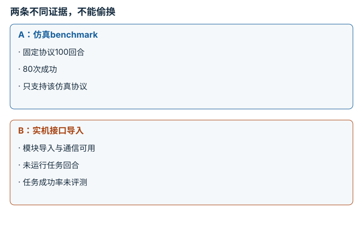
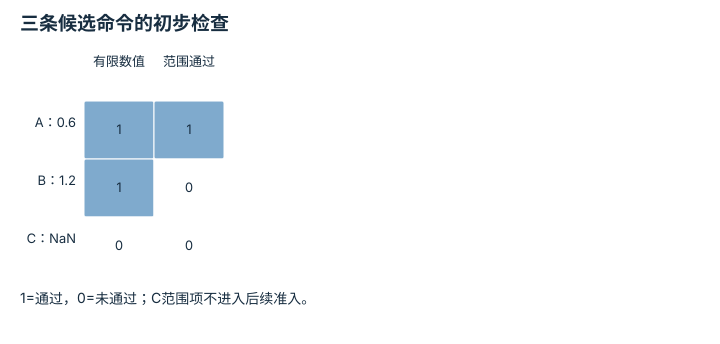
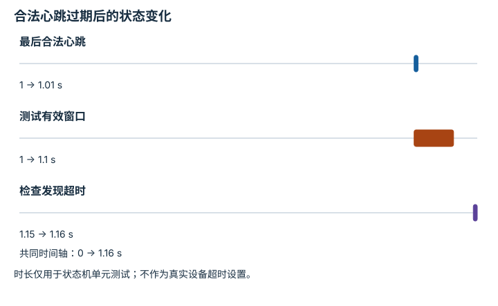
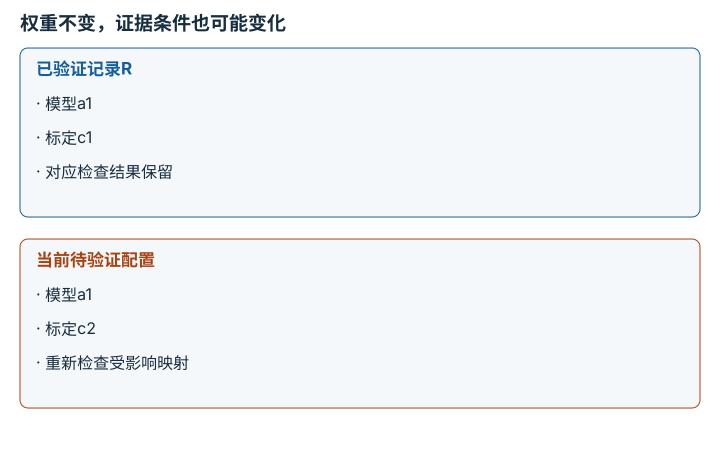

# 硬件证据与运行安全：逐点细解

<!-- Generated by scripts/build_knowledge_atlas.py; edit knowledge/atlas/*.json. -->

[全部知识点](../index.md) · [返回原课程](../../VALIDATION.md)

Hardware evidence and operational safety · 本页拆成 **4 个小知识点**。

先阅读直觉和原理，再独立完成算例、自测；图是解释工具，不是已掌握或真机验证的证明。

## 前置知识

[系统辨识与 Sim-to-Real](../deploy-sim-to-real/index.md) → [力、阻抗与柔顺交互](../system-force-compliance/index.md)

## 本页知识点

1. [运行环境与证据等级不能混成一个标签](#hardware-evidence-axes)
2. [预测命令必须经过独立准入检查](#hardware-command-admission)
3. [看门狗处理的是控制链失联，而不是任务失败](#hardware-watchdog)
4. [模型或标定改变后，旧证据不能自动沿用](#hardware-change-provenance)

## 1. 运行环境与证据等级不能混成一个标签

**Evidence level and execution environment**

**需要先懂：**实验记录、接口测试

### 一句话直觉

在仿真里看到机器人动，与在真实机器人上完成受控评测，不是同一类证据。

### 原理拆开看

1. 证据等级描述验证强度：导入、smoke、确定性测试、冻结协议benchmark及特定硬件报告各有范围。
2. 运行环境另分合成数据、仿真、半实物、影子或物理执行；这条分类轴不能替代评测协议。
3. 声明必须同时指向具体产物和边界；有硬件接入也不自动证明策略任务性能。

### 手算或追踪一个例子

1. 教学记录A：100次仿真回合80成功且协议固定；B：实机接口导入成功，但未发送动作。
2. A可报告该仿真协议下80/100；B只能报告接口可用，实机任务成功率仍未评测。
3. 不能因B包含真实硬件一词，就把它写成比A更强的策略性能证据。

### 用图理解

<figure class="atlas-visual" tabindex="0" aria-label="两条不同证据，不能偷换；窄屏可在图内横向滚动">
<picture>
<source media="(max-width: 600px)" srcset="../../assets/knowledge-atlas/hardware-evidence-axes-mobile.svg">

</picture>
<figcaption>教学报告边界。</figcaption>
</figure>

- A有任务分母，B没有；硬件一词无法补出缺失分母。
- 两者都不能自动获得真实运行安全认证。

### 容易混淆的地方

**常见误解：**连上硬件就属于已验证真机成功。

**为什么不成立：**连接或导入没有产生任务回合和结果。

**正确理解：**分别写环境、验证类型、产物以及不可支持的推断。

### 自测

仿真视频能用来说明真实机器人完成了吗？

展开答案与推理

不能；应标明仿真环境和场景，真实执行需要单独硬件报告与回合证据。

**原始资料：**[本仓库：Validation and Claim Policy](https://github.com/Dld0621/Embodied-AI-Zero-to-Hero/blob/master/docs/VALIDATION.md)

## 2. 预测命令必须经过独立准入检查

**Command admission**

**需要先懂：**接口合同、约束

### 一句话直觉

策略输出只是候选命令，不应直接等同允许硬件执行的命令。

### 原理拆开看

1. 准入层先核查数值有限性、单位、坐标系、时间戳及目标设备身份。
2. 再核查位置、速度、变化率、碰撞与运行模式等设备相关条件，任何必要项失败都需拒绝或走已定义降级。
3. 通过软件准入只是运行链中的一环，还需要硬件限位、急停、操作者和设备专用流程。

### 手算或追踪一个例子

1. 教学纯离线夹具：允许角度[−1,1] rad，命令A=0.6 rad，B=1.2 rad，C=NaN。
2. A通过该范围检查，B超上界0.2 rad被拒绝，C在有限性检查阶段被拒绝。
3. A仍未通过其他准入项目，不能凭这个单项测试触发真实运动。

### 用图理解

<figure class="atlas-visual" tabindex="0" aria-label="三条候选命令的初步检查；窄屏可在图内横向滚动">
<picture>
<source media="(max-width: 600px)" srcset="../../assets/knowledge-atlas/hardware-command-admission-mobile.svg">

</picture>
<figcaption>教学离线接口测试，不连接机器人。</figcaption>
</figure>

- 检查顺序让非法数值在更早阶段停止。
- 矩阵仅覆盖两个项目，全为1也不表示硬件已获运行授权。

查看作图数据，自己复算

图上数值可能为便于阅读而取近似值，以下保留作图输入。

| 行 / 列 | 有限数值 | 范围通过 |
| --- | --- | --- |
| A：0.6 | 1 | 1 |
| B：1.2 | 1 | 0 |
| C：NaN | 0 | 0 |

### 容易混淆的地方

**常见误解：**模型训练时动作有界，部署可以省略检查。

**为什么不成立：**解码错误、异常输入或通信故障都可能产生超界命令。

**正确理解：**把准入与策略分离，并测试明确的拒绝路径。

### 自测

发现超界后静默clip一定合适吗？

展开答案与推理

不是；clip可能破坏动作语义，应根据设备专用合同选择拒绝、限幅或受控降级并记录。

**原始资料：**[本仓库：Validation and Claim Policy](https://github.com/Dld0621/Embodied-AI-Zero-to-Hero/blob/master/docs/VALIDATION.md)

## 3. 看门狗处理的是控制链失联，而不是任务失败

**Watchdog and fail-safe transition**

**需要先懂：**心跳、超时

### 一句话直觉

最后一条前进命令不能在控制程序断联后无限持续。

### 原理拆开看

1. watchdog监测合法更新或心跳的新鲜度，区分正常低速和控制链停止更新。
2. 达到设备专用超时条件时触发已验证的受控停止或降级；不能假设所有机器人失能后都安全。
3. 独立急停和人员流程仍需存在，软件心跳不替代完整风险控制。

### 手算或追踪一个例子

1. 教学离线状态机：最后合法心跳t=1.00 s，测试阈值0.10 s，当前t=1.15 s。
2. 心跳年龄0.15 s，超过阈值0.05 s，应进入超时状态而不是保持执行授权。
3. 测试只验证状态转换；0.10 s不是任何真实机器人的推荐安全参数。

### 用图理解

<figure class="atlas-visual" tabindex="0" aria-label="合法心跳过期后的状态变化；窄屏可在图内横向滚动">
<picture>
<source media="(max-width: 600px)" srcset="../../assets/knowledge-atlas/hardware-watchdog-mobile.svg">

</picture>
<figcaption>教学离线超时测试。</figcaption>
</figure>

- 检查时刻已经超过有效窗口，说明控制权限状态应改变。
- 图不说明实际机械停止时间，停止响应还需设备专用验证。

查看作图数据，自己复算

图上数值可能为便于阅读而取近似值，以下保留作图输入。

| 事件 | 开始 (s) | 结束 (s) |
| --- | --- | --- |
| 最后合法心跳 | 1 | 1.01 |
| 测试有效窗口 | 1 | 1.1 |
| 检查发现超时 | 1.15 | 1.16 |

### 容易混淆的地方

**常见误解：**收到任意网络包就可以刷新watchdog。

**为什么不成立：**无效、重复或过期数据不一定代表控制链健康。

**正确理解：**只接受满足合同的更新，记录触发原因与恢复条件。

### 自测

新的心跳到达后是否应立刻自动恢复运动？

展开答案与推理

不应默认如此；需要设备定义的复位、状态核查和必要人工授权。

**原始资料：**[本仓库：Validation and Claim Policy](https://github.com/Dld0621/Embodied-AI-Zero-to-Hero/blob/master/docs/VALIDATION.md) · [Nav2：Collision Monitor Node](https://docs.nav2.org/rolling/configuration_and_development/configuration_guide/core_servers/collision_monitor/configuring_collision_monitor_node/)

## 4. 模型或标定改变后，旧证据不能自动沿用

**Change control and evidence provenance**

**需要先懂：**版本、校准

### 一句话直觉

昨天的合格测试对应的是昨天那套模型、标定与硬件配置。

### 原理拆开看

1. 每次验证记录模型哈希、代码版本、配置、标定、机器人身份、操作者和异常日志。
2. 当关键配置改变，先分析它影响哪些假设和验证项目，不能只凭文件名相同沿用报告。
3. 按影响范围重新通过相应离线、仿真和设备专用门禁；旧产物保留为历史证据。

### 手算或追踪一个例子

1. 教学记录：报告R对应模型哈希a1、标定c1；今天模型仍a1但相机标定变成c2。
2. 即使权重没有变化，像素到机器人坐标的映射已经改变，原定位与避障验证可能失效。
3. 应保留R并创建新验证记录，明确c2的检查结果，而不是覆盖R日期假装连续有效。

### 用图理解

<figure class="atlas-visual" tabindex="0" aria-label="权重不变，证据条件也可能变化；窄屏可在图内横向滚动">
<picture>
<source media="(max-width: 600px)" srcset="../../assets/knowledge-atlas/hardware-change-provenance-mobile.svg">

</picture>
<figcaption>教学两次配置记录。</figcaption>
</figure>

- 相同模型哈希不能掩盖第二行标定差异。
- 图仅示例两个字段，真实配置指纹还需包含设备、软件和限值等。

### 容易混淆的地方

**常见误解：**代码没有改动，硬件验证就一直有效。

**为什么不成立：**标定、负载、环境和设备配置变化也会改变控制假设。

**正确理解：**按完整配置指纹追溯证据，不仅看代码commit。

### 自测

只改了文档错别字，需要重跑真机吗？

展开答案与推理

通常不需要；应做变更影响分析，避免无关修改触发不必要运动，但不能因此忽略控制相关变更。

**原始资料：**[本仓库：Validation and Claim Policy](https://github.com/Dld0621/Embodied-AI-Zero-to-Hero/blob/master/docs/VALIDATION.md) · [Henderson 等：Deep Reinforcement Learning that Matters](https://arxiv.org/abs/1709.06560)

## 从理解走向证据

本节点原有验收要求：要求授权监督、受限命令、停止路径、日志与任务证据。

完成图解自测后，回到[原课程](../../VALIDATION.md)运行对应示例并保留证据；浏览页面和查看答案不会自动获得课程晋级。
