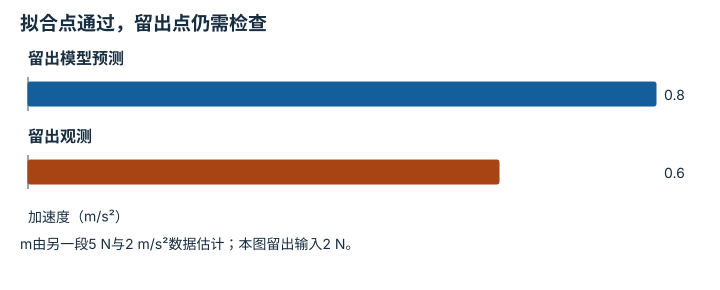
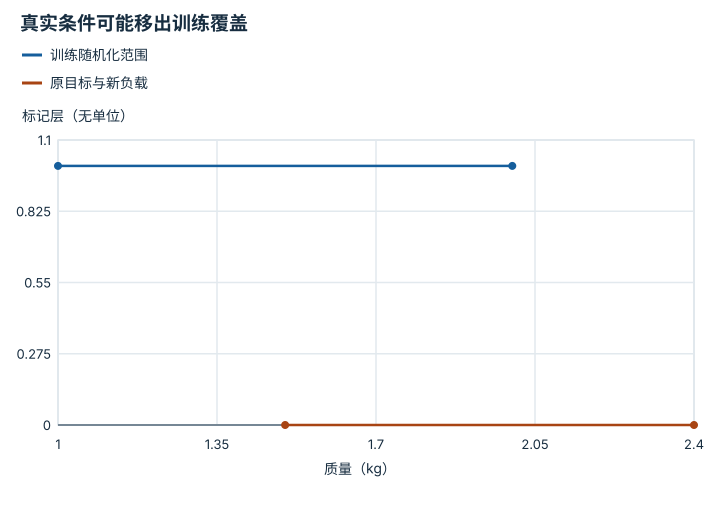
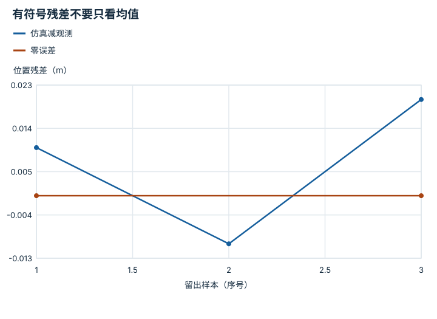

---
search:
  exclude: true
---

# 系统辨识与 Sim-to-Real：逐点细解

<!-- Generated by scripts/build_knowledge_atlas.py; edit knowledge/atlas/*.json. -->

[按小节学习](../index.md) · [全部知识点](../../index.md) · [返回原课程](../../../19-sim-to-real-guide.md)

System identification and Sim-to-Real · 本页拆成 **4 个小知识点**。

先阅读直觉和原理，再独立完成算例、自测；图是解释工具，不是已掌握或真机验证的证明。

## 前置知识

[任务定义、复位、扰动与随机化](../../sim-task-randomization/index.md) → [泛化、鲁棒性与分布偏移](../../eval-generalization-robustness/index.md) → [频率、看门狗、状态机与安全](../../system-realtime-safety/index.md)

## 本页知识点

1. [先估计能解释观测的参数，再调策略](#simreal-identification)
2. [把延迟当动力学参数纳入模型](#simreal-delay-identification)
3. [域随机化是训练分布设计，不是任意加噪](#simreal-domain-randomization)
4. [校准改善要用未参与调参的数据验证](#simreal-residual-validation)

## 1. 先估计能解释观测的参数，再调策略

**System identification**

**需要先懂：**牛顿第二定律、参数估计

### 一句话直觉

仿真中的物体太轻，策略在仿真里学会的用力方式就可能迁移失败。

### 原理拆开看

1. 系统辨识用已知输入与测得输出估计模型参数，必须先声明模型假设。
2. 不同参数可能产生类似输出，需要足够信息区分它们；只改一个参数可能把其他误差吸收进去。
3. 在未参与拟合的轨迹上检验预测残差，避免只对辨识数据拟合得好。

### 手算或追踪一个例子

1. 教学离线数据：忽略摩擦与其他力，水平恒力F=5 N，测得加速度a=2 m/s²。
2. 由F=ma估计m=5/2=2.5 kg；另一段F=2 N时模型预测a=0.8 m/s²。
3. 若留出段实际0.6 m/s²，残差−0.2 m/s²提示模型或参数不完整，不能只宣布质量已准确辨识。

### 用图理解

<figure class="atlas-visual" tabindex="0" aria-label="拟合点通过，留出点仍需检查；窄屏可在图内横向滚动">
<picture>
<source media="(max-width: 600px)" srcset="../../../assets/knowledge-atlas/simreal-identification-mobile.svg">

</picture>
<figcaption>教学加速度预测与留出观测。</figcaption>
</figure>

- 柱差0.2是未参与拟合数据上的预测残差。
- 残差不能单独区分质量、摩擦或测量误差，需要更丰富的验证。

查看作图数据，自己复算

图上数值可能为便于阅读而取近似值，以下保留作图输入。

| 项目 | 加速度（m/s²） |
| --- | --- |
| 留出模型预测 | 0.8 |
| 留出观测 | 0.6 |

### 容易混淆的地方

**常见误解：**单条轨迹拟合误差小就说明物理参数是真值。

**为什么不成立：**参数可能补偿了未建模摩擦、延迟或测量偏差。

**正确理解：**报告模型、可辨识性与独立验证残差。

### 自测

若未知摩擦也参与受力，直接用F/a仍能得到真实质量吗？

展开答案与推理

不能保证；F应是净力，忽略摩擦会把摩擦影响混入质量估计。

**原始资料：**[Sim-to-Real：Learning Agile Locomotion 原论文](https://arxiv.org/abs/1804.10332)

## 2. 把延迟当动力学参数纳入模型

**Delay identification**

**需要先懂：**时间戳、采样周期

### 一句话直觉

命令方向是对的，但到达时已经过时，也会使控制失效。

### 原理拆开看

1. 先定义要辨识的延迟段，例如命令发送到被测响应开始，而不是混用求解耗时。
2. 在共同时间基准下比较输入变化和响应变化，区分固定延迟、时钟偏移与系统渐进响应。
3. 用多次记录估计延迟分布并在仿真中复现；单次对齐不足以描述抖动。

### 手算或追踪一个例子

1. 教学离线采样周期10 ms，命令在样本3改变，响应从样本5开始变化。
2. 两者相差2个采样间隔，名义延迟20 ms。
3. 若时间戳存在±5 ms对齐误差，就不能把20 ms当无误差真值，更不能细分成未测量的网络与电机段。

### 用图理解

<figure class="atlas-visual" tabindex="0" aria-label="两拍延迟换算成时间；窄屏可在图内横向滚动">
<picture>
<source media="(max-width: 600px)" srcset="../../../assets/knowledge-atlas/simreal-delay-identification-mobile.svg">

</picture>
<figcaption>教学起始响应检测，不是设备实测。</figcaption>
</figure>

- 等待区间宽20 ms，来自两个10 ms采样间隔。
- 标记不能把采样间隔内的真实响应时刻精确定位。

查看作图数据，自己复算

图上数值可能为便于阅读而取近似值，以下保留作图输入。

| 事件 | 开始 (ms) | 结束 (ms) |
| --- | --- | --- |
| 命令变化 | 30 | 31 |
| 等待响应 | 30 | 50 |
| 观测开始变化 | 50 | 51 |

### 容易混淆的地方

**常见误解：**把响应曲线平移到重合，就能知道所有链路延迟。

**为什么不成立：**平移只能估计选定起终点的合成时差，还可能混入动态滞后。

**正确理解：**记录时钟、变化检测规则与辨识不确定性。

### 自测

采样周期20 ms时观察到两拍延迟，物理时差还是20 ms吗？

展开答案与推理

不是，名义值为40 ms；拍数必须乘对应采样周期。

**原始资料：**[Sim-to-Real：Learning Agile Locomotion 原论文](https://arxiv.org/abs/1804.10332) · [ROS REP-103：单位与坐标约定](https://github.com/ros-infrastructure/rep/blob/master/rep-0103.rst)

## 3. 域随机化是训练分布设计，不是任意加噪

**Domain randomization**

**需要先懂：**概率分布、参数范围

### 一句话直觉

把所有参数乱改一遍，可能训练出适应虚构世界却不适应目标硬件的策略。

### 原理拆开看

1. 先确定要覆盖的视觉与物理不确定因素，依据数据、辨识与设备资料建立合理范围。
2. 按明确分布采样训练环境，区分每回合固定参数与逐步变化噪声。
3. 评估范围内、边界及范围外表现；范围扩大可能增加覆盖，也可能提高学习难度。

### 手算或追踪一个例子

1. 教学质量随机化为每回合均匀采样[1,2] kg，目标系统估计质量1.5 kg。
2. 该估计位于训练范围；若目标后来加负载变成2.4 kg，则超出上界0.4 kg。
3. 过去的随机化覆盖不能证明新负载可用，需要重新辨识、评测与准入。

### 用图理解

<figure class="atlas-visual" tabindex="0" aria-label="真实条件可能移出训练覆盖；窄屏可在图内横向滚动">
<picture>
<source media="(max-width: 600px)" srcset="../../../assets/knowledge-atlas/simreal-domain-randomization-mobile.svg">

</picture>
<figcaption>教学单因素范围示意。</figcaption>
</figure>

- 新负载点落在线段之外，清楚显示哪一因素失去覆盖。
- 图没有表示质量在界内就保证迁移，其他参数和联合组合仍重要。

查看作图数据，自己复算

图上数值可能为便于阅读而取近似值，以下保留作图输入。线段的含义以本图图注和读图说明为准，不应自行解释为实测连续轨迹。

| 曲线 | 质量（kg） | 标记层（无单位） |
| --- | --- | --- |
| 训练随机化范围 | 1 | 1 |
| 训练随机化范围 | 2 | 1 |
| 原目标与新负载 | 1.5 | 0 |
| 原目标与新负载 | 2.4 | 0 |

### 容易混淆的地方

**常见误解：**随机化范围越宽越好，能自动消除sim-to-real gap。

**为什么不成立：**不真实组合会浪费数据，而且未覆盖的接触与延迟仍可能主导失败。

**正确理解：**让随机化来源可解释，并用独立实测验证。

### 自测

为什么质量通常不能每个仿真步独立跳变？

展开答案与推理

真实物体质量通常不会这样变化；逐步跳变会训练不同动力学问题，除非任务确实含相应变化。

**原始资料：**[Domain Randomization 原论文](https://arxiv.org/abs/1703.06907) · [Sim-to-Real：Learning Agile Locomotion 原论文](https://arxiv.org/abs/1804.10332)

## 4. 校准改善要用未参与调参的数据验证

**Held-out sim-to-real residuals**

**需要先懂：**训练验证拆分、RMSE

### 一句话直觉

反复调到某一段日志完全吻合，可能只是记住了那段运动。

### 原理拆开看

1. 将系统辨识、参数选择和最终验证数据分开，划分应覆盖目标工作条件。
2. 对相同输入比较仿真与观测轨迹，使用明确单位的残差及阶段分类。
3. 残差下降只支持相应预测改进，策略闭环结果与硬件准入仍需独立证据。

### 手算或追踪一个例子

1. 教学留出位置残差为[0.01,−0.01,0.02] m。
2. RMSE=√((0.0001+0.0001+0.0004)/3)=√0.0002≈0.01414 m。
3. 平均有符号误差仅0.00667 m，正负抵消不能说明每时刻都准确；应同时保留残差轨迹。

### 用图理解

<figure class="atlas-visual" tabindex="0" aria-label="有符号残差不要只看均值；窄屏可在图内横向滚动">
<picture>
<source media="(max-width: 600px)" srcset="../../../assets/knowledge-atlas/simreal-residual-validation-mobile.svg">

</picture>
<figcaption>教学三个留出采样点，连线仅为阅读辅助。</figcaption>
</figure>

- 跨过零线会抵消均值，但误差幅值没有消失。
- 三个点不能覆盖所有接触、速度和负载条件。

查看作图数据，自己复算

图上数值可能为便于阅读而取近似值，以下保留作图输入。线段的含义以本图图注和读图说明为准，不应自行解释为实测连续轨迹。

| 曲线 | 留出样本（序号） | 位置残差（m） |
| --- | --- | --- |
| 仿真减观测 | 1 | 0.01 |
| 仿真减观测 | 2 | -0.01 |
| 仿真减观测 | 3 | 0.02 |
| 零误差 | 1 | 0 |
| 零误差 | 3 | 0 |

### 容易混淆的地方

**常见误解：**平均误差接近零，仿真就与真实一致。

**为什么不成立：**正负误差可能抵消，接触时刻局部大误差也可能被平均掩盖。

**正确理解：**联合检查RMSE、峰值、时序与任务相关误差。

### 自测

这段RMSE变小，能直接宣称策略成功率提升吗？

展开答案与推理

不能；预测拟合与闭环任务性能是不同评估目标。

**原始资料：**[Sim-to-Real：Learning Agile Locomotion 原论文](https://arxiv.org/abs/1804.10332) · [Henderson 等：Deep Reinforcement Learning that Matters](https://arxiv.org/abs/1709.06560)

## 从理解走向证据

本节点原有验收要求：生成包含未满足门禁与回滚条件的晋级决策。

完成图解自测后，回到[原课程](../../../19-sim-to-real-guide.md)运行对应示例并保留证据；浏览页面和查看答案不会自动获得课程晋级。
