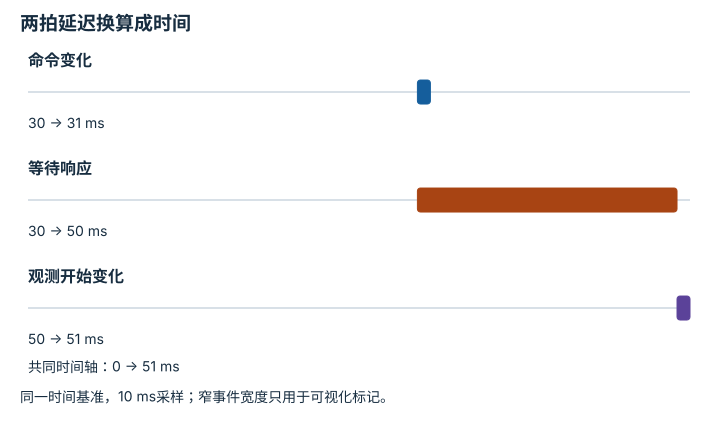

---
hide:
  - navigation
---

<!-- Generated by scripts/build_knowledge_atlas.py; edit knowledge/atlas/*.json. -->

<nav class="study-breadcrumb" aria-label="学习位置" markdown="1">
[知识目录](../../index.md) / [系统辨识与 Sim-to-Real](../index.md)
</nav>

L5 · 本章第 2 / 4 节

# 把延迟当动力学参数纳入模型

**Delay identification**

命令方向是对的，但到达时已经过时，也会使控制失效。

先确认：这些前置知识我懂了吗？

时间戳、采样周期

[任务定义、复位、扰动与随机化](../../sim-task-randomization/index.md) · [泛化、鲁棒性与分布偏移](../../eval-generalization-robustness/index.md) · [频率、看门狗、状态机与安全](../../system-realtime-safety/index.md)

<section class="study-section " markdown="1">

## 1 · 原理拆开看

1. 先定义要辨识的延迟段，例如命令发送到被测响应开始，而不是混用求解耗时。
2. 在共同时间基准下比较输入变化和响应变化，区分固定延迟、时钟偏移与系统渐进响应。
3. 用多次记录估计延迟分布并在仿真中复现；单次对齐不足以描述抖动。

</section>

<section class="study-section " markdown="1">

## 2 · 跟着例子算一遍

1. 教学离线采样周期10 ms，命令在样本3改变，响应从样本5开始变化。
2. 两者相差2个采样间隔，名义延迟20 ms。
3. 若时间戳存在±5 ms对齐误差，就不能把20 ms当无误差真值，更不能细分成未测量的网络与电机段。

</section>

<section class="study-section " markdown="1">

## 3 · 对照图，解释变化

<figure class="atlas-visual" tabindex="0" aria-label="两拍延迟换算成时间；窄屏可在图内横向滚动">
<picture>
<source media="(max-width: 600px)" srcset="../../../assets/knowledge-atlas/simreal-delay-identification-mobile.svg">

</picture>
<figcaption>教学起始响应检测，不是设备实测。</figcaption>
</figure>

- 等待区间宽20 ms，来自两个10 ms采样间隔。
- 标记不能把采样间隔内的真实响应时刻精确定位。

查看作图数据，自己复算

图上数值可能为便于阅读而取近似值，以下保留作图输入。

| 事件 | 开始 (ms) | 结束 (ms) |
| --- | --- | --- |
| 命令变化 | 30 | 31 |
| 等待响应 | 30 | 50 |
| 观测开始变化 | 50 | 51 |

</section>

<section class="study-section study-misconception" markdown="1">

## 4 · 避开一个误区

**容易误以为：**把响应曲线平移到重合，就能知道所有链路延迟。

**为什么不成立：**平移只能估计选定起终点的合成时差，还可能混入动态滞后。

**正确理解：**记录时钟、变化检测规则与辨识不确定性。

</section>

<section class="study-section study-check" markdown="1">

## 5 · 先独立回答

采样周期20 ms时观察到两拍延迟，物理时差还是20 ms吗？

我已作答，查看推理

不是，名义值为40 ms；拍数必须乘对应采样周期。

</section>

继续查阅原始资料

- [Sim-to-Real：Learning Agile Locomotion 原论文](https://arxiv.org/abs/1804.10332)
- [ROS REP-103：单位与坐标约定](https://github.com/ros-infrastructure/rep/blob/master/rep-0103.rst)

<nav class="study-pagination" aria-label="相邻小节" markdown="1">

[← 先估计能解释观测的参数，再调策略](../simreal-identification/index.md)

[域随机化是训练分布设计，不是任意加噪 →](../simreal-domain-randomization/index.md)

</nav>

[返回本章目录](../index.md) · [整章连续阅读](../complete/index.md)

本章最后需要提交什么？

生成包含未满足门禁与回滚条件的晋级决策。

回到[原课程](../../../19-sim-to-real-guide.md)完成实践。阅读位置或查看答案不计为通过验收。

