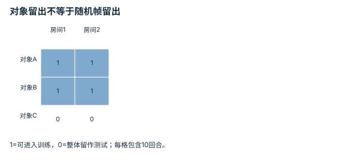
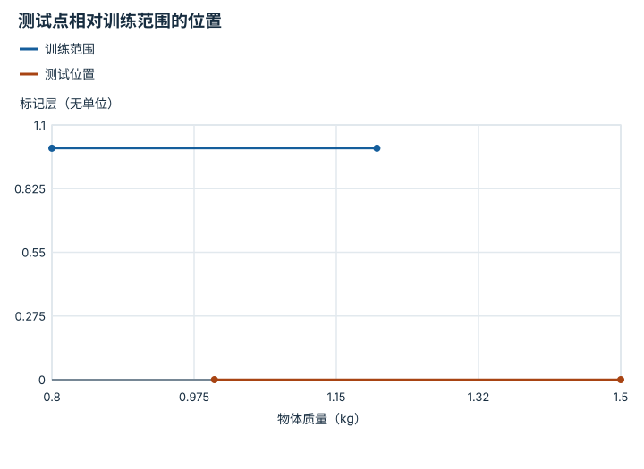
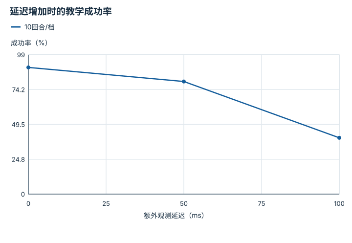
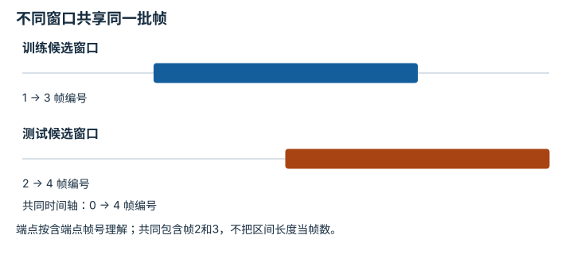

# 泛化、鲁棒性与分布偏移：逐点细解

<!-- Generated by scripts/build_knowledge_atlas.py; edit knowledge/atlas/*.json. -->

[全部知识点](../index.md) · [返回原课程](../../06-evaluation-metrics.md)

Generalization, robustness, and distribution shift · 本页拆成 **4 个小知识点**。

先阅读直觉和原理，再独立完成算例、自测；图是解释工具，不是已掌握或真机验证的证明。

## 前置知识

[任务指标与失败分类](../eval-task-metrics/index.md) → [数据质量、覆盖与无泄漏切分](../data-quality-splits/index.md)

## 本页知识点

1. [泛化必须说明留出的到底是什么](#generalization-holdout-axis)
2. [范围内插值与范围外外推分开报告](#generalization-interpolation-ood)
3. [鲁棒性需要随扰动强度的曲线](#generalization-robustness-curve)
4. [相邻帧拆分会把记忆误当泛化](#generalization-leakage)

## 1. 泛化必须说明留出的到底是什么

**Holdout factors**

**需要先懂：**训练与测试划分

### 一句话直觉

新图片不一定是新场景，新场景也不一定包含新任务。

### 原理拆开看

1. 把对象、场景、任务指令和本体分别视为可留出因素，先确定要回答的问题。
2. 以完整对象或场景组划分数据，避免同一实体的相邻片段跨训练测试。
3. 多因素同时留出更困难，但失败来源也更难归因，应与单因素测试配合。

### 手算或追踪一个例子

1. 教学数据含对象A、B、C，每对象在两个房间各10回合。
2. 把对象C的20回合全部留出，可测试新对象；若只随机留出其中几帧，则C已出现在训练中。
3. 若测试只包含房间2里的C，则对象和场景因素可能纠缠，不能只称对象泛化。

### 用图理解

<figure class="atlas-visual" tabindex="0" aria-label="对象留出不等于随机帧留出；窄屏可在图内横向滚动">
<picture>
<source media="(max-width: 600px)" srcset="../../assets/knowledge-atlas/generalization-holdout-axis-mobile.svg">

</picture>
<figcaption>教学训练测试分组。</figcaption>
</figure>

- C整行留出，才能针对该数据设计讨论新对象。
- 两房间均见过时，这个划分不测试新场景泛化。

查看作图数据，自己复算

图上数值可能为便于阅读而取近似值，以下保留作图输入。

| 行 / 列 | 房间1 | 房间2 |
| --- | --- | --- |
| 对象A | 1 | 1 |
| 对象B | 1 | 1 |
| 对象C | 0 | 0 |

### 容易混淆的地方

**常见误解：**测试文件名没在训练列表里，就不存在泄漏。

**为什么不成立：**同一轨迹或对象的高度相似数据可能以不同文件名出现。

**正确理解：**按问题对应的组ID划分并保留清单。

### 自测

要测试新场景但已知对象，应怎样分组？

展开答案与推理

保留同类已知对象，但把完整测试场景及其轨迹从训练中排除，并核查跨场景重复资产。

**原始资料：**[Open X-Embodiment 作者项目](https://robotic-transformer-x.github.io/) · [Henderson 等：Deep Reinforcement Learning that Matters](https://arxiv.org/abs/1709.06560)

## 2. 范围内插值与范围外外推分开报告

**Interpolation versus extrapolation**

**需要先懂：**区间、训练分布

### 一句话直觉

模型在已见变化范围内表现好，并不能推出范围外也可靠。

### 原理拆开看

1. 训练分布的支持范围说明模型在哪些条件下得到数据，但有限样本不等于覆盖整个范围。
2. 测试条件位于该范围内可研究插值，范围外则是特定因素上的外推。
3. 高维条件还存在组合空洞，所有单个变量在界内也不保证联合分布内。

### 手算或追踪一个例子

1. 教学训练质量范围[0.8,1.2] kg，其他条件固定。
2. 测试1.0 kg属于该质量范围内；1.5 kg在范围外，超出上界0.3 kg。
3. 应分别报告两组结果，而不是混成一个平均分后声称全面泛化。

### 用图理解

<figure class="atlas-visual" tabindex="0" aria-label="测试点相对训练范围的位置；窄屏可在图内横向滚动">
<picture>
<source media="(max-width: 600px)" srcset="../../assets/knowledge-atlas/generalization-interpolation-ood-mobile.svg">

</picture>
<figcaption>教学单因素支持范围，线段只标区间。</figcaption>
</figure>

- 上方线段是训练区间，下方两个点分别在其内外。
- 下方连线不表示存在连续测试结果，图也未展示成功率。

查看作图数据，自己复算

图上数值可能为便于阅读而取近似值，以下保留作图输入。线段的含义以本图图注和读图说明为准，不应自行解释为实测连续轨迹。

| 曲线 | 物体质量（kg） | 标记层（无单位） |
| --- | --- | --- |
| 训练范围 | 0.8 | 1 |
| 训练范围 | 1.2 | 1 |
| 测试位置 | 1 | 0 |
| 测试位置 | 1.5 | 0 |

### 容易混淆的地方

**常见误解：**只要每个参数都在训练最小最大值之间，就一定分布内。

**为什么不成立：**训练可能只包含参数之间的某些组合。

**正确理解：**检查联合组合与数据密度，而不只查逐维范围。

### 自测

质量1 kg、摩擦0.5都见过，但组合从没出现，算完全已覆盖吗？

展开答案与推理

不能这样认定；需要检验联合分布以及参数交互效应。

**原始资料：**[Domain Randomization 原论文](https://arxiv.org/abs/1703.06907) · [Sim-to-Real：Learning Agile Locomotion 原论文](https://arxiv.org/abs/1804.10332)

## 3. 鲁棒性需要随扰动强度的曲线

**Perturbation response**

**需要先懂：**对照实验、曲线

### 一句话直觉

只说“加噪声也成功”缺少噪声大小、失败阈值和基线。

### 原理拆开看

1. 固定任务协议，逐步改变一个扰动因素，例如相机偏移或观测延迟。
2. 每个强度使用匹配初始条件并报告回合数与不确定性，观察下降形状而非单个结果。
3. 多个扰动同时出现可能有交互，单因素稳健不代表组合稳健。

### 手算或追踪一个例子

1. 教学每档10回合，延迟0、50、100 ms时成功分别9、8、4次。
2. 成功率为90%、80%、40%，最大下降出现在50到100 ms之间，下降40个百分点。
3. 这提示应调查该区间，但每档10回合仍有较大统计不确定性，不能宣称精确临界值。

### 用图理解

<figure class="atlas-visual" tabindex="0" aria-label="延迟增加时的教学成功率；窄屏可在图内横向滚动">
<picture>
<source media="(max-width: 600px)" srcset="../../assets/knowledge-atlas/generalization-robustness-curve-mobile.svg">

</picture>
<figcaption>构造计数，连线为稀疏采样示意。</figcaption>
</figure>

- 看下降区间而不只看最高点，50–100 ms值得进一步采样。
- 没有置信区间时不能把每个点当真实概率。

查看作图数据，自己复算

图上数值可能为便于阅读而取近似值，以下保留作图输入。线段的含义以本图图注和读图说明为准，不应自行解释为实测连续轨迹。

| 曲线 | 额外观测延迟（ms） | 成功率（%） |
| --- | --- | --- |
| 10回合/档 | 0 | 90 |
| 10回合/档 | 50 | 80 |
| 10回合/档 | 100 | 40 |

### 容易混淆的地方

**常见误解：**一个噪声配置通过，就能称抗噪鲁棒。

**为什么不成立：**它只支持该扰动、强度和协议下的观察。

**正确理解：**报告扰动定义、强度曲线与组合测试边界。

### 自测

图上100 ms成功率40%，能否说99 ms一定安全？

展开答案与推理

不能；稀疏采样和有限回合无法确定精确阈值，更不能认证安全。

**原始资料：**[Sim-to-Real：Learning Agile Locomotion 原论文](https://arxiv.org/abs/1804.10332) · [rliable：可靠强化学习评测](https://github.com/google-research/rliable)

## 4. 相邻帧拆分会把记忆误当泛化

**Episode-level data leakage**

**需要先懂：**数据划分、相关性

### 一句话直觉

训练看过一段视频前半秒，测试再问下一帧，可能只是考近重复。

### 原理拆开看

1. 先确定独立评测单元，例如完整episode、对象或场景，而不是默认单帧。
2. 在该单元上划分，再生成训练窗口；否则同一轨迹的重叠窗口可能跨集合。
3. 归一化统计量与模型选择也只能用训练或验证数据，测试数据应保持最终评估角色。

### 手算或追踪一个例子

1. 教学一条轨迹6帧，窗口长度3；窗口[1,2,3]和[2,3,4]共享2帧。
2. 若前者进训练、后者进测试，测试窗口2/3输入已出现。
3. 按整条episode分组后两个窗口只能进入同一集合，避免这类重叠泄漏。

### 用图理解

<figure class="atlas-visual" tabindex="0" aria-label="不同窗口共享同一批帧；窄屏可在图内横向滚动">
<picture>
<source media="(max-width: 600px)" srcset="../../assets/knowledge-atlas/generalization-leakage-mobile.svg">

</picture>
<figcaption>教学帧编号区间。</figcaption>
</figure>

- 重叠部分是共享内容，不是两次独立观测。
- 完全不重叠的同一episode片段仍可能高度相关，分组规则需更严格。

查看作图数据，自己复算

图上数值可能为便于阅读而取近似值，以下保留作图输入。

| 事件 | 开始 (帧编号) | 结束 (帧编号) |
| --- | --- | --- |
| 训练候选窗口 | 1 | 3 |
| 测试候选窗口 | 2 | 4 |

### 容易混淆的地方

**常见误解：**训练窗口与测试窗口的起始帧不同，所以独立。

**为什么不成立：**不同起点仍可能共享绝大多数帧和任务状态。

**正确理解：**先分组再切窗，并审查资产与归一化的泄漏通道。

### 自测

把训练和测试窗口随机打乱能消除泄漏吗？

展开答案与推理

不能；打乱顺序不改变共享内容。

**原始资料：**[Henderson 等：Deep Reinforcement Learning that Matters](https://arxiv.org/abs/1709.06560)

## 从理解走向证据

本节点原有验收要求：在同一协议下比较分布内与留出结果。

完成图解自测后，回到[原课程](../../06-evaluation-metrics.md)运行对应示例并保留证据；浏览页面和查看答案不会自动获得课程晋级。
