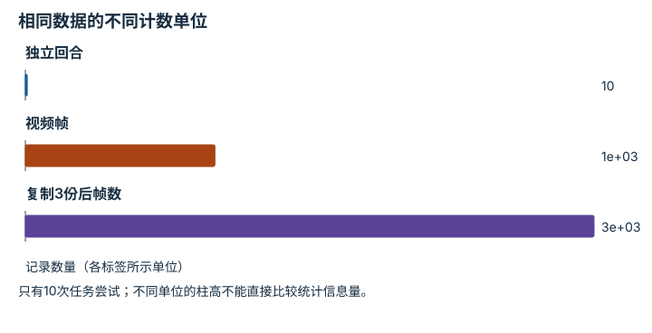
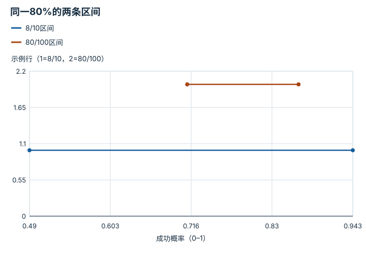
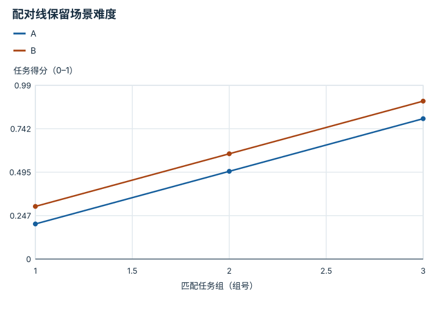
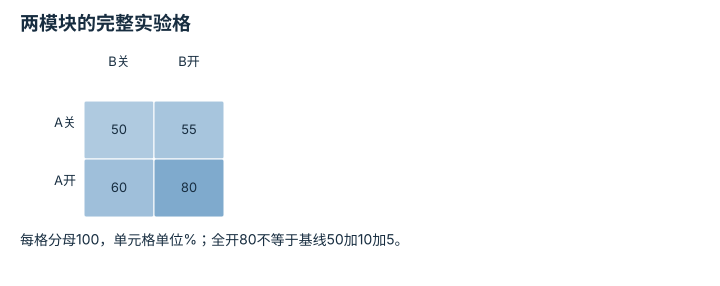
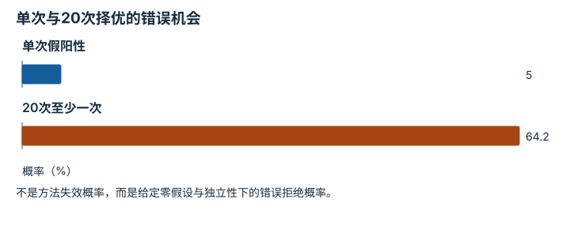

---
search:
  exclude: true
---

# 统计、消融与负结果：逐点细解

<!-- Generated by scripts/build_knowledge_atlas.py; edit knowledge/atlas/*.json. -->

[按小节学习](../index.md) · [全部知识点](../../index.md) · [返回原课程](../../../foundations/14-evaluation-and-reproducibility.md)

Statistics, ablations, and negative results · 本页拆成 **6 个小知识点**。

先阅读直觉和原理，再独立完成算例、自测；图是解释工具，不是已掌握或真机验证的证明。

## 前置知识

[概率、估计与不确定性](../../math-probability-statistics/index.md) → [任务指标与失败分类](../../eval-task-metrics/index.md)

## 改一个参数试试看

比较 8/10 与 80/100 的 Wilson 区间，并指出独立同分布假设。

[打开对应交互实验](../../../learning-lab-cn.md#evaluation)。滑块在文档站运行，GitHub 文件预览提供静态推导；不连接机器人。

## 本页知识点

1. [成功率分母应是独立任务回合，而不是视频帧](#statistics-denominator-unit)
2. [有限成功次数要配不确定性区间](#statistics-wilson-interval)
3. [比较方法时保留同初始条件的配对关系](#statistics-paired-seeds)
4. [消融要分清单独贡献与交互作用](#statistics-factorial-ablation)
5. [试得越多，偶然显著越容易出现](#statistics-multiple-testing)
6. [失败运行和计算预算不能从报告中消失](#statistics-negative-runs)

## 1. 成功率分母应是独立任务回合，而不是视频帧

**Unit of analysis**

**需要先懂：**比例、独立试验

### 一句话直觉

同一个成功过程录得更长，不应该使算法的成功次数增加。

### 原理拆开看

1. 先定义一次Bernoulli试验的单元和成功标准；同一回合内的相邻帧不是重复任务尝试。
2. 统计成功次数k和总回合n，成功率估计k/n；独立性不足时简单二项区间会过窄。
3. 按对象、场景或种子聚类的数据应保留层级，必要时按独立组重采样。

### 手算或追踪一个例子

1. 教学记录10个回合，每回合100帧，其中8回合成功。
2. 正确回合成功率8/10=80%；1000帧不提供1000次独立任务尝试。
3. 把成功回合每帧都标成功虽仍得800/1000=80%，却把样本量虚增100倍并夸大确定性。

### 用图理解

<figure class="atlas-visual" tabindex="0" aria-label="相同数据的不同计数单位；窄屏可在图内横向滚动">
<picture>
<source media="(max-width: 600px)" srcset="../../../assets/knowledge-atlas/statistics-denominator-unit-mobile.svg">

</picture>
<figcaption>教学数据量与独立回合数比较，不代表有效样本倍增。</figcaption>
</figure>

- 大柱子表示存储记录多，并不表示独立证据多。
- 真实独立性还取决于场景和重置协议，10回合也可能相关。

查看作图数据，自己复算

图上数值可能为便于阅读而取近似值，以下保留作图输入。

| 项目 | 记录数量（各标签所示单位） |
| --- | --- |
| 独立回合 | 10 |
| 视频帧 | 1000 |
| 复制3份后帧数 | 3000 |

### 容易混淆的地方

**常见误解：**比例相同，用帧数作分母也没关系。

**为什么不成立：**点估计可巧合不变，但不确定性计算与证据强度被扭曲。

**正确理解：**保留回合及聚类单位，不能制造伪重复。

### 自测

复制每回合视频三份，证据强度会增加吗？

展开答案与推理

不会；没有新增独立任务初始条件或结果。

**原始资料：**[NIST：Confidence Intervals for Proportions](https://www.itl.nist.gov/div898/handbook/prc/section2/prc241.htm) · [rliable：可靠强化学习评测](https://github.com/google-research/rliable)

## 2. 有限成功次数要配不确定性区间

**Binomial uncertainty and Wilson interval**

**需要先懂：**成功率、平方根

### 一句话直觉

8/10和80/100都是80%，但能排除的真实成功概率范围不同。

### 原理拆开看

1. 在同一成功概率、相互独立二元试验假设下，k/n是点估计，不等于真实概率。
2. Wilson区间用z=1.96的中心修正与标准误项，避免朴素对称区间在0或1附近失真。
3. 95%是名义置信水平，描述重复构造区间的约95%覆盖目标；有限n的实际覆盖率会随真实概率变化，并不严格恒定，更不是固定参数此刻有95%概率落在已算区间里。

### 手算或追踪一个例子

1. 教学例：k=8，n=10，p=0.8，z²=3.8416；分母D=1+3.8416/10=1.38416。
2. 中心=(0.8+3.8416/20)/D≈0.71674；半宽=1.96×√(0.8×0.2/10+3.8416/400)/D≈0.22658。
3. 区间约[0.490,0.943]；同法80/100约[0.711,0.867]，点估计相同但区间更窄。

### 用图理解

<figure class="atlas-visual" tabindex="0" aria-label="同一80%的两条区间；窄屏可在图内横向滚动">
<picture>
<source media="(max-width: 600px)" srcset="../../../assets/knowledge-atlas/statistics-wilson-interval-mobile.svg">

</picture>
<figcaption>教学Wilson端点，横向线段表示区间而非时间轨迹。</figcaption>
</figure>

- 第二条线更短，表示本抽样模型下不确定性较小。
- 两条区间没有覆盖数据泄漏、分布变化或硬件风险。

查看作图数据，自己复算

图上数值可能为便于阅读而取近似值，以下保留作图输入。线段的含义以本图图注和读图说明为准，不应自行解释为实测连续轨迹。

| 曲线 | 成功概率（0–1） | 示例行（1=8/10，2=80/100） |
| --- | --- | --- |
| 8/10区间 | 0.49 | 1 |
| 8/10区间 | 0.943 | 1 |
| 80/100区间 | 0.711 | 2 |
| 80/100区间 | 0.867 | 2 |

### 容易混淆的地方

**常见误解：**10次全部成功，就证明真实成功率100%。

**为什么不成立：**有限样本无法排除小概率失败，区间仍应有非零宽度。

**正确理解：**报告k、n、区间方法与抽样假设。

### 自测

增加同场景相邻帧能按Wilson规则缩窄区间吗？

展开答案与推理

不能把相关帧当独立试验；需要按合适独立单元分析。

**原始资料：**[NIST：Confidence Intervals for Proportions](https://www.itl.nist.gov/div898/handbook/prc/section2/prc241.htm)

## 3. 比较方法时保留同初始条件的配对关系

**Paired evaluation**

**需要先懂：**差值、随机种子

### 一句话直觉

方法A碰到容易场景、B碰到困难场景，直接比较平均值会混入任务难度。

### 原理拆开看

1. 将待比较方法在同一任务初始条件上成对评估，记录每对结果。
2. 先计算每对差值再汇总，能在合适设计下抵消部分共享场景难度。
3. 相同seed号码不自动保证相同状态，环境版本、随机源和初始化逻辑也需一致。

### 手算或追踪一个例子

1. 教学三组匹配任务得分：A=[0.2,0.5,0.8]，B=[0.3,0.6,0.9]。
2. 逐对B−A=[0.1,0.1,0.1]，平均改进0.1。
3. 三个点支持这三组的同向差异，但样本太少，不能据此宣布所有任务都提高0.1。

### 用图理解

<figure class="atlas-visual" tabindex="0" aria-label="配对线保留场景难度；窄屏可在图内横向滚动">
<picture>
<source media="(max-width: 600px)" srcset="../../../assets/knowledge-atlas/statistics-paired-seeds-mobile.svg">

</picture>
<figcaption>教学三组得分，连线仅帮助对应同组。</figcaption>
</figure>

- 两条曲线随难度共同变化，而纵向差保持0.1。
- 这不是三个独立训练种子的充分统计分析，训练方差还需另测。

查看作图数据，自己复算

图上数值可能为便于阅读而取近似值，以下保留作图输入。线段的含义以本图图注和读图说明为准，不应自行解释为实测连续轨迹。

| 曲线 | 匹配任务组（组号） | 任务得分（0–1） |
| --- | --- | --- |
| A | 1 | 0.2 |
| A | 2 | 0.5 |
| A | 3 | 0.8 |
| B | 1 | 0.3 |
| B | 2 | 0.6 |
| B | 3 | 0.9 |

### 容易混淆的地方

**常见误解：**只要两方法都跑了seed=1，就必然是公平配对。

**为什么不成立：**不同随机调用或版本可让同seed生成不同任务。

**正确理解：**保存真实初始状态与任务ID，必要时直接回放状态。

### 自测

去掉A失败而B成功的一对，剩余比较仍公平吗？

展开答案与推理

会产生选择偏差；除非按预先规定且与结果无关的规则排除，并完整披露。

**原始资料：**[rliable：可靠强化学习评测](https://github.com/google-research/rliable) · [Henderson 等：Deep Reinforcement Learning that Matters](https://arxiv.org/abs/1709.06560)

## 4. 消融要分清单独贡献与交互作用

**Factorial ablation and interaction**

**需要先懂：**对照、差分

### 一句话直觉

两个模块一起有效，不能把全部提升都归给其中一个。

### 原理拆开看

1. 固定数据、训练预算和评测协议，比较模块开关构成的实验格。
2. 二因素实验应包含都关、只开A、只开B、都开，才能估计差异与交互。
3. 重复运行得到不确定性后再解释效果；改变参数量或预算的消融可能同时改变多个因素。

### 手算或追踪一个例子

1. 教学例：四个配置各评估100个独立回合，都关、只A、只B、全开分别成功50、60、55、80次，成功率为50%、60%、55%、80%。
2. A在B关闭时增益10个百分点，在B打开时增益25个百分点。
3. 差中之差80−60−55+50=15个百分点，提示本例正交互，而不是简单10+5相加。

### 用图理解

<figure class="atlas-visual" tabindex="0" aria-label="两模块的完整实验格；窄屏可在图内横向滚动">
<picture>
<source media="(max-width: 600px)" srcset="../../../assets/knowledge-atlas/statistics-factorial-ablation-mobile.svg">

</picture>
<figcaption>教学成功率，每格100个独立评估回合，不是真实模型结果。</figcaption>
</figure>

- 先沿列看A的效果，两列增量分别10和25。
- 颜色差不能代替统计检验，也不能消除预算不匹配。

查看作图数据，自己复算

图上数值可能为便于阅读而取近似值，以下保留作图输入。

| 行 / 列 | B关 | B开 |
| --- | --- | --- |
| A关 | 50 | 55 |
| A开 | 60 | 80 |

### 容易混淆的地方

**常见误解：**全模型减去无A模型，就得到A在所有条件下的固定贡献。

**为什么不成立：**A的效果可能依赖B，且消融可能改变训练预算。

**正确理解：**报告完整实验格、交互与重复运行波动。

### 自测

若每格都只训练一个seed，即使各有100个评估回合，能确认15个百分点是真实交互吗？

展开答案与推理

不能；它只是样本点估计，还需要训练与评测变异分析。

**原始资料：**[Henderson 等：Deep Reinforcement Learning that Matters](https://arxiv.org/abs/1709.06560)

## 5. 试得越多，偶然显著越容易出现

**Multiple comparisons**

**需要先懂：**概率、显著性水平

### 一句话直觉

反复试参数直到找到p<0.05，会把调参运气包装成方法进步。

### 原理拆开看

1. 单次显著性水平α控制对应零假设下的错误拒绝率，并非结论为真的概率。
2. 若进行多次比较后只展示最好的，整体出现假阳性的机会会上升。
3. 预先定义比较集合并采用合适校正或独立确认集；Bonferroni把每项阈值分配为α/比较数。

### 手算或追踪一个例子

1. 教学例：20个真实无差异且相互独立的检验，每项假阳性概率0.05。
2. 至少一次假阳性的概率1−0.95²⁰≈0.6415，即64.15%。
3. Bonferroni总体α=0.05时每项阈值0.05/20=0.0025；其上界控制不要求检验独立。

### 用图理解

<figure class="atlas-visual" tabindex="0" aria-label="单次与20次择优的错误机会；窄屏可在图内横向滚动">
<picture>
<source media="(max-width: 600px)" srcset="../../../assets/knowledge-atlas/statistics-multiple-testing-mobile.svg">

</picture>
<figcaption>教学全零假设且独立的检验集合。</figcaption>
</figure>

- 第二柱说明尝试次数改变了错误机会。
- 图不决定所有问题都应用同一种校正，应按比较目标选择方法。

查看作图数据，自己复算

图上数值可能为便于阅读而取近似值，以下保留作图输入。

| 项目 | 概率（%） |
| --- | --- |
| 单次假阳性 | 5 |
| 20次至少一次 | 64.15 |

### 容易混淆的地方

**常见误解：**20次中出现一个p<0.05，就足以证明模块有效。

**为什么不成立：**选择最大结果忽略了多重尝试，未控制整体错误率。

**正确理解：**披露全部尝试，并分离探索与确认评测。

### 自测

64.15%这个数在检验高度相关时仍精确吗？

展开答案与推理

不是；1−0.95²⁰用了独立假设，相关情况下要另分析，不能机械套用。

**原始资料：**[NIST：Bonferroni's Method](https://www.itl.nist.gov/div898/handbook/prc/section4/prc473.htm)

## 6. 失败运行和计算预算不能从报告中消失

**Negative results and survivor bias**

**需要先懂：**平均值、缺失数据

### 一句话直觉

只展示跑完的训练，会隐藏方法经常崩溃或预算超限的事实。

### 原理拆开看

1. 为所有预先安排的运行登记状态，包括完成、崩溃、超时和未评测。
2. 任务分数只对有合法评测的运行计算，并明确其条件分母；缺失不能擅自变成零。
3. 同时报告运行完成率与预算，让读者看到方法性能和工程可靠性两个维度。

### 手算或追踪一个例子

1. 教学安排5次训练，4次完成，合法得分[0.80,0.82,0.78,0.81]，另1次崩溃且分数null。
2. 已完成运行均分3.21/4=0.8025；运行完成率4/5=80%。
3. 应同时报告80.25%的条件均分与1次崩溃，不能声称5次平均80.25%，也不能把null改成0。

### 用图理解

<figure class="atlas-visual" tabindex="0" aria-label="分数与运行状态分别记录；窄屏可在图内横向滚动">
<picture>
<source media="(max-width: 600px)" srcset="../../../assets/knowledge-atlas/statistics-negative-runs-mobile.svg">

</picture>
<figcaption>教学完成标志与合法评测存在性。</figcaption>
</figure>

- 最后一行揭示条件均分省略的运行状态。
- 该矩阵不显示崩溃原因，原因与预算需要日志佐证。

查看作图数据，自己复算

图上数值可能为便于阅读而取近似值，以下保留作图输入。

| 行 / 列 | 训练完成 | 有合法分数 |
| --- | --- | --- |
| 运行1 | 1 | 1 |
| 运行2 | 1 | 1 |
| 运行3 | 1 | 1 |
| 运行4 | 1 | 1 |
| 运行5 | 0 | 0 |

### 容易混淆的地方

**常见误解：**崩溃不是算法结果，可以从实验表删除。

**为什么不成立：**删除会让读者看不到运行可靠性和预算消耗。

**正确理解：**完整保留状态与日志，按预定失败处理协议报告。

### 自测

若崩溃发生在硬盘损坏，是否仍要记录？

展开答案与推理

要记录并解释外部原因；是否重跑按预定规则处理，原始失败记录不能消失。

**原始资料：**[Henderson 等：Deep Reinforcement Learning that Matters](https://arxiv.org/abs/1709.06560) · [本仓库：Validation and Claim Policy](https://github.com/Dld0621/Embodied-AI-Zero-to-Hero/blob/master/docs/VALIDATION.md)

## 从理解走向证据

本节点原有验收要求：复现一项比较，并说明协议无法证明什么。

完成图解自测后，回到[原课程](../../../foundations/14-evaluation-and-reproducibility.md)运行对应示例并保留证据；浏览页面和查看答案不会自动获得课程晋级。
