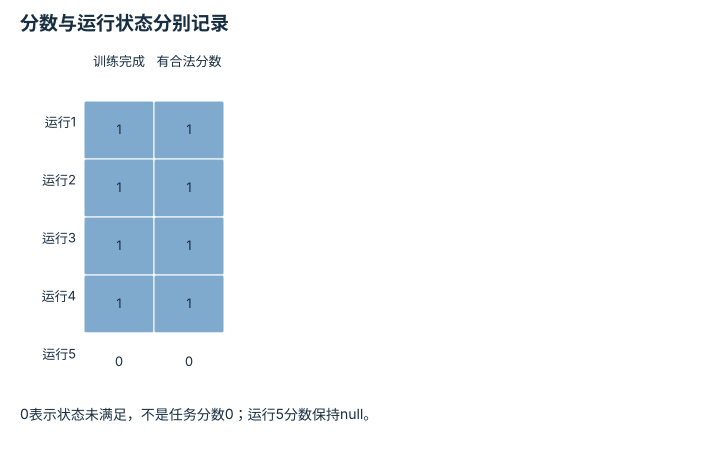

---
hide:
  - navigation
---

<!-- Generated by scripts/build_knowledge_atlas.py; edit knowledge/atlas/*.json. -->

<nav class="study-breadcrumb" aria-label="学习位置" markdown="1">
[知识目录](../../index.md) / [统计、消融与负结果](../index.md)
</nav>

L5 · 本章第 6 / 6 节

# 失败运行和计算预算不能从报告中消失

**Negative results and survivor bias**

只展示跑完的训练，会隐藏方法经常崩溃或预算超限的事实。

先确认：这些前置知识我懂了吗？

平均值、缺失数据

[概率、估计与不确定性](../../math-probability-statistics/index.md) · [任务指标与失败分类](../../eval-task-metrics/index.md)

<section class="study-section " markdown="1">

## 1 · 原理拆开看

1. 为所有预先安排的运行登记状态，包括完成、崩溃、超时和未评测。
2. 任务分数只对有合法评测的运行计算，并明确其条件分母；缺失不能擅自变成零。
3. 同时报告运行完成率与预算，让读者看到方法性能和工程可靠性两个维度。

</section>

<section class="study-section " markdown="1">

## 2 · 跟着例子算一遍

1. 教学安排5次训练，4次完成，合法得分[0.80,0.82,0.78,0.81]，另1次崩溃且分数null。
2. 已完成运行均分3.21/4=0.8025；运行完成率4/5=80%。
3. 应同时报告80.25%的条件均分与1次崩溃，不能声称5次平均80.25%，也不能把null改成0。

</section>

<section class="study-section " markdown="1">

## 3 · 对照图，解释变化

<figure class="atlas-visual" tabindex="0" aria-label="分数与运行状态分别记录；窄屏可在图内横向滚动">
<picture>
<source media="(max-width: 600px)" srcset="../../../assets/knowledge-atlas/statistics-negative-runs-mobile.svg">

</picture>
<figcaption>教学完成标志与合法评测存在性。</figcaption>
</figure>

- 最后一行揭示条件均分省略的运行状态。
- 该矩阵不显示崩溃原因，原因与预算需要日志佐证。

查看作图数据，自己复算

图上数值可能为便于阅读而取近似值，以下保留作图输入。

| 行 / 列 | 训练完成 | 有合法分数 |
| --- | --- | --- |
| 运行1 | 1 | 1 |
| 运行2 | 1 | 1 |
| 运行3 | 1 | 1 |
| 运行4 | 1 | 1 |
| 运行5 | 0 | 0 |

</section>

<section class="study-section study-misconception" markdown="1">

## 4 · 避开一个误区

**容易误以为：**崩溃不是算法结果，可以从实验表删除。

**为什么不成立：**删除会让读者看不到运行可靠性和预算消耗。

**正确理解：**完整保留状态与日志，按预定失败处理协议报告。

</section>

<section class="study-section study-check" markdown="1">

## 5 · 先独立回答

若崩溃发生在硬盘损坏，是否仍要记录？

我已作答，查看推理

要记录并解释外部原因；是否重跑按预定规则处理，原始失败记录不能消失。

</section>

继续查阅原始资料

- [Henderson 等：Deep Reinforcement Learning that Matters](https://arxiv.org/abs/1709.06560)
- [本仓库：Validation and Claim Policy](https://github.com/Dld0621/Embodied-AI-Zero-to-Hero/blob/master/docs/VALIDATION.md)

<nav class="study-pagination" aria-label="相邻小节" markdown="1">

[← 试得越多，偶然显著越容易出现](../statistics-multiple-testing/index.md)

[回原课程动手验证 →](../../../foundations/14-evaluation-and-reproducibility.md)

</nav>

[返回本章目录](../index.md) · [整章连续阅读](../complete/index.md)

本章最后需要提交什么？

复现一项比较，并说明协议无法证明什么。

回到[原课程](../../../foundations/14-evaluation-and-reproducibility.md)完成实践。阅读位置或查看答案不计为通过验收。

