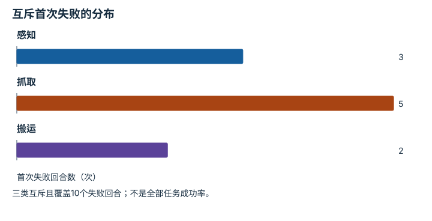

---
hide:
  - navigation
---

<!-- Generated by scripts/build_knowledge_atlas.py; edit knowledge/atlas/*.json. -->

<nav class="study-breadcrumb" aria-label="学习位置" markdown="1">
[知识目录](../../index.md) / [任务指标与失败分类](../index.md)
</nav>

L5 · 本章第 2 / 4 节

# 失败分类要说明是否互斥

**Failure taxonomy**

一段失败视频可能同时包含打滑、超时和碰撞，分类方式决定百分比能否相加。

先确认：这些前置知识我懂了吗？

计数、任务阶段

[实验流程与溯源](../../computing-experiment-workflow/index.md)

<section class="study-section " markdown="1">

## 1 · 原理拆开看

1. 可用首次失败作为互斥类别，每回合只进入一类，便于阶段分布统计。
2. 也可采用多标签记录所有现象，但总标签数可能超过回合数。
3. 报告时明确分类单位与规则，不能把多标签比例强行解释成分解总失败概率。

</section>

<section class="study-section " markdown="1">

## 2 · 跟着例子算一遍

1. 教学例：10个失败回合，首次失败分类为感知3、抓取5、搬运2。
2. 互斥计数3+5+2=10，比例为30%、50%、20%。
3. 若另记录7次出现超时，那是横跨阶段的附加标签，不能把7加进首次失败分母再归一化。

</section>

<section class="study-section " markdown="1">

## 3 · 对照图，解释变化

<figure class="atlas-visual" tabindex="0" aria-label="互斥首次失败的分布；窄屏可在图内横向滚动">
<picture>
<source media="(max-width: 600px)" srcset="../../../assets/knowledge-atlas/metric-stage-failures-mobile.svg">

</picture>
<figcaption>教学10个失败回合。</figcaption>
</figure>

- 柱子之和为10，因为这里选了互斥首次失败定义。
- 抓取柱最高不证明抓取算法是唯一根因，还需检查上游测量。

查看作图数据，自己复算

图上数值可能为便于阅读而取近似值，以下保留作图输入。

| 项目 | 首次失败回合数（次） |
| --- | --- |
| 感知 | 3 |
| 抓取 | 5 |
| 搬运 | 2 |

</section>

<section class="study-section study-misconception" markdown="1">

## 4 · 避开一个误区

**容易误以为：**所有失败标签的百分比必须加起来100%。

**为什么不成立：**只有互斥且完备的分类才必须如此。

**正确理解：**区分首次失败分类与多标签现象统计。

</section>

<section class="study-section study-check" markdown="1">

## 5 · 先独立回答

同一回合先抓空后超时，在首次失败分类里记哪里？

我已作答，查看推理

按既定规则记抓取；超时可以保留为独立附加标签。

</section>

继续查阅原始资料

- [本仓库：Validation and Claim Policy](https://github.com/Dld0621/Embodied-AI-Zero-to-Hero/blob/master/docs/VALIDATION.md)
- [Henderson 等：Deep Reinforcement Learning that Matters](https://arxiv.org/abs/1709.06560)

<nav class="study-pagination" aria-label="相邻小节" markdown="1">

[← 成功标准要在看结果之前固定](../metric-success-definition/index.md)

[成功率与路径效率要联合解释 →](../metric-success-efficiency/index.md)

</nav>

[返回本章目录](../index.md) · [整章连续阅读](../complete/index.md)

本章最后需要提交什么？

发布分子、分母、episode 协议与失败类别。

回到[原课程](../../../foundations/14-evaluation-and-reproducibility.md)完成实践。阅读位置或查看答案不计为通过验收。

