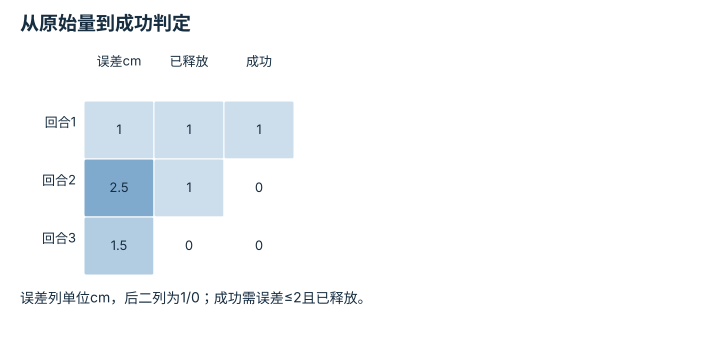

---
hide:
  - navigation
---

<!-- Generated by scripts/build_knowledge_atlas.py; edit knowledge/atlas/*.json. -->

<nav class="study-breadcrumb" aria-label="学习位置" markdown="1">
[知识目录](../../index.md) / [任务指标与失败分类](../index.md)
</nav>

L5 · 本章第 1 / 4 节

# 成功标准要在看结果之前固定

**Operational success criterion**

“看起来完成”难以复查，评测需要别人拿同样日志也能算出同样结果。

先确认：这些前置知识我懂了吗？

逻辑条件、测量

[实验流程与溯源](../../computing-experiment-workflow/index.md)

<section class="study-section " markdown="1">

## 1 · 原理拆开看

1. 将任务成功写成可观测谓词，明确目标误差、持续时间、超时与禁止事件。
2. 在运行前冻结阈值和计算方法，防止看完结果后挑选更有利的定义。
3. 成功率之外保留原始连续量，便于解释阈值附近结果及后续审计。

</section>

<section class="study-section " markdown="1">

## 2 · 跟着例子算一遍

1. 教学例：放置成功要求位置误差≤2 cm且已释放；三次误差为1、2.5、1.5 cm，释放标志[1,1,0]。
2. 逐次判定[1,0,0]；第三次虽位置达标但未释放。
3. 按预设定义成功1/3≈33.3%，不能只按位置宣称2/3。

</section>

<section class="study-section " markdown="1">

## 3 · 对照图，解释变化

<figure class="atlas-visual" tabindex="0" aria-label="从原始量到成功判定；窄屏可在图内横向滚动">
<picture>
<source media="(max-width: 600px)" srcset="../../../assets/knowledge-atlas/metric-success-definition-mobile.svg">

</picture>
<figcaption>教学三个回合。</figcaption>
</figure>

- 第三行说明连续指标达标仍可能违反另一个任务条件。
- 表格只是既定谓词的执行，不证明谓词覆盖所有真实需求。

查看作图数据，自己复算

图上数值可能为便于阅读而取近似值，以下保留作图输入。

| 行 / 列 | 误差cm | 已释放 | 成功 |
| --- | --- | --- | --- |
| 回合1 | 1 | 1 | 1 |
| 回合2 | 2.5 | 1 | 0 |
| 回合3 | 1.5 | 0 | 0 |

</section>

<section class="study-section study-misconception" markdown="1">

## 4 · 避开一个误区

**容易误以为：**位置达标次数就是放置成功次数。

**为什么不成立：**任务定义还要求释放等条件。

**正确理解：**用完整预注册谓词判定，并保留各条件结果。

</section>

<section class="study-section study-check" markdown="1">

## 5 · 先独立回答

把阈值从2 cm改到3 cm后能直接与旧论文数字比较吗？

我已作答，查看推理

不能；这是不同评测协议，应明确重算全部方法或另报新协议结果。

</section>

继续查阅原始资料

- [MIT Manipulation：Bin Picking](https://manipulation.mit.edu/clutter.html)
- [本仓库：Validation and Claim Policy](https://github.com/Dld0621/Embodied-AI-Zero-to-Hero/blob/master/docs/VALIDATION.md)

<nav class="study-pagination" aria-label="相邻小节" markdown="1">

[← 本章学习顺序](../index.md)

[失败分类要说明是否互斥 →](../metric-stage-failures/index.md)

</nav>

[返回本章目录](../index.md) · [整章连续阅读](../complete/index.md)

本章最后需要提交什么？

发布分子、分母、episode 协议与失败类别。

回到[原课程](../../../foundations/14-evaluation-and-reproducibility.md)完成实践。阅读位置或查看答案不计为通过验收。

