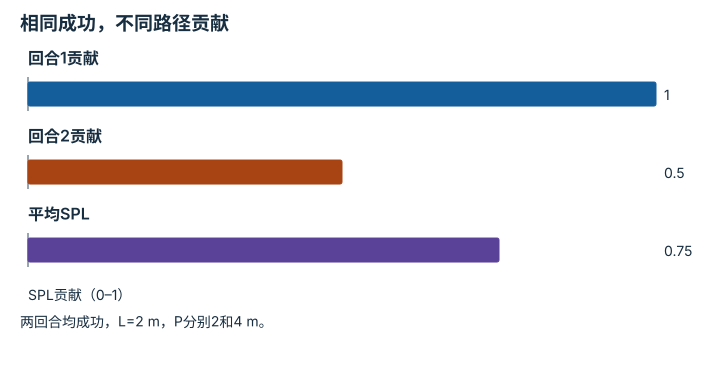

---
hide:
  - navigation
---

<!-- Generated by scripts/build_knowledge_atlas.py; edit knowledge/atlas/*.json. -->

<nav class="study-breadcrumb" aria-label="学习位置" markdown="1">
[知识目录](../../index.md) / [任务指标与失败分类](../index.md)
</nav>

L5 · 本章第 3 / 4 节

# 成功率与路径效率要联合解释

**Success weighted by path length**

总能到达但绕很远，与走得很短却经常失败，是不同能力。

先确认：这些前置知识我懂了吗？

比例、路径长度

[实验流程与溯源](../../computing-experiment-workflow/index.md)

<section class="study-section " markdown="1">

## 1 · 原理拆开看

1. SPL类指标把每回合成功标志S与路径效率L/max(P,L)相乘，L为最短参考路径，P为实际路径。
2. 失败回合S=0，对该回合SPL贡献为0；成功但绕路会低于1。
3. 同时报告成功率与SPL，避免一个复合数字掩盖失败和低效率的区别。

</section>

<section class="study-section " markdown="1">

## 2 · 跟着例子算一遍

1. 教学两回合：都成功，参考长度均2 m，实际路径分别2 m和4 m。
2. 贡献分别1×2/2=1、1×2/4=0.5，平均SPL=0.75。
3. 成功率为100%，但SPL只有0.75，差异来自第二回合绕路。

</section>

<section class="study-section " markdown="1">

## 3 · 对照图，解释变化

<figure class="atlas-visual" tabindex="0" aria-label="相同成功，不同路径贡献；窄屏可在图内横向滚动">
<picture>
<source media="(max-width: 600px)" srcset="../../../assets/knowledge-atlas/metric-success-efficiency-mobile.svg">

</picture>
<figcaption>教学两个导航回合。</figcaption>
</figure>

- 第二柱变低来自路径长度而非任务失败。
- 最短路径的地图和目标定义必须一致，才能公平比较。

查看作图数据，自己复算

图上数值可能为便于阅读而取近似值，以下保留作图输入。

| 项目 | SPL贡献（0–1） |
| --- | --- |
| 回合1贡献 | 1 |
| 回合2贡献 | 0.5 |
| 平均SPL | 0.75 |

</section>

<section class="study-section study-misconception" markdown="1">

## 4 · 避开一个误区

**容易误以为：**SPL为0.75就意味着成功率75%。

**为什么不成立：**它还乘上了成功回合的路径效率。

**正确理解：**先解释每个因子，再报告联合指标。

</section>

<section class="study-section study-check" markdown="1">

## 5 · 先独立回答

第二回合若失败，成功率和SPL分别是多少？

我已作答，查看推理

成功率50%，平均SPL=(1+0)/2=0.5；不能给失败回合绕路折扣后仍留正分。

</section>

继续查阅原始资料

- [Habitat Lab：SPL 指标](https://aihabitat.org/docs/habitat-lab/habitat.tasks.nav.nav.SPL.html)

<nav class="study-pagination" aria-label="相邻小节" markdown="1">

[← 失败分类要说明是否互斥](../metric-stage-failures/index.md)

[平均延迟会掩盖少量严重卡顿 →](../metric-tail-latency/index.md)

</nav>

[返回本章目录](../index.md) · [整章连续阅读](../complete/index.md)

本章最后需要提交什么？

发布分子、分母、episode 协议与失败类别。

回到[原课程](../../../foundations/14-evaluation-and-reproducibility.md)完成实践。阅读位置或查看答案不计为通过验收。

