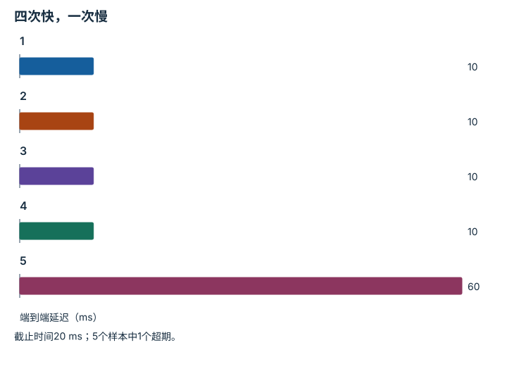

---
hide:
  - navigation
---

<!-- Generated by scripts/build_knowledge_atlas.py; edit knowledge/atlas/*.json. -->

<nav class="study-breadcrumb" aria-label="学习位置" markdown="1">
[知识目录](../../index.md) / [任务指标与失败分类](../index.md)
</nav>

L5 · 本章第 4 / 4 节

# 平均延迟会掩盖少量严重卡顿

**Tail latency and deadlines**

多数动作响应很快，偶尔迟到一次也可能破坏整个闭环。

先确认：这些前置知识我懂了吗？

排序、百分位

[实验流程与溯源](../../computing-experiment-workflow/index.md)

<section class="study-section " markdown="1">

## 1 · 原理拆开看

1. 定义完整计时边界并收集每次延迟，平均值描述中心但不限制最大值。
2. 报告分位数时说明估计规则与样本量，小样本高分位数尤其不稳定。
3. 同时按任务截止时间统计超期率，把系统及时性与模型推理耗时区分。

</section>

<section class="study-section " markdown="1">

## 2 · 跟着例子算一遍

1. 教学5次端到端延迟[10,10,10,10,60] ms，截止时间20 ms。
2. 平均(40+60)/5=20 ms，但有1/5=20%命令超期。
3. 采用nearest-rank定义的p95取ceil(0.95×5)=5位，即60 ms；只有5个样本不能稳定估计真实尾部。

</section>

<section class="study-section " markdown="1">

## 3 · 对照图，解释变化

<figure class="atlas-visual" tabindex="0" aria-label="四次快，一次慢；窄屏可在图内横向滚动">
<picture>
<source media="(max-width: 600px)" srcset="../../../assets/knowledge-atlas/metric-tail-latency-mobile.svg">

</picture>
<figcaption>教学延迟样本，非设备测速。</figcaption>
</figure>

- 第五柱解释为什么均值不能描述最坏体验。
- 这组小样本只能演示计算方法，不能估计生产系统尾部保证。

查看作图数据，自己复算

图上数值可能为便于阅读而取近似值，以下保留作图输入。

| 项目 | 端到端延迟（ms） |
| --- | --- |
| 1 | 10 |
| 2 | 10 |
| 3 | 10 |
| 4 | 10 |
| 5 | 60 |

</section>

<section class="study-section study-misconception" markdown="1">

## 4 · 避开一个误区

**容易误以为：**平均延迟等于截止时间，说明实时性通过。

**为什么不成立：**平均值允许一些请求大幅超期。

**正确理解：**报告超期率、尾分位数和观测时长。

</section>

<section class="study-section study-check" markdown="1">

## 5 · 先独立回答

去掉60 ms称其为异常值再报平均是否可以？

我已作答，查看推理

只有事先规定且有可审计理由时才可另报；原始全量统计仍应保留，不能选择性去掉卡顿。

</section>

继续查阅原始资料

- [Henderson 等：Deep Reinforcement Learning that Matters](https://arxiv.org/abs/1709.06560)
- [ROS REP-103：单位与坐标约定](https://github.com/ros-infrastructure/rep/blob/master/rep-0103.rst)

<nav class="study-pagination" aria-label="相邻小节" markdown="1">

[← 成功率与路径效率要联合解释](../metric-success-efficiency/index.md)

[回原课程动手验证 →](../../../foundations/14-evaluation-and-reproducibility.md)

</nav>

[返回本章目录](../index.md) · [整章连续阅读](../complete/index.md)

本章最后需要提交什么？

发布分子、分母、episode 协议与失败类别。

回到[原课程](../../../foundations/14-evaluation-and-reproducibility.md)完成实践。阅读位置或查看答案不计为通过验收。

