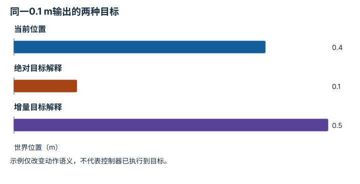
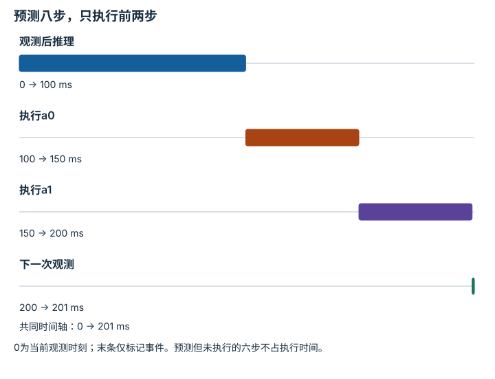
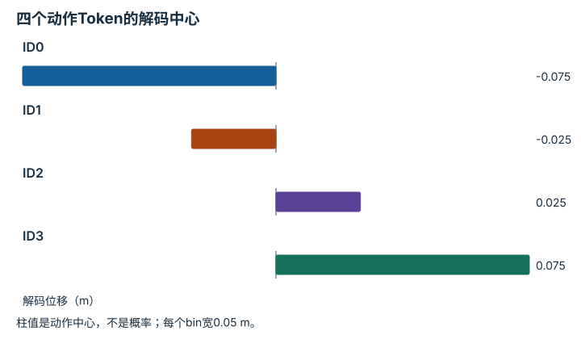
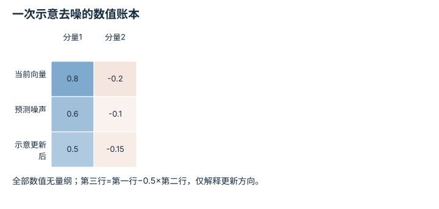

---
search:
  exclude: true
---

# 动作空间、分块、Token 与扩散：逐点细解

<!-- Generated by scripts/build_knowledge_atlas.py; edit knowledge/atlas/*.json. -->

[按小节学习](../index.md) · [全部知识点](../../index.md) · [返回原课程](../../../24-action-representation-and-tokenization.md)

Action spaces, chunks, tokens, and diffusion · 本页拆成 **4 个小知识点**。

先阅读直觉和原理，再独立完成算例、自测；图是解释工具，不是已掌握或真机验证的证明。

## 前置知识

[行为克隆与协变量偏移](../../learning-behavior-cloning/index.md) → [反馈、轨迹与饱和](../../system-feedback-control/index.md)

## 改一个参数试试看

固定预测长度 H，减小执行步数 K，观察重观测周期与动作占空比。

[打开对应交互实验](../../../learning-lab-cn.md#timing)。滑块在文档站运行，GitHub 文件预览提供静态推导；不连接机器人。

## 本页知识点

1. [绝对动作与增量动作：同一个数可能去向不同](#action-absolute-delta-frame)
2. [动作分块：预测长度与执行长度分开](#action-chunk-horizon)
3. [动作Token：离散编号如何还原连续量](#action-quantization)
4. [扩散动作：逐步去噪得到一个动作序列](#action-diffusion-denoising)

## 1. 绝对动作与增量动作：同一个数可能去向不同

**Absolute and delta action conventions**

**需要先懂：**坐标系、位置与位移

### 一句话直觉

数值0.1可能表示去到0.1 m，也可能表示再前进0.1 m；接口歧义会造成完全不同的运动。

### 原理拆开看

1. 绝对位置动作直接指定目标坐标，增量动作指定相对某个参考状态的变化。
2. 增量必须注明参考坐标系、参考时刻和复合顺序；三维旋转不能总按角度逐项相加。
3. 动作发布前执行单位与范围校验，并与数据标签定义一致。

### 手算或追踪一个例子

1. 教学当前位置x=0.4 m，动作数值为0.1 m。
2. 若协议为世界绝对位置，目标是0.1 m；若为世界平移增量，目标是0.5 m。
3. 两个解释相差0.4 m，模型输出长度和dtype却完全一样。

### 用图理解

<figure class="atlas-visual" tabindex="0" aria-label="同一0.1 m输出的两种目标；窄屏可在图内横向滚动">
<picture>
<source media="(max-width: 600px)" srcset="../../../assets/knowledge-atlas/action-absolute-delta-frame-mobile.svg">

</picture>
<figcaption>一维教学动作接口对比。</figcaption>
</figure>

- 数值相同不意味着物理目标相同。
- 图中没有速度、轨迹或安全约束，不能直接发送给硬件。

查看作图数据，自己复算

图上数值可能为便于阅读而取近似值，以下保留作图输入。

| 项目 | 世界位置（m） |
| --- | --- |
| 当前位置 | 0.4 |
| 绝对目标解释 | 0.1 |
| 增量目标解释 | 0.5 |

### 容易混淆的地方

**常见误解：**动作向量维度对了就能接到任意机器人。

**为什么不成立：**单位、坐标系、绝对/增量和执行频率都可能不同。

**正确理解：**把动作语义作为显式schema，并用小算例核对解码。

### 自测

机器人局部x轴相对世界转了90°，局部+x增量还是世界+x吗？

展开答案与推理

不是；必须先按当前姿态旋转到世界坐标，不能仅复制数值。

**原始资料：**[OpenVLA: Action Spaces and Unnormalization](https://github.com/openvla/openvla)

## 2. 动作分块：预测长度与执行长度分开

**Action chunks and execution horizon**

**需要先懂：**序列预测、反馈时序

### 一句话直觉

一次预测很多步能共享计算，但执行太久才重新观察会让反馈变旧。

### 原理拆开看

1. 预测H步动作不代表全部执行；滚动时域通常只执行前K步，要求1≤K≤H。
2. 教学同步串行模型推理耗时L，动作间隔Δt，周期为L+KΔt。
3. K增大可摊薄等待时间，却增加最后动作所依据观测的年龄；异步系统需另建模型。

### 手算或追踪一个例子

1. 教学H=8、K=2、L=100 ms、Δt=50 ms。
2. 先推理100 ms，再执行两个50 ms动作，周期200 ms。
3. 第二个动作在150 ms开始，使用周期起点观测；仅把H改成16且L不变，周期仍为200 ms。

### 用图理解

<figure class="atlas-visual" tabindex="0" aria-label="预测八步，只执行前两步；窄屏可在图内横向滚动">
<picture>
<source media="(max-width: 600px)" srcset="../../../assets/knowledge-atlas/action-chunk-horizon-mobile.svg">

</picture>
<figcaption>同步串行教学时序，不是ACT或Diffusion Policy实测延迟。</figcaption>
</figure>

- 两个实际动作窗口与推理窗口共同决定周期。
- 时间占比不能推导任务成功率或GPU利用率。

查看作图数据，自己复算

图上数值可能为便于阅读而取近似值，以下保留作图输入。

| 事件 | 开始 (ms) | 结束 (ms) |
| --- | --- | --- |
| 观测后推理 | 0 | 100 |
| 执行a0 | 100 | 150 |
| 执行a1 | 150 | 200 |
| 下一次观测 | 200 | 201 |

### 容易混淆的地方

**常见误解：**预测16步就必须16步后才能重新观测。

**为什么不成立：**预测horizon与实际执行前缀长度可独立配置。

**正确理解：**明确H、K、队列机制和重观测时刻。

### 自测

其他量不变，K改成4，周期与最后动作开始时观测年龄是多少？

展开答案与推理

周期300 ms；最后动作开始于100+3×50=250 ms，所以观测年龄250 ms。

**原始资料：**[Diffusion Policy: Receding Horizon Control](https://diffusion-policy.cs.columbia.edu/)

## 3. 动作Token：离散编号如何还原连续量

**Action quantization and tokenization**

**需要先懂：**区间、归一化

### 一句话直觉

语言模型可输出离散token，但机器人要连续动作；需要清楚的编码与反解码规则。

### 原理拆开看

1. 教学位移动作范围为[−0.1,0.1] m，均匀分成4个宽0.05 m的bin。
2. 编码记录所属bin索引，解码使用bin中心；边界归属与超范围处理需明确。
3. 量化引入分辨率误差；真实动作tokenizer可能采用非均匀、频域或学习表示，不能全部视作此方案。

### 手算或追踪一个例子

1. 教学bin中心为−0.075、−0.025、0.025、0.075 m；左闭右开，最右端点包含。
2. 动作0.04 m落入索引2的[0,0.05)区间。
3. 解码为0.025 m，误差−0.015 m；区间内最大中心量化误差为0.025 m。

### 用图理解

<figure class="atlas-visual" tabindex="0" aria-label="四个动作Token的解码中心；窄屏可在图内横向滚动">
<picture>
<source media="(max-width: 600px)" srcset="../../../assets/knowledge-atlas/action-quantization-mobile.svg">

</picture>
<figcaption>自定义均匀量化教学示例，不是OpenVLA实际词表配置。</figcaption>
</figure>

- 相邻索引对应0.05 m间隔，需通过表解码。
- 图未显示分类误差，也不证明更细量化能提高闭环成功率。

查看作图数据，自己复算

图上数值可能为便于阅读而取近似值，以下保留作图输入。

| 项目 | 解码位移（m） |
| --- | --- |
| ID0 | -0.075 |
| ID1 | -0.025 |
| ID2 | 0.025 |
| ID3 | 0.075 |

### 容易混淆的地方

**常见误解：**模型输出token ID2就代表关节移动2度。

**为什么不成立：**ID必须经过该模型专用解码、反归一化和动作协议。

**正确理解：**把词表、bin定义、单位与机器人接口绑定。

### 自测

相同范围改为8个均匀bin，最大中心量化误差多少？

展开答案与推理

bin宽0.025 m，最大误差0.0125 m；只减少量化误差，不保证策略更准。

**原始资料：**[OpenVLA Paper: Action Tokenization](https://arxiv.org/abs/2406.09246)

## 4. 扩散动作：逐步去噪得到一个动作序列

**Diffusion action generation**

**需要先懂：**条件分布、动作分块、高斯噪声

### 一句话直觉

动作分布有多种合理解时，模型可以从噪声开始，在观测条件下逐步生成一条候选序列。

### 原理拆开看

1. 训练时对标准化动作序列加入按噪声日程定义的噪声，学习对应的去噪目标。
2. 推理时从噪声样本出发，反复调用条件去噪网络与采样器得到动作块。
3. 采样步骤不是机器人执行步骤；输出还需反归一化、检查接口并按闭环方案执行。

### 手算或追踪一个例子

1. 教学仅展示一次简化去噪算术：当前无量纲向量(0.8,−0.2)，预测噪声(0.6,−0.1)。
2. 若示意更新规则为a新=a旧−0.5×噪声，得到(0.5,−0.15)。
3. 此规则不是完整DDPM/DDIM采样方程；真实更新还取决于训练参数化和噪声日程。

### 用图理解

<figure class="atlas-visual" tabindex="0" aria-label="一次示意去噪的数值账本；窄屏可在图内横向滚动">
<picture>
<source media="(max-width: 600px)" srcset="../../../assets/knowledge-atlas/action-diffusion-denoising-mobile.svg">

</picture>
<figcaption>教学算术，不是完整扩散采样器或实际动作轨迹。</figcaption>
</figure>

- 逐列核对减去半个预测噪声后的数值。
- 这三行不是三个机器人时刻，不能据此推断运动平滑性。

查看作图数据，自己复算

图上数值可能为便于阅读而取近似值，以下保留作图输入。

| 行 / 列 | 分量1 | 分量2 |
| --- | --- | --- |
| 当前向量 | 0.8 | -0.2 |
| 预测噪声 | 0.6 | -0.1 |
| 示意更新后 | 0.5 | -0.15 |

### 容易混淆的地方

**常见误解：**去噪迭代了10次，机器人就执行了10步。

**为什么不成立：**去噪是生成过程的内部计算，动作时间维是另一个轴。

**正确理解：**分别报告采样步数、动作horizon和实际执行前缀。

### 自测

减少采样步数是否必然保持同样动作分布？

展开答案与推理

不保证；需要相应采样器并验证质量与延迟，不能仅删除循环次数。

**原始资料：**[Diffusion Policy: Visuomotor Policy Learning via Action Diffusion](https://diffusion-policy.cs.columbia.edu/)

## 从理解走向证据

本节点原有验收要求：把一次策略输出解码为可执行命令，并检查单位与边界。

完成图解自测后，回到[原课程](../../../24-action-representation-and-tokenization.md)运行对应示例并保留证据；浏览页面和查看答案不会自动获得课程晋级。
