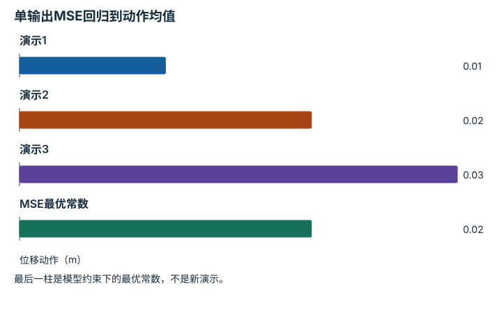
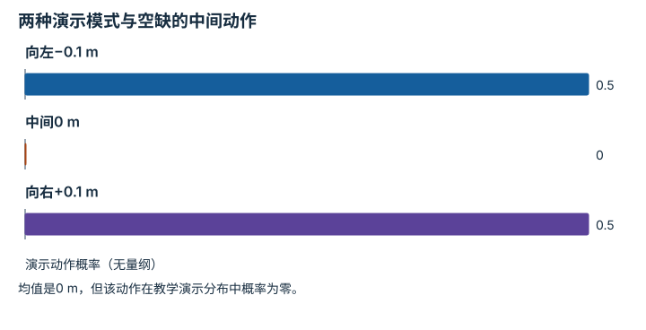
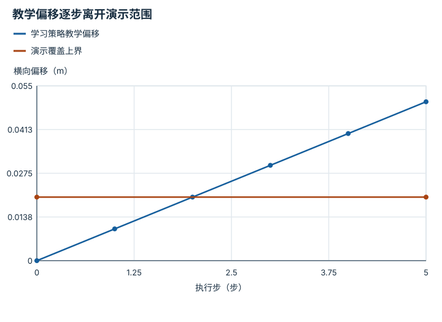
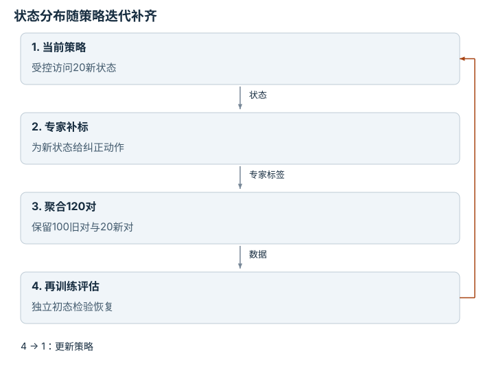

---
search:
  exclude: true
---

# 行为克隆与协变量偏移：逐点细解

<!-- Generated by scripts/build_knowledge_atlas.py; edit knowledge/atlas/*.json. -->

[按小节学习](../index.md) · [全部知识点](../../index.md) · [返回原课程](../../../22-act-vs-diffusion-policy.md)

Behavior cloning and covariate shift · 本页拆成 **4 个小知识点**。

先阅读直觉和原理，再独立完成算例、自测；图是解释工具，不是已掌握或真机验证的证明。

## 前置知识

[数据质量、覆盖与无泄漏切分](../../data-quality-splits/index.md) → [神经网络与优化循环](../../learning-neural-networks/index.md)

## 本页知识点

1. [行为克隆：把演示动作当作监督目标](#bc-supervised-policy)
2. [多解动作：平均两条好路线可能走向障碍](#bc-multimodal-actions)
3. [协变量偏移：自己的错误会改变后续输入](#bc-covariate-shift)
4. [DAgger：在学习者会到达的状态补标注](#bc-dagger-corrections)

## 1. 行为克隆：把演示动作当作监督目标

**Behavior cloning objective**

**需要先懂：**监督学习、观测动作协议

### 一句话直觉

演示者已经给出在某个观测下做什么，行为克隆学习从观测预测这些动作。

### 原理拆开看

1. 训练对为观测o与演示动作a，动作单位、坐标系和时序必须一致。
2. 确定性回归可最小化动作平方误差；概率策略可最大化演示动作的条件似然。
3. 优化针对演示分布，不直接保证策略自身闭环访问的状态都有高质量输出。

### 手算或追踪一个例子

1. 教学同一观测附近的三个一维位移动作为0.01、0.02、0.03 m，模型只能输出一个常数。
2. MSE最优常数是均值0.02 m。
3. 残差平方平均为(0.0001+0+0.0001)/3≈0.0000667 m²；这是离线拟合而非抓取成功率。

### 用图理解

<figure class="atlas-visual" tabindex="0" aria-label="单输出MSE回归到动作均值；窄屏可在图内横向滚动">
<picture>
<source media="(max-width: 600px)" srcset="../../../assets/knowledge-atlas/bc-supervised-policy-mobile.svg">

</picture>
<figcaption>同一观测附近的教学动作标签。</figcaption>
</figure>

- 输出位于三个标签中心，反映均方误差目标。
- 没有环境转移或碰撞信息，无法证明这个动作可执行。

查看作图数据，自己复算

图上数值可能为便于阅读而取近似值，以下保留作图输入。

| 项目 | 位移动作（m） |
| --- | --- |
| 演示1 | 0.01 |
| 演示2 | 0.02 |
| 演示3 | 0.03 |
| MSE最优常数 | 0.02 |

### 容易混淆的地方

**常见误解：**行为克隆在任何情况下都不可能超过演示者。

**为什么不成立：**多演示者数据、去噪、任务指标与泛化都使这种绝对结论不成立。

**正确理解：**说明数据、目标和评估条件，不从监督形式推导普遍性能上限。

### 自测

模型离线MSE更低，是否必然闭环更成功？

展开答案与推理

不必然；误差时序、危险方向及访问状态分布都会影响闭环结果。

**原始资料：**[Ross et al.: Imitation Learning and Dataset Aggregation](https://proceedings.mlr.press/v15/ross11a.html)

## 2. 多解动作：平均两条好路线可能走向障碍

**Multimodal action distributions**

**需要先懂：**均方误差、条件分布

### 一句话直觉

遇到障碍可以从左绕也可以从右绕，左右动作的平均值可能恰好指向障碍。

### 原理拆开看

1. 相似观测下可能存在多个有效动作模式，而不是唯一标签。
2. 单一确定性MSE输出倾向条件均值，多峰分布的均值可能位于低概率区域。
3. 分布建模、潜变量或序列策略可以表达多种候选，但仍需保证选出的整段动作一致。

### 手算或追踪一个例子

1. 教学横向绕行动作标签为−0.1和+0.1 m，各出现一半；中间方向被障碍占据。
2. 输出0时MSE为0.01 m²；输出−0.1时MSE为0.02 m²。
3. MSE偏好0，却可能对应不可行方向，说明损失与多解结构需要一起考虑。

### 用图理解

<figure class="atlas-visual" tabindex="0" aria-label="两种演示模式与空缺的中间动作；窄屏可在图内横向滚动">
<picture>
<source media="(max-width: 600px)" srcset="../../../assets/knowledge-atlas/bc-multimodal-actions-mobile.svg">

</picture>
<figcaption>教学分布，不是实际避障数据。</figcaption>
</figure>

- 两端都有质量，中间没有，显示双峰结构。
- 柱状概率不包含完整轨迹动力学，不能单独规划安全路线。

查看作图数据，自己复算

图上数值可能为便于阅读而取近似值，以下保留作图输入。

| 项目 | 演示动作概率（无量纲） |
| --- | --- |
| 向左−0.1 m | 0.5 |
| 中间0 m | 0 |
| 向右+0.1 m | 0.5 |

### 容易混淆的地方

**常见误解：**损失最小的平均动作一定也是最合理的物理动作。

**为什么不成立：**非凸可行空间不保留两个可行动作的均值可行性。

**正确理解：**检查条件动作分布及任务约束，而非只比较标量损失。

### 自测

输出左右各50%概率后，每一步独立抽样就足够吗？

展开答案与推理

未必；连续左右切换可能破坏路线一致性，需要合适的时间相关性或动作块设计。

**原始资料：**[Diffusion Policy: Multimodal Action Distributions](https://diffusion-policy.cs.columbia.edu/)

## 3. 协变量偏移：自己的错误会改变后续输入

**Covariate shift in imitation learning**

**需要先懂：**闭环反馈、训练分布

### 一句话直觉

机器人稍微偏离演示轨迹后，会看到演示者很少见到的画面，后续预测可能更不可靠。

### 原理拆开看

1. 演示数据中的观测分布由演示策略产生，部署观测分布则由学习策略和环境共同产生。
2. 一次动作误差改变后续状态，新的状态可能超出演示覆盖。
3. 因此独立样本上的小误差不自动保证长序列行为；需要闭环、扰动和恢复评估。

### 手算或追踪一个例子

1. 教学无反馈横向偏移模型每步增加0.01 m误差，初始偏移0。
2. 五步后偏移依次为0.01、0.02、0.03、0.04、0.05 m。
3. 若演示只覆盖±0.02 m附近，第3步起已离开已知覆盖；这是可检查的累积示意而非所有策略的误差定律。

### 用图理解

<figure class="atlas-visual" tabindex="0" aria-label="教学偏移逐步离开演示范围；窄屏可在图内横向滚动">
<picture>
<source media="(max-width: 600px)" srcset="../../../assets/knowledge-atlas/bc-covariate-shift-mobile.svg">

</picture>
<figcaption>人为假定每步同向误差0.01 m；连线只连接离散步骤。</figcaption>
</figure>

- 轨迹在第3步超过示例覆盖上界。
- 该图未训练任何策略，不能作为BC实际误差速度的证据。

查看作图数据，自己复算

图上数值可能为便于阅读而取近似值，以下保留作图输入。线段的含义以本图图注和读图说明为准，不应自行解释为实测连续轨迹。

| 曲线 | 执行步（步） | 横向偏移（m） |
| --- | --- | --- |
| 学习策略教学偏移 | 0 | 0 |
| 学习策略教学偏移 | 1 | 0.01 |
| 学习策略教学偏移 | 2 | 0.02 |
| 学习策略教学偏移 | 3 | 0.03 |
| 学习策略教学偏移 | 4 | 0.04 |
| 学习策略教学偏移 | 5 | 0.05 |
| 演示覆盖上界 | 0 | 0.02 |
| 演示覆盖上界 | 5 | 0.02 |

### 容易混淆的地方

**常见误解：**所有BC误差都严格按步数线性增长。

**为什么不成立：**真实系统可能恢复、放大或改变误差方向，具体取决于闭环。

**正确理解：**把此例当作风险机制，实际用轨迹证据测量。

### 自测

为什么只随机抽测试帧难以发现这个问题？

展开答案与推理

这些帧可能仍来自演示分布，没有包含策略自身偏离后会访问的状态。

**原始资料：**[Ross et al.: Distribution Shift in Imitation Learning](https://proceedings.mlr.press/v15/ross11a.html)

## 4. DAgger：在学习者会到达的状态补标注

**Dataset Aggregation**

**需要先懂：**协变量偏移、专家标注

### 一句话直觉

只重复最初演示不一定教会恢复；应询问专家在学习者偏离后的状态会如何处理。

### 原理拆开看

1. 在受控环境中运行当前学习策略，收集它实际访问的状态。
2. 为这些状态获得专家动作标签，与已有数据聚合后重新训练；具体执行可使用安全约束与专家介入。
3. 迭代改变训练状态分布，缓解分布偏移；新增标签的质量、成本与安全条件仍需评估。

### 手算或追踪一个例子

1. 教学原数据100个状态动作对，学习者访问20个新的偏移状态。
2. 专家对这20个状态给出纠正标签，聚合成120个训练对。
3. 重新训练后在独立初态测试恢复；不能仅因数据增至120就宣布提升。

### 用图理解

<figure class="atlas-visual" tabindex="0" aria-label="状态分布随策略迭代补齐；窄屏可在图内横向滚动">
<picture>
<source media="(max-width: 600px)" srcset="../../../assets/knowledge-atlas/bc-dagger-corrections-mobile.svg">

</picture>
<figcaption>教学DAgger循环；不授权真实机器人试错。</figcaption>
</figure>

- 关键新增信息是新状态上的专家动作，而不只是更多帧。
- 闭环箭头表示算法迭代，不证明具体任务已经成功。

### 容易混淆的地方

**常见误解：**DAgger就是把失败轨迹原动作直接复制进标签。

**为什么不成立：**它要求在所访问状态上获得适当专家动作，而非重复错误动作。

**正确理解：**明确状态采集策略、专家标签来源和独立验证。

### 自测

若偏移状态危险，可否为了数据让真机继续探索？

展开答案与推理

不应；采集受安全边界约束，可先在仿真、离线复核或受控专家介入流程中进行。

**原始资料：**[Ross, Gordon and Bagnell: DAgger](https://proceedings.mlr.press/v15/ross11a.html)

## 从理解走向证据

本节点原有验收要求：在固定 episode 上比较离线损失与闭环任务成功。

完成图解自测后，回到[原课程](../../../22-act-vs-diffusion-policy.md)运行对应示例并保留证据；浏览页面和查看答案不会自动获得课程晋级。
