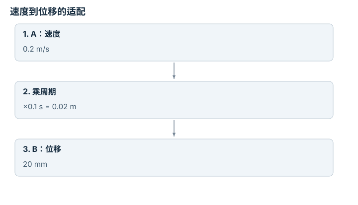

---
hide:
  - navigation
---

<!-- Generated by scripts/build_knowledge_atlas.py; edit knowledge/atlas/*.json. -->

<nav class="study-breadcrumb" aria-label="学习位置" markdown="1">
[知识目录](../../index.md) / [跨本体适配与机器人基础模型](../index.md)
</nav>

L4 · 本章第 1 / 4 节

# 动作向量相同，不代表动作含义相同

**Action semantics**

先确认每个数命令的是位置、位移还是速度，再讨论机器人之间迁移。

先确认：这些前置知识我懂了吗？

坐标系、单位

[视觉-语言-动作策略](../../learning-vla/index.md) · [驱动、传动与限制](../../robot-actuation-transmission/index.md) · [接口、配置与测试](../../computing-software-contracts/index.md)

<section class="study-section " markdown="1">

## 1 · 原理拆开看

1. 定义动作a的单位、坐标系和控制周期Δt；七维向量的长度不能说明七个分量含义。
2. 速度命令需乘Δt才成为位移；绝对位置还需要参考原点，不能只乘一个缩放系数。
3. 在训练前建立显式adapter，将原始动作解码成统一语义，再编码到目标控制器。

</section>

<section class="study-section " markdown="1">

## 2 · 跟着例子算一遍

1. 教学例：机器人A输出x速度0.2 m/s，周期0.1 s；机器人B接收每周期x位移，单位mm。
2. 一次周期位移为0.2×0.1=0.02 m=20 mm。
3. 若直接发送数值0.2，B只移动0.2 mm，动作缩小100倍；正确适配输出20。

</section>

<section class="study-section " markdown="1">

## 3 · 对照图，解释变化

<figure class="atlas-visual" tabindex="0" aria-label="速度到位移的适配；窄屏可在图内横向滚动">
<picture>
<source media="(max-width: 600px)" srcset="../../../assets/knowledge-atlas/cross-action-semantics-mobile.svg">

</picture>
<figcaption>教学单位转换；每一步都保留物理语义。</figcaption>
</figure>

- 箭头表示解码与单位转换，不是神经网络自动理解单位。
- 图只比较单轴，旋转、夹爪和参考坐标系还需单独定义。

</section>

<section class="study-section study-misconception" markdown="1">

## 4 · 避开一个误区

**容易误以为：**同为七维动作，可以直接混合训练。

**为什么不成立：**张量形状没约束单位、参照系或控制模式。

**正确理解：**先对齐语义，再决定哪些分量共享。

</section>

<section class="study-section study-check" markdown="1">

## 5 · 先独立回答

周期改成0.05 s，B应收到多少？

我已作答，查看推理

10 mm；同一速度下周期减半，每步位移也减半，不能沿用20。

</section>

继续查阅原始资料

- [ROS REP-103：单位与坐标约定](https://github.com/ros-infrastructure/rep/blob/master/rep-0103.rst)
- [Open X-Embodiment 作者项目](https://robotic-transformer-x.github.io/)

<nav class="study-pagination" aria-label="相邻小节" markdown="1">

[← 本章学习顺序](../index.md)

[缺失模态必须与真实零值区分 →](../cross-observation-mask/index.md)

</nav>

[返回本章目录](../index.md) · [整章连续阅读](../complete/index.md)

本章最后需要提交什么？

报告适配覆盖与分本体结果，不用汇总掩盖失败。

回到[原课程](../../../25-cross-embodiment-adaptation.md)完成实践。阅读位置或查看答案不计为通过验收。

