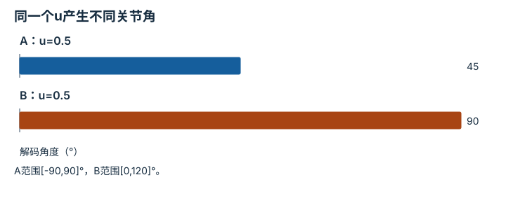

---
hide:
  - navigation
---

<!-- Generated by scripts/build_knowledge_atlas.py; edit knowledge/atlas/*.json. -->

<nav class="study-breadcrumb" aria-label="学习位置" markdown="1">
[知识目录](../../index.md) / [跨本体适配与机器人基础模型](../index.md)
</nav>

L4 · 本章第 4 / 4 节

# 归一化动作仍需检查本体可行域

**Normalization and embodiment limits**

网络输出都在[-1,1]，并不表示两个机器人能做同样的事。

先确认：这些前置知识我懂了吗？

范围映射、关节限位

[视觉-语言-动作策略](../../learning-vla/index.md) · [驱动、传动与限制](../../robot-actuation-transmission/index.md) · [接口、配置与测试](../../computing-software-contracts/index.md)

<section class="study-section " markdown="1">

## 1 · 原理拆开看

1. 令归一化值u落在[-1,1]，目标关节范围为[qmin,qmax]；线性解码为qmin+(u+1)(qmax−qmin)/2。
2. 这个映射只满足单关节位置范围，没有保证速度、碰撞或末端任务可达。
3. 跨本体共享策略输出后仍要经过目标机器人的运动学与约束检查。

</section>

<section class="study-section " markdown="1">

## 2 · 跟着例子算一遍

1. 教学例：u=0.5；机器人A关节范围[-90°,90°]，B为[0°,120°]。
2. A解码为45°，B解码为90°；二者都合法但姿态不是同一个。
3. 因此必须验证末端目标与碰撞，不能用归一化值相等宣称动作已对齐。

</section>

<section class="study-section " markdown="1">

## 3 · 对照图，解释变化

<figure class="atlas-visual" tabindex="0" aria-label="同一个u产生不同关节角；窄屏可在图内横向滚动">
<picture>
<source media="(max-width: 600px)" srcset="../../../assets/knowledge-atlas/cross-normalize-feasibility-mobile.svg">

</picture>
<figcaption>教学线性解码结果，不代表性能比较。</figcaption>
</figure>

- 两根柱子的差异来自解码范围，不是预测错误。
- 即使角度相同，不同几何机器人也不一定到达同一末端位置。

查看作图数据，自己复算

图上数值可能为便于阅读而取近似值，以下保留作图输入。

| 项目 | 解码角度（°） |
| --- | --- |
| A：u=0.5 | 45 |
| B：u=0.5 | 90 |

</section>

<section class="study-section study-misconception" markdown="1">

## 4 · 避开一个误区

**容易误以为：**归一化统一后，本体差异消失。

**为什么不成立：**归一化改变数值范围，没有改变连杆、关节和执行能力。

**正确理解：**把统计标准化与物理可行性作为两个独立检查。

</section>

<section class="study-section study-check" markdown="1">

## 5 · 先独立回答

u=1.2应直接发给目标机器人吗？

我已作答，查看推理

不应；先标记超域。是否截断或拒绝必须由已定义的准入策略决定，不能静默掩盖策略异常。

</section>

继续查阅原始资料

- [Open X-Embodiment 作者项目](https://robotic-transformer-x.github.io/)
- [MIT Manipulation：Motion Planning](https://manipulation.mit.edu/trajectories.html)

<nav class="study-pagination" aria-label="相邻小节" markdown="1">

[← 跨机器人采样率不能靠复制帧对齐](../cross-rate-resampling/index.md)

[回原课程动手验证 →](../../../25-cross-embodiment-adaptation.md)

</nav>

[返回本章目录](../index.md) · [整章连续阅读](../complete/index.md)

本章最后需要提交什么？

报告适配覆盖与分本体结果，不用汇总掩盖失败。

回到[原课程](../../../25-cross-embodiment-adaptation.md)完成实践。阅读位置或查看答案不计为通过验收。

