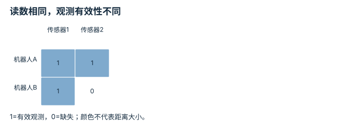

---
hide:
  - navigation
---

<!-- Generated by scripts/build_knowledge_atlas.py; edit knowledge/atlas/*.json. -->

<nav class="study-breadcrumb" aria-label="学习位置" markdown="1">
[知识目录](../../index.md) / [跨本体适配与机器人基础模型](../index.md)
</nav>

L4 · 本章第 2 / 4 节

# 缺失模态必须与真实零值区分

**Missing-modality mask**

没有腕部相机不是“看见一张全黑图片”，缺失信息要单独告诉模型。

先确认：这些前置知识我懂了吗？

张量形状

[视觉-语言-动作策略](../../learning-vla/index.md) · [驱动、传动与限制](../../robot-actuation-transmission/index.md) · [接口、配置与测试](../../computing-software-contracts/index.md)

<section class="study-section " markdown="1">

## 1 · 原理拆开看

1. 令观测向量z包含传感器读数，mask中的1表示确实观测到，0表示缺失。
2. 用占位零保持批次形状，但同时传递mask，避免把缺失当作物理零值。
3. 训练与部署必须使用同一缺失语义，否则模型可能依赖训练时总存在的传感器。

</section>

<section class="study-section " markdown="1">

## 2 · 跟着例子算一遍

1. 教学例：两台机器人各有两个距离槽位，A读数[0.4,0.0] m且mask=[1,1]。
2. B只有第一个传感器，填充[0.4,0.0] m但mask=[1,0]。
3. 相同数值数组对应不同信息：A第二路报告零距离，B第二路没有测量。

</section>

<section class="study-section " markdown="1">

## 3 · 对照图，解释变化

<figure class="atlas-visual" tabindex="0" aria-label="读数相同，观测有效性不同；窄屏可在图内横向滚动">
<picture>
<source media="(max-width: 600px)" srcset="../../../assets/knowledge-atlas/cross-observation-mask-mobile.svg">

</picture>
<figcaption>教学二值有效性矩阵。</figcaption>
</figure>

- 先读B右下角的0：这里是缺失，不是零距离。
- 矩阵不证明模型已学会鲁棒处理mask，需要单独评测。

查看作图数据，自己复算

图上数值可能为便于阅读而取近似值，以下保留作图输入。

| 行 / 列 | 传感器1 | 传感器2 |
| --- | --- | --- |
| 机器人A | 1 | 1 |
| 机器人B | 1 | 0 |

</section>

<section class="study-section study-misconception" markdown="1">

## 4 · 避开一个误区

**容易误以为：**缺失值填零后模型自然会分辨。

**为什么不成立：**真实传感器也可能输出零，数值本身没有缺失标志。

**正确理解：**保留mask与模态配置，并测试缺失模态的降级行为。

</section>

<section class="study-section study-check" markdown="1">

## 5 · 先独立回答

用-1当占位值就能删掉mask吗？

我已作答，查看推理

只有接口严格保证-1不可能出现且所有下游统一识别时才可作特殊编码；显式mask更清楚。

</section>

继续查阅原始资料

- [Open X-Embodiment 作者项目](https://robotic-transformer-x.github.io/)

<nav class="study-pagination" aria-label="相邻小节" markdown="1">

[← 动作向量相同，不代表动作含义相同](../cross-action-semantics/index.md)

[跨机器人采样率不能靠复制帧对齐 →](../cross-rate-resampling/index.md)

</nav>

[返回本章目录](../index.md) · [整章连续阅读](../complete/index.md)

本章最后需要提交什么？

报告适配覆盖与分本体结果，不用汇总掩盖失败。

回到[原课程](../../../25-cross-embodiment-adaptation.md)完成实践。阅读位置或查看答案不计为通过验收。

