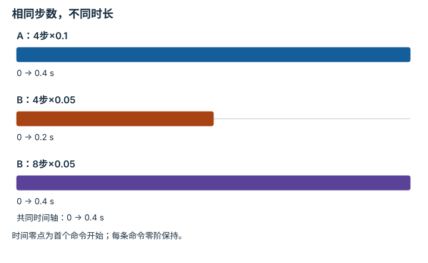

# 跨本体适配与机器人基础模型：逐点细解

<!-- Generated by scripts/build_knowledge_atlas.py; edit knowledge/atlas/*.json. -->

[全部知识点](../index.md) · [返回原课程](../../25-cross-embodiment-adaptation.md)

Cross-embodiment adaptation and robot foundation models · 本页拆成 **4 个小知识点**。

先阅读直觉和原理，再独立完成算例、自测；图是解释工具，不是已掌握或真机验证的证明。

## 前置知识

[视觉-语言-动作策略](../learning-vla/index.md) → [驱动、传动与限制](../robot-actuation-transmission/index.md) → [接口、配置与测试](../computing-software-contracts/index.md)

## 本页知识点

1. [动作向量相同，不代表动作含义相同](#cross-action-semantics)
2. [缺失模态必须与真实零值区分](#cross-observation-mask)
3. [跨机器人采样率不能靠复制帧对齐](#cross-rate-resampling)
4. [归一化动作仍需检查本体可行域](#cross-normalize-feasibility)

## 1. 动作向量相同，不代表动作含义相同

**Action semantics**

**需要先懂：**坐标系、单位

### 一句话直觉

先确认每个数命令的是位置、位移还是速度，再讨论机器人之间迁移。

### 原理拆开看

1. 定义动作a的单位、坐标系和控制周期Δt；七维向量的长度不能说明七个分量含义。
2. 速度命令需乘Δt才成为位移；绝对位置还需要参考原点，不能只乘一个缩放系数。
3. 在训练前建立显式adapter，将原始动作解码成统一语义，再编码到目标控制器。

### 手算或追踪一个例子

1. 教学例：机器人A输出x速度0.2 m/s，周期0.1 s；机器人B接收每周期x位移，单位mm。
2. 一次周期位移为0.2×0.1=0.02 m=20 mm。
3. 若直接发送数值0.2，B只移动0.2 mm，动作缩小100倍；正确适配输出20。

### 用图理解

<figure class="atlas-visual" tabindex="0" aria-label="速度到位移的适配；窄屏可在图内横向滚动">
<picture>
<source media="(max-width: 600px)" srcset="../../assets/knowledge-atlas/cross-action-semantics-mobile.svg">

</picture>
<figcaption>教学单位转换；每一步都保留物理语义。</figcaption>
</figure>

- 箭头表示解码与单位转换，不是神经网络自动理解单位。
- 图只比较单轴，旋转、夹爪和参考坐标系还需单独定义。

### 容易混淆的地方

**常见误解：**同为七维动作，可以直接混合训练。

**为什么不成立：**张量形状没约束单位、参照系或控制模式。

**正确理解：**先对齐语义，再决定哪些分量共享。

### 自测

周期改成0.05 s，B应收到多少？

展开答案与推理

10 mm；同一速度下周期减半，每步位移也减半，不能沿用20。

**原始资料：**[ROS REP-103：单位与坐标约定](https://github.com/ros-infrastructure/rep/blob/master/rep-0103.rst) · [Open X-Embodiment 作者项目](https://robotic-transformer-x.github.io/)

## 2. 缺失模态必须与真实零值区分

**Missing-modality mask**

**需要先懂：**张量形状

### 一句话直觉

没有腕部相机不是“看见一张全黑图片”，缺失信息要单独告诉模型。

### 原理拆开看

1. 令观测向量z包含传感器读数，mask中的1表示确实观测到，0表示缺失。
2. 用占位零保持批次形状，但同时传递mask，避免把缺失当作物理零值。
3. 训练与部署必须使用同一缺失语义，否则模型可能依赖训练时总存在的传感器。

### 手算或追踪一个例子

1. 教学例：两台机器人各有两个距离槽位，A读数[0.4,0.0] m且mask=[1,1]。
2. B只有第一个传感器，填充[0.4,0.0] m但mask=[1,0]。
3. 相同数值数组对应不同信息：A第二路报告零距离，B第二路没有测量。

### 用图理解

<figure class="atlas-visual" tabindex="0" aria-label="读数相同，观测有效性不同；窄屏可在图内横向滚动">
<picture>
<source media="(max-width: 600px)" srcset="../../assets/knowledge-atlas/cross-observation-mask-mobile.svg">

</picture>
<figcaption>教学二值有效性矩阵。</figcaption>
</figure>

- 先读B右下角的0：这里是缺失，不是零距离。
- 矩阵不证明模型已学会鲁棒处理mask，需要单独评测。

查看作图数据，自己复算

图上数值可能为便于阅读而取近似值，以下保留作图输入。

| 行 / 列 | 传感器1 | 传感器2 |
| --- | --- | --- |
| 机器人A | 1 | 1 |
| 机器人B | 1 | 0 |

### 容易混淆的地方

**常见误解：**缺失值填零后模型自然会分辨。

**为什么不成立：**真实传感器也可能输出零，数值本身没有缺失标志。

**正确理解：**保留mask与模态配置，并测试缺失模态的降级行为。

### 自测

用-1当占位值就能删掉mask吗？

展开答案与推理

只有接口严格保证-1不可能出现且所有下游统一识别时才可作特殊编码；显式mask更清楚。

**原始资料：**[Open X-Embodiment 作者项目](https://robotic-transformer-x.github.io/)

## 3. 跨机器人采样率不能靠复制帧对齐

**Temporal alignment**

**需要先懂：**时间戳、速度

### 一句话直觉

不同控制频率会让同样长度的动作块覆盖不同真实时间。

### 原理拆开看

1. 定义采样周期Δt，长度K的动作块覆盖时长KΔt；时间长度与张量长度是两回事。
2. 重采样前确认动作是零阶保持命令、连续速度还是离散事件，选择对应插值策略。
3. 把观测曝光和动作执行时间对齐；复制图像不能产生新的独立观测。

### 手算或追踪一个例子

1. 教学例：A以10 Hz输出4步速度动作，覆盖4×0.1=0.4 s。
2. B以20 Hz执行同一恒定速度0.1 m/s，需8步覆盖0.4 s。
3. 两者总位移都是0.04 m；只复制成4步会让B只走0.02 m。

### 用图理解

<figure class="atlas-visual" tabindex="0" aria-label="相同步数，不同时长；窄屏可在图内横向滚动">
<picture>
<source media="(max-width: 600px)" srcset="../../assets/knowledge-atlas/cross-rate-resampling-mobile.svg">

</picture>
<figcaption>教学动作块覆盖时间，不表示实测延迟。</figcaption>
</figure>

- A和B的8步区间对齐，B的4步区间只覆盖一半。
- 时间对齐不保证执行器带宽、延迟和接触行为相同。

查看作图数据，自己复算

图上数值可能为便于阅读而取近似值，以下保留作图输入。

| 事件 | 开始 (s) | 结束 (s) |
| --- | --- | --- |
| A：4步×0.1 | 0 | 0.4 |
| B：4步×0.05 | 0 | 0.2 |
| B：8步×0.05 | 0 | 0.4 |

### 容易混淆的地方

**常见误解：**把所有序列裁成4步就实现时序标准化。

**为什么不成立：**相同步数可能对应不同物理时长。

**正确理解：**保留时间戳，按时间与动作语义对齐。

### 自测

A的夹爪关闭事件可用线性插值成半关闭事件吗？

展开答案与推理

不能默认这样做；离散事件应保留发生时刻，并依据目标夹爪协议映射。

**原始资料：**[Open X-Embodiment 作者项目](https://robotic-transformer-x.github.io/) · [ROS REP-103：单位与坐标约定](https://github.com/ros-infrastructure/rep/blob/master/rep-0103.rst)

## 4. 归一化动作仍需检查本体可行域

**Normalization and embodiment limits**

**需要先懂：**范围映射、关节限位

### 一句话直觉

网络输出都在[-1,1]，并不表示两个机器人能做同样的事。

### 原理拆开看

1. 令归一化值u落在[-1,1]，目标关节范围为[qmin,qmax]；线性解码为qmin+(u+1)(qmax−qmin)/2。
2. 这个映射只满足单关节位置范围，没有保证速度、碰撞或末端任务可达。
3. 跨本体共享策略输出后仍要经过目标机器人的运动学与约束检查。

### 手算或追踪一个例子

1. 教学例：u=0.5；机器人A关节范围[-90°,90°]，B为[0°,120°]。
2. A解码为45°，B解码为90°；二者都合法但姿态不是同一个。
3. 因此必须验证末端目标与碰撞，不能用归一化值相等宣称动作已对齐。

### 用图理解

<figure class="atlas-visual" tabindex="0" aria-label="同一个u产生不同关节角；窄屏可在图内横向滚动">
<picture>
<source media="(max-width: 600px)" srcset="../../assets/knowledge-atlas/cross-normalize-feasibility-mobile.svg">

</picture>
<figcaption>教学线性解码结果，不代表性能比较。</figcaption>
</figure>

- 两根柱子的差异来自解码范围，不是预测错误。
- 即使角度相同，不同几何机器人也不一定到达同一末端位置。

查看作图数据，自己复算

图上数值可能为便于阅读而取近似值，以下保留作图输入。

| 项目 | 解码角度（°） |
| --- | --- |
| A：u=0.5 | 45 |
| B：u=0.5 | 90 |

### 容易混淆的地方

**常见误解：**归一化统一后，本体差异消失。

**为什么不成立：**归一化改变数值范围，没有改变连杆、关节和执行能力。

**正确理解：**把统计标准化与物理可行性作为两个独立检查。

### 自测

u=1.2应直接发给目标机器人吗？

展开答案与推理

不应；先标记超域。是否截断或拒绝必须由已定义的准入策略决定，不能静默掩盖策略异常。

**原始资料：**[Open X-Embodiment 作者项目](https://robotic-transformer-x.github.io/) · [MIT Manipulation：Motion Planning](https://manipulation.mit.edu/trajectories.html)

## 从理解走向证据

本节点原有验收要求：报告适配覆盖与分本体结果，不用汇总掩盖失败。

完成图解自测后，回到[原课程](../../25-cross-embodiment-adaptation.md)运行对应示例并保留证据；浏览页面和查看答案不会自动获得课程晋级。
