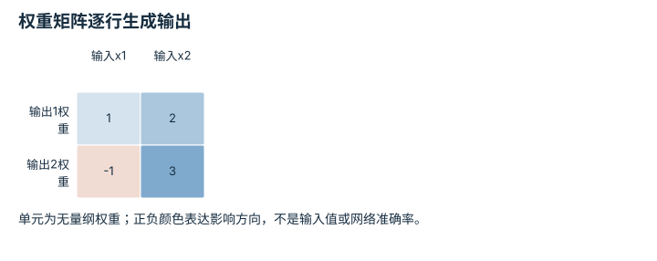
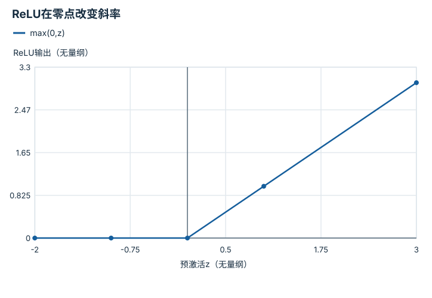
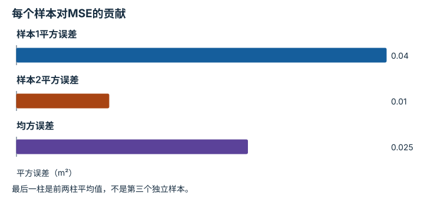
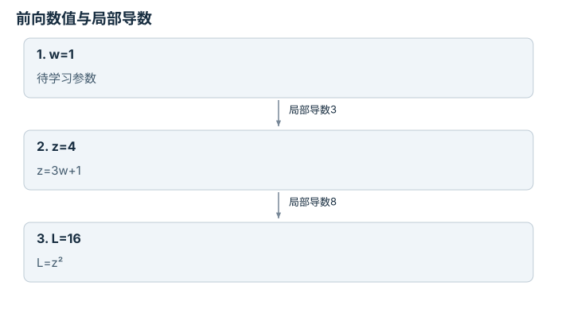

---
search:
  exclude: true
---

# 神经网络与优化循环：逐点细解

<!-- Generated by scripts/build_knowledge_atlas.py; edit knowledge/atlas/*.json. -->

[按小节学习](../index.md) · [全部知识点](../../index.md) · [返回原课程](../../../foundations/03-deep-learning-basics.md)

Neural networks and optimization loops · 本页拆成 **7 个小知识点**。

先阅读直觉和原理，再独立完成算例、自测；图是解释工具，不是已掌握或真机验证的证明。

## 前置知识

[线性代数与最小二乘](../../math-linear-algebra/index.md) → [目标、约束与优化](../../math-optimization/index.md)

## 本页知识点

1. [线性层：每个输出是输入的加权组合](#nn-linear-layer)
2. [非线性：为什么堆线性层还不够](#nn-nonlinear-activation)
3. [损失：把预测差异变成优化目标](#nn-loss-function)
4. [链式法则：参数怎样影响最终损失](#nn-chain-rule)
5. [反向传播：分支梯度要相加](#nn-backprop-accumulation)
6. [优化器：沿梯度走多大一步](#nn-optimizer-learning-rate)
7. [验证：训练损失下降之后还要问什么](#nn-validation-generalization)

## 1. 线性层：每个输出是输入的加权组合

**Affine linear layer**

**需要先懂：**矩阵乘法、张量形状

### 一句话直觉

网络首先要把输入特征组合成新的特征，权重决定每个输入对输出的影响。

### 原理拆开看

1. 单样本列向量x维度为2，权重W形状2×2，偏置b维度2；本例特征均无量纲。
2. 计算y=Wx+b，每个输出使用W的一行与x点积。
3. 批量实现需注意行向量约定；PyTorch Linear保存的权重形状为输出维×输入维，不应盲目照搬手写转置。

### 手算或追踪一个例子

1. 教学输入x=(2,1)，W的两行为(1,2)、(−1,3)，b=(0.5,−0.5)。
2. 第一个输出1×2+2×1+0.5=4.5；第二个输出−1×2+3×1−0.5=0.5。
3. 得到两个新特征(4.5,0.5)；此层共有4个权重和2个偏置，共6个参数。

### 用图理解

<figure class="atlas-visual" tabindex="0" aria-label="权重矩阵逐行生成输出；窄屏可在图内横向滚动">
<picture>
<source media="(max-width: 600px)" srcset="../../../assets/knowledge-atlas/nn-linear-layer-mobile.svg">

</picture>
<figcaption>教学权重；还需乘输入并加偏置。</figcaption>
</figure>

- 沿第一行与输入(2,1)点积，再加0.5。
- 仅看权重矩阵不能得到输出，还需要具体输入和偏置。

查看作图数据，自己复算

图上数值可能为便于阅读而取近似值，以下保留作图输入。

| 行 / 列 | 输入x1 | 输入x2 |
| --- | --- | --- |
| 输出1权重 | 1 | 2 |
| 输出2权重 | -1 | 3 |

### 容易混淆的地方

**常见误解：**线性层名字有线性，所以带偏置后仍必须穿过原点。

**为什么不成立：**带偏置实际是仿射映射；输入为零时输出b。

**正确理解：**区分线性部分Wx与偏置b，并核对实际张量约定。

### 自测

输入x=(0,0)时输出是什么？

展开答案与推理

输出(0.5,−0.5)，由偏置决定而不是必然为零。

**原始资料：**[PyTorch: Linear](https://docs.pytorch.org/docs/stable/generated/torch.nn.Linear.html)

## 2. 非线性：为什么堆线性层还不够

**Nonlinear activation**

**需要先懂：**线性层、函数复合

### 一句话直觉

多层纯线性变换仍可以合并成一层；非线性让网络能够表达弯折和条件变化。

### 原理拆开看

1. 两个仿射层复合仍是仿射映射，单纯增加层数不会改变这个函数族。
2. ReLU逐元素计算max(0,z)，把负输入截为零、正输入保留。
3. 其正半轴导数为1，负半轴为0；零点不可微，框架采用约定的次梯度。

### 手算或追踪一个例子

1. 教学预激活z=(−2,0,3)，均为无量纲特征。
2. 逐元素ReLU输出(0,0,3)。
3. 当z从−1变到−0.5时输出不变；从1变到1.5时输出增加0.5，显示不同区域的响应。

### 用图理解

<figure class="atlas-visual" tabindex="0" aria-label="ReLU在零点改变斜率；窄屏可在图内横向滚动">
<picture>
<source media="(max-width: 600px)" srcset="../../../assets/knowledge-atlas/nn-nonlinear-activation-mobile.svg">

</picture>
<figcaption>确切的分段线性函数，不是训练结果。</figcaption>
</figure>

- 负半轴平坦，正半轴斜率为1。
- 这张单元曲线不能说明整个网络是否学会复杂任务。

查看作图数据，自己复算

图上数值可能为便于阅读而取近似值，以下保留作图输入。线段的含义以本图图注和读图说明为准，不应自行解释为实测连续轨迹。

| 曲线 | 预激活z（无量纲） | ReLU输出（无量纲） |
| --- | --- | --- |
| max(0,z) | -2 | 0 |
| max(0,z) | -1 | 0 |
| max(0,z) | 0 | 0 |
| max(0,z) | 1 | 1 |
| max(0,z) | 3 | 3 |

### 容易混淆的地方

**常见误解：**ReLU把负特征置零，所以负信息从来不重要。

**为什么不成立：**信息是否重要取决于表示；其他通道或激活可以保留不同符号信息。

**正确理解：**把激活当作模型设计，不把截断规则当作数据价值判断。

### 自测

在没有激活的情况下，连续三个线性层能否表示任意非线性边界？

展开答案与推理

不能；它们仍合并为一个仿射变换，必须加入非线性或其他结构。

**原始资料：**[PyTorch: ReLU](https://docs.pytorch.org/docs/stable/generated/torch.nn.ReLU.html)

## 3. 损失：把预测差异变成优化目标

**Loss function**

**需要先懂：**预测与标签、平均值

### 一句话直觉

优化器不知道什么叫动作好，必须用任务相关的损失明确告诉它要减少哪种差异。

### 原理拆开看

1. 回归教学使用均方误差MSE：每个预测减标签，平方后按样本取平均。
2. 预测和标签若用m，MSE单位为m²；更换单位会改变数值尺度。
3. 损失减少只针对已定义目标；离线动作误差与闭环成功率不是同一个指标。

### 手算或追踪一个例子

1. 教学预测位置为0.4、0.9 m，标签为0.2、1 m。
2. 残差为0.2、−0.1 m，平方为0.04、0.01 m²。
3. 平均损失为0.025 m²；均方根误差约0.158 m，与MSE单位不同。

### 用图理解

<figure class="atlas-visual" tabindex="0" aria-label="每个样本对MSE的贡献；窄屏可在图内横向滚动">
<picture>
<source media="(max-width: 600px)" srcset="../../../assets/knowledge-atlas/nn-loss-function-mobile.svg">

</picture>
<figcaption>两个位置回归样本的教学计算。</figcaption>
</figure>

- 更大残差在平方后获得更大权重。
- 图没有任何闭环执行，不能换算成成功率。

查看作图数据，自己复算

图上数值可能为便于阅读而取近似值，以下保留作图输入。

| 项目 | 平方误差（m²） |
| --- | --- |
| 样本1平方误差 | 0.04 |
| 样本2平方误差 | 0.01 |
| 均方误差 | 0.025 |

### 容易混淆的地方

**常见误解：**MSE=0.025就表示平均只差0.025 m。

**为什么不成立：**MSE平方了误差，单位是m²且不同于平均绝对误差。

**正确理解：**同时说明损失定义、聚合维度与物理单位。

### 自测

同样误差改用cm记录，MSE变为多少？

展开答案与推理

残差20和−10 cm，MSE=(400+100)/2=250 cm²；是单位变化，不是模型退化。

**原始资料：**[PyTorch: MSELoss](https://docs.pytorch.org/docs/stable/generated/torch.nn.MSELoss.html)

## 4. 链式法则：参数怎样影响最终损失

**Chain rule**

**需要先懂：**导数、函数复合

### 一句话直觉

参数通常隔着多层才影响输出，链式法则把长路径拆成每一步的局部影响。

### 原理拆开看

1. 无量纲教学函数先计算z=3w+1，再计算L=z²。
2. 局部导数为dz/dw=3与dL/dz=2z。
3. 沿依赖链相乘得到dL/dw=(2z)×3；它描述当前点附近的微小变化，不是任意大步长的精确变化。

### 手算或追踪一个例子

1. 教学输入w=1，前向得到z=4、L=16。
2. 在此点dL/dz=8，乘dz/dw=3得到梯度24。
3. 若w增加0.001，损失一阶近似增加0.024；实际增量0.024009，多出的量来自二阶项。

### 用图理解

<figure class="atlas-visual" tabindex="0" aria-label="前向数值与局部导数；窄屏可在图内横向滚动">
<picture>
<source media="(max-width: 600px)" srcset="../../../assets/knowledge-atlas/nn-chain-rule-mobile.svg">

</picture>
<figcaption>无量纲函数L=(3w+1)²的具体教学计算图。</figcaption>
</figure>

- 前向由左向右算值，梯度沿依赖关系反向使用边上的导数。
- 24是一阶局部敏感度，不是下次更新后必然减少的损失。

### 容易混淆的地方

**常见误解：**反向传播是把前向数值倒着相乘。

**为什么不成立：**反向乘的是局部导数，而不是节点输出值。

**正确理解：**分别记录前向值与局部导数，再沿依赖关系传播。

### 自测

若w=0，梯度仍是24吗？

展开答案与推理

不是；此时z=1，梯度为2×1×3=6，导数取决于当前参数点。

**原始资料：**[PyTorch: Automatic Differentiation with Autograd](https://docs.pytorch.org/tutorials/beginner/basics/autogradqs_tutorial.html)

## 5. 反向传播：分支梯度要相加

**Backpropagation and gradient accumulation**

**需要先懂：**链式法则、计算图

### 一句话直觉

共享参数能通过多条路径影响损失，遗漏一条就会得到错误更新方向或大小。

### 原理拆开看

1. 教学损失L=(2w)²+(3w)²，两条分支共用同一个无量纲参数w。
2. 每条分支按链式法则产生梯度，汇合到w时相加而非相乘。
3. 自动微分负责累计梯度；训练循环还需按设计清零或有意累积，再由优化器更新参数。

### 手算或追踪一个例子

1. 教学输入w=1，两项损失分别为4和9，总损失13。
2. 两分支梯度分别为8和18，合计26。
3. 若不更新参数且未清零，对同样数据重新前向再反向，累计梯度可变成52；这不是模型自动学得更快，也不等于可对已释放的同一计算图直接反向两次。

### 用图理解

<figure class="atlas-visual" tabindex="0" aria-label="共享参数收到的分支梯度；窄屏可在图内横向滚动">
<picture>
<source media="(max-width: 600px)" srcset="../../../assets/knowledge-atlas/nn-backprop-accumulation-mobile.svg">

</picture>
<figcaption>无量纲二分支教学计算。</figcaption>
</figure>

- 总柱高展示梯度汇合规则。
- 图不包含学习率，因此不能直接读出参数更新量。

查看作图数据，自己复算

图上数值可能为便于阅读而取近似值，以下保留作图输入。

| 项目 | dL/dw（无量纲） |
| --- | --- |
| 第一分支 | 8 |
| 第二分支 | 18 |
| 总梯度 | 26 |

### 容易混淆的地方

**常见误解：**调用backward就已经修改模型权重。

**为什么不成立：**backward主要计算与累计梯度，参数更新由optimizer.step等操作完成。

**正确理解：**分清前向、清梯度、反向和更新四个职责。

### 自测

若只保留第二条分支，w=1时梯度是多少？

展开答案与推理

18；共享参数梯度的26来自两条实际存在的依赖路径。

**原始资料：**[PyTorch: Autograd and Computational Graphs](https://docs.pytorch.org/tutorials/beginner/basics/autogradqs_tutorial.html)

## 6. 优化器：沿梯度走多大一步

**Optimizer and learning rate**

**需要先懂：**损失梯度、迭代

### 一句话直觉

梯度告诉局部上升方向，优化器还需决定怎样、以多大步子修改参数。

### 原理拆开看

1. 教学梯度下降使用w下一步=w−ηg，η为学习率，g为当前损失梯度。
2. 对于无量纲L=0.5w²，梯度g=w；每步必须用更新后的w重新计算梯度。
3. 学习率过大可能跨过谷底并发散；Adam等自适应方法改变缩放规则，也不能免除验证。

### 手算或追踪一个例子

1. 教学输入w0=2、η=0.25，初始损失2。
2. 第一步w1=2−0.25×2=1.5，损失1.125。
3. 第二步w2=1.125，损失0.6328125；在此简单函数中逐步靠近最小点0。

### 用图理解

<figure class="atlas-visual" tabindex="0" aria-label="同一损失的迭代下降；窄屏可在图内横向滚动">
<picture>
<source media="(max-width: 600px)" srcset="../../../assets/knowledge-atlas/nn-optimizer-learning-rate-mobile.svg">

</picture>
<figcaption>解析二次函数上的教学梯度下降；点间连线仅标记迭代顺序。</figcaption>
</figure>

- 每个点来自更新参数后的重新计算。
- 这条简单曲线不能保证深度策略训练同样单调。

查看作图数据，自己复算

图上数值可能为便于阅读而取近似值，以下保留作图输入。线段的含义以本图图注和读图说明为准，不应自行解释为实测连续轨迹。

| 曲线 | 优化步（步） | 损失（无量纲） |
| --- | --- | --- |
| η=0.25 | 0 | 2 |
| η=0.25 | 1 | 1.125 |
| η=0.25 | 2 | 0.6328125 |
| η=0.25 | 3 | 0.35595703125 |

### 容易混淆的地方

**常见误解：**学习率越大，达到最小值就越快。

**为什么不成立：**局部梯度只适用于邻域，过大更新可能造成振荡或发散。

**正确理解：**检查学习曲线、梯度尺度和验证指标，而非只追求大更新。

### 自测

本函数w0=2、η=3时第一步损失多少？

展开答案与推理

w1=−4，损失8，比初始2更大；更新方向正确也可能因步长过大失败。

**原始资料：**[PyTorch: Optimizing Model Parameters](https://docs.pytorch.org/tutorials/beginner/basics/optimization_tutorial.html)

## 7. 验证：训练损失下降之后还要问什么

**Validation and generalization**

**需要先懂：**group split、优化循环

### 一句话直觉

模型可以更好地记住训练数据，同时在未见数据上变差；需要独立信号选择模型。

### 原理拆开看

1. 训练集用于计算梯度，验证集用于选择超参数或checkpoint，最终测试集用于独立报告。
2. 评估时按模型要求切换eval模式，关闭梯度记录用于节省资源；这两项功能不同。
3. 比较训练与验证曲线，并记录数据切分；低离线损失之后仍需要闭环评估。

### 手算或追踪一个例子

1. 教学四个epoch训练损失为1、0.6、0.3、0.2，验证损失为1.1、0.7、0.8、1。
2. 验证最小值出现在第2个epoch，不是训练损失最小的第4个epoch。
3. 若预先约定按验证损失选择，则保留第2个checkpoint，再做未参与选择的测试。

### 用图理解

<figure class="atlas-visual" tabindex="0" aria-label="训练改善但验证开始退化；窄屏可在图内横向滚动">
<picture>
<source media="(max-width: 600px)" srcset="../../../assets/knowledge-atlas/nn-validation-generalization-mobile.svg">

</picture>
<figcaption>人为构造的教学损失曲线，连线只连接epoch样本。</figcaption>
</figure>

- 两条曲线在第2轮后朝不同方向变化。
- 图提示选择问题，但不能仅凭形状证明唯一原因是过拟合。

查看作图数据，自己复算

图上数值可能为便于阅读而取近似值，以下保留作图输入。线段的含义以本图图注和读图说明为准，不应自行解释为实测连续轨迹。

| 曲线 | epoch（轮） | 平均损失（无量纲） |
| --- | --- | --- |
| 训练 | 1 | 1 |
| 训练 | 2 | 0.6 |
| 训练 | 3 | 0.3 |
| 训练 | 4 | 0.2 |
| 验证 | 1 | 1.1 |
| 验证 | 2 | 0.7 |
| 验证 | 3 | 0.8 |
| 验证 | 4 | 1 |

### 容易混淆的地方

**常见误解：**no_grad会自动关闭dropout并切换所有评估行为。

**为什么不成立：**梯度记录与模块训练/评估模式是不同开关。

**正确理解：**分别处理eval模式和梯度上下文，并检查数据无泄漏。

### 自测

重复看测试集结果挑出最佳epoch，测试集还独立吗？

展开答案与推理

不再独立；它已参与模型选择，应另留未用于选择的最终评估集。

**原始资料：**[PyTorch: Optimization and Testing Loop](https://docs.pytorch.org/tutorials/beginner/basics/optimization_tutorial.html)

## 从理解走向证据

本节点原有验收要求：训练一个小模型并诊断学习曲线。

完成图解自测后，回到[原课程](../../../foundations/03-deep-learning-basics.md)运行对应示例并保留证据；浏览页面和查看答案不会自动获得课程晋级。
