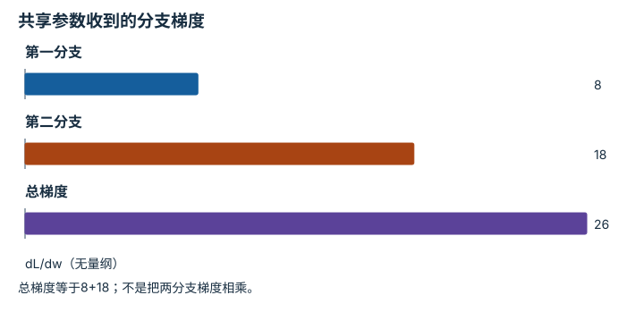

---
hide:
  - navigation
---

<!-- Generated by scripts/build_knowledge_atlas.py; edit knowledge/atlas/*.json. -->

<nav class="study-breadcrumb" aria-label="学习位置" markdown="1">
[知识目录](../../index.md) / [神经网络与优化循环](../index.md)
</nav>

L3 · 本章第 5 / 7 节

# 反向传播：分支梯度要相加

**Backpropagation and gradient accumulation**

共享参数能通过多条路径影响损失，遗漏一条就会得到错误更新方向或大小。

先确认：这些前置知识我懂了吗？

链式法则、计算图

[线性代数与最小二乘](../../math-linear-algebra/index.md) · [目标、约束与优化](../../math-optimization/index.md)

<section class="study-section " markdown="1">

## 1 · 原理拆开看

1. 教学损失L=(2w)²+(3w)²，两条分支共用同一个无量纲参数w。
2. 每条分支按链式法则产生梯度，汇合到w时相加而非相乘。
3. 自动微分负责累计梯度；训练循环还需按设计清零或有意累积，再由优化器更新参数。

</section>

<section class="study-section " markdown="1">

## 2 · 跟着例子算一遍

1. 教学输入w=1，两项损失分别为4和9，总损失13。
2. 两分支梯度分别为8和18，合计26。
3. 若不更新参数且未清零，对同样数据重新前向再反向，累计梯度可变成52；这不是模型自动学得更快，也不等于可对已释放的同一计算图直接反向两次。

</section>

<section class="study-section " markdown="1">

## 3 · 对照图，解释变化

<figure class="atlas-visual" tabindex="0" aria-label="共享参数收到的分支梯度；窄屏可在图内横向滚动">
<picture>
<source media="(max-width: 600px)" srcset="../../../assets/knowledge-atlas/nn-backprop-accumulation-mobile.svg">

</picture>
<figcaption>无量纲二分支教学计算。</figcaption>
</figure>

- 总柱高展示梯度汇合规则。
- 图不包含学习率，因此不能直接读出参数更新量。

查看作图数据，自己复算

图上数值可能为便于阅读而取近似值，以下保留作图输入。

| 项目 | dL/dw（无量纲） |
| --- | --- |
| 第一分支 | 8 |
| 第二分支 | 18 |
| 总梯度 | 26 |

</section>

<section class="study-section study-misconception" markdown="1">

## 4 · 避开一个误区

**容易误以为：**调用backward就已经修改模型权重。

**为什么不成立：**backward主要计算与累计梯度，参数更新由optimizer.step等操作完成。

**正确理解：**分清前向、清梯度、反向和更新四个职责。

</section>

<section class="study-section study-check" markdown="1">

## 5 · 先独立回答

若只保留第二条分支，w=1时梯度是多少？

我已作答，查看推理

18；共享参数梯度的26来自两条实际存在的依赖路径。

</section>

继续查阅原始资料

- [PyTorch: Autograd and Computational Graphs](https://docs.pytorch.org/tutorials/beginner/basics/autogradqs_tutorial.html)

<nav class="study-pagination" aria-label="相邻小节" markdown="1">

[← 链式法则：参数怎样影响最终损失](../nn-chain-rule/index.md)

[优化器：沿梯度走多大一步 →](../nn-optimizer-learning-rate/index.md)

</nav>

[返回本章目录](../index.md) · [整章连续阅读](../complete/index.md)

本章最后需要提交什么？

训练一个小模型并诊断学习曲线。

回到[原课程](../../../foundations/03-deep-learning-basics.md)完成实践。阅读位置或查看答案不计为通过验收。

