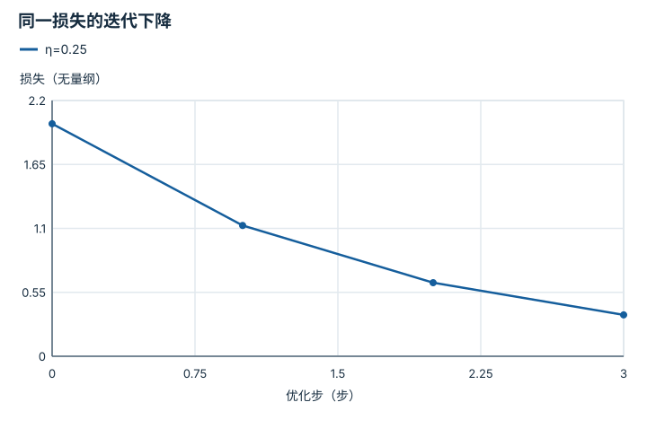

---
hide:
  - navigation
---

<!-- Generated by scripts/build_knowledge_atlas.py; edit knowledge/atlas/*.json. -->

<nav class="study-breadcrumb" aria-label="学习位置" markdown="1">
[知识目录](../../index.md) / [神经网络与优化循环](../index.md)
</nav>

L3 · 本章第 6 / 7 节

# 优化器：沿梯度走多大一步

**Optimizer and learning rate**

梯度告诉局部上升方向，优化器还需决定怎样、以多大步子修改参数。

先确认：这些前置知识我懂了吗？

损失梯度、迭代

[线性代数与最小二乘](../../math-linear-algebra/index.md) · [目标、约束与优化](../../math-optimization/index.md)

<section class="study-section " markdown="1">

## 1 · 原理拆开看

1. 教学梯度下降使用w下一步=w−ηg，η为学习率，g为当前损失梯度。
2. 对于无量纲L=0.5w²，梯度g=w；每步必须用更新后的w重新计算梯度。
3. 学习率过大可能跨过谷底并发散；Adam等自适应方法改变缩放规则，也不能免除验证。

</section>

<section class="study-section " markdown="1">

## 2 · 跟着例子算一遍

1. 教学输入w0=2、η=0.25，初始损失2。
2. 第一步w1=2−0.25×2=1.5，损失1.125。
3. 第二步w2=1.125，损失0.6328125；在此简单函数中逐步靠近最小点0。

</section>

<section class="study-section " markdown="1">

## 3 · 对照图，解释变化

<figure class="atlas-visual" tabindex="0" aria-label="同一损失的迭代下降；窄屏可在图内横向滚动">
<picture>
<source media="(max-width: 600px)" srcset="../../../assets/knowledge-atlas/nn-optimizer-learning-rate-mobile.svg">

</picture>
<figcaption>解析二次函数上的教学梯度下降；点间连线仅标记迭代顺序。</figcaption>
</figure>

- 每个点来自更新参数后的重新计算。
- 这条简单曲线不能保证深度策略训练同样单调。

查看作图数据，自己复算

图上数值可能为便于阅读而取近似值，以下保留作图输入。线段的含义以本图图注和读图说明为准，不应自行解释为实测连续轨迹。

| 曲线 | 优化步（步） | 损失（无量纲） |
| --- | --- | --- |
| η=0.25 | 0 | 2 |
| η=0.25 | 1 | 1.125 |
| η=0.25 | 2 | 0.6328125 |
| η=0.25 | 3 | 0.35595703125 |

</section>

<section class="study-section study-misconception" markdown="1">

## 4 · 避开一个误区

**容易误以为：**学习率越大，达到最小值就越快。

**为什么不成立：**局部梯度只适用于邻域，过大更新可能造成振荡或发散。

**正确理解：**检查学习曲线、梯度尺度和验证指标，而非只追求大更新。

</section>

<section class="study-section study-check" markdown="1">

## 5 · 先独立回答

本函数w0=2、η=3时第一步损失多少？

我已作答，查看推理

w1=−4，损失8，比初始2更大；更新方向正确也可能因步长过大失败。

</section>

继续查阅原始资料

- [PyTorch: Optimizing Model Parameters](https://docs.pytorch.org/tutorials/beginner/basics/optimization_tutorial.html)

<nav class="study-pagination" aria-label="相邻小节" markdown="1">

[← 反向传播：分支梯度要相加](../nn-backprop-accumulation/index.md)

[验证：训练损失下降之后还要问什么 →](../nn-validation-generalization/index.md)

</nav>

[返回本章目录](../index.md) · [整章连续阅读](../complete/index.md)

本章最后需要提交什么？

训练一个小模型并诊断学习曲线。

回到[原课程](../../../foundations/03-deep-learning-basics.md)完成实践。阅读位置或查看答案不计为通过验收。

