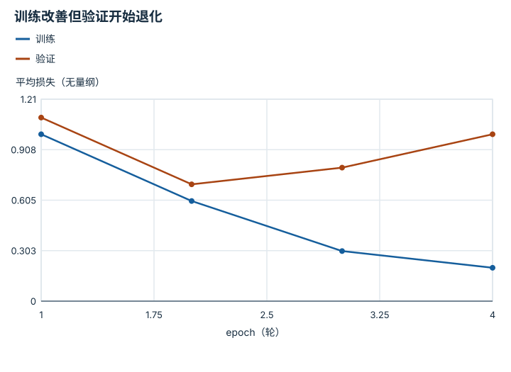

---
hide:
  - navigation
---

<!-- Generated by scripts/build_knowledge_atlas.py; edit knowledge/atlas/*.json. -->

<nav class="study-breadcrumb" aria-label="学习位置" markdown="1">
[知识目录](../../index.md) / [神经网络与优化循环](../index.md)
</nav>

L3 · 本章第 7 / 7 节

# 验证：训练损失下降之后还要问什么

**Validation and generalization**

模型可以更好地记住训练数据，同时在未见数据上变差；需要独立信号选择模型。

先确认：这些前置知识我懂了吗？

group split、优化循环

[线性代数与最小二乘](../../math-linear-algebra/index.md) · [目标、约束与优化](../../math-optimization/index.md)

<section class="study-section " markdown="1">

## 1 · 原理拆开看

1. 训练集用于计算梯度，验证集用于选择超参数或checkpoint，最终测试集用于独立报告。
2. 评估时按模型要求切换eval模式，关闭梯度记录用于节省资源；这两项功能不同。
3. 比较训练与验证曲线，并记录数据切分；低离线损失之后仍需要闭环评估。

</section>

<section class="study-section " markdown="1">

## 2 · 跟着例子算一遍

1. 教学四个epoch训练损失为1、0.6、0.3、0.2，验证损失为1.1、0.7、0.8、1。
2. 验证最小值出现在第2个epoch，不是训练损失最小的第4个epoch。
3. 若预先约定按验证损失选择，则保留第2个checkpoint，再做未参与选择的测试。

</section>

<section class="study-section " markdown="1">

## 3 · 对照图，解释变化

<figure class="atlas-visual" tabindex="0" aria-label="训练改善但验证开始退化；窄屏可在图内横向滚动">
<picture>
<source media="(max-width: 600px)" srcset="../../../assets/knowledge-atlas/nn-validation-generalization-mobile.svg">

</picture>
<figcaption>人为构造的教学损失曲线，连线只连接epoch样本。</figcaption>
</figure>

- 两条曲线在第2轮后朝不同方向变化。
- 图提示选择问题，但不能仅凭形状证明唯一原因是过拟合。

查看作图数据，自己复算

图上数值可能为便于阅读而取近似值，以下保留作图输入。线段的含义以本图图注和读图说明为准，不应自行解释为实测连续轨迹。

| 曲线 | epoch（轮） | 平均损失（无量纲） |
| --- | --- | --- |
| 训练 | 1 | 1 |
| 训练 | 2 | 0.6 |
| 训练 | 3 | 0.3 |
| 训练 | 4 | 0.2 |
| 验证 | 1 | 1.1 |
| 验证 | 2 | 0.7 |
| 验证 | 3 | 0.8 |
| 验证 | 4 | 1 |

</section>

<section class="study-section study-misconception" markdown="1">

## 4 · 避开一个误区

**容易误以为：**no_grad会自动关闭dropout并切换所有评估行为。

**为什么不成立：**梯度记录与模块训练/评估模式是不同开关。

**正确理解：**分别处理eval模式和梯度上下文，并检查数据无泄漏。

</section>

<section class="study-section study-check" markdown="1">

## 5 · 先独立回答

重复看测试集结果挑出最佳epoch，测试集还独立吗？

我已作答，查看推理

不再独立；它已参与模型选择，应另留未用于选择的最终评估集。

</section>

继续查阅原始资料

- [PyTorch: Optimization and Testing Loop](https://docs.pytorch.org/tutorials/beginner/basics/optimization_tutorial.html)

<nav class="study-pagination" aria-label="相邻小节" markdown="1">

[← 优化器：沿梯度走多大一步](../nn-optimizer-learning-rate/index.md)

[回原课程动手验证 →](../../../foundations/03-deep-learning-basics.md)

</nav>

[返回本章目录](../index.md) · [整章连续阅读](../complete/index.md)

本章最后需要提交什么？

训练一个小模型并诊断学习曲线。

回到[原课程](../../../foundations/03-deep-learning-basics.md)完成实践。阅读位置或查看答案不计为通过验收。

