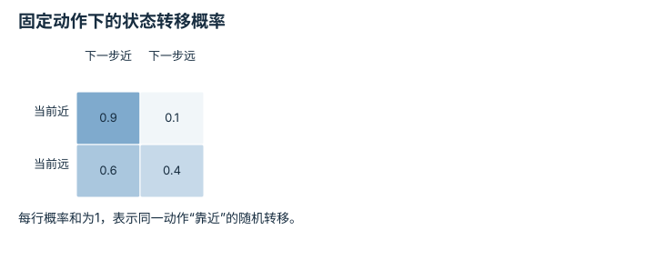
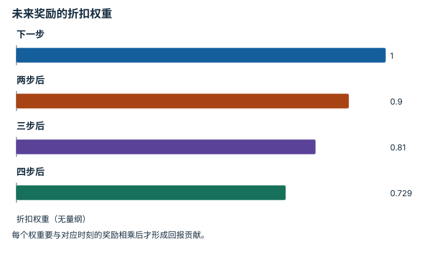
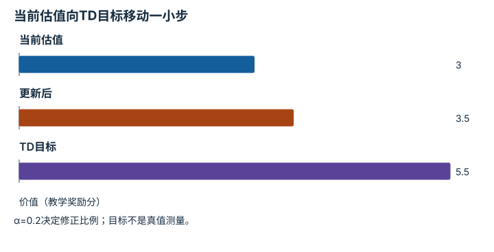
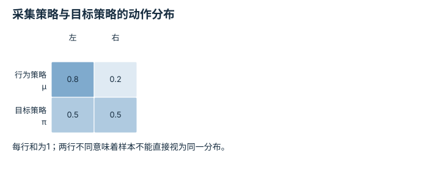
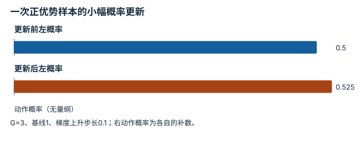

# 强化学习与后训练：逐点细解

<!-- Generated by scripts/build_knowledge_atlas.py; edit knowledge/atlas/*.json. -->

[全部知识点](../index.md) · [返回原课程](../../14-rl-zero-to-one.md)

Reinforcement learning and post-training · 本页拆成 **6 个小知识点**。

先阅读直觉和原理，再独立完成算例、自测；图是解释工具，不是已掌握或真机验证的证明。

## 前置知识

[MDP、POMDP、奖励与信念](../planning-mdp-pomdp/index.md) → [神经网络与优化循环](../learning-neural-networks/index.md) → [频率、看门狗、状态机与安全](../system-realtime-safety/index.md)

## 本页知识点

1. [MDP：动作改变状态，再得到奖励](#rl-mdp-transition)
2. [回报与折扣：不只看眼前奖励](#rl-discounted-return)
3. [Bellman目标：一步经验如何连接长期价值](#rl-bellman-bootstrap)
4. [同策略与异策略：数据是谁采来的](#rl-on-policy-off-policy)
5. [策略梯度：提高比预期更好的动作概率](#rl-policy-gradient-advantage)
6. [PPO裁剪：限制目标的更新激励](#rl-ppo-clipping)

## 1. MDP：动作改变状态，再得到奖励

**Markov decision process**

**需要先懂：**概率、状态与观测

### 一句话直觉

强化学习不只拟合动作标签，而是考虑动作怎样改变环境与后续收益。

### 原理拆开看

1. MDP包括状态s、动作a、转移概率、奖励及折扣；奖励单位由任务定义，本例为无量纲教学分。
2. 马尔可夫性质要求给定当前状态与动作后，下一状态分布不再需要更早历史。
3. 图像通常是部分观测而非完整状态，需要历史或状态估计；不能因接口名叫state就假定满足马尔可夫性。

### 手算或追踪一个例子

1. 教学只有“近目标”和“远目标”两个状态，固定动作“靠近”。
2. 若当前远，下一步近的概率0.6、仍远0.4；若当前近，则保持近0.9、变远0.1。
3. 从远出发的一步期望“近目标指示值”为0.6，不是保证每次都会靠近。

### 用图理解

<figure class="atlas-visual" tabindex="0" aria-label="固定动作下的状态转移概率；窄屏可在图内横向滚动">
<picture>
<source media="(max-width: 600px)" srcset="../../assets/knowledge-atlas/rl-mdp-transition-mobile.svg">

</picture>
<figcaption>两状态教学MDP，不是机器人实测转移。</figcaption>
</figure>

- 按当前状态选一行，再读取下一状态概率。
- 图中没有其他动作和奖励，尚不足以判断最优策略。

查看作图数据，自己复算

图上数值可能为便于阅读而取近似值，以下保留作图输入。

| 行 / 列 | 下一步近 | 下一步远 |
| --- | --- | --- |
| 当前近 | 0.9 | 0.1 |
| 当前远 | 0.6 | 0.4 |

### 容易混淆的地方

**常见误解：**MDP状态必须等于当前一张RGB图像。

**为什么不成立：**单帧可能无法识别速度、遮挡或隐藏接触状态。

**正确理解：**先检查信息是否足够，再决定状态表示或POMDP建模。

### 自测

两物体位置相同但速度方向相反，下一步分布可能不同吗？

展开答案与推理

可能；只用位置作为状态会遗漏影响未来的速度信息。

**原始资料：**[Sutton and Barto: Reinforcement Learning, Second Edition](https://www.incompleteideas.net/book/RLbook2020.pdf)

## 2. 回报与折扣：不只看眼前奖励

**Discounted return**

**需要先懂：**奖励、等比权重

### 一句话直觉

短期看似没收益的动作可能为后续成功创造条件，因此需要评价整个未来序列。

### 原理拆开看

1. 定义从当前动作之后开始的奖励为r1、r2等，回报G=r1+γr2+γ²r3+…。
2. 无量纲折扣γ在0到1之间，本例γ=0.9；回报与奖励具有相同任务单位。
3. 折扣反映问题设定中的时间偏好或数学处理，不自动等于任务终止概率；改变控制时间步需重新考虑时间尺度。

### 手算或追踪一个例子

1. 教学三步奖励为0、0、10分，随后终止，γ=0.9。
2. 回报为0+0.9×0+0.9²×10=8.1分。
3. 若同样10分在下一步就获得，回报是10分；延迟收益的折扣权重较小。

### 用图理解

<figure class="atlas-visual" tabindex="0" aria-label="未来奖励的折扣权重；窄屏可在图内横向滚动">
<picture>
<source media="(max-width: 600px)" srcset="../../assets/knowledge-atlas/rl-discounted-return-mobile.svg">

</picture>
<figcaption>γ=0.9时的教学权重，不是奖励发生概率。</figcaption>
</figure>

- 第一根柱为1，对应紧接当前动作的奖励。
- 柱高递减不说明未来事件更不可能，只表示本定义中的权重变化。

查看作图数据，自己复算

图上数值可能为便于阅读而取近似值，以下保留作图输入。

| 项目 | 折扣权重（无量纲） |
| --- | --- |
| 下一步 | 1 |
| 两步后 | 0.9 |
| 三步后 | 0.81 |
| 四步后 | 0.729 |

### 容易混淆的地方

**常见误解：**折扣0.9意味着每步恰有10%概率死亡。

**为什么不成立：**只有特定等价建模才能这样解释，一般MDP的折扣不是直接观测的生存率。

**正确理解：**明确γ的任务含义、时间步与终止机制。

### 自测

三步奖励都为1分且γ=0.5，回报是多少？

展开答案与推理

1+0.5+0.25=1.75分；不要把第一步奖励也额外乘一次γ。

**原始资料：**[Sutton and Barto: Returns and Discounting](https://www.incompleteideas.net/book/RLbook2020.pdf)

## 3. Bellman目标：一步经验如何连接长期价值

**Bellman targets and bootstrapping**

**需要先懂：**折扣回报、价值估计、终止与截断

### 一句话直觉

不必等所有未来都发生才学习，可以把当前奖励和下一状态估值组合起来更新。

### 原理拆开看

1. V(s)表示在明确策略下从s开始的期望回报；Q(s,a)额外指定第一步动作。
2. 教学TD目标y=r+γV(s下一步)，真实终止时后续项为零；这是对长期回报的bootstrap估计。
3. 误差δ=y−V(s)驱动更新，但目标中的V也可能有偏差，不能视作精确标签。

### 手算或追踪一个例子

1. 教学当前V(s)=3分，奖励r=1分，γ=0.9，下一状态估值5分且未终止。
2. 目标y=1+0.9×5=5.5分，TD误差2.5分。
3. 若更新步长α=0.2，则新估值3+0.2×2.5=3.5分，而不是直接改成5.5。

### 用图理解

<figure class="atlas-visual" tabindex="0" aria-label="当前估值向TD目标移动一小步；窄屏可在图内横向滚动">
<picture>
<source media="(max-width: 600px)" srcset="../../assets/knowledge-atlas/rl-bellman-bootstrap-mobile.svg">

</picture>
<figcaption>单条教学转移的标量更新。</figcaption>
</figure>

- 更新后值位于旧值和目标之间。
- 一次靠近目标不代表最终策略一定改善。

查看作图数据，自己复算

图上数值可能为便于阅读而取近似值，以下保留作图输入。

| 项目 | 价值（教学奖励分） |
| --- | --- |
| 当前估值 | 3 |
| 更新后 | 3.5 |
| TD目标 | 5.5 |

### 容易混淆的地方

**常见误解：**Bellman目标是环境直接告诉我们的真实长期回报。

**为什么不成立：**其中包含模型自己的价值估计，可能误差传播。

**正确理解：**区分观测奖励、估计目标和实际完整回报。

### 自测

若同一转移真实终止，目标与更新后估值是多少？

展开答案与推理

目标为1，TD误差−2；更新后3+0.2×(−2)=2.6分。

**原始资料：**[Sutton and Barto: Temporal-Difference Learning](https://www.incompleteideas.net/book/RLbook2020.pdf)

## 4. 同策略与异策略：数据是谁采来的

**On-policy and off-policy learning**

**需要先懂：**随机策略、概率分布

### 一句话直觉

旧策略探索的数据可以有价值，但不能无条件当作当前策略新采到的数据。

### 原理拆开看

1. 行为策略μ负责采集，目标策略π是想评价或改善的策略；两者是否相同决定数据分布关系。
2. 异策略方法设计了利用不同采集分布的更新方式，回放缓冲区本身不自动消除偏差。
3. 重要性比π(a|s)/μ(a|s)是某些估计的校正因子；需要行为策略对目标动作有足够支持。

### 手算或追踪一个例子

1. 教学两个动作左、右，μ概率为0.8、0.2，π概率为0.5、0.5。
2. 左动作的重要性比0.5/0.8=0.625，右动作比0.5/0.2=2.5。
3. 右动作样本更稀少，需要更大校正权重，也可能增大估计方差。

### 用图理解

<figure class="atlas-visual" tabindex="0" aria-label="采集策略与目标策略的动作分布；窄屏可在图内横向滚动">
<picture>
<source media="(max-width: 600px)" srcset="../../assets/knowledge-atlas/rl-on-policy-off-policy-mobile.svg">

</picture>
<figcaption>两动作教学概率表。</figcaption>
</figure>

- 右列从0.2变成0.5，说明目标更重视采集中较少出现的动作。
- 概率表只覆盖一个状态，真实轨迹还存在状态访问分布差异。

查看作图数据，自己复算

图上数值可能为便于阅读而取近似值，以下保留作图输入。

| 行 / 列 | 左 | 右 |
| --- | --- | --- |
| 行为策略μ | 0.8 | 0.2 |
| 目标策略π | 0.5 | 0.5 |

### 容易混淆的地方

**常见误解：**任何RL算法加一个经验回放队列就变成正确的off-policy算法。

**为什么不成立：**更新公式可能依赖当前策略分布，旧数据会破坏其假设。

**正确理解：**核对算法数据要求、策略版本和校正方式。

### 自测

若μ从不选右而π仍有0.5概率选右，能靠简单重要性比修复吗？

展开答案与推理

不能；分母为零且没有对应样本，缺少分布支持，不能从无数据处凭空估计。

**原始资料：**[Sutton and Barto: Off-policy Prediction](https://www.incompleteideas.net/book/RLbook2020.pdf)

## 5. 策略梯度：提高比预期更好的动作概率

**Policy gradient and advantage**

**需要先懂：**概率策略、梯度、价值基线

### 一句话直觉

同样获得5分，在困难状态可能很好，在容易状态可能很差；优势量比较结果与基线。

### 原理拆开看

1. 教学优势A=采样回报G−状态基线b，奖励单位保持一致；正优势表示比基线更好。
2. 策略梯度使用A乘以所选动作对数概率的参数梯度，提高正优势动作的概率。
3. 在满足相应假设时，与动作无关的基线可减小方差而不改变期望梯度；样本优势仍有噪声。

### 手算或追踪一个例子

1. 教学二动作策略用logit θ控制左动作概率p=sigmoid(θ)，θ=0时p=0.5。
2. 采到左动作，G=3分、基线1分，所以A=2；对数概率梯度为1−p=0.5。
3. 梯度上升步长0.1给θ新=0+0.1×2×0.5=0.1，新左概率约0.525。

### 用图理解

<figure class="atlas-visual" tabindex="0" aria-label="一次正优势样本的小幅概率更新；窄屏可在图内横向滚动">
<picture>
<source media="(max-width: 600px)" srcset="../../assets/knowledge-atlas/rl-policy-gradient-advantage-mobile.svg">

</picture>
<figcaption>二动作logit教学算例，不是训练性能曲线。</figcaption>
</figure>

- 策略概率仅小幅变化，并非直接设成100%。
- 一次样本更新没有证明期望回报实际提高，需要统计验证。

查看作图数据，自己复算

图上数值可能为便于阅读而取近似值，以下保留作图输入。

| 项目 | 动作概率（无量纲） |
| --- | --- |
| 更新前左概率 | 0.5 |
| 更新后左概率 | 0.5249791875 |

### 容易混淆的地方

**常见误解：**正奖励动作永远应该提高概率。

**为什么不成立：**它可能比该状态通常结果更差，优势可以为负。

**正确理解：**看相对于合理基线的表现，并核对优化器是最大化目标还是最小化负目标。

### 自测

若同样G=3但基线为5，更新方向如何？

展开答案与推理

A=−2，θ减少0.1，左动作概率下降；正奖励并不保证正优势。

**原始资料：**[Sutton et al.: Policy Gradient Methods for Reinforcement Learning](https://proceedings.neurips.cc/paper/1999/hash/464d828b85b0bed98e80ade0a5c43b0f-Abstract.html)

## 6. PPO裁剪：限制目标的更新激励

**PPO clipped surrogate objective**

**需要先懂：**策略梯度、优势、概率比

### 一句话直觉

同一批轨迹反复优化可能让新策略偏离采集策略太多，PPO用保守代理目标抑制部分过大变化的收益。

### 原理拆开看

1. 概率比ρ=π新(a|s)/π旧(a|s)，示例裁剪范围[1−ε,1+ε]，ε=0.2。
2. 最大化的代理项取min(ρA,clip(ρ)A)；正负优势都会影响哪一支被选中。
3. 裁剪约束的是目标激励，不是对每个参数或概率比的硬约束，也不保证KL或硬件安全。

### 手算或追踪一个例子

1. 教学采样动作旧概率0.5、新概率0.7，优势A=2分。
2. ρ=1.4，未裁剪项2.8，裁剪后项1.2×2=2.4。
3. 代理项取2.4，继续增大该概率不再提高这个正优势样本的裁剪分支收益。

### 用图理解

<figure class="atlas-visual" tabindex="0" aria-label="正优势下PPO代理收益的平台；窄屏可在图内横向滚动">
<picture>
<source media="(max-width: 600px)" srcset="../../assets/knowledge-atlas/rl-ppo-clipping-mobile.svg">

</picture>
<figcaption>A=2、ε=0.2的教学目标函数。</figcaption>
</figure>

- ρ大于1.2后正优势代理项出现平台。
- 平台不意味着真实概率比被锁住，也不代表真实任务回报不再变化。

查看作图数据，自己复算

图上数值可能为便于阅读而取近似值，以下保留作图输入。线段的含义以本图图注和读图说明为准，不应自行解释为实测连续轨迹。

| 曲线 | 新旧动作概率比ρ（无量纲） | 代理目标项（教学奖励分） |
| --- | --- | --- |
| min(ρA,clip(ρ)A) | 0.5 | 1 |
| min(ρA,clip(ρ)A) | 0.8 | 1.6 |
| min(ρA,clip(ρ)A) | 1 | 2 |
| min(ρA,clip(ρ)A) | 1.2 | 2.4 |
| min(ρA,clip(ρ)A) | 1.4 | 2.4 |
| min(ρA,clip(ρ)A) | 1.6 | 2.4 |

### 容易混淆的地方

**常见误解：**PPO会强制所有新旧动作概率比都保持在0.8到1.2内。

**为什么不成立：**目标裁剪不是显式可行域投影，共享参数更新仍可让概率比超界。

**正确理解：**同时监测KL、优势、梯度与评估结果，区分代理目标和安全约束。

### 自测

同一ρ=1.4但A=−2时，代理项是多少？

展开答案与推理

未裁剪项−2.8，裁剪项−2.4，取较小者−2.8；不能无论优势符号都直接用裁剪值。

**原始资料：**[Schulman et al.: Proximal Policy Optimization Algorithms](https://arxiv.org/abs/1707.06347)

## 从理解走向证据

本节点原有验收要求：复现带种子的运行，并区分奖励、任务成功与安全。

完成图解自测后，回到[原课程](../../14-rl-zero-to-one.md)运行对应示例并保留证据；浏览页面和查看答案不会自动获得课程晋级。
