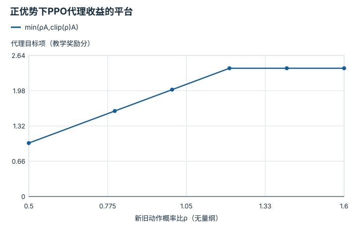

---
hide:
  - navigation
---

<!-- Generated by scripts/build_knowledge_atlas.py; edit knowledge/atlas/*.json. -->

<nav class="study-breadcrumb" aria-label="学习位置" markdown="1">
[知识目录](../../index.md) / [强化学习与后训练](../index.md)
</nav>

L3 · 本章第 6 / 6 节

# PPO裁剪：限制目标的更新激励

**PPO clipped surrogate objective**

同一批轨迹反复优化可能让新策略偏离采集策略太多，PPO用保守代理目标抑制部分过大变化的收益。

先确认：这些前置知识我懂了吗？

策略梯度、优势、概率比

[MDP、POMDP、奖励与信念](../../planning-mdp-pomdp/index.md) · [神经网络与优化循环](../../learning-neural-networks/index.md) · [频率、看门狗、状态机与安全](../../system-realtime-safety/index.md)

<section class="study-section " markdown="1">

## 1 · 原理拆开看

1. 概率比ρ=π新(a|s)/π旧(a|s)，示例裁剪范围[1−ε,1+ε]，ε=0.2。
2. 最大化的代理项取min(ρA,clip(ρ)A)；正负优势都会影响哪一支被选中。
3. 裁剪约束的是目标激励，不是对每个参数或概率比的硬约束，也不保证KL或硬件安全。

</section>

<section class="study-section " markdown="1">

## 2 · 跟着例子算一遍

1. 教学采样动作旧概率0.5、新概率0.7，优势A=2分。
2. ρ=1.4，未裁剪项2.8，裁剪后项1.2×2=2.4。
3. 代理项取2.4，继续增大该概率不再提高这个正优势样本的裁剪分支收益。

</section>

<section class="study-section " markdown="1">

## 3 · 对照图，解释变化

<figure class="atlas-visual" tabindex="0" aria-label="正优势下PPO代理收益的平台；窄屏可在图内横向滚动">
<picture>
<source media="(max-width: 600px)" srcset="../../../assets/knowledge-atlas/rl-ppo-clipping-mobile.svg">

</picture>
<figcaption>A=2、ε=0.2的教学目标函数。</figcaption>
</figure>

- ρ大于1.2后正优势代理项出现平台。
- 平台不意味着真实概率比被锁住，也不代表真实任务回报不再变化。

查看作图数据，自己复算

图上数值可能为便于阅读而取近似值，以下保留作图输入。线段的含义以本图图注和读图说明为准，不应自行解释为实测连续轨迹。

| 曲线 | 新旧动作概率比ρ（无量纲） | 代理目标项（教学奖励分） |
| --- | --- | --- |
| min(ρA,clip(ρ)A) | 0.5 | 1 |
| min(ρA,clip(ρ)A) | 0.8 | 1.6 |
| min(ρA,clip(ρ)A) | 1 | 2 |
| min(ρA,clip(ρ)A) | 1.2 | 2.4 |
| min(ρA,clip(ρ)A) | 1.4 | 2.4 |
| min(ρA,clip(ρ)A) | 1.6 | 2.4 |

</section>

<section class="study-section study-misconception" markdown="1">

## 4 · 避开一个误区

**容易误以为：**PPO会强制所有新旧动作概率比都保持在0.8到1.2内。

**为什么不成立：**目标裁剪不是显式可行域投影，共享参数更新仍可让概率比超界。

**正确理解：**同时监测KL、优势、梯度与评估结果，区分代理目标和安全约束。

</section>

<section class="study-section study-check" markdown="1">

## 5 · 先独立回答

同一ρ=1.4但A=−2时，代理项是多少？

我已作答，查看推理

未裁剪项−2.8，裁剪项−2.4，取较小者−2.8；不能无论优势符号都直接用裁剪值。

</section>

继续查阅原始资料

- [Schulman et al.: Proximal Policy Optimization Algorithms](https://arxiv.org/abs/1707.06347)

<nav class="study-pagination" aria-label="相邻小节" markdown="1">

[← 策略梯度：提高比预期更好的动作概率](../rl-policy-gradient-advantage/index.md)

[回原课程动手验证 →](../../../14-rl-zero-to-one.md)

</nav>

[返回本章目录](../index.md) · [整章连续阅读](../complete/index.md)

本章最后需要提交什么？

复现带种子的运行，并区分奖励、任务成功与安全。

回到[原课程](../../../14-rl-zero-to-one.md)完成实践。阅读位置或查看答案不计为通过验收。

