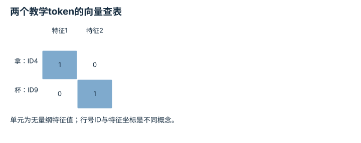
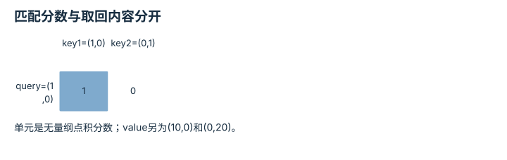
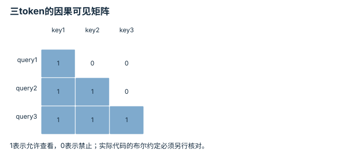
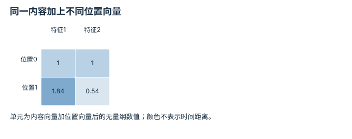
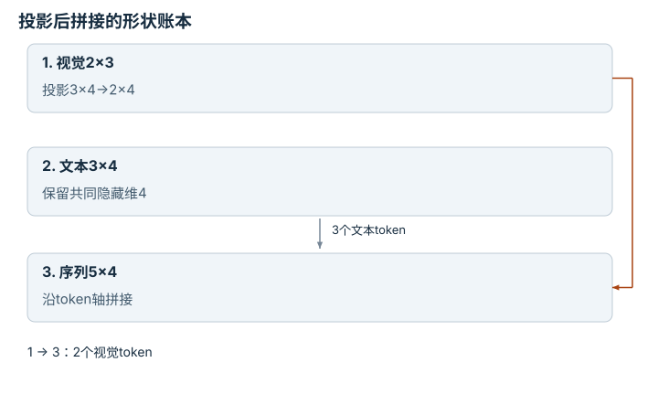

# Transformer 与多模态表示：逐点细解

<!-- Generated by scripts/build_knowledge_atlas.py; edit knowledge/atlas/*.json. -->

[全部知识点](../index.md) · [返回原课程](../../foundations/04-transformer-basics.md)

Transformers and multimodal representations · 本页拆成 **7 个小知识点**。

先阅读直觉和原理，再独立完成算例、自测；图是解释工具，不是已掌握或真机验证的证明。

## 前置知识

[神经网络与优化循环](../learning-neural-networks/index.md)

## 本页知识点

1. [Token与Embedding：编号不等于语义距离](#transformer-token-embedding)
2. [形状追踪：注意力在哪个维度混合](#transformer-tensor-shapes)
3. [Q、K、V：怎样匹配与取回信息](#transformer-query-key-value)
4. [缩放点积：从分数到加权输出](#transformer-scaled-softmax)
5. [Mask：哪些信息此刻不允许看](#transformer-causal-mask)
6. [位置信息：交换顺序为什么不该无所谓](#transformer-position-information)
7. [多模态：维度对齐之后还要语义对齐](#transformer-multimodal-projection)

## 1. Token与Embedding：编号不等于语义距离

**Tokenization and embeddings**

**需要先懂：**查表、向量

### 一句话直觉

文本先变成离散编号，再查成可学习向量；编号只是索引，不能当作连续物理量。

### 原理拆开看

1. Tokenizer按既定词表把输入切成token，token不一定等于一个汉字或完整单词。
2. Embedding表每行对应一个token ID，查表后每个token得到D维向量。
3. 相邻ID不保证意思相近；语义相关性来自训练得到的表示与上下文处理。

### 手算或追踪一个例子

1. 教学自定义词表将“拿”编号4、“杯”编号9，设D=2。
2. Embedding表第4行为(1,0)，第9行为(0,1)，得到2×2特征矩阵。
3. 交换token顺序会交换矩阵行；编号差9−4=5没有“语义相隔5单位”的含义。

### 用图理解

<figure class="atlas-visual" tabindex="0" aria-label="两个教学token的向量查表；窄屏可在图内横向滚动">
<picture>
<source media="(max-width: 600px)" srcset="../../assets/knowledge-atlas/transformer-token-embedding-mobile.svg">

</picture>
<figcaption>人为指定Embedding，不是训练出的中文语义表示。</figcaption>
</figure>

- 每一行是一条token表示，不是一个句子概率。
- 正交向量只为算例方便，不能据此解释真实词义关系。

查看作图数据，自己复算

图上数值可能为便于阅读而取近似值，以下保留作图输入。

| 行 / 列 | 特征1 | 特征2 |
| --- | --- | --- |
| 拿：ID4 | 1 | 0 |
| 杯：ID9 | 0 | 1 |

### 容易混淆的地方

**常见误解：**一个token必定是一个词，ID大小表示词的重要性。

**为什么不成立：**切分与编号由词表约定，可能使用子词或字节。

**正确理解：**查看实际tokenizer输出与词表，不把索引当成物理量。

### 自测

换tokenizer后保持旧Embedding表，编号仍能直接沿用吗？

展开答案与推理

不能假定兼容；相同ID可能指向不同token，必须保持词表与模型匹配。

**原始资料：**[Attention Is All You Need: Embeddings](https://arxiv.org/html/1706.03762v7)

## 2. 形状追踪：注意力在哪个维度混合

**Attention tensor shapes**

**需要先懂：**批量张量、矩阵乘法

### 一句话直觉

注意力错误常来自把batch、token和feature维混淆；先画形状可以在运行前发现问题。

### 原理拆开看

1. 输入X形状为B×N×D，分别表示批量大小、token数和特征维；这些维度是计数而非物理单位。
2. 单头Q、K形状为B×N×d，Q乘K转置后分数形状为B×N×N。
3. 分数对最后的key维归一化，再乘V得到每个query的新表示；不同batch不应互相混合。

### 手算或追踪一个例子

1. 教学输入B=2、N=3、D=4，一共24个特征标量；下图只展示一个batch的3×4矩阵。
2. 设单头d=2，则Q和K各有2×3×2个标量，分数有2×3×3=18个。
3. 若V特征维也是2，输出形状2×3×2，保留3个query位置。

### 用图理解

<figure class="atlas-visual" tabindex="0" aria-label="一个batch中的token特征矩阵；窄屏可在图内横向滚动">
<picture>
<source media="(max-width: 600px)" srcset="../../assets/knowledge-atlas/transformer-tensor-shapes-mobile.svg">

</picture>
<figcaption>教学X样本；另一个batch具有同样形状但独立数据。</figcaption>
</figure>

- 沿行读一个token的四维表示，而不是沿列拼出token。
- 这不是注意力权重图；QK转置后才得到3×3分数。

查看作图数据，自己复算

图上数值可能为便于阅读而取近似值，以下保留作图输入。

| 行 / 列 | 特征1 | 特征2 | 特征3 | 特征4 |
| --- | --- | --- | --- | --- |
| token1 | 1 | 2 | 0 | 0 |
| token2 | 0 | 1 | 3 | 0 |
| token3 | 2 | 0 | 0 | 1 |

### 容易混淆的地方

**常见误解：**N×N分数矩阵的两轴都是特征维。

**为什么不成立：**两轴分别对应query token和key token，而特征维已在点积中求和。

**正确理解：**给每个轴命名，再核对矩阵乘法的收缩维。

### 自测

只有token数从3变成6、其他维不变，分数元素数量怎么变？

展开答案与推理

从2×3²=18变成2×6²=72，变为四倍。

**原始资料：**[PyTorch: Scaled Dot Product Attention](https://docs.pytorch.org/docs/stable/generated/torch.nn.functional.scaled_dot_product_attention.html)

## 3. Q、K、V：怎样匹配与取回信息

**Query, key and value projections**

**需要先懂：**线性层、点积

### 一句话直觉

匹配用的描述与最终取回的内容可以不同，就像用书名检索但取回的是正文。

### 原理拆开看

1. 同一输入X通过三个可学习线性投影生成Q、K、V，不是固定的三个数据源。
2. query与key点积产生匹配分数；value提供被加权组合的内容。
3. 一条query通常可以关注多个key，注意力不是简单选择唯一最近邻。

### 手算或追踪一个例子

1. 教学query q=(1,0)，两个key为(1,0)、(0,1)，两个value为(10,0)、(0,20)。
2. 点积得分为1与0，第一key与query在本表示下更匹配。
3. 归一化权重若为0.75和0.25，则取回value加权和(7.5,5)；这里权重人为指定，下一小点再计算softmax。

### 用图理解

<figure class="atlas-visual" tabindex="0" aria-label="匹配分数与取回内容分开；窄屏可在图内横向滚动">
<picture>
<source media="(max-width: 600px)" srcset="../../assets/knowledge-atlas/transformer-query-key-value-mobile.svg">

</picture>
<figcaption>一个query对两个key的原始点积，不是归一化概率。</figcaption>
</figure>

- 第一列分数高，表示本query与key1更匹配。
- 不能把1和0直接当作最终权重，仍需缩放、mask与归一化。

查看作图数据，自己复算

图上数值可能为便于阅读而取近似值，以下保留作图输入。

| 行 / 列 | key1=(1,0) | key2=(0,1) |
| --- | --- | --- |
| query=(1,0) | 1 | 0 |

### 容易混淆的地方

**常见误解：**Q永远来自文字、K永远来自图像、V永远来自动作。

**为什么不成立：**来源由self-attention或cross-attention结构决定，名称并不固定模态。

**正确理解：**查清每个投影接收哪个序列，以及权重在何处共享。

### 自测

只改变V而保持Q和K不变，匹配权重会改变吗？

展开答案与推理

在此标准注意力计算中不会，但加权输出会改变，因为取回的内容不同。

**原始资料：**[Attention Is All You Need: Attention](https://arxiv.org/html/1706.03762v7)

## 4. 缩放点积：从分数到加权输出

**Scaled dot-product attention**

**需要先懂：**QKV、指数与归一化

### 一句话直觉

原始点积随特征维数可能变大，缩放有助于控制softmax的数值尺度。

### 原理拆开看

1. 用每条query与key点积得到分数，再除以√d_k；这是特征维度缩放，不是除以token数。
2. 对每条query的key分数做softmax，权重非负且每行和为1。
3. 输出为这些权重对value的加权和；注意力权重不是模型置信度或因果解释。

### 手算或追踪一个例子

1. 教学d_k=4，两原始分数为2和0，除以2后得到1和0。
2. softmax权重为exp(1)/(exp(1)+1)≈0.7311和0.2689。
3. 若标量value为10和0，输出约7.311；全部特征仅为无量纲教学数。

### 用图理解

<figure class="atlas-visual" tabindex="0" aria-label="分数1与0经softmax变成权重；窄屏可在图内横向滚动">
<picture>
<source media="(max-width: 600px)" srcset="../../assets/knowledge-atlas/transformer-scaled-softmax-mobile.svg">

</picture>
<figcaption>两key教学注意力计算。</figcaption>
</figure>

- 较低分数仍获得非零权重，输出不是硬选择。
- 图不能证明高权重token是任务成功的因果原因。

查看作图数据，自己复算

图上数值可能为便于阅读而取近似值，以下保留作图输入。

| 项目 | 注意力权重（无量纲） |
| --- | --- |
| key1权重 | 0.7310585786 |
| key2权重 | 0.2689414214 |

### 容易混淆的地方

**常见误解：**0.7311权重表示模型有73.11%概率判断正确。

**为什么不成立：**权重只分配当前value组合，没有对应任务正确事件。

**正确理解：**解释其归一化维度与计算作用，不擅自转成成功概率。

### 自测

两个缩放分数都加100，数学上的softmax权重改变吗？

展开答案与推理

不改变，公共因子会约去；稳定实现常减去最大分数以避免指数溢出。

**原始资料：**[Attention Is All You Need: Scaled Dot-Product Attention](https://arxiv.org/html/1706.03762v7)

## 5. Mask：哪些信息此刻不允许看

**Causal and padding masks**

**需要先懂：**注意力权重、因果性

### 一句话直觉

训练时整个序列都在内存里，mask负责禁止使用生成时不可获得的未来token。

### 原理拆开看

1. 因果mask允许第i个query看第i个及更早的key，禁止未来位置。
2. 在softmax前把禁止位置设为不可参与的分数，随后权重为零；padding mask另处理补齐位置。
3. 不同API布尔mask的真值含义可能不同，应核对接口，不能照抄矩阵而不验证。

### 手算或追踪一个例子

1. 教学序列有3个token，value为1、2、3，所有允许位置的分数相同。
2. 第1行只能读1，输出1；第2行读1和2，平均为1.5。
3. 第3行可读全部，平均为2；若未屏蔽未来，第1行也会错误得到2。

### 用图理解

<figure class="atlas-visual" tabindex="0" aria-label="三token的因果可见矩阵；窄屏可在图内横向滚动">
<picture>
<source media="(max-width: 600px)" srcset="../../assets/knowledge-atlas/transformer-causal-mask-mobile.svg">

</picture>
<figcaption>逻辑可见性图，不是点积分数。</figcaption>
</figure>

- 右上角为零，未来信息不能流入较早query。
- 该图不处理相机时间戳泄漏，输入序列的因果构造仍需验证。

查看作图数据，自己复算

图上数值可能为便于阅读而取近似值，以下保留作图输入。

| 行 / 列 | key1 | key2 | key3 |
| --- | --- | --- | --- |
| query1 | 1 | 0 | 0 |
| query2 | 1 | 1 | 0 |
| query3 | 1 | 1 | 1 |

### 容易混淆的地方

**常见误解：**先对全部位置softmax，再把未来权重置零总是等价。

**为什么不成立：**若不重新归一化，剩余权重和会小于1。

**正确理解：**在正确阶段应用mask并测试每行有效权重和。

### 自测

第2个query能否关注第3个key？

展开答案与推理

在此自回归因果约定下不能；非因果视觉编码器可能采用不同规则，需看具体结构。

**原始资料：**[PyTorch: Scaled Dot Product Attention Masks](https://docs.pytorch.org/docs/stable/generated/torch.nn.functional.scaled_dot_product_attention.html)

## 6. 位置信息：交换顺序为什么不该无所谓

**Positional information**

**需要先懂：**token向量、正弦与余弦

### 一句话直觉

“先开门再走”和“先走再开门”包含相同词，但顺序会改变行动含义。

### 原理拆开看

1. 不含位置机制的self-attention对token重排具有相应的重排性质，不能凭内容自动知道绝对序号。
2. 位置编码或相对位置机制把顺序信息引入表示；正弦编码、学习编码与RoPE不是同一实现。
3. 教学二维正弦位置向量定义为(sin p,cos p)，p为无量纲位置索引，仅展示基本思路。

### 手算或追踪一个例子

1. 教学相同内容向量为(1,0)，比较p=0和p=1。
2. 位置向量分别是(0,1)与约(0.8415,0.5403)。
3. 相加后表示分别为(1,1)与(1.8415,0.5403)，相同内容在不同位置不再完全相同。

### 用图理解

<figure class="atlas-visual" tabindex="0" aria-label="同一内容加上不同位置向量；窄屏可在图内横向滚动">
<picture>
<source media="(max-width: 600px)" srcset="../../assets/knowledge-atlas/transformer-position-information-mobile.svg">

</picture>
<figcaption>二维教学位置编码，不是某模型的完整位置实现。</figcaption>
</figure>

- 内容相同但两行不同，差异由位置信息产生。
- 二维示意不能证明真实模型已理解语言的时间逻辑。

查看作图数据，自己复算

图上数值可能为便于阅读而取近似值，以下保留作图输入。

| 行 / 列 | 特征1 | 特征2 |
| --- | --- | --- |
| 位置0 | 1 | 1 |
| 位置1 | 1.8414709848 | 0.5403023059 |

### 容易混淆的地方

**常见误解：**位置编码会自动解决任意长序列外推。

**为什么不成立：**训练长度、位置机制与数值分布会影响外推行为。

**正确理解：**区分表示顺序的机制与经实测验证的长度泛化。

### 自测

图中的p=1表示1秒吗？

展开答案与推理

不是，它是token位置索引；时间序列若需要真实采样间隔，必须另外编码或定义。

**原始资料：**[Attention Is All You Need: Positional Encoding](https://arxiv.org/html/1706.03762v7)

## 7. 多模态：维度对齐之后还要语义对齐

**Multimodal projection and fusion**

**需要先懂：**线性投影、token形状

### 一句话直觉

相机特征和文字特征来自不同编码器，能拼成同一矩阵只是融合的第一步。

### 原理拆开看

1. 视觉编码器输出N_v个D_v维特征，语言编码器输出N_l个D_l维特征。
2. 通过投影等机制映射到共同隐藏维D，再按结构选择拼接、自注意力或交叉注意力。
3. 尺寸一致不保证词语与对象对应，语义关系要靠训练数据、目标和评估验证；相机时序也不能遗漏。

### 手算或追踪一个例子

1. 教学视觉有2个3维token，文本有3个4维token，共同隐藏维定为4。
2. 视觉投影矩阵形状3×4，得到2×4；文本已有3×4。
3. 简单拼接得到5×4序列，共20个特征标量，不代表自动获得正确的图文定位。

### 用图理解

<figure class="atlas-visual" tabindex="0" aria-label="投影后拼接的形状账本；窄屏可在图内横向滚动">
<picture>
<source media="(max-width: 600px)" srcset="../../assets/knowledge-atlas/transformer-multimodal-projection-mobile.svg">

</picture>
<figcaption>教学融合结构；并非所有VLA都按此方式拼接。</figcaption>
</figure>

- 两路输入汇入同一隐藏维，token数量相加。
- 箭头只表达计算接口，不证明视觉对象与指令已正确关联。

### 容易混淆的地方

**常见误解：**把图像和语言投影到同样维数，就已经完成语义对齐。

**为什么不成立：**张量形状只是计算契约，正确关联需要学习和检验。

**正确理解：**分开验证尺寸、模态边界、语义关联与任务表现。

### 自测

多一张相机图像是否只增加隐藏维D？

展开答案与推理

不一定；常见设计增加视觉token数量N_v，隐藏维可以不变，具体看编码与融合接口。

**原始资料：**[OpenVLA: An Open-Source Vision-Language-Action Model](https://arxiv.org/abs/2406.09246)

## 从理解走向证据

本节点原有验收要求：无歧义地追踪一批多模态数据经过注意力模块。

完成图解自测后，回到[原课程](../../foundations/04-transformer-basics.md)运行对应示例并保留证据；浏览页面和查看答案不会自动获得课程晋级。
