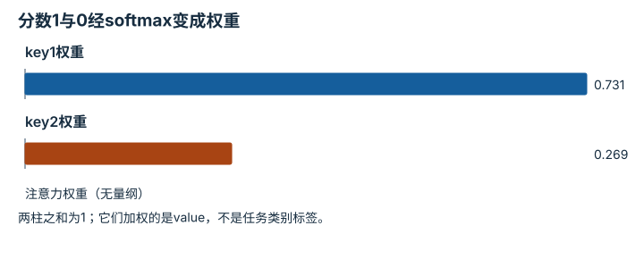

---
hide:
  - navigation
---

<!-- Generated by scripts/build_knowledge_atlas.py; edit knowledge/atlas/*.json. -->

<nav class="study-breadcrumb" aria-label="学习位置" markdown="1">
[知识目录](../../index.md) / [Transformer 与多模态表示](../index.md)
</nav>

L3 · 本章第 4 / 7 节

# 缩放点积：从分数到加权输出

**Scaled dot-product attention**

原始点积随特征维数可能变大，缩放有助于控制softmax的数值尺度。

先确认：这些前置知识我懂了吗？

QKV、指数与归一化

[神经网络与优化循环](../../learning-neural-networks/index.md)

<section class="study-section " markdown="1">

## 1 · 原理拆开看

1. 用每条query与key点积得到分数，再除以√d_k；这是特征维度缩放，不是除以token数。
2. 对每条query的key分数做softmax，权重非负且每行和为1。
3. 输出为这些权重对value的加权和；注意力权重不是模型置信度或因果解释。

</section>

<section class="study-section " markdown="1">

## 2 · 跟着例子算一遍

1. 教学d_k=4，两原始分数为2和0，除以2后得到1和0。
2. softmax权重为exp(1)/(exp(1)+1)≈0.7311和0.2689。
3. 若标量value为10和0，输出约7.311；全部特征仅为无量纲教学数。

</section>

<section class="study-section " markdown="1">

## 3 · 对照图，解释变化

<figure class="atlas-visual" tabindex="0" aria-label="分数1与0经softmax变成权重；窄屏可在图内横向滚动">
<picture>
<source media="(max-width: 600px)" srcset="../../../assets/knowledge-atlas/transformer-scaled-softmax-mobile.svg">

</picture>
<figcaption>两key教学注意力计算。</figcaption>
</figure>

- 较低分数仍获得非零权重，输出不是硬选择。
- 图不能证明高权重token是任务成功的因果原因。

查看作图数据，自己复算

图上数值可能为便于阅读而取近似值，以下保留作图输入。

| 项目 | 注意力权重（无量纲） |
| --- | --- |
| key1权重 | 0.7310585786 |
| key2权重 | 0.2689414214 |

</section>

<section class="study-section study-misconception" markdown="1">

## 4 · 避开一个误区

**容易误以为：**0.7311权重表示模型有73.11%概率判断正确。

**为什么不成立：**权重只分配当前value组合，没有对应任务正确事件。

**正确理解：**解释其归一化维度与计算作用，不擅自转成成功概率。

</section>

<section class="study-section study-check" markdown="1">

## 5 · 先独立回答

两个缩放分数都加100，数学上的softmax权重改变吗？

我已作答，查看推理

不改变，公共因子会约去；稳定实现常减去最大分数以避免指数溢出。

</section>

继续查阅原始资料

- [Attention Is All You Need: Scaled Dot-Product Attention](https://arxiv.org/html/1706.03762v7)

<nav class="study-pagination" aria-label="相邻小节" markdown="1">

[← Q、K、V：怎样匹配与取回信息](../transformer-query-key-value/index.md)

[Mask：哪些信息此刻不允许看 →](../transformer-causal-mask/index.md)

</nav>

[返回本章目录](../index.md) · [整章连续阅读](../complete/index.md)

本章最后需要提交什么？

无歧义地追踪一批多模态数据经过注意力模块。

回到[原课程](../../../foundations/04-transformer-basics.md)完成实践。阅读位置或查看答案不计为通过验收。

