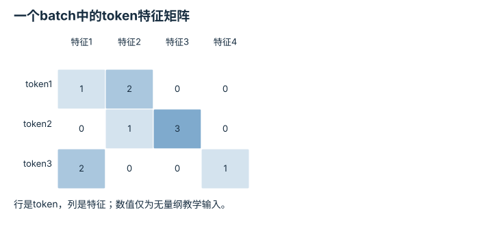

---
hide:
  - navigation
---

<!-- Generated by scripts/build_knowledge_atlas.py; edit knowledge/atlas/*.json. -->

<nav class="study-breadcrumb" aria-label="学习位置" markdown="1">
[知识目录](../../index.md) / [Transformer 与多模态表示](../index.md)
</nav>

L3 · 本章第 2 / 7 节

# 形状追踪：注意力在哪个维度混合

**Attention tensor shapes**

注意力错误常来自把batch、token和feature维混淆；先画形状可以在运行前发现问题。

先确认：这些前置知识我懂了吗？

批量张量、矩阵乘法

[神经网络与优化循环](../../learning-neural-networks/index.md)

<section class="study-section " markdown="1">

## 1 · 原理拆开看

1. 输入X形状为B×N×D，分别表示批量大小、token数和特征维；这些维度是计数而非物理单位。
2. 单头Q、K形状为B×N×d，Q乘K转置后分数形状为B×N×N。
3. 分数对最后的key维归一化，再乘V得到每个query的新表示；不同batch不应互相混合。

</section>

<section class="study-section " markdown="1">

## 2 · 跟着例子算一遍

1. 教学输入B=2、N=3、D=4，一共24个特征标量；下图只展示一个batch的3×4矩阵。
2. 设单头d=2，则Q和K各有2×3×2个标量，分数有2×3×3=18个。
3. 若V特征维也是2，输出形状2×3×2，保留3个query位置。

</section>

<section class="study-section " markdown="1">

## 3 · 对照图，解释变化

<figure class="atlas-visual" tabindex="0" aria-label="一个batch中的token特征矩阵；窄屏可在图内横向滚动">
<picture>
<source media="(max-width: 600px)" srcset="../../../assets/knowledge-atlas/transformer-tensor-shapes-mobile.svg">

</picture>
<figcaption>教学X样本；另一个batch具有同样形状但独立数据。</figcaption>
</figure>

- 沿行读一个token的四维表示，而不是沿列拼出token。
- 这不是注意力权重图；QK转置后才得到3×3分数。

查看作图数据，自己复算

图上数值可能为便于阅读而取近似值，以下保留作图输入。

| 行 / 列 | 特征1 | 特征2 | 特征3 | 特征4 |
| --- | --- | --- | --- | --- |
| token1 | 1 | 2 | 0 | 0 |
| token2 | 0 | 1 | 3 | 0 |
| token3 | 2 | 0 | 0 | 1 |

</section>

<section class="study-section study-misconception" markdown="1">

## 4 · 避开一个误区

**容易误以为：**N×N分数矩阵的两轴都是特征维。

**为什么不成立：**两轴分别对应query token和key token，而特征维已在点积中求和。

**正确理解：**给每个轴命名，再核对矩阵乘法的收缩维。

</section>

<section class="study-section study-check" markdown="1">

## 5 · 先独立回答

只有token数从3变成6、其他维不变，分数元素数量怎么变？

我已作答，查看推理

从2×3²=18变成2×6²=72，变为四倍。

</section>

继续查阅原始资料

- [PyTorch: Scaled Dot Product Attention](https://docs.pytorch.org/docs/stable/generated/torch.nn.functional.scaled_dot_product_attention.html)

<nav class="study-pagination" aria-label="相邻小节" markdown="1">

[← Token与Embedding：编号不等于语义距离](../transformer-token-embedding/index.md)

[Q、K、V：怎样匹配与取回信息 →](../transformer-query-key-value/index.md)

</nav>

[返回本章目录](../index.md) · [整章连续阅读](../complete/index.md)

本章最后需要提交什么？

无歧义地追踪一批多模态数据经过注意力模块。

回到[原课程](../../../foundations/04-transformer-basics.md)完成实践。阅读位置或查看答案不计为通过验收。

