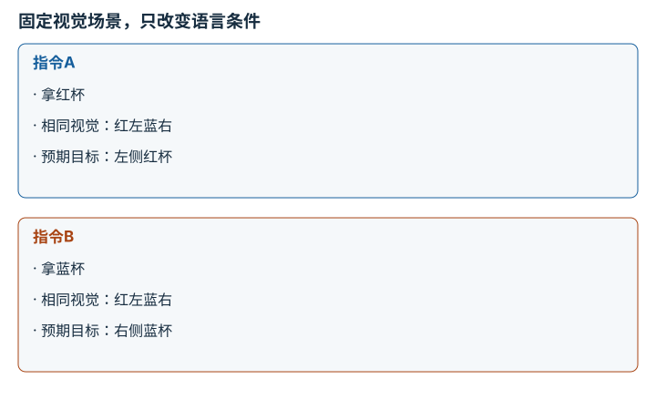

---
search:
  exclude: true
---

# 视觉-语言-动作策略：逐点细解

<!-- Generated by scripts/build_knowledge_atlas.py; edit knowledge/atlas/*.json. -->

[按小节学习](../index.md) · [全部知识点](../../index.md) · [返回原课程](../../../specializations/vla-zero-to-one.md)

Vision-language-action policies · 本页拆成 **4 个小知识点**。

先阅读直觉和原理，再独立完成算例、自测；图是解释工具，不是已掌握或真机验证的证明。

## 前置知识

[Transformer 与多模态表示](../../learning-transformers-multimodal/index.md) → [动作空间、分块、Token 与扩散](../../learning-action-representations/index.md) → [Episode 协议与多模态对齐](../../data-episode-schema/index.md)

## 改一个参数试试看

检查一次 VLA 推理为何不等于控制周期；此实验只解释时序，不运行 VLA。

[打开对应交互实验](../../../learning-lab-cn.md#timing)。滑块在文档站运行，GitHub 文件预览提供静态推导；不连接机器人。

## 本页知识点

1. [指令条件：同一画面为什么选择不同动作](#vla-language-conditioning)
2. [动作解码：模型输出到机器人接口之间](#vla-action-decoding-contract)
3. [闭环层级：VLA不是全部控制系统](#vla-hierarchical-closed-loop)
4. [适配与评估：预训练能力不能直接当成本机证据](#vla-adaptation-evaluation)

## 1. 指令条件：同一画面为什么选择不同动作

**Language-conditioned visuomotor policy**

**需要先懂：**多模态表示、行为克隆

### 一句话直觉

画面里有多个可操作对象，语言告诉策略当前要完成哪个任务，而不是只描述画面。

### 原理拆开看

1. VLA将视觉观测与语言指令等输入共同映射为动作，具体输入模态由模型定义。
2. 相同图像配不同指令应允许不同动作；语言条件的实际作用需要通过受控干预检验。
3. 能够输出动作不等于具备任意长程推理或安全规划能力，必须保持任务与训练覆盖边界。

### 手算或追踪一个例子

1. 教学场景左边是红杯，右边是蓝杯；相机与物体保持不变。
2. 分别给“拿红杯”和“拿蓝杯”，按任务定义正确目标应从左切换到右。
3. 若两次始终选左侧，需要检查语言是否被模型使用、目标歧义和数据偏差，不能只看动作格式合法。

### 用图理解

<figure class="atlas-visual" tabindex="0" aria-label="固定视觉场景，只改变语言条件；窄屏可在图内横向滚动">
<picture>
<source media="(max-width: 600px)" srcset="../../../assets/knowledge-atlas/vla-language-conditioning-mobile.svg">

</picture>
<figcaption>教学测试设计，不是OpenVLA已测性能。</figcaption>
</figure>

- 两个面板只让指令变化，便于归因目标选择差异。
- 预期目标是任务标签，不是模型已经产生的真实结果。

### 容易混淆的地方

**常见误解：**模型接收了文字，就证明它理解了文字中的所有约束。

**为什么不成立：**输入被接受与条件真正影响决策不同。

**正确理解：**设计只改变指令的配对测试，并记录目标选择与失败类型。

### 自测

同时换了语言、光照和物体位置，能单独证明语言条件有效吗？

展开答案与推理

不能；多个因素混在一起，应固定其他因素再检验语言干预。

**原始资料：**[OpenVLA: Vision-Language-Action Model](https://openvla.github.io/)

## 2. 动作解码：模型输出到机器人接口之间

**Action decoding and embodiment contracts**

**需要先懂：**动作Token、反归一化、坐标变换

### 一句话直觉

VLA输出不是可以无条件直连电机的命令；它必须经过训练数据对应的动作解释。

### 原理拆开看

1. 先使用模型对应的token或连续动作解码器，再选与目标数据集匹配的归一化统计。
2. 将归一化动作还原到物理单位，核对机器人动作维、绝对/增量、坐标系及夹爪约定。
3. 只在完成接口校验与安全资格检查后交给已有控制系统；模型输出合法不证明动作安全。

### 手算或追踪一个例子

1. 教学连续动作z=0.5，假设线性归一化范围[−1,1]对应位移[−0.05,0.05] m。
2. 反变换得到0.025 m，随后按指定坐标系解释为位移。
3. 若错误使用[−0.5,0.5] m统计，会变成0.25 m，放大十倍；此例不是某OpenVLA检查点的真实统计。

### 用图理解

<figure class="atlas-visual" tabindex="0" aria-label="从模型输出到有资格的控制请求；窄屏可在图内横向滚动">
<picture>
<source media="(max-width: 600px)" srcset="../../../assets/knowledge-atlas/vla-action-decoding-contract-mobile.svg">

</picture>
<figcaption>教学接口链，不授权硬件运动。</figcaption>
</figure>

- 反归一化位于模型与物理接口之间，不能省略。
- 最后一个节点表示检查职责，不表示认证安全已经成立。

### 容易混淆的地方

**常见误解：**换机器人时只改IP地址和关节数量就够了。

**为什么不成立：**动作语义、比例、坐标与控制模式也可能不同。

**正确理解：**建立明确adapter契约，先在无风险验证环境检查每个转换。

### 自测

归一化统计来自另一数据集，输出看起来仍在−1到1之间，可以放心用吗？

展开答案与推理

不能；归一化范围合法并不保证反变换后的单位与尺度适合目标机器人。

**原始资料：**[OpenVLA Repository: Action Unnormalization](https://github.com/openvla/openvla)

## 3. 闭环层级：VLA不是全部控制系统

**Policy and low-level control loops**

**需要先懂：**反馈控制、实时截止时间

### 一句话直觉

高层策略更新目标，底层控制器持续执行与监测；两者的任务和更新频率不同。

### 原理拆开看

1. 策略根据图像与指令输出动作参考，低层控制器根据更高频状态跟踪并处理执行限制。
2. 新观测需要经过采集、传输、推理，不能把策略的推理时长当作端到端反馈延迟。
3. 重新观测后策略才能纠正任务级偏差；独立看门狗和硬件保护不应依赖VLA输出文本判断。

### 手算或追踪一个例子

1. 教学架构设策略周期100 ms、低层周期2 ms；这不是任何模型实测频率。
2. 一次策略窗口中低层运行50次，但仍可能跟踪同一条较旧参考。
3. 若目标以0.2 m/s移动，100 ms内会移动0.02 m，显示任务级反馈年龄仍需考虑。

### 用图理解

<figure class="atlas-visual" tabindex="0" aria-label="慢策略与快执行回路并存；窄屏可在图内横向滚动">
<picture>
<source media="(max-width: 600px)" srcset="../../../assets/knowledge-atlas/vla-hierarchical-closed-loop-mobile.svg">

</picture>
<figcaption>教学时序，不是OpenVLA基准延迟。</figcaption>
</figure>

- 快回路可以重复跟踪旧参考，不代表视觉信息同样新鲜。
- 图没有独立保护链实现，不能作为部署安全证明。

查看作图数据，自己复算

图上数值可能为便于阅读而取近似值，以下保留作图输入。

| 事件 | 开始 (ms) | 结束 (ms) |
| --- | --- | --- |
| 策略参考保持 | 0 | 100 |
| 低层第1周期 | 0 | 2 |
| 低层第2周期 | 2 | 4 |
| 下次策略更新 | 100 | 101 |

### 容易混淆的地方

**常见误解：**低层控制500 Hz，就等于VLA每2 ms重新理解一次场景。

**为什么不成立：**低层状态反馈与视觉语言推理不是同一条更新链。

**正确理解：**分别报告策略、感知、执行与保护回路的时序。

### 自测

VLA暂时无新输出，底层是否自动知道应该安全保持还是停止？

展开答案与推理

不能假定；失联行为必须由明确控制协议与风险评估定义。

**原始资料：**[OpenVLA: Inference and Robot Deployment](https://github.com/openvla/openvla)

## 4. 适配与评估：预训练能力不能直接当成本机证据

**VLA adaptation and evidence boundaries**

**需要先懂：**训练验证切分、本体动作协议

### 一句话直觉

论文中的成功发生在特定数据和机器人上，换相机或夹爪之后需要新的证据。

### 原理拆开看

1. 先确认预训练模型报告覆盖哪些输入、动作和任务，再定义目标系统的差异。
2. 如需适配，记录数据来源、训练参数、checkpoint及独立测试划分。
3. 分别报告已见与未见条件的结果；模型作者报告、仓库复现和本机实测必须分开标注。

### 手算或追踪一个例子

1. 纯教学表假设适配前后各在两个固定条件上测试10回合，成功数分别为(6,2)与(8,3)。
2. 已见条件从6/10到8/10，未见条件从2/10到3/10；两列都保留分母。
3. 样本很少且差异有不确定性，不能仅由这张示例表宣布广泛泛化或统计显著。

### 用图理解

<figure class="atlas-visual" tabindex="0" aria-label="适配结果按条件拆开报告；窄屏可在图内横向滚动">
<picture>
<source media="(max-width: 600px)" srcset="../../../assets/knowledge-atlas/vla-adaptation-evaluation-mobile.svg">

</picture>
<figcaption>人为构造的教学成功计数，不属于任何真实VLA实验。</figcaption>
</figure>

- 按列比较相同条件，避免把场景难度变化当作模型提升。
- 不能将教学数值转述为OpenVLA作者报告或本仓库实测。

查看作图数据，自己复算

图上数值可能为便于阅读而取近似值，以下保留作图输入。

| 行 / 列 | 已见条件 | 未见条件 |
| --- | --- | --- |
| 适配前 | 6 | 2 |
| 适配后 | 8 | 3 |

### 容易混淆的地方

**常见误解：**下载了论文模型，就可以把论文机器人成功率写成本机结果。

**为什么不成立：**权重可用与目标系统验证是不同证据。

**正确理解：**为每个性能声明附模型、数据、场景和执行记录。

### 自测

适配后只测试训练时相同场景，能证明跨场景泛化吗？

展开答案与推理

不能；必须明确未见场景划分并独立评估，且报告失败与样本量。

**原始资料：**[OpenVLA Paper: Fine-tuning and Evaluation](https://arxiv.org/abs/2406.09246)

## 从理解走向证据

本节点原有验收要求：执行语言与视觉消融，并单独报告闭环成功率。

完成图解自测后，回到[原课程](../../../specializations/vla-zero-to-one.md)运行对应示例并保留证据；浏览页面和查看答案不会自动获得课程晋级。
