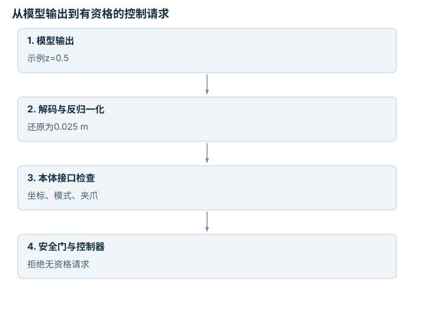

---
hide:
  - navigation
---

<!-- Generated by scripts/build_knowledge_atlas.py; edit knowledge/atlas/*.json. -->

<nav class="study-breadcrumb" aria-label="学习位置" markdown="1">
[知识目录](../../index.md) / [视觉-语言-动作策略](../index.md)
</nav>

L3 · 本章第 2 / 4 节

# 动作解码：模型输出到机器人接口之间

**Action decoding and embodiment contracts**

VLA输出不是可以无条件直连电机的命令；它必须经过训练数据对应的动作解释。

先确认：这些前置知识我懂了吗？

动作Token、反归一化、坐标变换

[Transformer 与多模态表示](../../learning-transformers-multimodal/index.md) · [动作空间、分块、Token 与扩散](../../learning-action-representations/index.md) · [Episode 协议与多模态对齐](../../data-episode-schema/index.md)

<section class="study-section " markdown="1">

## 1 · 原理拆开看

1. 先使用模型对应的token或连续动作解码器，再选与目标数据集匹配的归一化统计。
2. 将归一化动作还原到物理单位，核对机器人动作维、绝对/增量、坐标系及夹爪约定。
3. 只在完成接口校验与安全资格检查后交给已有控制系统；模型输出合法不证明动作安全。

</section>

<section class="study-section " markdown="1">

## 2 · 跟着例子算一遍

1. 教学连续动作z=0.5，假设线性归一化范围[−1,1]对应位移[−0.05,0.05] m。
2. 反变换得到0.025 m，随后按指定坐标系解释为位移。
3. 若错误使用[−0.5,0.5] m统计，会变成0.25 m，放大十倍；此例不是某OpenVLA检查点的真实统计。

</section>

<section class="study-section " markdown="1">

## 3 · 对照图，解释变化

<figure class="atlas-visual" tabindex="0" aria-label="从模型输出到有资格的控制请求；窄屏可在图内横向滚动">
<picture>
<source media="(max-width: 600px)" srcset="../../../assets/knowledge-atlas/vla-action-decoding-contract-mobile.svg">

</picture>
<figcaption>教学接口链，不授权硬件运动。</figcaption>
</figure>

- 反归一化位于模型与物理接口之间，不能省略。
- 最后一个节点表示检查职责，不表示认证安全已经成立。

</section>

<section class="study-section study-misconception" markdown="1">

## 4 · 避开一个误区

**容易误以为：**换机器人时只改IP地址和关节数量就够了。

**为什么不成立：**动作语义、比例、坐标与控制模式也可能不同。

**正确理解：**建立明确adapter契约，先在无风险验证环境检查每个转换。

</section>

<section class="study-section study-check" markdown="1">

## 5 · 先独立回答

归一化统计来自另一数据集，输出看起来仍在−1到1之间，可以放心用吗？

我已作答，查看推理

不能；归一化范围合法并不保证反变换后的单位与尺度适合目标机器人。

</section>

继续查阅原始资料

- [OpenVLA Repository: Action Unnormalization](https://github.com/openvla/openvla)

<nav class="study-pagination" aria-label="相邻小节" markdown="1">

[← 指令条件：同一画面为什么选择不同动作](../vla-language-conditioning/index.md)

[闭环层级：VLA不是全部控制系统 →](../vla-hierarchical-closed-loop/index.md)

</nav>

[返回本章目录](../index.md) · [整章连续阅读](../complete/index.md)

本章最后需要提交什么？

执行语言与视觉消融，并单独报告闭环成功率。

回到[原课程](../../../specializations/vla-zero-to-one.md)完成实践。阅读位置或查看答案不计为通过验收。

