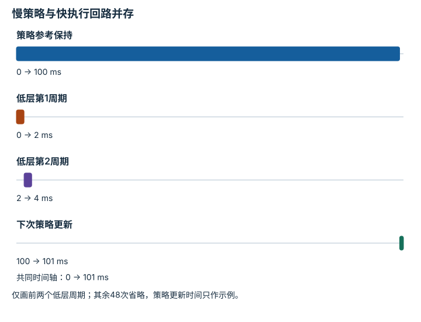

---
hide:
  - navigation
---

<!-- Generated by scripts/build_knowledge_atlas.py; edit knowledge/atlas/*.json. -->

<nav class="study-breadcrumb" aria-label="学习位置" markdown="1">
[知识目录](../../index.md) / [视觉-语言-动作策略](../index.md)
</nav>

L3 · 本章第 3 / 4 节

# 闭环层级：VLA不是全部控制系统

**Policy and low-level control loops**

高层策略更新目标，底层控制器持续执行与监测；两者的任务和更新频率不同。

先确认：这些前置知识我懂了吗？

反馈控制、实时截止时间

[Transformer 与多模态表示](../../learning-transformers-multimodal/index.md) · [动作空间、分块、Token 与扩散](../../learning-action-representations/index.md) · [Episode 协议与多模态对齐](../../data-episode-schema/index.md)

<section class="study-section " markdown="1">

## 1 · 原理拆开看

1. 策略根据图像与指令输出动作参考，低层控制器根据更高频状态跟踪并处理执行限制。
2. 新观测需要经过采集、传输、推理，不能把策略的推理时长当作端到端反馈延迟。
3. 重新观测后策略才能纠正任务级偏差；独立看门狗和硬件保护不应依赖VLA输出文本判断。

</section>

<section class="study-section " markdown="1">

## 2 · 跟着例子算一遍

1. 教学架构设策略周期100 ms、低层周期2 ms；这不是任何模型实测频率。
2. 一次策略窗口中低层运行50次，但仍可能跟踪同一条较旧参考。
3. 若目标以0.2 m/s移动，100 ms内会移动0.02 m，显示任务级反馈年龄仍需考虑。

</section>

<section class="study-section " markdown="1">

## 3 · 对照图，解释变化

<figure class="atlas-visual" tabindex="0" aria-label="慢策略与快执行回路并存；窄屏可在图内横向滚动">
<picture>
<source media="(max-width: 600px)" srcset="../../../assets/knowledge-atlas/vla-hierarchical-closed-loop-mobile.svg">

</picture>
<figcaption>教学时序，不是OpenVLA基准延迟。</figcaption>
</figure>

- 快回路可以重复跟踪旧参考，不代表视觉信息同样新鲜。
- 图没有独立保护链实现，不能作为部署安全证明。

查看作图数据，自己复算

图上数值可能为便于阅读而取近似值，以下保留作图输入。

| 事件 | 开始 (ms) | 结束 (ms) |
| --- | --- | --- |
| 策略参考保持 | 0 | 100 |
| 低层第1周期 | 0 | 2 |
| 低层第2周期 | 2 | 4 |
| 下次策略更新 | 100 | 101 |

</section>

<section class="study-section study-misconception" markdown="1">

## 4 · 避开一个误区

**容易误以为：**低层控制500 Hz，就等于VLA每2 ms重新理解一次场景。

**为什么不成立：**低层状态反馈与视觉语言推理不是同一条更新链。

**正确理解：**分别报告策略、感知、执行与保护回路的时序。

</section>

<section class="study-section study-check" markdown="1">

## 5 · 先独立回答

VLA暂时无新输出，底层是否自动知道应该安全保持还是停止？

我已作答，查看推理

不能假定；失联行为必须由明确控制协议与风险评估定义。

</section>

继续查阅原始资料

- [OpenVLA: Inference and Robot Deployment](https://github.com/openvla/openvla)

<nav class="study-pagination" aria-label="相邻小节" markdown="1">

[← 动作解码：模型输出到机器人接口之间](../vla-action-decoding-contract/index.md)

[适配与评估：预训练能力不能直接当成本机证据 →](../vla-adaptation-evaluation/index.md)

</nav>

[返回本章目录](../index.md) · [整章连续阅读](../complete/index.md)

本章最后需要提交什么？

执行语言与视觉消融，并单独报告闭环成功率。

回到[原课程](../../../specializations/vla-zero-to-one.md)完成实践。阅读位置或查看答案不计为通过验收。

