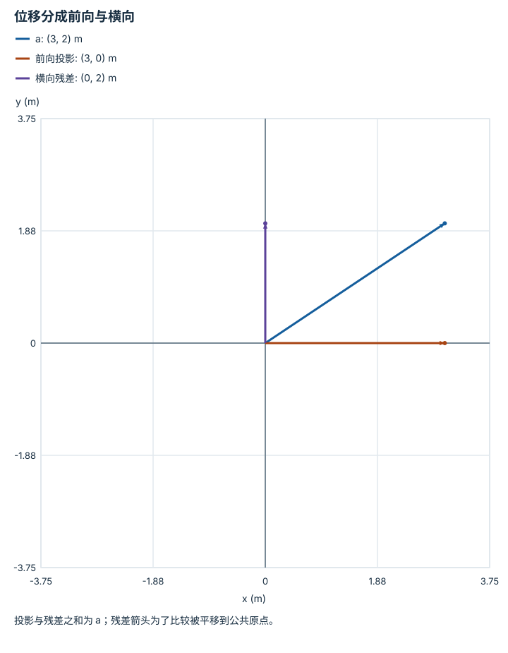

---
hide:
  - navigation
---

<!-- Generated by scripts/build_knowledge_atlas.py; edit knowledge/atlas/*.json. -->

<nav class="study-breadcrumb" aria-label="学习位置" markdown="1">
[知识目录](../../index.md) / [线性代数与最小二乘](../index.md)
</nav>

L1 · 本章第 3 / 8 节

# 点乘读出沿指定方向的分量

**Dot product and projection**

机器人朝前走了多少，不是总路程，而是位移在前向轴上的投影。

先确认：这些前置知识我懂了吗？

单位向量、矩阵乘法

[Python、NumPy 与张量形状](../../computing-python-numpy/index.md)

<section class="study-section " markdown="1">

## 1 · 原理拆开看

1. 令 a 为位移，u 为无量纲单位方向；标量 a·u 是带符号的投影长度。
2. 投影向量为 (a·u)u；若方向 b 未归一化，则需使用 (a·b)/(b·b)×b。
3. 残差 a-投影与投影方向正交，所以点乘还能分解沿轴和横向误差。

</section>

<section class="study-section " markdown="1">

## 2 · 跟着例子算一遍

1. 教学 a=(3,2) m，前向 u=(1,0)。
2. a·u=3 m，前向投影为 (3,0) m。
3. 残差为 (0,2) m，与 u 点乘为 0；总长度 √13 m 不等于前向位移 3 m。

</section>

<section class="study-section " markdown="1">

## 3 · 对照图，解释变化

<figure class="atlas-visual" tabindex="0" aria-label="位移分成前向与横向；窄屏可在图内横向滚动">
<picture>
<source media="(max-width: 600px)" srcset="../../../assets/knowledge-atlas/linear-dot-projection-mobile.svg">

</picture>
<figcaption>教学示意，非实测；箭头都从公共原点画出。</figcaption>
</figure>

- 横向残差垂直前向轴；两分量的平方和等于总长度平方。
- 图是位移分解，不描述真实行走顺序。

查看作图数据，自己复算

图上数值可能为便于阅读而取近似值，以下保留作图输入。

| 向量 | x (m) | y (m) |
| --- | --- | --- |
| a | 3 | 2 |
| 前向投影 | 3 | 0 |
| 横向残差 | 0 | 2 |

</section>

<section class="study-section study-misconception" markdown="1">

## 4 · 避开一个误区

**容易误以为：**投影长度永远非负。

**为什么不成立：**朝指定轴反方向的位移产生负点积，符号包含方向信息。

**正确理解：**区分带符号投影、投影向量与无符号距离。

</section>

<section class="study-section study-check" markdown="1">

## 5 · 先独立回答

若 u=(-1,0)，投影标量和投影向量各是什么？

我已作答，查看推理

标量为 -3 m；乘 u 后投影向量仍为 (3,0) m。改变轴的正向会改标量符号，但不改变投影直线。

</section>

继续查阅原始资料

- [MIT 18.06: orthogonal projections](https://ocw.mit.edu/courses/18-06-linear-algebra-spring-2010/)

<nav class="study-pagination" aria-label="相邻小节" markdown="1">

[← 矩阵乘法的内维为什么必须相同](../linear-matrix-shape/index.md)

[叉乘把力臂和力变成力矩 →](../linear-cross-torque/index.md)

</nav>

[返回本章目录](../index.md) · [整章连续阅读](../complete/index.md)

本章最后需要提交什么？

推导并数值验证一个最小二乘解。

回到[原课程](../../../foundations/02-linear-algebra.md)完成实践。阅读位置或查看答案不计为通过验收。

